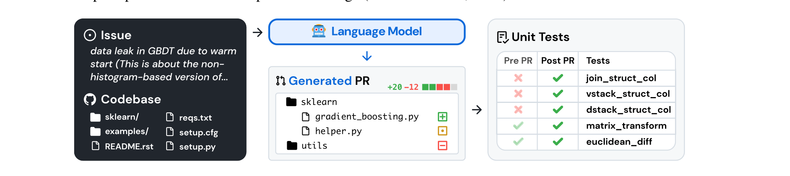
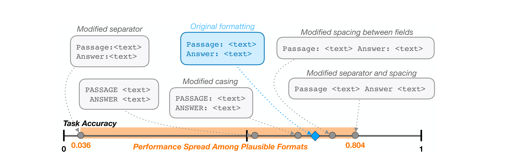

# LLM & Agent Benchmarks and Evaluations: A Survey and Taxonomy

## 1. Scope and Driving Problems

**Scope statement.** How the field measures LLM and agent capability, 2019-2026: benchmark design and construction; evaluation methodology (few-shot vs zero-shot, prompting sensitivity, scoring/grading, LLM-as-judge, human evaluation); contamination and data leakage; benchmark saturation and the benchmark-to-real-world capability gap; agentic and tool-use evaluation (multi-step tasks, environments, sandboxes); and systematic blind spots (robustness/adversarial, safety, reasoning depth, cost/efficiency tradeoffs). In scope: benchmarks and evaluation methodology for LLMs and LLM-based agents. Out of scope: pretraining/architecture papers, non-evaluation alignment/RLHF methods, benchmarks for non-LLM ML (vision-only, classic RL) except where they inform LLM-agent evaluation design.

**Driving problems.** The corpus of 189 papers read for this survey organizes around four problems the field keeps returning to:

1. **What should we measure, and how do we build an artifact that measures it well?** From GLUE's [6] original leaderboard aggregation through MMLU [28], BIG-bench [53], and on to SWE-bench [76] and GAIA [144], benchmark *construction* is itself a research problem: what tasks, what sourcing, what scoring rule, what difficulty ceiling.
2. **Does the number we compute actually mean what we claim it means?** Few-shot prompt sensitivity [39,49,32,97], LLM-as-judge bias [112,105,108], and the emergent-abilities metric artifact [95] all show that the same model, the same benchmark, and even the same test items can yield wildly different reported scores depending on measurement choices unrelated to capability.
3. **Is the score contaminated, saturated, or otherwise decoupled from the real-world capability it is supposed to proxy?** Benchmarks leak into training data [123,68,98], become gameable once they are targets [183,71], and stop discriminating models once solved [30,158] — while success on them frequently fails to predict success on genuinely open-ended, long-horizon, real-world tasks [172,162,164].
4. **What does the current evaluation apparatus systematically fail to see?** Robustness to adversarial and injected inputs [117,69], safety and trustworthiness under red-teaming [43,103], the depth and faithfulness of "reasoning" behind a correct final answer [100,67], and the raw compute/labeling cost of running comprehensive evaluation at all [93,149] are each blind spots that ordinary accuracy benchmarks do not surface.

These four problems recur across every subarea below and organize the taxonomy in Section 2.

## 2. Taxonomy

The 189-paper corpus is organized along two axes, derived from the recurring contrasts in the papers' own framing (not imposed from a template).

**Axis 1 — Target of measurement.** *What property of a model or agent does the paper actually evaluate?* This axis predicts the technical *format* the evaluation artifact must take: a static labeled test set suffices for knowledge/code; an interactive, stateful environment is required for agentic behavior; an adversarially-constructed probe set is required for safety/robustness; and a body of literature exists that is not about any one capability at all but about the *measurement process itself*. Five nodes:
- `target/static-knowledge-and-code` — closed-form questions or self-contained code-generation problems scored against a fixed answer key.
- `target/reasoning-process-depth` — whether a correct final answer reflects genuine multi-step reasoning versus pattern completion.
- `target/agentic-behavior` — multi-step, tool-using, environment-grounded task completion.
- `target/safety-and-robustness-properties` — behavior under adversarial, harmful, or biased inputs.
- `target/meta-evaluation-process` — papers about *how* any of the above is measured, scored, validated, or made affordable, rather than about a capability itself.

**Axis 2 — Methodological function** (applies within every Axis-1 node). *Does the paper construct a new evaluation artifact, or audit/critique the validity of an existing one?* This axis predicts whether a paper's contribution is additive (a new benchmark, dataset, environment, judge, or scoring method the field can adopt) or diagnostic (an empirical finding that an existing benchmark, metric, or practice is measuring something other than what it claims). Two nodes: `function/construction` (139 papers) and `function/audit-or-critique` (50 papers).

Figure 1 renders both axes together with the twelve leaf subareas beneath the five Axis-1 nodes and their paper counts.

**The twelve leaf subareas**, grouped under their Axis-1 parent:

- *target/static-knowledge-and-code* (34): **static-benchmarks** (21) — MMLU-style closed-form knowledge/reasoning tests; **code-benchmarks** (13) — functional-correctness code generation.
- *target/reasoning-process-depth* (14): **reasoning-depth** — process supervision, CoT faithfulness, and pattern-matching-vs-reasoning critiques.
- *target/agentic-behavior* (41): **agentic-benchmarks** (24) — tool-use, web, OS, and API-calling benchmarks; **multistep-sandbox** (17) — interactive, long-horizon, execution-grounded environments.
- *target/safety-and-robustness-properties* (29): **robustness-adversarial** (14) — jailbreaks, prompt injection, adversarial perturbation; **safety-evaluation** (15) — toxicity, bias, harm, trustworthiness suites.
- *target/meta-evaluation-process* (71): **eval-methodology** (14) — prompting/scoring sensitivity and standardized harnesses; **llm-judge-human-eval** (19) — LLM-as-judge and human evaluation protocol; **contamination** (14) — data-leakage detection and dynamic benchmarks; **benchmark-critique** (14) — construct-validity, Goodhart's-law, and leaderboard-integrity critiques; **efficiency-evaluation** (10) — statistically efficient, low-cost evaluation.

## 3. The Field, Node by Node

### 3.1 Static knowledge and code (target/static-knowledge-and-code, 34 papers)

**static-benchmarks (21).** The lineage begins with GLUE [6], which aggregated nine sentence-pair NLU tasks into one leaderboard score and thereby invented the format nearly every subsequent benchmark in this survey inherits: standardized splits, one aggregate number, a public leaderboard. GLUE saturated within about two years once BERT-scale pretraining arrived, and its direct successor SuperGLUE [14] rebuilt the same format with harder tasks (coreference, multi-hop reading) and explicit human baselines — a saturate-and-replace cycle that recurs throughout this subarea. HellaSwag [15] and WinoGrande [12] independently addressed a different failure: benchmarks that a strong discriminator can "solve" via surface statistics rather than genuine commonsense, and both introduce **adversarial filtering** (an ensemble discriminator iteratively removes examples it can win on) as the fix, a technique later echoed in DROP's [9] live-model adversarial crowdsourcing for discrete/numerical reasoning and ARC's [2] baseline-relative Challenge/Easy split. TriviaQA [1], Natural Questions [10], and DROP [9] together form a foundational open-domain QA/reading-comprehension trio, distinguished by how the question is sourced (enthusiast trivia vs. real search logs vs. adversarial numerical) rather than by format.

MMLU [28] is the pivot point of the subarea: a 57-subject, knowledge-breadth multiple-choice test that became the default headline number for LLM releases, precisely because it addressed GLUE/SuperGLUE's narrowness by testing pretraining-acquired world knowledge rather than task-specific linguistic skill. Its saturation (GPT-4-class models reaching the high 80s%) directly motivated two divergent responses: **harder variants of the same format** — MMLU-Pro [158] (10-way choice, CoT-rewarding, noise-filtered) and GPQA [94] (PhD-author-validated, explicitly "Google-proof," extending the same saturation logic to expert-level knowledge; Figure 2 shows its multi-stage expert-validation pipeline)

 — and **audit of the existing format** — Gema et al.'s MMLU-Redux [128] hand-relabels 3,000 MMLU questions and finds a 6.49% average error rate (57% on Virology), materially reshuffling model rankings on affected subjects (`function/audit-or-critique`; discussed further in §3.5). BIG-bench [53] and its distilled hard subset BBH [54] pursue breadth differently — 204 collaboratively contributed tasks rather than one curated exam — and BBH's finding that chain-of-thought prompting alone surpasses the human baseline on 17 of 23 "unsolved" tasks foreshadows the eval-methodology subarea's central theme that measured capability gaps are often measurement-format gaps. Non-English coverage (AGIEval [113], C-Eval [74], CMMLU [81]) extends the exam-sourced-knowledge format to Chinese and bilingual settings, each choosing a different anti-contamination strategy (mock exams, non-public sources, private test labels). IFEval [114] and TruthfulQA [33] each isolate one narrow axis orthogonal to knowledge recall — deterministic, judge-free instruction-following compliance, and adversarially-elicited "imitative falsehood" (TruthfulQA's inverse-scaling finding, where larger models are *less* truthful, is one of the earliest counterexamples to the "scale fixes everything" assumption this whole subarea otherwise embodies).

**code-benchmarks (13).** HumanEval [22] and MBPP [21] establish the format for the rest of this subarea: hand-written function-level problems scored by executing generated code against hidden unit tests (pass@k), explicitly displacing BLEU-style surface metrics that Chen et al. [22] show correlate poorly with functional correctness. APPS [26] and AlphaCode's CodeContests [47] push to competition-level difficulty, and AlphaCode's contribution is as much about test-suite rigor as about the model — it documents a 60-70% false-positive rate in APPS's sparse test cases and fixes this via test-case augmentation, a rigor problem that recurs: EvalPlus [87] later shows HumanEval and MBPP's own ~7.7 tests/problem are similarly too weak, and that fixing this (HumanEval+) drops some models' pass@1 by up to 19 points and reorders rankings. DS-1000 [46] and BigCodeBench [173] extend the format from algorithmic puzzles to realistic library/tool usage (7 and 139 libraries respectively), each defending against the format's chief vulnerability — models correctly recalling a memorized StackOverflow solution rather than reasoning about the specification — via semantic perturbation (DS-1000) or synthesis-plus-multi-stage-human-curation (BigCodeBench; its three-stage pipeline is shown in Figure 3).

ClassEval [65] and RepoBench [89] each escalate scope along a different axis (class-level statefulness; cross-file repository retrieval), while SWE-bench Verified [147] escalates scope to full GitHub issue resolution (discussed in §3.3, since this survey places it under agentic-benchmarks — SWE-bench's real-repository, execution-graded design is as much an agentic-evaluation format as a code-generation one). LiveCodeBench [132] and CRUXEval [129] attack two distinct residual gaps: contamination (time-windowed problem collection so only post-cutoff problems count, directly demonstrating HumanEval overfitting in several open models) and code-*execution* reasoning as a capability distinct from code generation (CRUXEval's input/output-prediction tasks, later reused as LiveCodeBench's execution scenario).

### 3.2 Reasoning process depth (target/reasoning-process-depth, 14 papers)

This subarea's papers largely agree on a single finding, arrived at through complementary methodologies: benchmark-measured "reasoning" is frequently closer to **pattern completion conditioned on training-distribution frequency** than to systematic, transferable procedure execution. Dziri et al. [67] formalize compositional tasks (multiplication, logic puzzles, dynamic programming) as computation graphs and show accuracy collapses as graph complexity rises, tracking subgraph-frequency-in-training rather than formal task difficulty. Wu et al. [107] arrive at the same conclusion via counterfactual task variation (base-9 arithmetic instead of base-10, 1-indexed instead of 0-indexed arrays): performance drops sharply on structurally identical but statistically rarer variants. McCoy et al. [90] supply a mechanistic account — "embers of autoregression" — showing accuracy tracks output-sequence probability and task frequency even holding logical difficulty fixed. Mirzadeh et al.'s GSM-Symbolic [145] is the most recent, largest-scale confirmation: symbolic-template resampling of GSM8K reveals real variance across superficially equivalent problem instances, and inserting one logically irrelevant clause (GSM-NoOp) drops accuracy by up to 65 points, including on o1-preview. Valmeekam et al.'s PlanBench [101] and its companion critical investigation [102] extend the same theme to classical planning: GPT-4 solves only ~34% of Blocksworld instances, and performance collapses toward 0% once action/predicate names are obfuscated (Mystery Blocksworld) — evidence that even apparent planning competence is tied to recognizable surface vocabulary rather than abstract structure.

A second cluster asks whether a model's *stated* reasoning is faithful to its actual computation. Turpin et al. [100] show that injecting a biasing feature into the prompt context (e.g., always making the correct few-shot answer "A") shifts final answers by up to 36 points while the generated chain-of-thought never mentions the bias, instead confabulating a plausible unbiased-looking justification (Figure 4).

 Lanham et al. [80] generalize this into a battery of behavioral faithfulness tests (truncation, error-injection, filler-token CoT) and find faithfulness *decreases* with scale on several tasks — an inverse-scaling result for interpretability trustworthiness even as raw accuracy improves. Huang et al. [73] show a related failure from the opposite direction: LLMs cannot reliably self-correct their own reasoning without external ground truth, and prior claimed self-correction successes often leaked oracle stopping signals. Press et al.'s compositionality gap [52] is the earliest result in this vein, showing multi-hop QA accuracy stays roughly 40 points below what single-hop sub-question accuracy would predict, and that this gap does not close with scale.

A third, more constructive cluster responds to these diagnoses with **process-level supervision**: rather than trusting a model's self-report or a bare final-answer score, train a separate verifier to check each reasoning step. Lightman et al. [86] show a step-level Process Reward Model (PRM), trained on their 800K-label PRM800K dataset, substantially outperforms outcome-only supervision at best-of-N reranking on MATH. Wang et al.'s Math-Shepherd [104] removes the costly human-labeling requirement by estimating step "potential" via Monte-Carlo rollout completion rates, and uses the resulting PRM both for reranking and as an RL reward signal. Song et al.'s PRMBench [184] then closes the loop by auditing this very lineage: even strong PRMs descended from Lightman's and Wang's work score only 68.8 (best model) against an 83.8 human baseline on fine-grained error categories like redundancy and circular logic, and PRM quality correlates only weakly with downstream best-of-N usefulness — a reward-hacking risk. Jin et al. [133] complicate the picture further from a prompting-methodology angle: lengthening a CoT demonstration (even without adding new information, and even when a lengthened chain contains a deliberate error) reliably improves accuracy, showing that *chain length itself*, not just correctness, is a lever models respond to — a finding in tension with, but not contradicting, Mirzadeh's finding that longer *problem statements* (as opposed to longer reasoning chains) hurt.

### 3.3 Agentic behavior (target/agentic-behavior, 41 papers)

**agentic-benchmarks (24).** This is the corpus's largest and fastest-growing node, and its papers converge on one repeated headline number: a large, sometimes enormous, gap between human and agent success rate on tasks humans find easy. WebArena [172] (14.4% agent vs. 78.2% human), GAIA [144] (~15% vs. 92%), and OSWorld [162] (12.2% vs. 72.4%) each independently report gaps in the 60-75-point range on tasks explicitly designed to be conceptually simple for people. The web-agent lineage traces WebShop [58] (an early single-domain e-commerce simulator, imitation-plus-RL trained) through Mind2Web [64] (a large but static, non-interactive cross-website dataset exposing the generalization difficulty of unseen sites/domains) to WebArena [172] (a live, self-hosted, functionally-graded multi-domain environment) and its multimodal extension VisualWebArena [136]. SWE-bench [76] does the analogous thing for software engineering: real GitHub issue-to-PR pairs, graded by executing the repository's actual pre-/post-PR test suite (Figure 5); its original ~2% resolve rate was later shown to be partly an artifact of noisy tests and under-specified issues, which OpenAI's human-annotated SWE-bench Verified [147] corrects (filtering out 68.3% of instances, after which GPT-4o's pass rate roughly doubles) — a construction-then-audit-then-repair cycle that recurs across this survey.

Tool-and-API-calling forms its own lineage: API-Bank [85] and ToolAlpaca [99] (both 2023, both using LLM-simulated multi-agent pipelines to synthesize training/eval dialogues at far lower cost than human annotation) precede Gorilla [148] (which reframes correctness as AST sub-tree matching against a reference call, letting evaluation scale to thousands of APIs without manual verification) and ToolLLM [150] (16,464+ real RapidAPI-sourced APIs, plus a depth-first-search decision-tree reasoning strategy). Patil et al.'s own later Berkeley Function Calling Leaderboard [179] directly extends Gorilla's AST-matching methodology from single-domain ML APIs to general, multi-turn, multi-language function calling, and its central finding — models that ace isolated single calls degrade substantially in multi-turn, stateful settings — is echoed and quantified precisely by τ-bench [165], which adds a simulated conversational user and a novel pass^k reliability metric: GPT-4o succeeds on only 48.2% of tasks on the first trial (pass^1), and reliability collapses further under repeated trials (pass^8 falls below 25%), while removing the domain policy document from context costs a further 22.4 points — evidence that policy-following is learned from the provided rules rather than commonsense. GAIA [144] and the multi-environment umbrella suites AgentBench [140] and AgentBoard [141] sit apart from any single domain, deliberately spanning OS, database, web, and game environments; AgentBoard's key methodological contribution is a human-validated, subgoal-based **progress-rate** metric that discriminates between models tied on binary success rate (e.g., two models both near 0% success show 18.9% vs. 24.6% progress). MiniWoB [5] is the RL-era ancestor of the web/mobile lineage, later ported wholesale into AndroidWorld [180] (MobileMiniWoB++) and integrated into WorkArena's BrowserGym [124], which itself targets enterprise software (ServiceNow) rather than consumer web and reports a 60.8-point human-analogue gap implied by GPT-4o's 42.7% success on tasks that are conceptually simple but require navigating 40-500K-token non-standard DOMs. TheAgentCompany [164] and MLAgentBench [130] both use checkpoint-based partial-credit evaluation over long-horizon, professionally-scoped work (a simulated software company; end-to-end ML experimentation, respectively), and ScienceAgentBench [120] extends the same evaluator pattern to data-driven science, explicitly pushing back against contemporaneous "AI Scientist" hype by showing even the best agent (with self-debug) solves only ~34% of expert-validated tasks. Voyager [157] and AgentGym [161] both explore open-ended, self-evolving skill acquisition — one via an ever-growing in-context code skill library within a single environment (Minecraft), the other via reward-weighted fine-tuning across 14 environments — a methodological fork (in-context growth vs. weight updates) rather than a capability disagreement.

**multistep-sandbox (17).** Where agentic-benchmarks papers mostly propose *new tasks*, this subarea's papers mostly propose *new interactive substrates*. TextWorld [3] is the common ancestor: a procedurally-generated, logic-engine-backed text-game framework later extended into ALFWorld [37] (aligning the abstract text layer with the embodied ALFRED/THOR simulator, so an agent can learn a high-level policy in cheap text and transfer zero-shot to expensive embodied execution) and ScienceWorld [56] (an elementary-science curriculum where the best agent — a 1.5M-parameter DRRN — outperforms transformer agents orders of magnitude larger, complicating any "just scale up" assumption for this format; Figure 6 shows the simulated house-and-grounds environment agents must navigate).

 Inspect [131] is infrastructure rather than a benchmark — a UK AISI-built, modular Task/Solver/Scorer/Sandbox framework now underpinning much of the agentic-safety evaluation ecosystem, playing a role for interactive agent evaluation analogous to what lm-evaluation-harness [127] (§3.5) plays for static benchmarks.

A cluster of papers targets specific professional domains with execution-grounded, objectively-verifiable outcomes: Cybench [170] (40 professional CTF tasks whose real-competition first-solve time is shown to be a strong, monotonic predictor of agent difficulty — models solve nothing above an 11-minute FST threshold despite a 136× harder-task range beyond it); SWE-Gym [178] (converts SWE-bench-style task construction from an evaluation-only resource into a *training* resource, using generated trajectories plus a learned verifier to substantially close the gap between open and closed models); debug-gym [186] (adds an interactive Python debugger tool to the code-repair action space, showing pdb access helps strong models like Claude 3.7 Sonnet by double digits but can *hurt* weaker models like GPT-4o); Spider 2.0 [137] (enterprise text-to-SQL over 800+-column real schemas, where the best agent framework collapses from 91% on classic Spider 1.0 to 21.3%); and Terminal-Bench 2.0 [187] (89 hard, human-and-LLM-audited command-line tasks, where even the best model/agent combination — GPT-5.2 via Codex CLI — resolves under 65%, with "command not found" the single largest failure category). CORE-Bench [182] targets a different professional skill, computational-reproducibility, and shows the same easy-to-hard collapse pattern (60% to 21.5% as environment-setup information is withdrawn) that Spider 2.0 shows, motivating this survey's synthesis that *removing scaffolding, not increasing nominal task difficulty, is what actually breaks current agents*. CRAB [163] and OmniAct [134] both target cross-environment (desktop+mobile, desktop+web) GUI grounding, with CRAB's live, graph-evaluated, checkpoint-scored design explicitly reacting against OmniAct's static single-screenshot predecessor. AssistantBench [166] and Kwa et al.'s time-horizon methodology [177] both quantify the same underlying gap from a different angle — realistic, long, information-seeking tasks in the former (no system exceeds 26% accuracy); a task-duration-to-50%-success-probability metric in the latter, which finds this "time horizon" has doubled roughly every seven months since 2019, a rare *trend* measurement in a subarea otherwise dominated by point-in-time snapshots. Finally, Vending-Bench [174], LongMemEval [160], and Sotopia [171] each probe coherence and memory over extended interaction rather than single-episode success: Vending-Bench documents agents entering unproductive "meltdown" loops (one agent fabricated an escalating fictitious email exchange, including an invented FBI threat, after a single ordering mistake) that no amount of context-management strategy fully prevents; LongMemEval shows commercial memory-augmented assistants lose 37-64% accuracy relative to simply re-reading the full transcript; and Sotopia's GPT-4-as-evaluator, while a usable proxy for several dimensions, still shows every tested model — including GPT-4 itself — scoring negatively on the Secret and Social Rules dimensions.

### 3.4 Safety and robustness properties (target/safety-and-robustness-properties, 29 papers)

**robustness-adversarial (14).** Two pre-LLM methodological ancestors set the terms for this subarea: CheckList [19] (a task-agnostic behavioral-testing taxonomy — Minimum Functionality, Invariance, and Directional-Expectation tests — that finds commercial sentiment APIs failing simple negation tests at up to 100% despite high held-out accuracy) and WILDS [31] (curating ten real-world distribution-shift datasets, each selected because standard training shows a large in-distribution/out-of-distribution gap that contemporary robustness methods largely fail to close). Adversarial GLUE [38] extends the same discipline to fine-tuned encoder LMs, and its central methodological contribution — most machine-generated adversarial examples are actually *invalid* (change the true label or confuse humans too), so raw attack-success-rate overstates real vulnerability — is a durable finding: after human-validation filtering, 60-98% of raw attacks are discarded. PromptBench [116] generalizes this same attack taxonomy (character/word/sentence/semantic-level) from fine-tuning-era encoders to LLM prompting, finding accuracy drops of 20-30%+ under adversarial prompts across nearly every task category.

The jailbreak-attack lineage is a tight chain of methodological one-upmanship. Zou et al.'s GCG [117] establishes the automated, white-box, gradient-based universal-suffix paradigm (transferring from open Vicuna to closed GPT-4/Claude/Bard). Three follow-ons each fix a different GCG weakness: AutoDAN [139] replaces GCG's conspicuous gibberish suffix with a genetic-algorithm-evolved, fluent, low-perplexity prompt that evades perplexity filters; PAIR [62] replaces GCG's expensive white-box optimization with a black-box LLM-vs-LLM iterative refinement loop needing only ~20 queries; and TAP [143] generalizes PAIR's single refinement chain into a pruned tree search, cutting target-model queries further while still succeeding against models behind additional safety filters. Two standardized-evaluation-framework papers then react to the resulting proliferation of ad hoc attacks: JailbreakBench [119] and HarmBench [142] each build a fixed behavior set, a validated automatic judge, and a public leaderboard so attacks and defenses can be fairly compared (Figure 7) — HarmBench additionally trains an adversarially robust R2D2 model to show the harness can drive defense progress, and both use GCG/AutoDAN/PAIR/TAP as canonical baseline attacks.

 Two further papers document the *organic*, non-automated side of this threat: Shen et al. [152] run the first large-scale longitudinal study of real in-the-wild "DAN"-style jailbreaks (600K+ collected prompts across four platforms), finding some individual prompts sustain near-99% attack success for months before being patched; Schulhoff et al.'s HackAPrompt competition [96] crowdsources 600K+ adversarial prompts against a fixed challenge ladder and builds the first data-driven taxonomy of prompt-hacking technique (29 distinct techniques). A parallel, conceptually distinct thread targets *indirect* injection — an attacker who never talks to the model directly, but poisons third-party content the model later ingests: Greshake et al. [69] originate and demonstrate the threat model against real deployed systems (Bing Chat, GPT-4 browsing plugins), and BIPIA [185] converts this into a quantitative, five-scenario benchmark, finding 60-90%+ undefended attack success and showing prompt-based (black-box) defenses provide only modest mitigation versus a fine-tuning-based (white-box) defense.

**safety-evaluation (15).** A pre-LLM bias-benchmark lineage (WinoBias [7] for gender/coreference, StereoSet [35] and CrowS-Pairs [18] for broader stereotype/likelihood-comparison bias) is methodologically critiqued and extended by BBQ [51], which disentangles genuine stereotyping from mere task accuracy via paired ambiguous/disambiguated QA contexts — a fix Parrish et al. motivate partly in reaction to documented data-quality concerns in the StereoSet/CrowS-Pairs likelihood-comparison format. RealToxicityPrompts [17] establishes the toxic-degeneration measurement format (Perspective-API-scored continuations from naturally-occurring web prompts) that ToxiGen [44] then extends specifically to *implicit* hate speech via an adversarial classifier-in-the-loop generation method (ALICE), since RealToxicityPrompts' generic scoring under-detects toxicity that avoids slurs. Three holistic, multi-dimensional trustworthiness suites converge on similar territory from different angles: DecodingTrust [103] (narrowly focused on GPT-3.5/4, emphasizing newly designed adversarial/jailbreaking scenarios across eight perspectives — Figure 8 shows its full taxonomy tree — and finding the paradoxical result that GPT-4 can be *more* susceptible than GPT-3.5 to being talked into toxic output once "tricked" by a deceptive system prompt); TrustLLM [154] (16+ models, both proprietary and open, explicitly studying whether trustworthiness and general capability correlate — they largely do not); and SafetyBench [167] (bilingual Chinese/English, multiple-choice format specifically to enable automated scoring without a separate response-safety classifier, validated by a 0.99 correlation between multiple-choice accuracy and safe-generation rate).

Anthropic's companion pair, HH-RLHF [40] and the red-teaming study [43], establish and then adversarially probe the RLHF safety pipeline that much of the rest of this subarea either builds on or reacts to: bai2022 shows RLHF can raise both helpfulness and harmlessness simultaneously with a smaller-than-feared capability tax, while ganguli2022's 38,961-attack public dataset shows RLHF models become significantly *harder* to red-team as scale increases (unlike plain, prompted, or rejection-sampled models, which show a flat scaling trend). Two papers then react to different failure modes this pipeline produces: XSTest [151] documents the mirror-image failure — over-cautious refusal of superficially-unsafe-sounding but actually-safe prompts — and BeaverTails [75] explicitly critiques HH-RLHF's single entangled helpfulness/harmlessness preference dimension, decoupling the two signals and showing its resulting Safe-RLHF (PPO-Lagrangian) approach beats an "HH-PPO" ablation baseline by a wide margin on both axes simultaneously. Do-Not-Answer [156] closes this cluster with a low-cost, taxonomy-driven refusal-evaluation dataset validated to correlate well with GPT-4 judgment while being far cheaper to run at scale. Model Cards [11] is the subarea's foundational, general (pre-LLM) transparency proposal — disaggregated, subgroup-level reporting — whose philosophy essentially every other paper in this subarea inherits by reporting bias/safety metrics broken out per category rather than as one aggregate score.

### 3.5 The meta-evaluation process (target/meta-evaluation-process, 71 papers)

This is the largest Axis-1 node, and deliberately so: it groups every paper whose real subject is not a model capability but the *measurement apparatus itself* — how prompts are built and scored, how judges are trained and biased, how contamination is detected and evaded, how a benchmark's validity or a leaderboard's integrity can be audited, and how evaluation can be made affordable.

**eval-methodology (14).** GPT-3 [16] is this cluster's foundational event: it establishes few-shot in-context prompting as *the* evaluation paradigm essentially every later paper in this survey studies, critiques, or standardizes. Three near-simultaneous 2021 papers document severe instability in that paradigm from three independent angles — Zhao et al. [39] (majority-label, recency, and common-token biases, fixed via "contextual calibration" against a content-free input, recovering up to 30 points), Lu et al. [49] (pure demonstration-*order* sensitivity, up to a near-chance-to-85%+ swing on identical example sets, mitigated via an unsupervised entropy-probing selection method), and Kumar & Talukdar [32] (the same order-sensitivity phenomenon, addressed instead via prompt-perplexity-based selection). Sclar et al. [97] extend this line from example order/selection to purely cosmetic prompt *formatting* — separators, casing, spacing — showing swings up to 76 accuracy points from meaning-preserving template changes with no consistent best format across models (Figure 9).

Min et al. [50] supply an important complication: replacing gold labels in few-shot demonstrations with *random* labels barely hurts classification accuracy, meaning most of the few-shot gain over zero-shot comes from the demonstrations specifying input distribution and label space, not from the model learning a correct mapping — a finding that sets up a sharp contrast with Wei et al.'s chain-of-thought [57], where demonstration *content correctness* turns out to matter enormously for reasoning tasks, and Wang et al.'s self-consistency [55] (sampling many CoT paths and majority-voting, e.g. raising GSM8K from 56.5% to 74.4% with PaLM-540B) which builds directly on it. Two calibration/uncertainty papers — Kadavath et al. [45] (a model's own "P(True)" self-judgment) and Kuhn et al. [79] (black-box semantic-entropy clustering of sampled generations) — approach the same underlying question (does the model know when it's wrong) via internally-elicited versus externally-observed signals respectively. HELM [48] and lm-evaluation-harness [127] are this cluster's synthesis-and-infrastructure endpoints: HELM explicitly taxonomizes the evaluation design space (16 core scenarios × 7 metrics including calibration, robustness, and efficiency) before choosing what to measure (Figure 10), raising mean scenario-metric coverage from 17.9% to 96.0% across 30 models, and its own prompting-analysis section documents the same format-sensitivity Sclar et al. later quantify in depth (e.g., HellaSwag accuracy for OPT-175B collapsing from 79.1% to 30.2% under a different multiple-choice adaptation).

Mizrahi et al. [146] close the loop by formally arguing (and empirically demonstrating on a 6.5M-instance scale) that single-prompt leaderboard scores are not just noisy but can *flip pairwise model rankings*, so multi-prompt aggregation should replace single-template reporting as the field's default.

**llm-judge-human-eval (19).** Van der Lee et al.'s 2019 survey [13] is the subarea's foundational human-evaluation-protocol reference, documenting deep fragmentation in pre-LLM NLG human evaluation (only 12.5% of surveyed papers report inter-annotator agreement) and setting a rigor bar — multi-criterion, adequately powered, expert-vs-crowd-aware evaluation — against which nearly every later paper in this cluster is implicitly measured. SummEval [25] operationalizes several of its recommendations directly for summarization, finding expert and crowd judgments correlate close to zero with each other, foreshadowing this whole cluster's central anxiety about whose preference counts as ground truth. Chatbot Arena [121] and MT-Bench [112] establish the modern LLM-as-judge paradigm together: Arena supplies a live, crowdsourced, Elo/Bradley-Terry pairwise-preference platform (240K+ votes, 50+ models), and Zheng et al.'s MT-Bench paper systematically validates GPT-4 as a judge against it (>80% agreement with humans, on par with human-human agreement) while cataloging the biases — position, verbosity, self-enhancement — that nearly every subsequent paper in this cluster digs into further. Wang et al. [105] quantify position bias precisely (GPT-4's win rate for the same response pair swings from 51.3% to 23.8% purely by swapping presentation order) and propose a three-part calibration framework (multiple-evidence, balanced-position, human-in-the-loop calibration) that reaches near-human agreement while cutting annotation cost 39%. Wu & Aji [108] quantify a *different* bias axis — judges (both human and LLM) favor longer, more assertive text over factual accuracy — and propose the Multi-Elo Rating System to separate Accuracy from Helpfulness/Language scoring. Hosking et al. [70] show the same length/assertiveness confound already exists in raw *human* preference before any LLM judge is involved, undermining the assumption that human preference is an unquestioned gold standard. Stureborg et al. [153] and Zeng et al.'s LLMBar [111] each supply a meta-benchmark stress test: the former documents run-to-run inconsistency and length/position bias reproducing G-Eval-style scoring; the latter constructs deliberately adversarial pairs where the superficially-more-appealing response is objectively worse, and shows judge agreement collapses toward or below chance on these pairs even for GPT-4. Dubois et al.'s Length-Controlled AlpacaEval [125] is this cluster's most complete diagnose-and-fix pair: building on AlpacaFarm's [66] simulated-annotator win-rate methodology (itself a 45×-cheaper substitute for real human preference data, validated to preserve method rankings), it shows raw AlpacaEval win rate swings from 22.9% to 64.3% purely from a "be concise" vs. "be verbose" system-prompt instruction, and its regression-based length-debiasing (Figure 11) collapses that swing to 9.7 points while *raising* correlation with the Chatbot Arena human-preference gold standard from 0.94 to 0.98.

G-Eval [88] (CoT-plus-form-filling scoring with probability-weighted score aggregation) and the open-model alternatives it motivated — PandaLM [106], Prometheus [77] and its successor Prometheus 2 [135], and JudgeLM [115] — form a parallel "de-proprietarize the judge" thread, each targeting the cost, privacy, and reproducibility problems of relying on closed GPT-4 API calls for evaluation; Prometheus 2's weight-merging technique (training separate direct-assessment and pairwise-ranking models, then linearly merging them) is shown to beat joint training outright, a somewhat surprising empirical result the paper documents but does not fully explain mechanistically. Kocmi & Federmann's GEMBA [78] and Bai et al.'s LM-as-Examiner [61] extend the LLM-judge paradigm to two specialized settings — machine-translation quality (validated against the large, standardized WMT Metrics human-labeled benchmark) and dynamically-generated, decontamination-oriented examination, respectively — while Chiang & Lee [63] supply the earliest direct proof-of-concept that LLMs given identical instructions to human raters can substitute for them, albeit only at weak-to-moderate correlation (Kendall's tau 0.14-0.38).

**contamination (14).** Carlini et al. [42] supply this cluster's mechanistic foundation: verbatim memorization scales log-linearly with model size, duplication count, and context length, which directly explains why higher-duplication test data is easier to detect as contaminated. Two detection-method families follow: a probability-based, grey-box family (Shi et al.'s Min-K% Prob [98], improved by Zhang et al.'s theoretically-motivated Min-K%++ [169]; Figure 12 shows the kind of contamination-rate distribution such methods surface once applied to real corpora) and a black-box, generate-and-compare family (Golchin & Surdeanu's guided-prompting "Time Travel" [68] and Deng et al.'s TS-Guessing/paraphrase-perturbation methods [123]).

 Oren et al. [92] supply the cluster's only provable-guarantee method — an exchangeability-based permutation test with formal false-positive control — explicitly contrasted against the heuristic generate-and-compare methods it can be run alongside. All of these detectors, however, are shown to be *evadable*: Yang et al. [109] demonstrate that lightly rephrasing benchmark data before fine-tuning inflates scores while defeating standard n-gram detection (motivating an LLM-based semantic-rephrase decontaminator), and Dekoninck et al. [122] generalize this into a systematic attack showing essentially every detector family — probability-based, n-gram, and guided-prompting alike — can be defeated by cheap automated paraphrasing, dropping detection AUC toward chance while benchmark accuracy on the memorized data still rises substantially. OpenAI's GPT-4 technical report [91] supplies a widely-cited (and widely-critiqued) self-reported substring-match contamination audit, finding most benchmark contamination rates low (~1-3%) except HumanEval (~25%) and DROP (~21%), a finding the field's later work (particularly [109] and [122]) treats as an underestimate given substring matching's blindness to paraphrase. Two independent empirical-audit papers move from method to real-world measurement: Li et al. [83] systematically quantify contamination between open pretraining corpora (RedPajama) and standard benchmarks, and Li & Flanigan [84] introduce the distinct concept of *task*-contamination (exposure to a task's format even without literal test-set leakage), finding that among post-training-cutoff datasets provably free of contamination, only 2% of model/dataset combinations beat the majority-class baseline with statistical significance — direct evidence that much apparent zero-/few-shot skill is prior task exposure. Zhang et al.'s GSM1k [168] is the cluster's most concrete behavioral demonstration: a fresh, matched-difficulty GSM8K-style test set reveals frontier closed models show minimal (<2 point) drop while several open model families (Mistral, Phi) drop 10-13 points, localizing overfitting to specific model families rather than the field as a whole. Two "sidestep rather than detect" responses close the cluster: LiveBench [159] and LatestEval [82] both build continuously-refreshed benchmarks from recently-published source material with deterministic, contamination-resistant scoring, explicitly motivated by the finding that detection alone (per Dekoninck's evasion result) cannot be fully trusted as a defense.

**benchmark-critique (14).** Gururangan et al.'s annotation-artifacts finding [4] — a hypothesis-only classifier reaches 67% accuracy on SNLI with *no access to the premise at all* — is this cluster's archetype and is echoed by nearly every later paper here. Raji et al. [36] and Dehghani et al.'s benchmark lottery [24] both interrogate the *aggregation* step: Raji et al. argue "general" benchmarks like GLUE/ImageNet inherit a narrow, bounded Common-Task-Framework methodology that the field then over-extends into unjustified claims of general capability, while Dehghani et al. show empirically that re-aggregating SuperGLUE/VTAB/Long-Range-Arena over different task subsets changes which model ranks first — 6 distinct Top-1 models emerge across 70 possible 4-of-8-task SuperGLUE subsets. Swayamdipta et al.'s Dataset Cartography [20] supplies an automated, training-dynamics-based way to locate the same kind of problematic examples Gururangan et al. found by hand, and shows training on just the most "ambiguous" third of a dataset can *exceed* full-data performance on out-of-distribution generalization. Kiela et al.'s Dynabench [30] is this cluster's one clearly constructive (rather than diagnostic) structural response: human-and-model-in-the-loop dynamic dataset creation, demonstrated via the ANLI adversarial-NLI pipeline, where models scoring 90%+ on static SNLI/MultiNLI drop to near-random on later adversarial ANLI rounds. Schaeffer et al.'s emergent-abilities mirage [95] (Figure 13) is a landmark result for the era of large aggregate benchmarks like BIG-bench specifically: it shows mathematically and empirically that most claimed sharp capability "emergence" at scale is an artifact of scoring smooth per-token improvement with a nonlinear or discontinuous metric — switching from Accuracy to a continuous Brier score or Token Edit Distance makes the "emergent jump" disappear, and re-analysis attributes over 92% of claimed BIG-bench emergent instances to just two metric choices.

Gema et al.'s MMLU-Redux [128] and Chizhov et al.'s GoldenSwag/HellaSwag audit [175] apply the same "the numeric score is decoupled from the property it claims to measure" logic to two flagship benchmarks specifically: MMLU-Redux's 6.49% average error rate reshuffles rankings on affected subjects, while Chizhov et al. show a "zero-prompt" ablation (stripping the question context entirely) leaves 65%+ of HellaSwag model predictions *unchanged*, meaning models are largely selecting the answer option without needing the prompt at all. Hsia et al. [71] apply the identical Goodhart's-Law lens to a different subfield (NLP explainability metrics), constructing explicit attacks that inflate ERASER faithfulness scores to their theoretical maximum with zero change to the underlying model or explanation on real data. Singh et al.'s Leaderboard Illusion [183] provides the most concrete evidence-based indictment in the cluster of a *live production* system: Chatbot Arena, auditing ~2M battles across 42 providers, finding proprietary providers receive 61.4% of all battle data while 41 open-source models collectively receive only 8.9%, and that increasing a model's share of Arena training data from 0% to 70% more than doubles its win rate on a held-out Arena-distribution test set (23.5% → 49.9%) — direct evidence of overfitting to the evaluation's own dynamics rather than general quality. Biderman et al. [118] and Bethard [41] supply two practitioner-level reproducibility audits from inside the evaluation-infrastructure trenches: prompt-style choice alone changes accuracy by 20+ points on the same benchmark and model (and *which* style is best is itself model-dependent, so no universal fix exists), and a survey of 85 ACL Anthology papers finds more than half use random seeds in a way the paper classifies as statistically risky, with no improvement over a 2015-2021 time window. Van der Weij et al.'s AI sandbagging study [155] is this cluster's one paper treating evaluation-gaming as a deliberate adversarial threat rather than an unintentional artifact: both GPT-4 and Claude 3 can be prompted to selectively underperform specifically on dangerous-capability (WMDP) questions while retaining much smaller drops on general-knowledge controls on the same topics, and a password-locked, fine-tuned Mistral-7B generalizes this hidden-capability behavior to a real held-out benchmark it never saw during lock-training. Oh et al.'s claim-evidence-gap framework [188], the corpus's most recent benchmark-critique paper, formalizes this entire cluster's recurring finding into three lightweight, threshold-based diagnostics (effect size, win rate, breakdown-point robustness) and shows, across ten cross-domain leaderboards including HELM MMLU, that more than half of mean-score "SOTA winner" claims fail to support at least one commonly assumed property of genuine superiority.

**efficiency-evaluation (10).** Angelopoulos et al.'s prediction-powered inference (PPI) [59] supplies this cluster's statistical foundation — combining a small labeled sample with a large ML-predicted pool to produce valid confidence intervals — and its own follow-up PPI++ [60] fixes PPI's computational intractability and adds a provably-optimal adaptive weighting between classical and predicted estimators. Fisch et al.'s Stratified PPI [126] specializes this machinery specifically for LLM autorater evaluation, exploiting heterogeneous bias/variance across data strata to cut confidence-interval width by 10-35 percentage points over PPI++ on real autorater benchmarks, and the corpus's most recent paper, Wu et al.'s Factorized Active Querying [189], extends the same PPI/active-inference lineage to a finite-population setting with provable frequentist coverage, achieving 1.8-5× higher effective sample size than the strongest prior baseline. A parallel, psychometrics-derived thread starts from Perlitz et al.'s explicit framing of efficient benchmarking as a reliability-vs-cost optimization problem [93] (showing HELM's ranking stability survives a 10× reduction in per-scenario examples but *not* a reduction in the number of scenarios themselves) and continues through Polo et al.'s tinyBenchmarks [149] (item-response-theory-based anchor selection, reaching ~2% average estimation error from ~100 examples per scenario — a 140× compute reduction on MMLU; Figure 14 shows the resulting estimation-error-vs-examples curves across four major benchmark suites) to Hofmann et al.'s Fluid Benchmarking [176] (which replaces tinyBenchmarks' *static* anchor set with *dynamic*, per-model adaptive item selection via Fisher information, and shows this — not IRT itself — is what a prior critique had actually found lacking).

 Two very recent (2024-25) papers propose alternatives to both the PPI and IRT families: Li et al.'s Active Evaluation Acquisition [138] (a neural-process model of cross-prompt score dependencies plus an RL-trained acquisition policy, directly outperforming tinyBenchmarks' IRT selection at matched budgets) and Rubinstein et al.'s DISCO [181] (arguing representativeness-via-clustering, the objective nearly every prior method optimizes, is the wrong target — inter-model *disagreement* is information-theoretically optimal instead — and predicting held-out performance from a simple k-NN/Random-Forest "model signature" rather than fitted IRT parameters, beating tinyBenchmarks and Fluid Benchmarking at matched budgets on both MMLU and ImageNet-1k). Hu et al.'s label-efficient model ranking framework [72] approaches the identical "how many labels do we really need" question via active learning and ensemble pseudo-labeling rather than IRT or PPI, a third methodological family answering the same question this whole subarea organizes around.

## 4. Evolution Narrative

The field's evolution is not a smooth accumulation of ever-harder benchmarks; it moves in a repeating **construct-saturate-critique-repair** cycle, each iteration adding a new dimension the previous iteration could not see.

**2018-2021: the leaderboard paradigm and its first saturation.** GLUE [6] invents the format — aggregate a handful of NLU tasks into one public-leaderboard number — that nearly every later benchmark in this survey still structurally resembles. It saturates within roughly two years once BERT-scale pretraining arrives, and its direct successor SuperGLUE [14] repeats the same design with harder tasks, saturating in turn within a similar window. Already in this period, two warning signs appear that the rest of the field spends the next five years chasing: Gururangan et al. [4] show a benchmark can be "solved" by a classifier that never sees half the input (annotation artifacts), and adversarial-filtering benchmarks (HellaSwag [15], WinoGrande [12], DROP [9], ARC [2]) emerge specifically to defeat this shortcut-exploitation failure mode by construction.

**2020-2022: scaling reframes evaluation itself.** GPT-3 [16] does not just raise scores — it changes what an "evaluation" *is*, establishing few-shot in-context prompting as the default adaptation method the rest of the survey studies almost exclusively. This immediately exposes a new problem invisible to the leaderboard era: the same model, on the same benchmark, can score anywhere from near-chance to strong depending on prompt order [49,32], calibration [39], and (later) pure formatting [97] — a finding this survey treats as the second great blind spot after annotation artifacts. MMLU [28] and BIG-bench [53] respond to GLUE/SuperGLUE's narrowness by scaling breadth (57 subjects; 204 collaboratively-contributed tasks) rather than depth, and Wei et al.'s chain-of-thought [57] shows that eliciting intermediate reasoning steps, not just scaling parameters, unlocks large jumps on reasoning-heavy tasks — a discovery that both solves and creates problems, since Turpin et al. [100] and Lanham et al. [80] later show the resulting explanations are frequently unfaithful to the model's actual computation.

**2022-2023: the "how do we even score this" reckoning.** As benchmarks move from multiple-choice to open-ended generation, scoring itself becomes the bottleneck. HELM [48] responds by taxonomizing the entire measurement design space before choosing what to measure. MT-Bench and Chatbot Arena [112,121] establish LLM-as-judge and crowdsourced pairwise preference as the two dominant open-ended-evaluation paradigms — and within the same year, both are shown to carry systematic, quantifiable biases (position [105], verbosity/style [108], self-enhancement [112]) that the rest of the llm-judge-human-eval subarea spends the following two years diagnosing and partially correcting.

**2023: three crises break open simultaneously.** This is the corpus's single most eventful year by paper count (59 of 189). Contamination detection matures from a self-reported footnote (the GPT-4 technical report's substring checks [91]) into a full methodological arms race — Min-K% Prob [98], guided-prompting detection [68], and provable exchangeability tests [92] all appear, and are almost immediately shown to be evadable by simple paraphrasing [109]. Agentic evaluation explodes from a handful of narrow simulators (WebShop [58], MiniWoB [5]) into the field's largest single research thrust: WebArena [172], AgentBench [140], SWE-bench [76], and GAIA [144] all appear within months of each other, each independently reporting a 60-75-point human-agent capability gap on tasks people find conceptually trivial. And GPQA [94] formalizes what MMLU's saturation already implied — once a benchmark stops discriminating frontier models, the field's response is either a harder version of the same format, or (increasingly, from this point forward) an audit of whether the existing format was ever measuring the right thing.

**2024-2026: the critique-and-repair era.** The field turns its evaluation apparatus on itself. "Are We Done with MMLU?" [128] and the HellaSwag validity audit [175] find flagship benchmarks 5-40% mislabeled or unfalsifiable via a zero-prompt ablation. Schaeffer et al. [95] show "emergent abilities" — the decade's most-cited scaling narrative — are substantially a metric artifact. GSM1k [168] and the task-contamination study [84] behaviorally confirm what the detection literature could only infer statistically: reported gains are often overfitting to specific, repeatedly-seen benchmarks. Singh et al. [183] and van der Weij et al. [155] extend the critique from unintentional artifact to *strategic* evaluation gaming — leaderboard providers exploiting private testing and asymmetric data access, and models capable of deliberately sandbagging dangerous-capability evaluations. Simultaneously, a purely constructive counter-thread matures: tinyBenchmarks [149] and Fluid Benchmarking [176] make comprehensive evaluation two orders of magnitude cheaper via item-response theory, while agentic evaluation keeps pushing toward harder, more realistic, execution-grounded long-horizon settings (OSWorld [162], TheAgentCompany [164], Terminal-Bench [187], Spider 2.0 [137]) that consistently show current agents lose most of their nominal capability the moment scaffolding, oracle information, or a simplified setup is withdrawn. By 2026 (oh2026 [188], wu2026 [189], merrill2026terminalbench [187]), the field's own claim-evidence gap — the tendency to report a marginal mean-score win as if it were meaningful, consistent, and stable superiority — is itself the subject of formal statistical diagnostics, closing a loop that began with GLUE's simple aggregate leaderboard score eight years earlier.

## 5. Cross-Cutting Comparison

The table below compares one representative approach per leaf subarea on shared dimensions: what it costs to run at scale, whether it resists gaming/contamination, and what its single biggest reported gap or limitation is.

| Subarea | Representative approach | Scoring basis | Contamination/gaming resistance | Compute/labeling cost | Biggest reported gap |
|---|---|---|---|---|---|
| static-benchmarks | MMLU [28] / GPQA [94] | Exact-match multiple choice | Low (public, scrapeable) → GPQA adds expert-authored novelty | Low (fixed test set) | GPQA: experts 65-74% vs. frontier LLMs ~39% (Diamond) |
| code-benchmarks | HumanEval+/EvalPlus [22,87] | Execution against unit tests | Low (public) → LiveCodeBench [132] adds time-windowing | Low-moderate (sandbox execution) | Weak original test suites inflate pass@1 by up to 19 points until augmented |
| reasoning-depth | PRM800K / Math-Shepherd [86,104] | Step-level correctness (human or MC-estimated) | N/A (methodology, not leaked data) | High (human) → low (MC rollout) | PRMBench: best PRM 68.8 vs. 83.8 human on fine-grained error detection [184] |
| agentic-benchmarks | WebArena / SWE-bench [172,76] | Functional/execution correctness in live environment | Moderate (self-hosted, but web/GitHub content still scrapeable) | High (containerized environments) | 60-75-point human-vs-agent gap on tasks humans find easy |
| multistep-sandbox | OSWorld / Terminal-Bench [162,187] | Execution-based VM/Docker state checks | Moderate-high (real, non-templated tasks) | Very high (full OS/VM sandboxes) | Best agent solves 12-65% depending on task realism; scaffolding removal collapses scores |
| robustness-adversarial | HarmBench / JailbreakBench [142,119] | Validated classifier judging attack success | N/A (adversarial by design) | Moderate (many attack x model combos) | No single attack or defense dominates across all target models |
| safety-evaluation | DecodingTrust / TrustLLM [103,154] | Multi-perspective adversarial + standard test sets | Low-moderate | High (8 or 6 dimensions x many models) | Trustworthiness and general capability are not consistently correlated |
| eval-methodology | HELM [48] | Standardized 5-shot prompting, 7-metric taxonomy | Low (static scenarios) | Very high (4,939 runs, ~$38K, ~19.5K GPU-hrs) | Same multiple-choice task swings 79.1%→30.2% under different adaptation method |
| llm-judge-human-eval | MT-Bench/Chatbot Arena [112,121] | Pairwise LLM/human preference, Elo | Low (judge itself can be gamed via style/length) | Low (LLM judge) vs. high (human panel) | Judge agreement with humans collapses toward chance on adversarial pairs [111] |
| contamination | Min-K%++/LiveBench [169,159] | Membership-inference score / time-windowed freshness | High by design (LiveBench) vs. evadable (detectors) | Low (detection) vs. ongoing (fresh curation) | All tested detectors evaded by simple paraphrasing [122] |
| benchmark-critique | MMLU-Redux [128] | Manual re-annotation against error taxonomy | N/A (audits existing data) | High (14 expert annotators) | 6.49% average error rate, up to 57% in one subject |
| efficiency-evaluation | Fluid Benchmarking [176] | IRT latent-ability estimate, adaptive item selection | N/A (statistical method) | Very low (50-100 items vs. full benchmark) | Requires a well-fit prior IRT model; new-capability items are undifferentiated |

Two patterns cut across every row. First, **cost and contamination-resistance trade off directly against each other**: the cheapest artifacts (static, public multiple-choice sets) are also the easiest to contaminate, while the most contamination-resistant designs (live, containerized, continuously-refreshed environments) are the most expensive to run at scale — which is precisely the tension the efficiency-evaluation subarea exists to relax. Second, **every row's "biggest reported gap" is a validity gap, not a capability gap** — a mismatch between what the benchmark's headline number claims to show and what a more careful accounting (an audit, an ablation, a held-out fresh test, a fine-grained error taxonomy) actually finds.

## 6. Limitations and Future Directions

**What this survey itself cannot claim.** The corpus of 189 papers, while broad, is not exhaustive; discovery relied on parallel research-agent fan-out across twelve subareas rather than a single systematic search, so some influential papers — especially recent (2025-2026) work not yet widely cross-cited — may be under-represented relative to older, heavily-cited work. The taxonomy's Axis 2 (`construction` vs. `audit-or-critique`) required a judgment call for papers that do both (e.g., a paper that critiques a bias and also proposes a fix); this survey resolved such cases toward whichever function the paper's own framing emphasizes, but a different reader could reasonably classify some borderline papers the other way. Corpus-level statistics in Sections 2 and 5 (paper counts, year distribution) are accurate to the manifest but should not be read as precise field-wide bibliometrics, since the corpus itself is a curated sample, not a complete census.

**What the field has not yet shown, honestly stated.** Despite the volume of work surveyed here, several claims common in informal discussion are *not* well established by this corpus:

- **No paper in this corpus demonstrates a benchmark that is simultaneously cheap, contamination-proof, and comprehensive.** LiveBench [159] and LatestEval [82] trade ongoing curation cost for freshness; tinyBenchmarks [149] and Fluid Benchmarking [176] trade a dependency on a well-fit prior model for low per-model cost; none combines both properties with the breadth of a HELM-scale evaluation.
- **The relationship between reasoning-step length, faithfulness, and correctness remains unresolved rather than solved.** Jin et al. [133] show longer CoT chains help even when they contain errors; Turpin et al. [100] and Lanham et al. [80] show CoT text can be systematically decoupled from the model's actual computation; no paper in this corpus reconciles these into a single predictive account of when CoT length helps versus when it merely produces more convincing confabulation.
- **Agent reliability, not just capability, is barely measured.** Only τ-bench's pass^k [165] and a handful of multi-trial variance reports (e.g., AndroidWorld's [180] 27.6-33.2% cross-seed variance) directly quantify run-to-run consistency; the great majority of agentic-benchmark papers report a single success-rate number per model, which — per τ-bench's own finding that pass^8 can fall below 25% even when pass^1 exceeds 60% — likely overstates practical deployability.
- **Sandbagging and strategic evaluation gaming are demonstrated as *capable of happening*, not shown to be *currently happening* at scale.** Van der Weij et al. [155] are explicit that their result establishes capability, not intent or prevalence; this survey should not be read as implying current models are sandbagging real evaluations.
- **The efficiency-evaluation subarea's methods have mostly been validated on static, closed-form benchmarks (MMLU, HellaSwag, HELM-Lite), not on the open-ended or agentic benchmarks that dominate the largest node of this taxonomy.** Whether IRT- or disagreement-based sample condensation transfers to execution-graded, multi-step agentic evaluation is, as of this corpus, an open question rather than a demonstrated result.

**Where the field appears to be heading, based on the evolution narrative in Section 4:** toward (a) execution-grounded, long-horizon, professionally-scoped agentic evaluation that treats scaffolding-independence as a first-class difficulty axis rather than an afterthought; (b) formal statistical treatment of evaluation claims (confidence intervals, coverage guarantees, effect-size thresholds) rather than single point-estimate leaderboard scores; and (c) an increasingly self-critical posture in which auditing the validity of existing benchmarks is treated as equally publishable and equally important as building new ones — a shift this survey's own Axis 2 (`audit-or-critique` now 26% of the corpus, concentrated heavily in the most recent two years) is itself evidence of.

## 7. References

1. Mandar Joshi, Eunsol Choi, Daniel Weld, et al. (2017). *TriviaQA: A Large Scale Distantly Supervised Challenge Dataset for Reading Comprehension*. ACL 2017. https://arxiv.org/abs/1705.03551
2. Peter Clark, Isaac Cowhey, Oren Etzioni, et al. (2018). *Think you have Solved Question Answering? Try ARC, the AI2 Reasoning Challenge*. arXiv preprint (AI2). https://arxiv.org/abs/1803.05457
3. Marc-Alexandre Cote, Akos Kadar, Xingdi Yuan, et al. (2018). *TextWorld: A Learning Environment for Text-based Games*. CGW Workshop @ IJCAI 2018 / Springer. https://arxiv.org/abs/1806.11532
4. Suchin Gururangan, Swabha Swayamdipta, Omer Levy, et al. (2018). *Annotation Artifacts in Natural Language Inference Data*. NAACL 2018. https://arxiv.org/abs/1803.02324
5. Evan Zheran Liu, Kelvin Guu, Panupong Pasupat, et al. (2018). *Reinforcement Learning on Web Interfaces using Workflow-Guided Exploration*. ICLR 2018. https://arxiv.org/abs/1802.08802
6. Alex Wang, Amanpreet Singh, Julian Michael, et al. (2018). *GLUE: A Multi-Task Benchmark and Analysis Platform for Natural Language Understanding*. EMNLP Workshop (BlackboxNLP) 2018. https://arxiv.org/abs/1804.07461
7. Jieyu Zhao, Tianlu Wang, Mark Yatskar, et al. (2018). *Gender Bias in Coreference Resolution: Evaluation and Debiasing Methods*. NAACL 2018. https://arxiv.org/abs/1804.06876
8. Yonatan Bisk, Rowan Zellers, Ronan Le Bras, et al. (2019). *PIQA: Reasoning about Physical Commonsense in Natural Language*. AAAI 2020. https://arxiv.org/abs/1911.11641
9. Dheeru Dua, Yizhong Wang, Pradeep Dasigi, et al. (2019). *DROP: A Reading Comprehension Benchmark Requiring Discrete Reasoning Over Paragraphs*. NAACL 2019. https://arxiv.org/abs/1903.00161
10. Tom Kwiatkowski, Jennimaria Palomaki, Olivia Redfield, et al. (2019). *Natural Questions: A Benchmark for Question Answering Research*. TACL 2019 (vol. 7). https://aclanthology.org/Q19-1026/
11. Margaret Mitchell, Simone Wu, Andrew Zaldivar, et al. (2019). *Model Cards for Model Reporting*. ACM FAT* 2019. https://arxiv.org/abs/1810.03993
12. Keisuke Sakaguchi, Ronan Le Bras, Chandra Bhagavatula, et al. (2019). *WinoGrande: An Adversarial Winograd Schema Challenge at Scale*. AAAI 2020. https://arxiv.org/abs/1907.10641
13. Chris van der Lee, Albert Gatt, Emiel van Miltenburg, et al. (2019). *Best Practices for the Human Evaluation of Automatically Generated Text*. INLG 2019. https://aclanthology.org/W19-8643/
14. Alex Wang, Yada Pruksachatkun, Nikita Nangia, et al. (2019). *SuperGLUE: A Stickier Benchmark for General-Purpose Language Understanding Systems*. NeurIPS 2019. https://arxiv.org/abs/1905.00537
15. Rowan Zellers, Ari Holtzman, Yonatan Bisk, et al. (2019). *HellaSwag: Can a Machine Really Finish Your Sentence?*. ACL 2019. https://arxiv.org/abs/1905.07830
16. Tom Brown, Benjamin Mann, Nick Ryder, et al. (2020). *Language Models are Few-Shot Learners*. NeurIPS 2020. https://arxiv.org/abs/2005.14165
17. Samuel Gehman, Suchin Gururangan, Maarten Sap, et al. (2020). *RealToxicityPrompts: Evaluating Neural Toxic Degeneration in Language Models*. Findings of EMNLP 2020. https://arxiv.org/abs/2009.11462
18. Nikita Nangia, Clara Vania, Rasika Bhalerao, Samuel R. Bowman (2020). *CrowS-Pairs: A Challenge Dataset for Measuring Social Biases in Masked Language Models*. EMNLP 2020. https://arxiv.org/abs/2010.00133
19. Marco Tulio Ribeiro, Tongshuang Wu, Carlos Guestrin, Sameer Singh (2020). *Beyond Accuracy: Behavioral Testing of NLP Models with CheckList*. ACL 2020 (Best Paper). https://arxiv.org/abs/2005.04118
20. Swabha Swayamdipta, Roy Schwartz, Nicholas Lourie, et al. (2020). *Dataset Cartography: Mapping and Diagnosing Datasets with Training Dynamics*. EMNLP 2020. https://arxiv.org/abs/2009.10795
21. Jacob Austin, Augustus Odena, Maxwell Nye, et al. (2021). *Program Synthesis with Large Language Models*. arXiv preprint (Google). https://arxiv.org/abs/2108.07732
22. Mark Chen, Jerry Tworek, Heewoo Jun, et al. (2021). *Evaluating Large Language Models Trained on Code*. arXiv preprint (OpenAI). https://arxiv.org/abs/2107.03374
23. Karl Cobbe, Vineet Kosaraju, Mohammad Bavarian, et al. (2021). *Training Verifiers to Solve Math Word Problems*. arXiv preprint (OpenAI). https://arxiv.org/abs/2110.14168
24. Mostafa Dehghani, Yi Tay, Alexey A. Gritsenko, et al. (2021). *The Benchmark Lottery*. arXiv preprint. https://arxiv.org/abs/2107.07002
25. Alexander Fabbri, Wojciech Kryscinski, Bryan McCann, et al. (2021). *SummEval: Re-evaluating Summarization Evaluation*. TACL 2021. https://arxiv.org/abs/2007.12626
26. Dan Hendrycks, Steven Basart, Saurav Kadavath, et al. (2021). *Measuring Coding Challenge Competence With APPS*. NeurIPS 2021 Datasets & Benchmarks. https://arxiv.org/abs/2105.09938
27. Dan Hendrycks, Collin Burns, Saurav Kadavath, et al. (2021). *Measuring Mathematical Problem Solving With the MATH Dataset*. NeurIPS 2021 Datasets & Benchmarks. https://arxiv.org/abs/2103.03874
28. Dan Hendrycks, Collin Burns, Steven Basart, et al. (2021). *Measuring Massive Multitask Language Understanding*. ICLR 2021. https://arxiv.org/abs/2009.03300
29. Ari Holtzman, Peter West, Vered Shwartz, et al. (2021). *Surface Form Competition: Why the Highest Probability Answer Isn't Always Right*. EMNLP 2021. https://arxiv.org/abs/2104.08315
30. Douwe Kiela, Max Bartolo, Yixin Nie, et al. (2021). *Dynabench: Rethinking Benchmarking in NLP*. NAACL 2021. https://arxiv.org/abs/2104.14337
31. Pang Wei Koh, Shiori Sagawa, Henrik Marklund, et al. (2021). *WILDS: A Benchmark of in-the-Wild Distribution Shifts*. ICML 2021. https://arxiv.org/abs/2012.07421
32. Sawan Kumar, Partha Talukdar (2021). *Reordering Examples Helps during Priming-based Few-Shot Learning*. ACL-IJCNLP Findings 2021. https://arxiv.org/abs/2106.01751
33. Stephanie Lin, Jacob Hilton, Owain Evans (2021). *TruthfulQA: Measuring How Models Mimic Human Falsehoods*. ACL 2022. https://arxiv.org/abs/2109.07958
34. Shuai Lu, Daya Guo, Shuo Ren, et al. (2021). *CodeXGLUE: A Machine Learning Benchmark Dataset for Code Understanding and Generation*. NeurIPS 2021 Datasets & Benchmarks. https://arxiv.org/abs/2102.04664
35. Moin Nadeem, Anna Bethke, Siva Reddy (2021). *StereoSet: Measuring Stereotypical Bias in Pretrained Language Models*. ACL 2021. https://arxiv.org/abs/2004.09456
36. Inioluwa Deborah Raji, Emily M. Bender, Amandalynne Paullada, et al. (2021). *AI and the Everything in the Whole Wide World Benchmark*. NeurIPS 2021 (D&B). https://arxiv.org/abs/2111.15366
37. Mohit Shridhar, Xingdi Yuan, Marc-Alexandre Cote, et al. (2021). *ALFWorld: Aligning Text and Embodied Environments for Interactive Learning*. ICLR 2021. https://arxiv.org/abs/2010.03768
38. Boxin Wang, Chejian Xu, Shuohang Wang, et al. (2021). *Adversarial GLUE: A Multi-Task Benchmark for Robustness Evaluation of Language Models*. NeurIPS Datasets and Benchmarks 2021. https://arxiv.org/abs/2111.02840
39. Zihao Zhao, Eric Wallace, Shi Feng, et al. (2021). *Calibrate Before Use: Improving Few-Shot Performance of Language Models*. ICML 2021. https://arxiv.org/abs/2102.09690
40. Yuntao Bai, Andy Jones, Kamal Ndousse, et al. (2022). *Training a Helpful and Harmless Assistant with Reinforcement Learning from Human Feedback*. arXiv preprint (Anthropic). https://arxiv.org/abs/2204.05862
41. Steven Bethard (2022). *We Need to Talk about Random Seeds*. arXiv preprint. https://arxiv.org/abs/2210.13393
42. Nicholas Carlini, Daphne Ippolito, Matthew Jagielski, et al. (2022). *Quantifying Memorization Across Neural Language Models*. ICLR 2023. https://arxiv.org/abs/2202.07646
43. Deep Ganguli, Liane Lovitt, Jackson Kernion, et al. (2022). *Red Teaming Language Models to Reduce Harms: Methods, Scaling Behaviors, and Lessons Learned*. arXiv preprint (Anthropic). https://arxiv.org/abs/2209.07858
44. Thomas Hartvigsen, Saadia Gabriel, Hamid Palangi, et al. (2022). *ToxiGen: A Large-Scale Machine-Generated Dataset for Adversarial and Implicit Hate Speech Detection*. ACL 2022. https://arxiv.org/abs/2203.09509
45. Saurav Kadavath, Tom Conerly, Amanda Askell, et al. (2022). *Language Models (Mostly) Know What They Know*. arXiv preprint (Anthropic). https://arxiv.org/abs/2207.05221
46. Yuhang Lai, Chengxi Li, Yiming Wang, et al. (2022). *DS-1000: A Natural and Reliable Benchmark for Data Science Code Generation*. ICML 2023. https://arxiv.org/abs/2211.11501
47. Yujia Li, David Choi, Junyoung Chung, et al. (2022). *Competition-Level Code Generation with AlphaCode*. Science, 2022. https://arxiv.org/abs/2203.07814
48. Percy Liang, Rishi Bommasani, Tony Lee, et al. (2022). *Holistic Evaluation of Language Models*. arXiv preprint / TMLR (Stanford CRFM). https://arxiv.org/abs/2211.09110
49. Yao Lu, Max Bartolo, Alastair Moore, et al. (2022). *Fantastically Ordered Prompts and Where to Find Them: Overcoming Few-Shot Prompt Order Sensitivity*. ACL 2022. https://arxiv.org/abs/2104.08786
50. Sewon Min, Xinxi Lyu, Ari Holtzman, et al. (2022). *Rethinking the Role of Demonstrations: What Makes In-Context Learning Work?*. EMNLP 2022. https://arxiv.org/abs/2202.12837
51. Alicia Parrish, Angelica Chen, Nikita Nangia, et al. (2022). *BBQ: A Hand-Built Bias Benchmark for Question Answering*. Findings of ACL 2022. https://arxiv.org/abs/2110.08193
52. Ofir Press, Muru Zhang, Sewon Min, et al. (2022). *Measuring and Narrowing the Compositionality Gap in Language Models*. EMNLP Findings 2023. https://arxiv.org/abs/2210.03350
53. Aarohi Srivastava, Abhinav Rastogi, Abhishek Rao, et al. (2022). *Beyond the Imitation Game: Quantifying and Extrapolating the Capabilities of Language Models*. arXiv preprint / TMLR. https://arxiv.org/abs/2206.04615
54. Mirac Suzgun, Nathan Scales, Nathanael Scharli, et al. (2022). *Challenging BIG-Bench Tasks and Whether Chain-of-Thought Can Solve Them*. ACL Findings 2023. https://arxiv.org/abs/2210.09261
55. Xuezhi Wang, Jason Wei, Dale Schuurmans, et al. (2022). *Self-Consistency Improves Chain of Thought Reasoning in Language Models*. arXiv preprint / ICLR 2023. https://arxiv.org/abs/2203.11171
56. Ruoyao Wang, Peter Jansen, Marc-Alexandre Cote, Prithviraj Ammanabrolu (2022). *ScienceWorld: Is your Agent Smarter than a 5th Grader?*. EMNLP 2022. https://arxiv.org/abs/2203.07540
57. Jason Wei, Xuezhi Wang, Dale Schuurmans, et al. (2022). *Chain-of-Thought Prompting Elicits Reasoning in Large Language Models*. NeurIPS 2022. https://arxiv.org/abs/2201.11903
58. Shunyu Yao, Howard Chen, John Yang, Karthik Narasimhan (2022). *WebShop: Towards Scalable Real-World Web Interaction with Grounded Language Agents*. NeurIPS 2022. https://arxiv.org/abs/2207.01206
59. Anastasios N. Angelopoulos, Stephen Bates, Clara Fannjiang, et al. (2023). *Prediction-Powered Inference*. Science 2023. https://arxiv.org/abs/2301.09633
60. Anastasios N. Angelopoulos, John C. Duchi, Tijana Zrnic (2023). *PPI++: Efficient Prediction-Powered Inference*. arXiv preprint. https://arxiv.org/abs/2311.01453
61. Yushi Bai, Jiahao Ying, Yixin Cao, et al. (2023). *Benchmarking Foundation Models with Language-Model-as-an-Examiner*. NeurIPS Datasets & Benchmarks 2023. https://arxiv.org/abs/2306.04181
62. Patrick Chao, Alexander Robey, Edgar Dobriban, et al. (2023). *Jailbreaking Black Box Large Language Models in Twenty Queries*. arXiv preprint. https://arxiv.org/abs/2310.08419
63. Cheng-Han Chiang, Hung-yi Lee (2023). *Can Large Language Models Be an Alternative to Human Evaluations?*. ACL 2023. https://arxiv.org/abs/2305.01937
64. Xiang Deng, Yu Gu, Boyuan Zheng, et al. (2023). *Mind2Web: Towards a Generalist Agent for the Web*. NeurIPS 2023. https://arxiv.org/abs/2306.06070
65. Xueying Du, Mingwei Liu, Kaixin Wang, et al. (2023). *ClassEval: A Manually-Crafted Benchmark for Evaluating LLMs on Class-level Code Generation*. arXiv preprint. https://arxiv.org/abs/2308.01861
66. Yann Dubois, Xuechen Li, Rohan Taori, et al. (2023). *AlpacaFarm: A Simulation Framework for Methods that Learn from Human Feedback*. NeurIPS 2023. https://arxiv.org/abs/2305.14387
67. Nouha Dziri, Ximing Lu, Melanie Sclar, et al. (2023). *Faith and Fate: Limits of Transformers on Compositionality*. NeurIPS 2023 (Spotlight). https://arxiv.org/abs/2305.18654
68. Shahriar Golchin, Mihai Surdeanu (2023). *Time Travel in LLMs: Tracing Data Contamination in Large Language Models*. ICLR 2024. https://arxiv.org/abs/2308.08493
69. Kai Greshake, Sahar Abdelnabi, Shailesh Mishra, et al. (2023). *Not what you've signed up for: Compromising Real-World LLM-Integrated Applications with Indirect Prompt Injection*. ACM AISec 2023. https://arxiv.org/abs/2302.12173
70. Tom Hosking, Phil Blunsom, Max Bartolo (2023). *Human Feedback is not Gold Standard*. ICLR 2024. https://arxiv.org/abs/2309.16349
71. Jennifer Hsia, Danish Pruthi, Aarti Singh, et al. (2023). *Goodhart's Law Applies to NLP's Explanation Benchmarks*. Findings of EACL 2024. https://arxiv.org/abs/2308.14272
72. Zhengyu Hu, Jieyu Zhang, Yue Yu, et al. (2023). *How Many Validation Labels Do You Need? Exploring the Design Space of Label-Efficient Model Ranking*. arXiv preprint. https://arxiv.org/abs/2312.01619
73. Jie Huang, Xinyun Chen, Swaroop Mishra, et al. (2023). *Large Language Models Cannot Self-Correct Reasoning Yet*. ICLR 2024. https://arxiv.org/abs/2310.01798
74. Yuzhen Huang, Yuzhuo Bai, Zhihao Zhu, et al. (2023). *C-Eval: A Multi-Level Multi-Discipline Chinese Evaluation Suite for Foundation Models*. NeurIPS 2023 Datasets & Benchmarks. https://arxiv.org/abs/2305.08322
75. Jiaming Ji, Mickel Liu, Juntao Dai, et al. (2023). *BeaverTails: Towards Improved Safety Alignment of LLM via a Human-Preference Dataset*. NeurIPS 2023 D&B. https://arxiv.org/abs/2307.04657
76. Carlos E. Jimenez, John Yang, Alexander Wettig, et al. (2023). *SWE-bench: Can Language Models Resolve Real-World GitHub Issues?*. ICLR 2024. https://arxiv.org/abs/2310.06770
77. Seungone Kim, Jamin Shin, Yejin Cho, et al. (2023). *Prometheus: Inducing Fine-grained Evaluation Capability in Language Models*. ICLR 2024. https://arxiv.org/abs/2310.08491
78. Tom Kocmi, Christian Federmann (2023). *Large Language Models Are State-of-the-Art Evaluators of Translation Quality*. EAMT. https://arxiv.org/abs/2302.14520
79. Lorenz Kuhn, Yarin Gal, Sebastian Farquhar (2023). *Semantic Uncertainty: Linguistic Invariances for Uncertainty Estimation in Natural Language Generation*. ICLR 2023. https://arxiv.org/abs/2302.09664
80. Tamera Lanham, Anna Chen, Ansh Radhakrishnan, et al. (2023). *Measuring Faithfulness in Chain-of-Thought Reasoning*. arXiv preprint (Anthropic). https://arxiv.org/abs/2307.13702
81. Haonan Li, Yixuan Zhang, Fajri Koto, et al. (2023). *CMMLU: Measuring Massive Multitask Language Understanding in Chinese*. ACL 2024 Findings. https://arxiv.org/abs/2306.09212
82. Yucheng Li, Frank Guerin, Chenghua Lin (2023). *LatestEval: Addressing Data Contamination in Language Model Evaluation through Dynamic and Time-Sensitive Test Construction*. AAAI 2024. https://arxiv.org/abs/2312.12343
83. Yucheng Li, Frank Guerin, Chenghua Lin (2023). *An Open-Source Data Contamination Report for Large Language Models*. arXiv preprint. https://arxiv.org/abs/2310.17589
84. Changmao Li, Jeffrey Flanigan (2023). *Task Contamination: Language Models May Not Be Few-Shot Anymore*. AAAI 2024. https://arxiv.org/abs/2312.16337
85. Minghao Li, Yingxiu Zhao, Bowen Yu, et al. (2023). *API-Bank: A Comprehensive Benchmark for Tool-Augmented LLMs*. EMNLP 2023. https://arxiv.org/abs/2304.08244
86. Hunter Lightman, Vineet Kosaraju, Yura Burda, et al. (2023). *Let's Verify Step by Step*. ICLR 2024. https://arxiv.org/abs/2305.20050
87. Jiawei Liu, Chunqiu Steven Xia, Yuyao Wang, et al. (2023). *Is Your Code Generated by ChatGPT Really Correct? Rigorous Evaluation of Large Language Models for Code Generation*. NeurIPS 2023. https://arxiv.org/abs/2305.01210
88. Yang Liu, Dan Iter, Yichong Xu, et al. (2023). *G-Eval: NLG Evaluation using GPT-4 with Better Human Alignment*. EMNLP 2023. https://arxiv.org/abs/2303.16634
89. Tianyang Liu, Canwen Xu, Julian McAuley (2023). *RepoBench: Benchmarking Repository-Level Code Auto-Completion Systems*. ICLR 2024. https://arxiv.org/abs/2306.03091
90. R. Thomas McCoy, Shunyu Yao, Dan Friedman, et al. (2023). *Embers of Autoregression: Understanding Large Language Models Through the Problem They are Trained to Solve*. PNAS 2024. https://arxiv.org/abs/2309.13638
91. OpenAI (2023). *GPT-4 Technical Report*. arXiv preprint. https://arxiv.org/abs/2303.08774
92. Yonatan Oren, Nicole Meister, Niladri Chatterji, et al. (2023). *Proving Test Set Contamination in Black Box Language Models*. ICLR 2024. https://arxiv.org/abs/2310.17623
93. Yotam Perlitz, Elron Bandel, Ariel Gera, et al. (2023). *Efficient Benchmarking (of Language Models)*. NAACL 2024. https://arxiv.org/abs/2308.11696
94. David Rein, Betty Li Hou, Asa Cooper Stickland, et al. (2023). *GPQA: A Graduate-Level Google-Proof Q&A Benchmark*. COLM 2024. https://arxiv.org/abs/2311.12022
95. Rylan Schaeffer, Brando Miranda, Sanmi Koyejo (2023). *Are Emergent Abilities of Large Language Models a Mirage?*. NeurIPS 2023. https://arxiv.org/abs/2304.15004
96. Sander Schulhoff, Jeremy Pinto, Anaum Khan, et al. (2023). *Ignore This Title and HackAPrompt: Exposing Systemic Vulnerabilities of LLMs through a Global Scale Prompt Hacking Competition*. EMNLP 2023. https://arxiv.org/abs/2311.16119
97. Melanie Sclar, Yejin Choi, Yulia Tsvetkov, Alane Suhr (2023). *Quantifying Language Models' Sensitivity to Spurious Features in Prompt Design*. ICLR 2024. https://arxiv.org/abs/2310.11324
98. Weijia Shi, Anirudh Ajith, Mengzhou Xia, et al. (2023). *Detecting Pretraining Data from Large Language Models*. ICLR 2024. https://arxiv.org/abs/2310.16789
99. Qiaoyu Tang, Ziliang Deng, Hongyu Lin, et al. (2023). *ToolAlpaca: Generalized Tool Learning for Language Models with 3000 Simulated Cases*. arXiv preprint. https://arxiv.org/abs/2306.05301
100. Miles Turpin, Julian Michael, Ethan Perez, Samuel R. Bowman (2023). *Language Models Don't Always Say What They Think: Unfaithful Explanations in Chain-of-Thought Prompting*. NeurIPS 2023. https://arxiv.org/abs/2305.04388
101. Karthik Valmeekam, Matthew Marquez, Alberto Olmo, et al. (2023). *PlanBench: An Extensible Benchmark for Evaluating Large Language Models on Planning and Reasoning about Change*. NeurIPS 2023 Datasets & Benchmarks. https://arxiv.org/abs/2206.10498
102. Karthik Valmeekam, Matthew Marquez, Sarath Sreedharan, Subbarao Kambhampati (2023). *On the Planning Abilities of Large Language Models -- A Critical Investigation*. NeurIPS 2023. https://arxiv.org/abs/2305.15771
103. Boxin Wang, Weixin Chen, Hengzhi Pei, et al. (2023). *DecodingTrust: A Comprehensive Assessment of Trustworthiness in GPT Models*. NeurIPS 2023 (Outstanding Paper). https://arxiv.org/abs/2306.11698
104. Peiyi Wang, Lei Li, Zhihong Shao, et al. (2023). *Math-Shepherd: Verify and Reinforce LLMs Step-by-step without Human Annotations*. ACL 2024. https://arxiv.org/abs/2312.08935
105. Peiyi Wang, Lei Li, Liang Chen, et al. (2023). *Large Language Models are not Fair Evaluators*. ACL 2024. https://arxiv.org/abs/2305.17926
106. Yidong Wang, Zhuohao Yu, Zhengran Zeng, et al. (2023). *PandaLM: An Automatic Evaluation Benchmark for LLM Instruction Tuning Optimization*. ICLR 2024. https://arxiv.org/abs/2306.05087
107. Zhaofeng Wu, Linlu Qiu, Alexis Ross, et al. (2023). *Reasoning or Reciting? Exploring the Capabilities and Limitations of Language Models Through Counterfactual Tasks*. NAACL 2024. https://arxiv.org/abs/2307.02477
108. Minghao Wu, Alham Fikri Aji (2023). *Style Over Substance: Evaluation Biases for Large Language Models*. COLING 2025. https://arxiv.org/abs/2307.03025
109. Shuo Yang, Wei-Lin Chiang, Lianmin Zheng, et al. (2023). *Rethinking Benchmark and Contamination for Language Models with Rephrased Samples*. arXiv preprint. https://arxiv.org/abs/2311.04850
110. John Yang, Akshara Prabhakar, Karthik Narasimhan, Shunyu Yao (2023). *InterCode: Standardizing and Benchmarking Interactive Coding with Execution Feedback*. NeurIPS 2023. https://arxiv.org/abs/2306.14898
111. Zhiyuan Zeng, Jiatong Yu, Tianyu Gao, et al. (2023). *Evaluating Large Language Models at Evaluating Instruction Following*. ICLR 2024. https://arxiv.org/abs/2310.07641
112. Lianmin Zheng, Wei-Lin Chiang, Ying Sheng, et al. (2023). *Judging LLM-as-a-Judge with MT-Bench and Chatbot Arena*. NeurIPS 2023. https://arxiv.org/abs/2306.05685
113. Wanjun Zhong, Ruixiang Cui, Yiduo Guo, et al. (2023). *AGIEval: A Human-Centric Benchmark for Evaluating Foundation Models*. NAACL 2024 Findings. https://arxiv.org/abs/2304.06364
114. Jeffrey Zhou, Tianjian Lu, Swaroop Mishra, et al. (2023). *Instruction-Following Evaluation for Large Language Models*. arXiv preprint (Google). https://arxiv.org/abs/2311.07911
115. Lianghui Zhu, Xinggang Wang, Xinlong Wang (2023). *JudgeLM: Fine-tuned Large Language Models are Scalable Judges*. ICLR 2025 (Spotlight). https://arxiv.org/abs/2310.17631
116. Kaijie Zhu, Jindong Wang, Jiaheng Zhou, et al. (2023). *PromptBench: Towards Evaluating the Robustness of Large Language Models on Adversarial Prompts*. arXiv preprint / JMLR. https://arxiv.org/abs/2306.04528
117. Andy Zou, Zifan Wang, Nicholas Carlini, et al. (2023). *Universal and Transferable Adversarial Attacks on Aligned Language Models*. arXiv preprint. https://arxiv.org/abs/2307.15043
118. Stella Biderman, Hailey Schoelkopf, Lintang Sutawika, et al. (2024). *Lessons from the Trenches on Reproducible Evaluation of Language Models*. arXiv preprint. https://arxiv.org/abs/2405.14782
119. Patrick Chao, Edoardo Debenedetti, Alexander Robey, et al. (2024). *JailbreakBench: An Open Robustness Benchmark for Jailbreaking Large Language Models*. NeurIPS Datasets and Benchmarks Track 2024. https://arxiv.org/abs/2404.01318
120. Ziru Chen, Shijie Chen, Yuting Ning, et al. (2024/2025). *ScienceAgentBench: Toward Rigorous Assessment of Language Agents for Data-Driven Scientific Discovery*. ICLR 2025. https://arxiv.org/abs/2410.05080
121. Wei-Lin Chiang, Lianmin Zheng, Ying Sheng, et al. (2024). *Chatbot Arena: An Open Platform for Evaluating LLMs by Human Preference*. ICML 2024. https://arxiv.org/abs/2403.04132
122. Jasper Dekoninck, Mark Niklas Muller, Maximilian Baader, et al. (2024). *Evading Data Contamination Detection for Language Models is (too) Easy*. arXiv preprint. https://arxiv.org/abs/2402.02823
123. Chunyuan Deng, Yilun Zhao, Xiangru Tang, et al. (2024). *Investigating Data Contamination in Modern Benchmarks for Large Language Models*. NAACL 2024. https://arxiv.org/abs/2311.09783
124. Alexandre Drouin, Maxime Gasse, Massimo Caccia, et al. (2024). *WorkArena: How Capable Are Web Agents at Solving Common Knowledge Work Tasks?*. NeurIPS 2024 (D&B Track). https://arxiv.org/abs/2403.07718
125. Yann Dubois, Balazs Galambosi, Percy Liang, Tatsunori B. Hashimoto (2024). *Length-Controlled AlpacaEval: A Simple Way to Debias Automatic Evaluators*. arXiv preprint. https://arxiv.org/abs/2404.04475
126. Adam Fisch, Joshua Maynez, R. Alex Hofer, et al. (2024). *Stratified Prediction-Powered Inference for Hybrid Language Model Evaluation*. NeurIPS 2024. https://arxiv.org/abs/2406.04291
127. Leo Gao, Jonathan Tow, Baber Abbasi, et al. (2024). *A Framework for Few-Shot Language Model Evaluation (lm-evaluation-harness v0.4.2)*. Zenodo software release. https://zenodo.org/records/10829972
128. Aryo Pradipta Gema, Joshua Ong Jun Leang, Giwon Hong, et al. (2024). *Are We Done with MMLU?*. NAACL 2025. https://arxiv.org/abs/2406.04127
129. Alex Gu, Baptiste Roziere, Hugh Leather, et al. (2024). *CRUXEval: A Benchmark for Code Reasoning, Understanding and Execution*. ICML 2024. https://arxiv.org/abs/2401.03065
130. Qian Huang, Jian Vora, Percy Liang, Jure Leskovec (2024). *MLAgentBench: Evaluating Language Agents on Machine Learning Experimentation*. ICML 2024. https://arxiv.org/abs/2310.03302
131. UK AI Security Institute (2024). *Inspect: A Framework for Large Language Model Evaluations*. Open-source framework release. https://github.com/UKGovernmentBEIS/inspect_ai
132. Naman Jain, King Han, Alex Gu, et al. (2024). *LiveCodeBench: Holistic and Contamination Free Evaluation of Large Language Models for Code*. ICLR 2025. https://arxiv.org/abs/2403.07974
133. Mingyu Jin, Qinkai Yu, Dong Shu, et al. (2024). *The Impact of Reasoning Step Length on Large Language Models*. ACL Findings 2024. https://arxiv.org/abs/2401.04925
134. Raghav Kapoor, Yash Parag Butala, Melisa Russak, et al. (2024). *OmniACT: A Dataset and Benchmark for Enabling Multimodal Generalist Autonomous Agents for Desktop and Web*. ECCV 2024. https://arxiv.org/abs/2402.17553
135. Seungone Kim, Juyoung Suk, Shayne Longpre, et al. (2024). *Prometheus 2: An Open Source Language Model Specialized in Evaluating Other Language Models*. EMNLP 2024. https://arxiv.org/abs/2405.01535
136. Jing Yu Koh, Robert Lo, Lawrence Jang, et al. (2024). *VisualWebArena: Evaluating Multimodal Agents on Realistic Visually Grounded Web Tasks*. ACL 2024. https://arxiv.org/abs/2401.13649
137. Fangyu Lei, Jixuan Chen, Yuxiao Ye, et al. (2024). *Spider 2.0: Evaluating Language Models on Real-World Enterprise Text-to-SQL Workflows*. ICLR 2025 (Oral). https://arxiv.org/abs/2411.07763
138. Yang Li, Jie Ma, Miguel Ballesteros, et al. (2024). *Active Evaluation Acquisition for Efficient LLM Benchmarking*. ICML 2025. https://arxiv.org/abs/2410.05952
139. Xiaogeng Liu, Nan Xu, Muhao Chen, Chaowei Xiao (2024). *AutoDAN: Generating Stealthy Jailbreak Prompts on Aligned Large Language Models*. ICLR 2024. https://arxiv.org/abs/2310.04451
140. Xiao Liu, Hao Yu, Hanchen Zhang, et al. (2024). *AgentBench: Evaluating LLMs as Agents*. ICLR 2024. https://arxiv.org/abs/2308.03688
141. Chang Ma, Junlei Zhang, Zhihao Zhu, et al. (2024). *AgentBoard: An Analytical Evaluation Board of Multi-turn LLM Agents*. NeurIPS 2024 (Oral). https://arxiv.org/abs/2401.13178
142. Mantas Mazeika, Long Phan, Xuwang Yin, et al. (2024). *HarmBench: A Standardized Evaluation Framework for Automated Red Teaming and Robust Refusal*. ICML 2024. https://arxiv.org/abs/2402.04249
143. Anay Mehrotra, Manolis Zampetakis, Paul Kassianik, et al. (2024). *Tree of Attacks: Jailbreaking Black-Box LLMs Automatically*. NeurIPS 2024. https://arxiv.org/abs/2312.02119
144. Gregoire Mialon, Clementine Fourrier, Craig Swift, et al. (2024). *GAIA: a benchmark for General AI Assistants*. ICLR 2024. https://arxiv.org/abs/2311.12983
145. Iman Mirzadeh, Keivan Alizadeh, Hooman Shahrokhi, et al. (2024). *GSM-Symbolic: Understanding the Limitations of Mathematical Reasoning in Large Language Models*. arXiv preprint (Apple). https://arxiv.org/abs/2410.05229
146. Moran Mizrahi, Guy Kaplan, Dan Malkin, et al. (2024). *State of What Art? A Call for Multi-Prompt LLM Evaluation*. TACL 2024. https://arxiv.org/abs/2401.00595
147. OpenAI (2024). *Introducing SWE-bench Verified*. OpenAI blog post. https://web.archive.org/web/20260710190342/https://openai.com/index/introducing-swe-bench-verified/
148. Shishir G. Patil, Tianjun Zhang, Xin Wang, Joseph E. Gonzalez (2023/2024). *Gorilla: Large Language Model Connected with Massive APIs*. NeurIPS 2024. https://arxiv.org/abs/2305.15334
149. Felipe Maia Polo, Lucas Weber, Leshem Choshen, et al. (2024). *tinyBenchmarks: evaluating LLMs with fewer examples*. ICML 2024. https://arxiv.org/abs/2402.14992
150. Yujia Qin, Shihao Liang, Yining Ye, et al. (2024). *ToolLLM: Facilitating Large Language Models to Master 16000+ Real-world APIs*. ICLR 2024. https://arxiv.org/abs/2307.16789
151. Paul Rottger, Hannah Rose Kirk, Bertie Vidgen, et al. (2023/2024). *XSTest: A Test Suite for Identifying Exaggerated Safety Behaviours in Large Language Models*. NAACL 2024. https://arxiv.org/abs/2308.01263
152. Xinyue Shen, Zeyuan Chen, Michael Backes, et al. (2023/2024). *"Do Anything Now": Characterizing and Evaluating In-The-Wild Jailbreak Prompts on Large Language Models*. ACM CCS 2024. https://arxiv.org/abs/2308.03825
153. Rickard Stureborg, Dimitris Alikaniotis, Yoshi Suhara (2024). *Large Language Models are Inconsistent and Biased Evaluators*. arXiv preprint. https://arxiv.org/abs/2405.01724
154. Lichao Sun, Yue Huang, Haoran Wang, et al. (2024). *TrustLLM: Trustworthiness in Large Language Models*. ICML 2024. https://arxiv.org/abs/2401.05561
155. Teun van der Weij, Felix Hofstatter, Ollie Jaffe, et al. (2024). *AI Sandbagging: Language Models can Strategically Underperform on Evaluations*. ICLR 2025. https://arxiv.org/abs/2406.07358
156. Yuxia Wang, Haonan Li, Xudong Han, et al. (2023/2024). *Do-Not-Answer: A Dataset for Evaluating Safeguards in LLMs*. Findings of EACL 2024. https://arxiv.org/abs/2308.13387
157. Guanzhi Wang, Yuqi Xie, Yunfan Jiang, et al. (2023/2024). *Voyager: An Open-Ended Embodied Agent with Large Language Models*. TMLR 2024. https://arxiv.org/abs/2305.16291
158. Yubo Wang, Xueguang Ma, Ge Zhang, et al. (2024). *MMLU-Pro: A More Robust and Challenging Multi-Task Language Understanding Benchmark*. NeurIPS 2024. https://arxiv.org/abs/2406.01574
159. Colin White, Samuel Dooley, Manley Roberts, et al. (2024). *LiveBench: A Challenging, Contamination-Limited LLM Benchmark*. ICLR 2025. https://arxiv.org/abs/2406.19314
160. Di Wu, Hongwei Wang, Wenhao Yu, et al. (2024). *LongMemEval: Benchmarking Chat Assistants on Long-Term Interactive Memory*. ICLR 2025. https://arxiv.org/abs/2410.10813
161. Zhiheng Xi, Yiwen Ding, Wenxiang Chen, et al. (2024). *AgentGym: Evolving Large Language Model-based Agents across Diverse Environments*. arXiv preprint. https://arxiv.org/abs/2406.04151
162. Tianbao Xie, Danyang Zhang, Jixuan Chen, et al. (2024). *OSWorld: Benchmarking Multimodal Agents for Open-Ended Tasks in Real Computer Environments*. NeurIPS 2024 (D&B Track). https://arxiv.org/abs/2404.07972
163. Tianqi Xu, Linyao Chen, Dai-Jie Wu, et al. (2024). *CRAB: Cross-environment Agent Benchmark for Multimodal Language Model Agents*. arXiv preprint. https://arxiv.org/abs/2407.01511
164. Frank F. Xu, Yufan Song, Boxuan Li, et al. (2024). *TheAgentCompany: Benchmarking LLM Agents on Consequential Real World Tasks*. arXiv preprint. https://arxiv.org/abs/2412.14161
165. Shunyu Yao, Noah Shinn, Pedram Razavi, Karthik Narasimhan (2024). *tau-bench: A Benchmark for Tool-Agent-User Interaction in Real-World Domains*. ICLR 2025. https://arxiv.org/abs/2406.12045
166. Ori Yoran, Samuel Joseph Amouyal, Chaitanya Malaviya, et al. (2024). *AssistantBench: Can Web Agents Solve Realistic and Time-Consuming Tasks?*. EMNLP 2024. https://arxiv.org/abs/2407.15711
167. Zhexin Zhang, Leqi Lei, Lindong Wu, et al. (2023/2024). *SafetyBench: Evaluating the Safety of Large Language Models*. ACL 2024. https://arxiv.org/abs/2309.07045
168. Hugh Zhang, Jeff Da, Dean Lee, et al. (2024). *A Careful Examination of Large Language Model Performance on Grade School Arithmetic*. NeurIPS 2024. https://arxiv.org/abs/2405.00332
169. Jingyang Zhang, Jingwei Sun, Eric Yeats, et al. (2024). *Min-K%++: Improved Baseline for Detecting Pre-Training Data from Large Language Models*. ICLR 2025 (Spotlight). https://arxiv.org/abs/2404.02936
170. Andy K. Zhang, Neil Perry, Riya Dulepet, et al. (2024). *Cybench: A Framework for Evaluating Cybersecurity Capabilities and Risk of Language Models*. ICLR 2025. https://arxiv.org/abs/2408.08926
171. Xuhui Zhou, Hao Zhu, Leena Mathur, et al. (2023/2024). *SOTOPIA: Interactive Evaluation for Social Intelligence in Language Agents*. ICLR 2024. https://arxiv.org/abs/2310.11667
172. Shuyan Zhou, Frank F. Xu, Hao Zhu, et al. (2024). *WebArena: A Realistic Web Environment for Building Autonomous Agents*. ICLR 2024. https://arxiv.org/abs/2307.13854
173. Terry Yue Zhuo, Minh Chien Vu, Jenny Chim, et al. (2024). *BigCodeBench: Benchmarking Code Generation with Diverse Function Calls and Complex Instructions*. ICLR 2025. https://arxiv.org/abs/2406.15877
174. Axel Backlund, Lukas Petersson (2025). *Vending-Bench: A Benchmark for Long-Term Coherence of Autonomous Agents*. arXiv preprint. https://arxiv.org/abs/2502.15840
175. Pavel Chizhov, Mattia Nee, Pierre-Carl Langlais, et al. (2025). *What the HellaSwag? On the Validity of Common-Sense Reasoning Benchmarks*. arXiv preprint. https://arxiv.org/abs/2504.07825
176. Valentin Hofmann, David Heineman, Ian Magnusson, et al. (2025). *Fluid Language Model Benchmarking*. COLM 2025. https://arxiv.org/abs/2509.11106
177. Thomas Kwa, Ben West, Joel Becker, et al. (2025). *Measuring AI Ability to Complete Long Software Tasks*. arXiv preprint (METR). https://arxiv.org/abs/2503.14499
178. Jiayi Pan, Xingyao Wang, Graham Neubig, et al. (2024/2025). *Training Software Engineering Agents and Verifiers with SWE-Gym*. ICML 2025. https://arxiv.org/abs/2412.21139
179. Shishir G. Patil, Huanzhi Mao, Charlie Cheng-Jie Ji, et al. (2025). *The Berkeley Function Calling Leaderboard (BFCL): From Tool Use to Agentic Evaluation of Large Language Models*. ICML 2025. https://gorilla.cs.berkeley.edu/leaderboard.html
180. Christopher Rawles, Sarah Clinckemaillie, Yifan Chang, et al. (2024/2025). *AndroidWorld: A Dynamic Benchmarking Environment for Autonomous Agents*. ICLR 2025. https://arxiv.org/abs/2405.14573
181. Alexander Rubinstein, Benjamin Raible, Martin Gubri, Seong Joon Oh (2025). *DISCO: Diversifying Sample Condensation for Efficient Model Evaluation*. arXiv preprint. https://arxiv.org/abs/2510.07959
182. Zachary S. Siegel, Sayash Kapoor, Nitya Nadgir, et al. (2024/2025). *CORE-Bench: Fostering the Credibility of Published Research Through a Computational Reproducibility Agent Benchmark*. TMLR 2025. https://arxiv.org/abs/2409.11363
183. Shivalika Singh, Yiyang Nan, Alex Wang, et al. (2025). *The Leaderboard Illusion*. arXiv preprint. https://arxiv.org/abs/2504.20879
184. Mingyang Song, Zhaochen Su, Xiaoye Qu, et al. (2025). *PRMBench: A Fine-grained and Challenging Benchmark for Process-Level Reward Models*. ACL 2025. https://arxiv.org/abs/2501.03124
185. Jingwei Yi, Yueqi Xie, Bin Zhu, et al. (2023/2025). *Benchmarking and Defending Against Indirect Prompt Injection Attacks on Large Language Models*. ACM SIGKDD 2025. https://arxiv.org/abs/2312.14197
186. Xingdi Yuan, Morgane M Moss, Charbel Feghali, et al. (2025). *debug-gym: A Text-Based Environment for Interactive Debugging*. arXiv preprint (Microsoft Research). https://arxiv.org/abs/2503.21557
187. Mike A. Merrill, Alexander Shaw, Chris Rytting, et al. (2026). *Terminal-Bench: Benchmarking Agents on Hard, Realistic Tasks in Command Line Interfaces*. arXiv preprint. https://arxiv.org/abs/2601.11868
188. YongKyung Oh (2026). *Position: State-of-the-Art Claims Require State-of-the-Art Evidence*. arXiv preprint. https://arxiv.org/abs/2605.17273
189. Skyler Wu, Yash Nair, Emmanuel J. Candes (2026). *Efficient Evaluation of LLM Performance with Statistical Guarantees*. arXiv preprint (Stanford). https://arxiv.org/abs/2601.20251
