## Scope and Driving Problems

**Scope.** This survey covers a specific and now-pervasive recipe: take one
downstream task, build a task-specific dataset for it, define a reward that
measures success *on that task*, and run a reinforcement-learning loop until
the model becomes a specialist at it. The corpus of 118 papers spans the full
recipe — how the task reward is manufactured (deterministic verifiers,
execution in an environment, learned reward models, LLM judges), how that
reward is turned into a policy update (critic-free group policy gradient,
actor-critic PPO, search-guided RL, rejection sampling and self-play), how the
task data and curriculum are constructed, and what specializing a model this
way actually does to it. It surveys the recipe both as a set of methods and as
it has been instantiated across concrete domains — mathematics, code and
software engineering, text-to-SQL and structured output, tool use, retrieval
and agents, and vertical domains from medicine to translation to chemistry.
In scope: reward construction for a target task, the RL optimizers used to
train task specialists, task data/curriculum construction, and the empirical
science of specialization (when RL beats supervised fine-tuning, forgetting,
generalization, and task-level reward hacking). Out of scope, because a
companion survey covers it: the broad theory of RL for LLM *alignment* —
learning reward models from human pairwise preferences, RLHF as a general
alignment tool, and direct preference optimization (DPO and its offline
descendants), which optimize preferences without a task-specific reward loop.
This survey references that machinery where a task recipe reuses it, but does
not re-derive it.

**Relation to the companion survey.** Where the broad "Reinforcement Learning
for Large Language Models" survey is organized around *reward source ×
optimization mechanism* as a general alignment story (RLHF → DPO → RLVR), this
one is organized around the act of *specialization*: its center of gravity is
how you obtain a reward for an arbitrary task and what happens to a model you
push hard toward one. The two overlap in the verifiable-reward and GRPO
material and diverge everywhere else — this survey has no DPO node, foregrounds
reward *construction* and search-guided training, and devotes its later
sections to domain case studies and specialization dynamics that the alignment
survey treats only in passing.

**Driving problems.** The field organizes around four recurring problems, which
form the spine of the taxonomy and the sections below:

1. **Reward construction for an arbitrary task.** The central problem. A task
   admits RL only once you can score its outputs. Some tasks come with a
   deterministic verifier (a math answer, a passing test); most valuable tasks
   do not, forcing a choice among execution-grounded checks, trained reward
   models, rubric-conditioned scorers, and LLM-as-judge rewards — each trading
   generality against how easily it can be gamed.
2. **Task data and curriculum construction.** RL over a fixed prompt set is
   only as good as the set. A large body of work asks which examples to train
   on, how to filter by difficulty, how to schedule easy-to-hard curricula, and
   how to synthesize new task instances when the labeled pool runs out.
3. **The dynamics of specialization.** Pushing a model toward one task is not
   free. When does RL genuinely beat supervised fine-tuning, and when does it
   only re-weight what the base model already knew? What does specialization
   cost in forgetting, output diversity, and out-of-distribution robustness,
   and where does the reward get hacked?
4. **Instantiating the recipe across domains.** The same skeleton reappears in
   code, math, SQL, tool use, retrieval, and vertical domains — but the reward
   that works for one rarely transfers to another. How the recipe is adapted,
   domain by domain, is itself a driving concern.

## Taxonomy

Reading across all 118 papers' methods — not the discovery-time keywords used
to find them — the field's variation resolves cleanly along two largely
orthogonal axes, with a substantial remainder of papers that sit *above* both:
they study or enable task-specific RL rather than instantiate one particular
method.

**Axis 1 — Reward source: how the task's success signal is manufactured.** This
is the defining axis for task-specific RL, because the whole enterprise begins
only once a task can be scored. It predicts which tasks a recipe can even be
applied to, how exposed the training is to reward hacking, and how expensive
each reward evaluation is. Four nodes recur:

- **Rule-based verifiable** — a deterministic checker with no learned component:
  exact-match answers, format compliance, an automatic metric above a
  threshold. The signal RLVR was built on (Lambert et al., 2024; Guo et al., 2025); cheap and unhackable, but only available where a
  mechanical check exists.
- **Execution-grounded** — the reward resolves only by running the output in an
  external system: a code interpreter and unit tests, a database, a tool or
  API, a search engine, a proof assistant. Objective like a verifier, but the
  "checker" is a live environment, which makes the signal sparse, multi-turn,
  and costly (Le et al., 2022; Jin et al., 2025).
- **Learned reward model** — a trained scorer supplies the reward: a scalar
  reward model, a process/step-level reward model, or a rubric-conditioned
  model. This extends RL to open-ended tasks with no mechanical check, at the
  price of a model that must be trained and can be gamed (Lightman et al., 2023; Gunjal et al., 2025).
- **Generative / LLM-as-judge** — a prompted or separately-trained LLM (or the
  policy itself) produces the reward by judging in natural language, including
  self-rewarding and reference-probability schemes (Zhang et al., 2024; Yuan et al., 2024). The most general reward source and the least
  trustworthy.

**Axis 2 — Optimization mechanism: how the reward drives the policy update.**
This axis predicts a method's memory and compute footprint, its sample
efficiency, and whether it needs an on-policy rollout loop at all. Four nodes
recur, plus a group of reward-construction papers that sit off this axis
because they supply a signal used outside any policy-gradient loop:

- **Critic-free group policy gradient** — GRPO and its relatives (RLOO, DAPO,
  GSPO), which replace a learned value network with a group-relative baseline;
  the dominant choice for task specialization since DeepSeekMath and
  DeepSeek-R1 (Shao et al., 2024; Guo et al., 2025).
- **Actor-critic PPO** — methods that keep a learned value function for
  lower-variance, step-level credit assignment, at roughly double the memory
  (Le et al., 2022; Kazemnejad et al., 2024).
- **Search / tree-guided** — RL coupled with MCTS over reasoning steps or proof
  states, spending search to manufacture high-quality trajectories and
  step-level rewards (Guan et al., 2025).
- **Rejection sampling & self-play** — sample, filter by a reward check, and
  retrain on survivors, or let a model generate its own tasks and opponents
  (Zhao et al., 2025; Yuan et al., 2024).

Placing every paper on both axes leaves **85 of 118** on the grid and **33
cross-cutting** at the root — the specialization-dynamics studies (does RL teach
or elicit? forgetting, generalization), the data-and-curriculum construction
work, the reward-hacking analyses, and the open-source RL systems and
frameworks. These cross-cutting papers are treated in the evolution narrative,
the comparison tables, and the limitations section rather than in a method node
of their own.

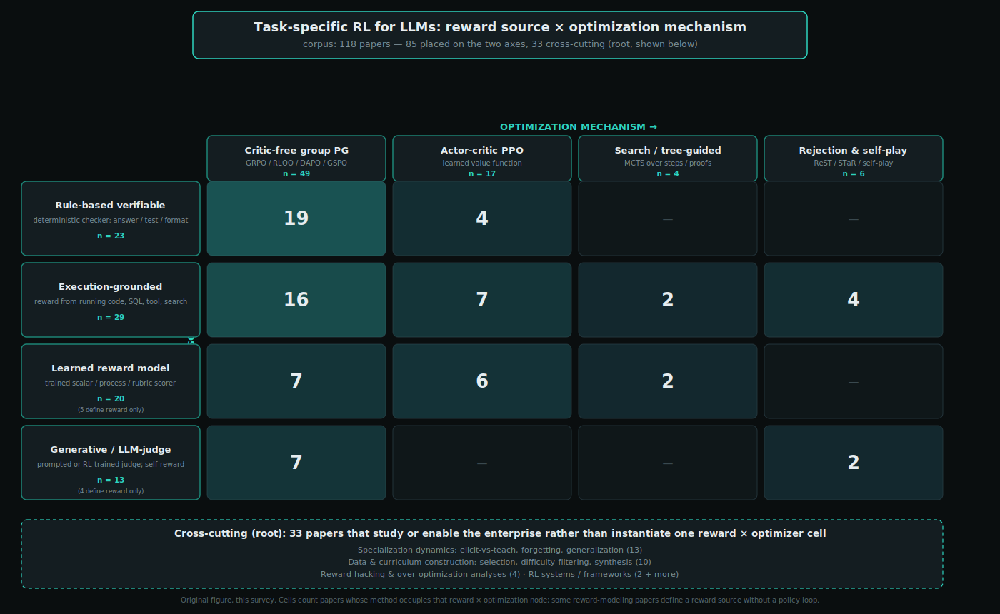

*Figure: The two-axis taxonomy — reward source (rows) × optimization mechanism
(columns) — with per-cell paper counts and the cross-cutting root band beneath.
The heaviest cells are verifiable-reward × critic-free group policy gradient
(the DeepSeek-R1 recipe) and execution-grounded × group policy gradient (the
code/SQL/agent recipe). Original figure, this survey.*

The method treatments that follow take each node of the two axes in turn — the
optimization mechanisms first (including the reward-construction work that sits
off that axis), then the four reward sources. Because every paper is placed on
both axes, systems recur across sections, seen once through the lens of *how*
they optimize and once through the lens of *what* supervises them.

### Actor-critic policy gradient (PPO-style)

The defining move of this family is to carry a second learned network alongside the policy: a value function, or critic, that estimates the expected return from any partial state. That critic buys finer-grained credit assignment. Where a critic-free group method (its sibling node) assigns one trajectory-level advantage to every token in a rollout, an actor-critic method can subtract a per-state baseline and, via generalized advantage estimation, hand each token or reasoning step its own lower-variance advantage. This matters precisely when the task reward is sparse and delayed — a single pass/fail at the end of a long code program, a correct final answer after a multi-step proof, a successful web-navigation trajectory of ten actions — because a bootstrapped value estimate propagates that terminal signal backward instead of smearing it uniformly. The cost is structural: the critic roughly doubles training memory and must itself be fit, and a badly-fit critic gives biased advantages that can stall or collapse training (Kazemnejad et al., 2024; Yue et al., 2025).

The lineage runs deep. The canonical task-RLHF pipeline is preference-based summarization (Stiennon et al., 2020): a reward model trained on human comparisons, then PPO against it with a KL penalty to the SFT policy and a separate value network — the template later reused everywhere, and also the origin of the reward-over-optimization (Goodhart) warning. Before LLMs, policy-gradient RL was already being bolted onto narrow NLP tasks: Seq2SQL trained the WHERE-clause decoder with REINFORCE using database execution as reward, so any query executing to the right result was rewarded regardless of clause ordering (Zhong et al., 2017), and noisy-data relation extraction cast sentence selection (Feng et al., 2018) and hierarchical mention extraction (Feng et al., 2018) as REINFORCE problems with a downstream classifier's likelihood as a delayed reward. These share the modern credit-assignment problem in miniature.

Execution-reward code RL is where actor-critic methods concentrated. CodeRL made the pattern explicit — the code LM is the actor and a learned critic predicts unit-test outcomes ({compile-error, runtime-error, failed, passed}) to weight a REINFORCE update with per-token relative returns (Le et al., 2022). PPOCoder generalized it to task-agnostic PPO with AST/data-flow-aligned rewards (Shojaee et al., 2023); RLTF added online sampling and multi-granularity (coarse/fine/adaptive) unit-test rewards (Liu et al., 2023); StepCoder eased sparse-reward exploration with a code-completion curriculum and masked non-executed tokens from the PPO loss (Dou et al., 2024); and RLEF framed iterative repair as a multi-turn MDP so the model genuinely learns to use execution feedback across turns (Gehring et al., 2024). A parallel thread densifies the reward itself so the critic has more to work with: PRM-as-value and dense-reward PPO in code (Dai et al., 2024), the automatic step-level PRM of Math-Shepherd driving step-by-step PPO (Wang et al., 2023), and the multi-aspect, per-segment reward models of Fine-Grained RLHF (Wu et al., 2023). The SFT-warmup-then-PPO recipe with a rule-based answer check — no learned reward model — appears in ReFT for math reasoning (Luong et al., 2024), and PPO reappears in zero-RL reasoning directly on a base model (Hu et al., 2025) and in online-curriculum web-agent RL with a learned outcome reward and value network (Qi et al., 2024).

The family carries an internal tension. After GRPO, most of the corpus migrated away from critics — the critic's cost and fragility looked unjustified when a group baseline was cheaper. The counter-argument comes from within. VinePPO shows PPO's learned value net ranks reasoning steps barely above chance, then replaces it with unbiased Monte-Carlo value estimates (roll out K continuations from each state), keeping the advantage-weighted update while dropping the critic network — evidence that accurate credit assignment, not the critic machinery per se, is what drives gains (Kazemnejad et al., 2024). VAPO goes the other way: it re-engineers value-based training (value-pretraining, decoupled and length-adaptive GAE) to beat DAPO and GRPO on long-CoT math, the first value-based method to significantly outperform the value-free ones (Yue et al., 2025).

This is the direct foil to critic-free group policy gradient: keeping (or Monte-Carlo-estimating) a value function buys better per-step credit assignment at higher memory and fitting cost, versus discarding it for a cheap group baseline. It also contrasts with search/tree-guided methods (which spend inference compute rather than a critic to localize good steps) and with rejection-sampling and self-play (which learn only from filtered positive samples, forgoing gradient-based advantage weighting altogether).

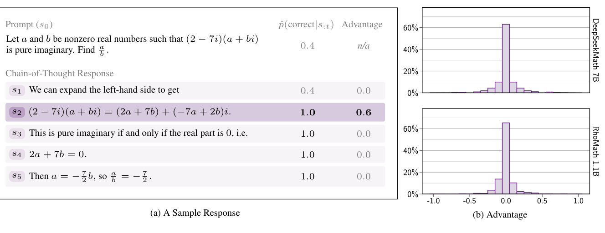

*Figure: VinePPO replaces PPO's value network with Monte-Carlo per-step correctness estimates, exploiting the language MDP's resettability. Figure from Kazemnejad et al. (2024), VinePPO, arXiv:2410.01679.*

### Critic-free group policy gradient

The single most consequential design choice shared across this survey is the decision to throw away the value network. Classical actor-critic PPO trains a learned critic alongside the policy to estimate a per-token baseline; for a large language model that critic is a second network of comparable size, roughly doubling optimizer memory and introducing a notoriously hard-to-fit regression target whose errors inject bias into every advantage. Group Relative Policy Optimization (GRPO), introduced with DeepSeekMath (Shao et al., 2024), observed that when you can cheaply sample many rollouts per prompt and score each one, you no longer need a critic at all: sample a group of *G* completions, normalize each completion's reward by the group mean (and, in the original formulation, standard deviation) to form its advantage, and optimize the usual clipped surrogate — moving the KL-to-reference term directly into the loss rather than into the reward. The group itself *is* the baseline. This turned out to be an unusually good fit for task specialization, where a rule-based or otherwise verifiable reward makes large-*G* sampling cheap and honest. DeepSeek-R1 made the recipe canonical, running GRPO from a base model with purely rule-based accuracy-plus-format rewards and no neural reward model at all, explicitly to sidestep reward hacking (Guo et al., 2025); Tulu 3's RLVR framing — reward equals a fixed bonus if a verifier accepts the completion, else zero — codified the same idea for open post-training (Lambert et al., 2024). Together these established critic-free group PG as the default optimizer for turning a general model into a specialist.

The corpus then contributes a series of algorithmic refinements to the base recipe. DAPO diagnoses several practical failure modes and fixes each: *Clip-Higher* decouples the lower and upper clipping bounds so low-probability exploratory tokens have room to grow and entropy does not collapse; *Dynamic Sampling* oversamples and discards prompts whose whole group is all-correct or all-wrong, since those contribute exactly zero gradient; and a token-level (rather than per-sample) loss normalization keeps long sequences from being under-weighted (Yu et al., 2025). GSPO argues that GRPO's per-token importance ratios are the wrong granularity when the reward is assigned to the whole sequence, and instead uses a single length-normalized sequence-likelihood ratio with response-level clipping, which stabilizes training on mixture-of-experts models where per-token ratios are especially noisy (Zheng et al., 2025). Dr. GRPO isolates two subtle biases baked into GRPO's normalization — the response-length divisor, which lets long wrong answers off lightly, and the group-std divisor, which silently up-weights easy questions — and removes both, recovering an unbiased Monte-Carlo advantage (Liu et al., 2025). RLOO-style leave-one-out baselines occupy the same design space, differing mainly in how the group baseline is computed.

What makes this node the backbone of the survey is its reach. Nearly every domain covered here rides on the same critic-free group-PG update. It is the optimizer of record in mathematical reasoning (Shao et al., 2024; Zeng et al., 2025); in code and software engineering (Wei et al., 2025; Golubev et al., 2025; Jiang et al., 2025); across the full text-to-SQL literature (Ma et al., 2025; Yao et al., 2025; Pourreza et al., 2025; Zhang et al., 2025; Weng et al., 2025); in structured-output extraction (Lu et al., 2025; Agarwal et al., 2025; Huang et al., 2025); throughout tool-use, search, and agentic settings (Jin et al., 2025; Song et al., 2025; Chen et al., 2025; Feng et al., 2025; Li et al., 2025; Qian et al., 2025; Singh et al., 2025; Jiang et al., 2025; Zheng et al., 2025; Li et al., 2025; Lu et al., 2025); in vision-language reasoning (Liu et al., 2025; Shen et al., 2025; Tan et al., 2025); and across professional verticals from medicine to law to finance (Chen et al., 2024; Lai et al., 2025; Feng et al., 2025; Dai et al., 2025; Liu et al., 2025; Qian et al., 2025; Xiao et al., 2025; Zhao et al., 2025). Crucially, the optimizer is agnostic to where the scalar reward comes from: the same GRPO loop pairs with verifiable rewards, with rubric-derived scores (Gunjal et al., 2025; Viswanathan et al., 2025; Liu et al., 2025), with generative-judge rewards (Whitehouse et al., 2025; Huang et al., 2025; Su et al., 2025; Yu et al., 2025), and with learned reward models (Zeng et al., 2025; Yang et al., 2024). This separability — optimizer here, reward source there — is precisely what let one algorithm generalize across so many tasks.

The trade-off against its siblings is the reason it is not universal. Dropping the critic makes the update dramatically cheaper and simpler than actor-critic PPO (Lambert et al., 2024), but it also makes the advantages noisier: a group-relative baseline is a high-variance Monte-Carlo estimate with no learned credit assignment, so it works best exactly when many rollouts per prompt are affordable and outcome rewards are reliable. Where those conditions fail — sparse rewards needing per-step credit, or settings that benefit from explicit lookahead — the search- and tree-guided and rejection-sampling siblings reappear. But for the verifiable, high-throughput regime that defines task-specific RL, critic-free group policy gradient is the shared default this survey documents.

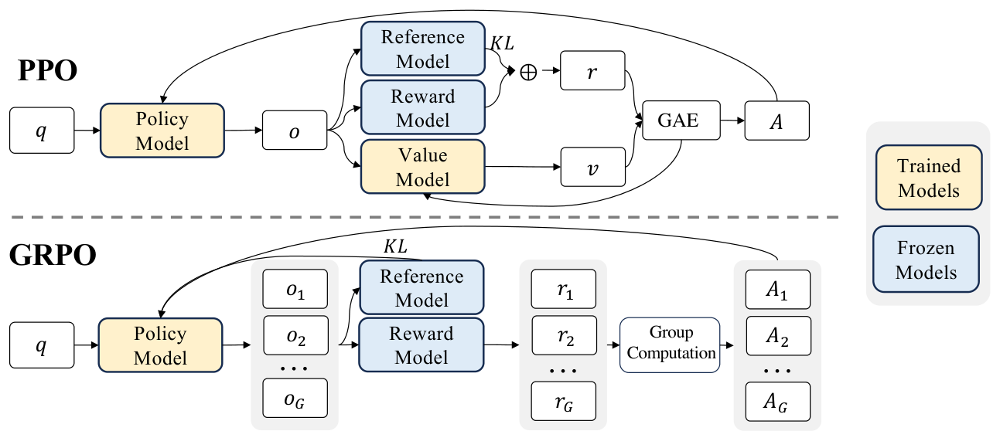

*Figure: Side-by-side schematic of PPO and GRPO: GRPO drops the separately-trained value model, estimating the baseline from a group of sampled outputs. Figure from Shao et al. (2024), DeepSeekMath, arXiv:2402.03300.*

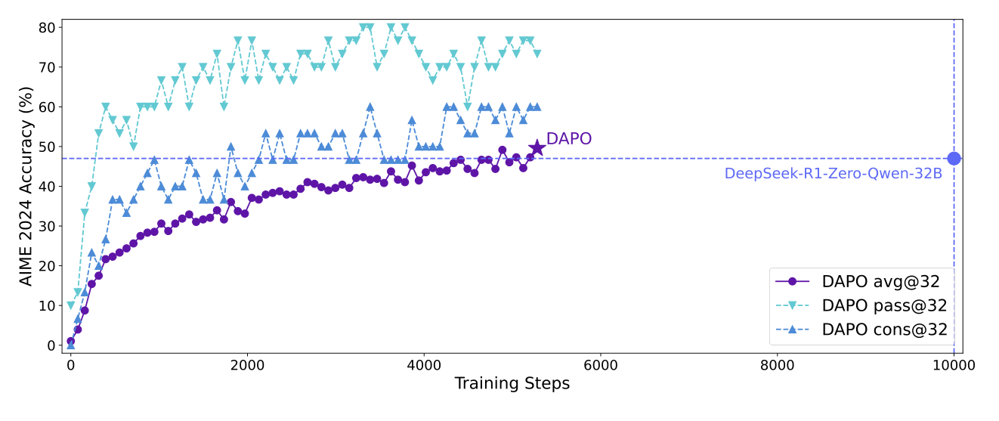

*Figure: DAPO's AIME 2024 accuracy on Qwen2.5-32B rising with training, surpassing a strong baseline using decoupled clipping and dynamic sampling. Figure from Yu et al. (2025), DAPO, arXiv:2503.14476.*

### Reward construction without an online policy loop

A large fraction of task-specific RL research never runs a policy-gradient step at all. Its object is the *reward* itself — how to manufacture a signal reliable enough that some *other* optimizer can safely consume it. The methods in this node build and study that signal off-policy, evaluated by reranking a fixed generator's samples (best-of-N) or by scoring held-out solutions, rather than by measuring how a policy improves under it. This is the reward-supply layer on which the sibling nodes depend: critic-free group policy gradient, actor-critic PPO, search/tree-guided methods, and rejection-sampling all assume a scalar reward is *given*, and much of the corpus here is precisely the work of producing one where a rule-based verifier does not suffice.

Two threads run through the node. The first is **process reward model (PRM) construction** — what makes a good per-step signal. The foundational result is that process supervision trains substantially more reliable verifiers than outcome supervision: labeling every reasoning step, not just the final answer, lets a PRM select correct solutions far better under best-of-N as N grows (Lightman et al., 2023). But *what* a step reward should measure is subtler than "is this step correct." Reframing the step reward as **progress** — the change in the likelihood of eventually reaching a correct answer, i.e. a step-level advantage measured under a complementary prover policy — turns dense process rewards from the marginal 1-2% gains of naive PRMs into large improvements in both search efficiency and sample efficiency (Setlur et al., 2024). The catch, documented empirically, is that the cheap automated route to PRM data (Monte-Carlo estimation) is noisy and generalizes worse than human or LLM-judge labels, and that best-of-N evaluation is itself a biased lens on PRM quality; consensus filtering (keep a step label only when MC and an LLM judge agree) and pairing best-of-N with step-error localization are the proposed correctives (Zhang et al., 2025).

The second thread is **generative and rubric-based reward-model construction**, which recasts scoring as text generation. Rather than a discriminative scalar head, a generative verifier predicts a "Yes/No" correctness token, unlocking chain-of-thought verification and test-time voting over sampled rationales (Zhang et al., 2024); generative reward models trained on ground-truth preferences with self-bootstrapped reasoning traces gain markedly stronger out-of-distribution robustness (Mahan et al., 2024); and critique-then-score reward models first write a natural-language critique, then predict a scalar conditioned on it (Ankner et al., 2024). Pointwise generative reward modeling with self-principled critique tuning extends this to general, reference-free queries and shows inference-time sampling of diverse principles can beat scaling model size (Liu et al., 2025). For genuinely non-verifiable domains, rubric generation supplies the criteria: jointly RL-training a rubric generator and a rubric-conditioned judge from pairwise preferences (Jiang et al., 2026), or eliciting complementary evaluative roles to cover a single generator's blind spots (Fu et al., 2026).

The methodological point is that because these rewards are validated by reranking and verification, their characteristic failure modes — label noise, distributional bias, and gameability — are all diagnosed *off-policy* (Zhang et al., 2025; Liu et al., 2025; Fu et al., 2026). The survey's limitations discussion connects this directly to reward hacking: a signal that looks clean under best-of-N can be exploited once it is placed inside an actual RL loop, where a policy actively optimizes against it. That is the defining contrast with the sibling optimization nodes — no policy is updated here. This node builds the reward the RL nodes plug in and then over-optimize.

### Search / tree-guided RL

For the hardest verifiable tasks — competition mathematics, program synthesis, formal proof — the reward is trustworthy but the *reasoning* behind a correct answer is not: a right final answer can rest on wrong intermediate steps (Zhang et al., 2024), and naive sampling almost never stumbles onto a long correct trajectory in the first place. This is the regime where the optimizers of the sibling nodes run dry. Group-relative policy gradient and PPO both assume a supply of trajectories worth learning from; rejection sampling assumes those trajectories can be found by sampling alone. When correct long-horizon traces are vanishingly rare and dense step-level supervision is unavailable, the methods here *manufacture* both by coupling learning with an explicit search procedure — usually Monte-Carlo tree search over reasoning steps or proof states.

The recurring instantiation is MCTS-guided self-training that mutually improves a policy and a process reward or value model. rStar-Math runs a policy SLM through extensive MCTS rollouts that self-annotate each step with a Q-value reflecting its contribution to correct final answers, then trains a process *preference* model by Bradley-Terry pairwise ranking of high- versus low-Q steps rather than regressing noisy scores directly; four rounds of this self-evolution lift a 7B model from 58.8% to 90.0% on MATH with no distillation from a larger teacher, and the reward model, not the policy, proves the dominant factor (Guan et al., 2025). ReST-MCTS* makes the mutual structure explicit: a value-model-guided MCTS* infers per-step process rewards automatically from tree search using only oracle final answers, and those inferred rewards do double duty — as value targets that refine the PRM and as a quality filter that selects traces for policy self-training, beating outcome-only self-training baselines like ReST-EM under equal token budgets (Zhang et al., 2024). The pattern generalizes beyond math. O1-Coder runs MCTS over pseudocode-level reasoning steps, but first must *build* the reward: a learned Test Case Generator supplies the execution environment that code datasets lack, yielding outcome rewards that MCTS turns into step-level process data for iterative policy fine-tuning (Zhang et al., 2024). DeepSeek-Prover-V1.5 attacks Lean 4 theorem proving, where the proof assistant gives a rigorous but extremely sparse binary reward; its RMaxTS search injects an intrinsic exploration reward for each newly discovered tactic state to drive proof search under that sparsity, and its truncate-and-resume mechanism unifies whole-proof and step-level generation, reaching 63.5% on miniF2F-test with search (Xin et al., 2024).

Across all four, the shared architecture is the same: search produces the data and the step-level rewards, and a policy-gradient or self-training step then distills that harvest back into the model. This is why the node composes so readily with its siblings — DeepSeek-Prover pairs RMaxTS with critic-free GRPO (Xin et al., 2024), and rStar-Math's outer loop is STaR-style bootstrapping wrapped around the tree search (Guan et al., 2025). What sets these methods apart is *where* the supervision comes from. The other optimizers consume step- or trajectory-level signal they assume is given; these spend test-time and training-time search compute to fabricate it. That purchase is expensive — rStar-Math's self-evolution ran on the order of weeks across many-GPU clusters, and DeepSeek-Prover's search demands hundreds of MCTS runners and thousands of CPU cores for Lean verification (Guan et al., 2025; Xin et al., 2024) — making this the heaviest-compute branch of the taxonomy, justified only where correct trajectories are otherwise unreachable.

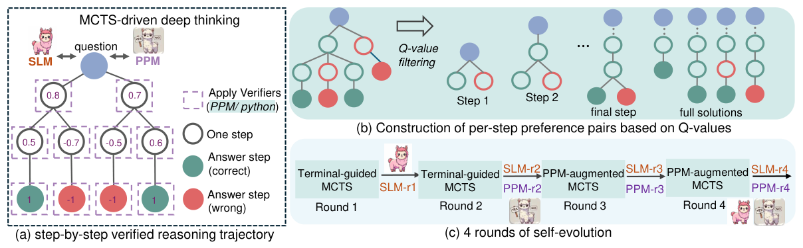

*Figure: rStar-Math pairs an MCTS deep-thinking policy with a process preference model, reaching o1-level math at small scale without distillation. Figure from Guan et al. (2025), rStar-Math, arXiv:2501.04519.*

### Rejection sampling and self-play

When a task's rollouts can be cheaply scored — a unit test executes, a math answer checks against a key — the simplest specializer barely looks like reinforcement learning at all: sample many candidate trajectories, discard the ones that fail the check, and fine-tune on the survivors. This rejection-sampling / expert-iteration recipe sidesteps advantage estimation, critics, and on-policy gradients entirely, yet it captures the core RL signal (do more of what worked) whenever a correctness oracle is available. Its practical limit is data: filtering still presumes a fixed pool of labeled tasks to sample against. Self-play removes even that dependence by letting one model propose its own problems and grade its own solutions, manufacturing a curriculum from nothing but its own generations.

The filtering-and-fine-tune end of this family is exemplified by SWE-Gym (Pan et al., 2024), which builds executable environments for real GitHub issues and improves a coding agent purely by rejection-sampling fine-tuning on execution-verified trajectories: 491 successful rollouts lift a 32B agent from 3.0% to 15.3% on SWE-Bench Lite, and a trained verifier reranking Best@k pushes it to 32.0% on Verified. Notably, its authors found on-policy self-improvement *without* a strong teacher ineffective — filtered behavior cloning is a weak learner when the samples come only from the model itself.

The self-play instantiations answer exactly that weakness by making task generation adversarial. CURE (Wang et al., 2025) co-evolves one model as both coder and unit-tester from their pairwise execution matrix, with a theoretically derived reward that favors tests which *discriminate* correct from incorrect code, needing no ground-truth solutions. Absolute Zero (Zhao et al., 2025) pushes to the extreme of zero external data: a single model proposes code-reasoning tasks (deduction, abduction, induction) whose difficulty maximizes its own learnability, then solves them, with a Python executor as the sole verifier — reaching state-of-the-art 7B coding despite no curated corpus. SPICE (Liu et al., 2025) grounds a Challenger–Reasoner self-play loop in a document corpus the solver never sees, breaking the information symmetry that lets ungrounded self-play stagnate. A related sub-thread turns self-play on the *reward* itself: Self-Rewarding LMs (Yuan et al., 2024) have the model judge its own generations via LLM-as-a-Judge and train on the resulting preference pairs through iterative DPO, improving both instruction-following and its own judging; Self-Taught Evaluators (Wang et al., 2024) bootstrap a strong judge from synthetic contrasting pairs and rejection-sampled reasoning verdicts, with no human preference labels.

The internal contrast runs between pure filtering-plus-SFT (Pan et al., 2024) and adversarial co-evolution (Wang et al., 2025; Zhao et al., 2025; Liu et al., 2025), with the self-rewarding loops (Yuan et al., 2024; Wang et al., 2024) as a third variant that self-generates preference data rather than task-correctness data. All share one hazard: self-generated data can drift or collapse when nothing external anchors it — a risk the members that add objective grounding mitigate directly (execution in (Wang et al., 2025; Zhao et al., 2025; Pan et al., 2024), a real corpus in (Liu et al., 2025)), while the introspective self-rewarding methods (Yuan et al., 2024; Wang et al., 2024), lacking such a check, remain more exposed to reward drift and saturate within a few iterations.

Against the sibling optimization mechanisms — critic-free group policy gradient, actor-critic PPO, and search/tree-guided methods — this family is distinctive on two counts. Most of its members apply no on-policy RL gradient at all, sitting closest to SFT on filtered samples rather than to policy optimization, and several dispense with a fixed critic model. More uniquely, self-play reduces or eliminates dependence on a curated task dataset, generating its own curriculum where the sibling methods all assume a supplied problem distribution to optimize against.

### Execution-grounded reward

For a large class of tasks, correctness is not a property of a string but of what happens when that string is *run*. A program either passes its unit tests or does not; a SQL query either executes to the right rows or does not; a Lean proof either type-checks or does not; a search query either surfaces the supporting document or does not. Here the reward resolves only by invoking an external system and reading its response, which gives an objective signal — as trustworthy as a rule-based verifier — but one that is characteristically **sparse, delayed, and expensive**: a single scalar arrives at the end of a rollout that may span thousands of tokens and dozens of environment interactions, and obtaining it requires a live interpreter, database, or web service in the RL loop. The central engineering problem is wiring that environment into training (a sandboxed executor, a retriever, a Docker-backed repo) and the central learning problem is credit assignment across multi-turn trajectories under such thin feedback.

The shared recipe pauses generation on a trigger token, dispatches the model's output to the environment, splices the observation back into context, and resumes — masking environment-returned tokens from the policy-gradient loss so the model is not trained to imitate deterministic tool output (Li et al., 2025; Feng et al., 2025; Jin et al., 2025). Internal variation is best organized by *which* environment supplies the reward.

**Code execution and unit tests.** The oldest branch predates RLVR: CodeRL casts synthesis as actor–critic RL with a learned critic predicting test outcomes (Le et al., 2022), and PPOCoder adds compiler and AST/DFG-structure rewards (Shojaee et al., 2023). Later work densifies the sparse pass/fail signal — RLTF localizes penalties to the erroneous lines (Liu et al., 2023), StepCoder curricularizes exploration and masks unexecuted tokens (Dou et al., 2024), RLEF makes multi-turn execution feedback genuinely useful across revision turns (Gehring et al., 2024), and CodeRL+ adds an auxiliary variable-value-prediction objective to close the text-versus-runtime semantic gap (Jiang et al., 2025).

**Real software repositories.** Scaling execution grounding to whole repos requires reproducible runtimes: SWE-Gym packages 2,438 GitHub-issue tasks with pre-installed environments and expert tests as the reward oracle (Pan et al., 2024), and long-context multi-turn DAPO trains a genuine SWE agent whose terminal reward is the actual test suite passing after a full interactive POMDP trajectory (Golubev et al., 2025).

**Self-play with executable tests.** When the executor is trusted, the task supply can be self-generated: CURE co-evolves a coder and a unit-test generator from their execution matrix with no ground-truth code (Wang et al., 2025), Absolute Zero has one model propose and solve code tasks validated entirely by a Python executor (Zhao et al., 2025), and O1-Coder trains a test-case generator to build the reward environment for MCTS self-play (Zhang et al., 2024).

**Database execution.** Text-to-SQL grounds reward in query execution — the idea originates in Seq2SQL, whose policy gradient rewards any query executing to the correct result regardless of clause ordering (Zhong et al., 2017). Modern GRPO variants split on reward shape: minimal execution-only rewards for stability (Ma et al., 2025; Yao et al., 2025) versus densified partial or process rewards to combat sparsity (Pourreza et al., 2025; Zhang et al., 2025).

**Tool and interpreter calls.** Here execution is an *action* inside reasoning: ReTool and ToRL interleave sandboxed Python for precise math computation (Feng et al., 2025; Li et al., 2025), while ToolRL and ARTIST reward correct multi-step tool selection and invocation (Qian et al., 2025; Singh et al., 2025).

**Search and retrieval outcomes.** Search-R1, R1-Searcher, and ReSearch reward answer correctness after live retrieval, treating the search engine as environment (Jin et al., 2025; Song et al., 2025; Chen et al., 2025); DeepRetrieval optimizes the retrieval metric itself (Jiang et al., 2025); and DeepResearcher and WebThinker scale this to the open web (Zheng et al., 2025; Li et al., 2025).

**Other environments.** WebRL grounds reward in GUI/web action success via a learned outcome model over final-page state (Qi et al., 2024); SPICE grounds a self-play curriculum in a document corpus the solver never sees (Liu et al., 2025); and DeepSeek-Prover-V1.5 takes its binary reward straight from the Lean proof assistant (Xin et al., 2024).

Against the siblings, execution rewards are as objective as **rule-based verifiable** rewards but differ in mechanism: the checker is a live, stateful, costly environment rather than a string comparison, so the signal is sparse and multi-turn. Unlike **learned reward models** and **generative/LLM-judge** rewards, an executor cannot be reward-hacked by fluent-but-wrong text — but it is only available where a task's correctness is genuinely runnable, and its rollouts are far more expensive than any static checker's.

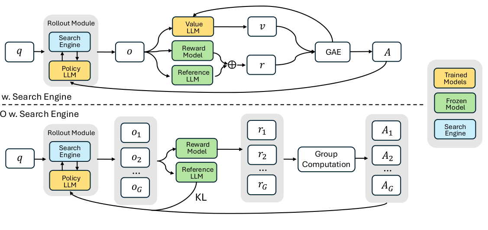

*Figure: Search-R1's rollout interleaves policy generation with live search-engine calls, with the retrieval outcome grounding the reward. Figure from Jin et al. (2025), Search-R1, arXiv:2503.09516.*

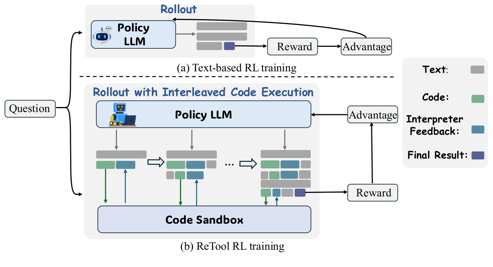

*Figure: ReTool trains the policy to interleave real code execution into its reasoning, with correctness of the executed result as the reward. Figure from Feng et al. (2025), ReTool, arXiv:2504.11536.*

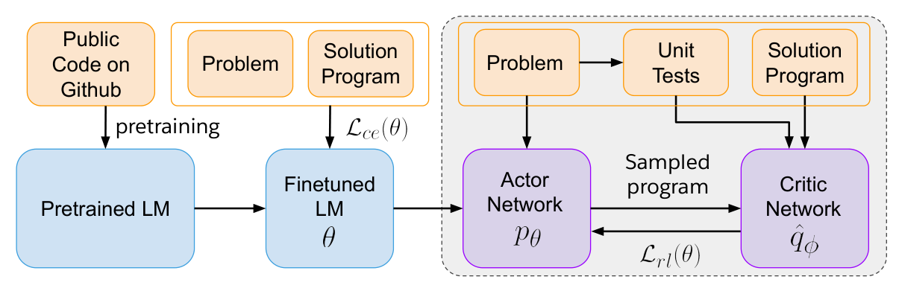

*Figure: CodeRL frames program synthesis as actor-critic RL, with a learned critic predicting unit-test outcomes to give dense reward. Figure from Le et al. (2022), CodeRL, arXiv:2207.01780.*

### Generative / LLM-as-judge reward

Many task specializations have neither a rule-based verifier nor an execution
environment, yet training a scalar reward model in the RLHF style demands a large
labeled preference set that is expensive to collect and goes stale as the policy
improves (Wang et al., 2024). The generative-judge family answers
this by letting a capable LLM produce the reward: rather than emitting a single
scalar from a Bradley-Terry head, the judge reads the output and *reasons about it
in natural language* before committing to a verdict or score. The wager is that a
model which can articulate *why* an answer is right verifies more accurately, ports
across domains, and can spend extra inference compute to sharpen its judgment
(Zhang et al., 2024; Ankner et al., 2024). This is the most
general reward source in the survey and, as its own reliability literature makes
clear, the least trustworthy.

**Generative verifiers and critique-then-score.** The foundational move recasts
scoring as next-token prediction: correctness becomes the probability of a "Yes"/"No"
(or preference-indicator) token, so one SFT loss trains generation and verification
jointly, and a chain-of-thought rationale can precede the verdict with majority
voting over sampled rationales trading test-time compute for accuracy
(Zhang et al., 2024; Mahan et al., 2024). GenRM-style
judges generalize markedly better out-of-distribution than BT reward models when
bootstrapped on self-generated reasoning traces (Mahan et al., 2024).
Critique-out-loud keeps a scalar head but conditions it on a self-generated critique,
recovering explicit reasoning while preserving a preference score
(Ankner et al., 2024). DeepSeek-GRM makes the judge *pointwise* and
principle-driven — it generates evaluation principles, then a critique, then scores
— which unifies single/paired/multiple-response scoring and lets parallel sampling
plus a meta-reward-model filter beat scaling the judge's parameter count
(Liu et al., 2025).

**RL-trained "thinking" judges and self-taught evaluators.** A second wave optimizes
the judge's reasoning directly with RL. J1 and Think-J convert judgment tasks —
including non-verifiable ones — into verifiable preference pairs and train with GRPO
under correctness, consistency, and format rewards, yielding judges that outrank much
larger models on reward benchmarks (Whitehouse et al., 2025; Huang et al., 2025).
Self-taught evaluators reach the same end without policy-gradient RL, via iterative
rejection-sampling on synthetic preference pairs and no human labels
(Wang et al., 2024). Position bias and reward hacking surface directly
here: J1 adds a consistency reward across answer orderings (Whitehouse et al., 2025), and
Think-J observes margin rewards driving scores to extremes (Huang et al., 2025).

**Self-rewarding and reference-probability rewards.** The judge can be the policy
itself. Self-Rewarding LMs have the model score its own generations via
LLM-as-a-Judge prompting inside an iterative-DPO loop, improving instruction-following
*and* the judging ability together (Yuan et al., 2024); SSR applies the same
actor-as-judge idea to reference-free machine translation with GRPO
(Yang et al., 2025). Two verifier-free routes extend RLVR to general domains where
rule matching fails: a compact distilled generative verifier judges free-form answers
against expert references (Su et al., 2025), while RLPR discards the
verifier entirely and rewards the policy's own mean token-probability of the reference
answer, debiased against a no-reasoning baseline (Yu et al., 2025). Domain deployments
follow the same template — a GPT-4o verifier scores medical reasoning trajectories
(Chen et al., 2024), and a staged structure/evidence/decision judge rewards
financial theses (Xiao et al., 2025).

**Reliability and contrast with siblings.** What defines this node is that the reward
is a *model's opinion*, so it is gameable and biased in ways a deterministic check is
not — the survey's limitations section treats reward hacking and "master-key" failures
and the meta-evaluation of judges separately. Against the rule-based verifiable,
execution-grounded, and learned scalar/PRM/rubric siblings, generative judges buy the
widest task coverage — any domain a language model can reason about — at the cost of
the weakest trust guarantee: there is no environment to fail in and no ground-truth
check, only another model's judgment standing in for one.

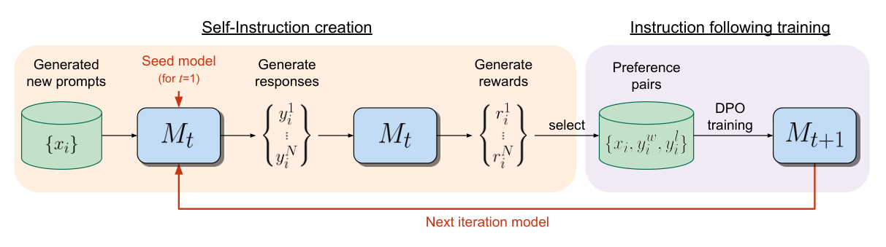

*Figure: In Self-Rewarding Language Models the model generates prompts and responses and scores them as its own LLM-as-a-judge reward. Figure from Yuan et al. (2024), Self-Rewarding Language Models, arXiv:2401.10020.*

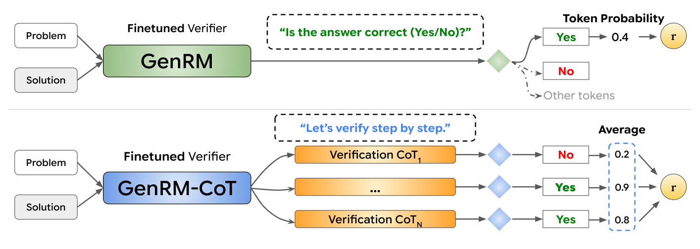

*Figure: GenRM scores a solution by the token probability of answering 'Yes' to a correctness question, unifying generation and verification. Figure from Zhang et al. (2024), Generative Verifiers, arXiv:2408.15240.*

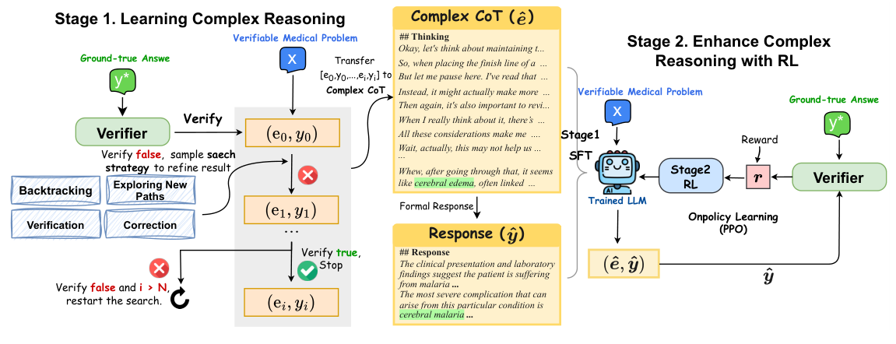

*Figure: HuatuoGPT-o1 uses an LLM verifier and search to build medical reasoning chains, then RL, specializing a model on clinical tasks. Figure from Chen et al. (2024), HuatuoGPT-o1, arXiv:2412.18925.*

### Learned reward model

Many valuable tasks admit no cheap deterministic verifier. Summary quality, clinical helpfulness, molecular validity, or "did this open-ended answer satisfy the instruction" cannot be checked by a rule or an interpreter, yet they are exactly the tasks where RL matters most. The learned-reward-model branch answers this by *training* a scorer to supply the reward — a scalar model, a step-level process reward model (PRM), or a rubric-conditioned judge. The move buys applicability to open-ended tasks that the sibling reward sources cannot touch: unlike rule-based verifiable rewards, execution-grounded rewards, or a frozen generative LLM-judge, a learned reward can be fit to any signal for which preference or correctness data exists. The price is that the reward is itself a fallible model, reintroducing the reward-hacking risk that verifiable and execution rewards structurally avoid — (Stiennon et al., 2020) already documented that optimizing too hard against the reward model degrades true quality past a KL threshold, the empirical seed of the overoptimization literature.

The classic instance is the RLHF task reward model: collect human pairwise comparisons, fit a reward model with a logistic preference loss, then optimize the policy with PPO under a KL penalty (Stiennon et al., 2020). Its lineage predates LLMs — (Feng et al., 2018) and (Feng et al., 2018) cast noisy relation extraction as RL, with a CNN classifier's likelihood serving as a learned, delayed reward for a policy that selects clean sentences or tags mention spans, the pre-RLVR root of applying RL to a narrow NLP task via a trained scorer rather than a rule.

**Process reward models** densify this signal from outcome to step. Rather than one terminal scalar, a PRM scores each reasoning step. (Lightman et al., 2023) established that human step-level supervision (PRM800K) trains a substantially more reliable verifier than outcome supervision on MATH; because per-step human labels do not scale, (Wang et al., 2023) defines a step's quality by its potential to reach the correct answer via completer rollouts, automating the labels, and (Dai et al., 2024) carries the same idea to code by binary-searching partial-prefix correctness against unit tests, used as both dense reward and value-init. (Setlur et al., 2024) sharpens what a step reward *should* measure — progress, the change in eventual-correctness likelihood under a complementary prover policy — arguing naive PRMs gain only 1–2% over outcome models. The limits are real: (Zhang et al., 2025) shows Monte-Carlo-estimated PRM data is noisy and Best-of-N evaluation biased, recommending consensus filtering against an LLM judge. PRMs also couple naturally to search: (Guan et al., 2025) and (Zhang et al., 2024) guide MCTS with a learned process/value model, using tree-derived Q-values to train the verifier and select traces.

A parallel line trains reward models from *automatically constructed* supervision. (Zeng et al., 2025) fits a code reward model from execution-derived preference pairs (test pass rates), and (Weng et al., 2025) learns an execution-free scorer over SQL graph representations, judging functional equivalence without running the database. These blur the line with the execution-grounded sibling — execution supplies the labels, but a trained model supplies the reward at RL time.

To reach genuinely open-ended tasks, **rubric- and checklist-conditioned** rewards decompose a judgment into weighted yes/no criteria. (Gunjal et al., 2025) frames RLVR as the single-criterion special case and turns per-instance rubrics into a GRPO reward for medicine and science; (Viswanathan et al., 2025) extracts instruction-specific checklists graded by an AI judge plus a verifier program; (Liu et al., 2025) trains rubric-generation and rubric-reward models at scale via contrastive generation; (Jiang et al., 2026) jointly RL-trains generator and judge into a deployable pointwise model; and (Fu et al., 2026) elicits complementary evaluative roles to close dimensional blind spots and resist rubric hacking. (Wu et al., 2023) is the ancestor: multiple category-specific reward models (factuality, relevance, completeness) applied densely per segment. Domain reward models specialize the same machinery — (Yang et al., 2024) combines a learned math RM with a rule verifier under GRPO, and (Zhao et al., 2025) builds a multi-dimensional structural reward for chemistry to blunt single-metric hacking.

The internal contrast runs along three axes: outcome versus process density; scalar versus rubric-conditioned decomposition; and human-labeled versus auto-constructed (MC-rollout, execution, or LLM-synthesized) supervision. What unifies the branch, and separates it from its siblings, is that the reward must be *trained* — and can therefore be gamed.

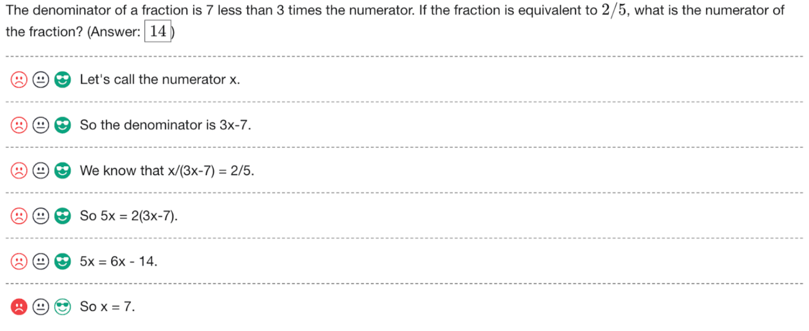

*Figure: The human-feedback interface used to collect step-level process supervision for training a process reward model. Figure from Lightman et al. (2023), Let's Verify Step by Step, arXiv:2305.20050.*

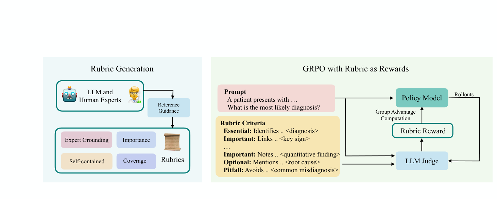

*Figure: Rubrics as Rewards (RaR) turns prompt-specific checklist criteria into a structured reward, extending RLVR beyond mechanically-verifiable tasks. Figure from Gunjal et al. (2025), Rubrics as Rewards, arXiv:2507.17746.*

### Rule-based verifiable reward

The largest and most influential family of task-specific RL recipes derives its reward signal from a **deterministic checker**: a piece of code that inspects the model's completion and returns a scalar with no learned model anywhere in the loop. The check might be an exact-match comparison against a gold answer, a regular-expression test that the output carries the required tags, or a metric computed against a reference. Because the verifier is a fixed program rather than a trained scorer, it cannot itself be gamed by the policy the way a neural reward model can — a property that made **RL with verifiable rewards (RLVR)** the default recipe for any task whose success admits a cheap, unambiguous programmatic test. The approach was formalized and named by Tulu 3 (Lambert et al., 2024), which ran PPO against a binary verification function (`α` if the completion is verifiably correct else `0`) across GSM8K, MATH, and per-constraint IFEval verifiers; and it was demonstrated at scale by DeepSeek-R1 (Guo et al., 2025), whose R1-Zero variant showed that GRPO with only rule-based accuracy plus format rewards — no SFT, no neural scorer — elicits emergent long chain-of-thought reasoning directly from a base model. R1 avoided neural reward models precisely because they invite reward hacking (Guo et al., 2025).

**Where a deterministic verifier is available, and what it checks.** The internal variation among these methods is best understood by grouping on *what the checker inspects*. The canonical case is **numeric/answer match in math**: the reward is `+1` when the boxed final answer is equivalent to ground truth. This is the setting of DeepSeekMath's original GRPO (Shao et al., 2024) and of the minimalist "zero-RL-from-base" reproductions — Open-Reasoner-Zero, which strips the recipe to vanilla PPO with a plain binary correctness reward and no KL penalty (Hu et al., 2025), and SimpleRL-Zoo, which runs the same `+1`/`0` reward across ten base models and finds a rigid format reward actually *harms* exploration in weaker ones (Zeng et al., 2025). ReFT is an early precursor, pairing warm-up SFT with PPO whose reward is a golden answer-check plus a small partial-credit term (Luong et al., 2024). A second group verifies **geometric or classification correctness for vision**: Visual-RFT computes an IoU reward for detection and an accuracy reward for classification at negligible cost (Liu et al., 2025); VLM-R1 uses IoU for referring-expression grounding and mAP for open-vocabulary detection (Shen et al., 2025); Reason-RFT tailors discrete, tolerance-smoothed, and function-based accuracy rewards to counting, structure, and spatial tasks (Tan et al., 2025). A third group checks **schema or format adherence**: SchemaRL rewards a fine-grained JSON-validator correctness ratio (Lu et al., 2025), and ThinkJSON combines a key-match/length reward with a binary format-verification regex (Agarwal et al., 2025). Verifiers also cover structured or action outputs — UI-R1's point-in-box coordinate plus action-type reward for GUI grounding (Lu et al., 2025), ReasoningNER's span-F1 plus schema-adherence reward for entity extraction (Huang et al., 2025) — and specialist domains where a letter-match or answer-check stands in for the verifier: Med-R1 for medical VQA (Lai et al., 2025), Legal-Delta for legal reasoning (Dai et al., 2025), and the financial models Fin-R1 (Liu et al., 2025) and Fin-o1 (Qian et al., 2025). Machine translation sits at the node's edge: MT-R1-Zero replaces the binary reward with a **continuous MT-metric** (BLEU, COMETKiwi) gated by a format check, keeping the verifier deterministic even where no single correct output exists (Feng et al., 2025) — though its reference-free metric is itself learned, blurring the boundary with the learned-reward-model sibling.

**Optimizer variants that ride verifiable rewards.** Because the reward is cheap and stable, much of this work targets the *credit-assignment and optimization* machinery rather than the reward. VinePPO replaces PPO's biased value network with unbiased Monte-Carlo value estimates, showing accurate per-step credit assignment — not the critic machinery — drives the gains (Kazemnejad et al., 2024). DAPO stabilizes large-scale GRPO with decoupled clipping, dynamic sampling, and token-level loss (Yu et al., 2025); VAPO reintroduces a value model with length-adaptive GAE to beat the value-free methods (Yue et al., 2025); and GSPO argues the token-level importance ratio itself is the source of GRPO's collapse on long sequences and MoE models, moving clipping to the sequence level (Zheng et al., 2025). SWE-RL extends the deterministic-reward idea to software engineering with a rule-based sequence-similarity (difflib) reward between predicted and oracle patch, avoiding any code execution (Wei et al., 2025).

**Contrast with the sibling reward sources.** The defining strength of rule-based verifiable rewards is that there is *no learned scorer to hack*: unlike a learned reward model or a generative LLM-judge, the checker's output is fixed, reproducible, and immune to the policy's optimization pressure. Unlike execution-grounded rewards, the check requires no runtime environment — a difflib comparison or answer-match runs in microseconds where SWE-RL would otherwise need executable test harnesses at scale (Wei et al., 2025). The corresponding limitation is equally sharp: the approach applies *only where a cheap deterministic check exists*. Tasks whose quality is subjective (open-ended generation, translation fidelity, reasoning-trace depth) either fall back to a learned metric or judge — Fin-R1 and Fin-o1 already lean on an LLM-judge for their "accuracy" reward (Liu et al., 2025; Qian et al., 2025) — or must engineer a proxy that risks being gamed. Several members observe exactly this: redundant-box enumeration under mAP (Shen et al., 2025), format-hacking under a rigid tag reward (Zeng et al., 2025; Feng et al., 2025). The very failure mode the node's rule-based purity is meant to avoid reappears whenever the deterministic check is a loose surrogate for true task success.

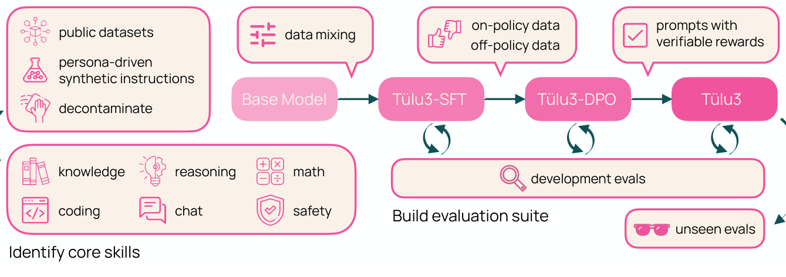

*Figure: Overview of the Tulu 3 post-training pipeline, which formalized RL with verifiable rewards (RLVR) against a deterministic checker. Figure from Lambert et al. (2024), Tulu 3, arXiv:2411.15124.*

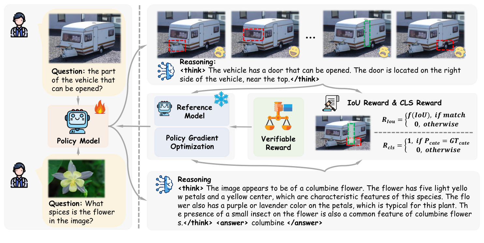

*Figure: Visual-RFT applies verifiable rule-based rewards (IoU for detection, accuracy for classification) to a vision-language policy. Figure from Liu et al. (2025), Visual-RFT, arXiv:2503.01785.*

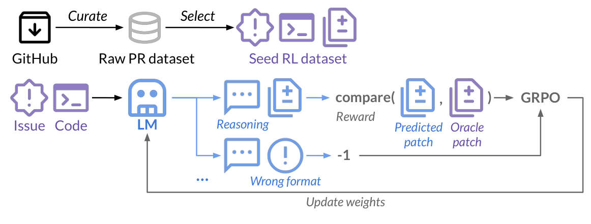

*Figure: SWE-RL curates a seed RL dataset from GitHub pull requests and trains with GRPO under a lightweight rule-based patch-similarity reward. Figure from Wei et al. (2025), SWE-RL, arXiv:2502.18449.*

## Evolution: from Seq2SQL to R1-everywhere

Task-specific RL for language models predates large language models. The
earliest corpus entries treat RL as a way to optimize a *non-differentiable
task metric* directly: Seq2SQL (Zhong et al., 2017) trains the WHERE-clause of a
query with policy gradient using live database execution as the reward — the
first execution-grounded task reward in the corpus — and the 2018 relation-
extraction work (Feng et al., 2018; Feng et al., 2018) uses
RL to denoise data for a fixed NLP task. In parallel, "Learning to summarize
from human feedback" (Stiennon et al., 2020) established the other archetype:
collect human comparisons for one task, train a reward model, and optimize it
with PPO. These two lineages — an *objective environment reward* and a *learned
reward model* — are the ancestors of everything that follows, and the reward-
over-optimization scaling laws of (Gao et al., 2022) already warned, in 2022,
that a learned proxy reward degrades once pushed too hard.

The 2022–2023 **reward-shaping era** deepened both lineages for code and
reasoning. CodeRL (Le et al., 2022) and PPOCoder (Shojaee et al., 2023) made unit-
test execution a dense actor-critic reward; RLTF (Liu et al., 2023) and StepCoder
(Dou et al., 2024) refined the granularity and exploration of that signal. On
the learned-reward side, process reward models arrived: "Let's Verify Step by
Step" (Lightman et al., 2023) showed step-level supervision trains more
reliable verifiers than outcome supervision, and Math-Shepherd (Wang et al., 2023)
made process labels automatic. Fine-Grained RLHF (Wu et al., 2023) pushed
learned rewards toward density and multiple aspects. The pieces of the modern
recipe existed, but training was expensive and the reward machinery elaborate.

The inflection was **GRPO**. DeepSeekMath (Shao et al., 2024) introduced
Group Relative Policy Optimization — dropping PPO's value network in favor of a
group-relative baseline — which roughly halved the cost of an RL step and made
large-scale task RL practical. Tulu 3 (Lambert et al., 2024) named and popularized
**RLVR**: PPO (or GRPO) against a purely deterministic verifier, fully open. The
two ideas fused in **DeepSeek-R1** (Guo et al., 2025): applying GRPO with only
rule-based accuracy and format rewards *directly on a base model*, with no
supervised warm-up, elicited long chain-of-thought reasoning, self-verification,
and reflection as emergent behaviors. R1-Zero was the branch point that turned
task-specific RL from a specialist craft into a commodity recipe.

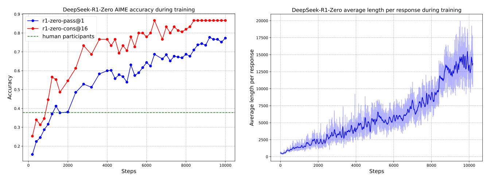

*Figure: DeepSeek-R1-Zero's AIME 2024 accuracy (pass@1 and cons@16) and average
response length rising over the course of pure-RL training with rule-based
verifiable rewards — the result that made "GRPO from base" the default recipe.
Figure from Guo et al. (2025), DeepSeek-R1, arXiv:2501.12948.*

What followed in 2025 was a **domain explosion**. The same recipe — verifiable
or execution reward + GRPO from a strong base — was carried into essentially
every task with a checkable answer: search and retrieval agents (Search-R1
(Jin et al., 2025), R1-Searcher (Song et al., 2025), ReSearch (Chen et al., 2025)),
tool and code-interpreter use (ReTool (Feng et al., 2025), ToRL (Li et al., 2025),
ToolRL (Qian et al., 2025)), software engineering (SWE-RL (Wei et al., 2025), long-
context SWE agents (Golubev et al., 2025)), text-to-SQL (SQL-R1 (Ma et al., 2025),
Arctic-Text2SQL-R1 (Yao et al., 2025)), structured output
(Lu et al., 2025; Agarwal et al., 2025), vision-language tasks (Visual-RFT
(Liu et al., 2025), VLM-R1 (Shen et al., 2025)), and verticals from medicine
(HuatuoGPT-o1 (Chen et al., 2024), Med-R1 (Lai et al., 2025)) to translation
(MT-R1-Zero (Feng et al., 2025)) to finance and chemistry (Liu et al., 2025; Zhao et al., 2025). In parallel the *recipe itself* was hardened: DAPO
(Yu et al., 2025), GSPO (Zheng et al., 2025), and analyses of R1-Zero-like training
(Liu et al., 2025) fixed instabilities; ProRL (Liu et al., 2025) and 1-shot RLVR
(Wang et al., 2025) probed how far it scales up and down; and a large
data-and-curriculum literature (Li et al., 2025; Shi et al., 2025; Bae et al., 2025)
asked which task examples are worth training on.

As the recipe generalized, two frontiers opened. First, **reward construction
past verifiable domains**: rubric-conditioned rewards (Rubrics as Rewards
(Gunjal et al., 2025), RLCF (Viswanathan et al., 2025), OpenRubrics
(Liu et al., 2025)), generative and RL-trained judges (GenRM
(Zhang et al., 2024), J1 (Whitehouse et al., 2025)), and verifier-free
schemes that recover a signal from a model's own reference probability (RLPR
(Yu et al., 2025)) or a distilled cross-domain verifier (Su et al., 2025)
— all attempts to reach the open-ended tasks that a deterministic checker cannot.
Second, a **reckoning**: careful studies began asking what the reward is
actually teaching. "Does RL Really Incentivize Reasoning?" (Yue et al., 2025)
found RLVR often narrows rather than expands a base model's reasoning boundary;
"Spurious Rewards" (Shao et al., 2025) showed random or incorrect rewards
can still lift certain models, implying the gains sometimes reflect elicitation,
not learning; and contamination audits (Wu et al., 2025)
traced some apparent gains to benchmark leakage. Counter-evidence
(Liu et al., 2025; Wen et al., 2025) argues prolonged or
properly-measured RL does extend capability. This debate — teach or elicit —
together with work on forgetting and diversity collapse, is the live frontier
the limitations section takes up. By 2026 the corpus turns increasingly
reflective: forgetting laws (Shenfeld et al., 2025; Harmon et al., 2025),
generalization studies (Xi et al., 2026), and diagnostics for reward
hacking in rubric-based RL (Mahmoud et al., 2026; Wang et al., 2026).

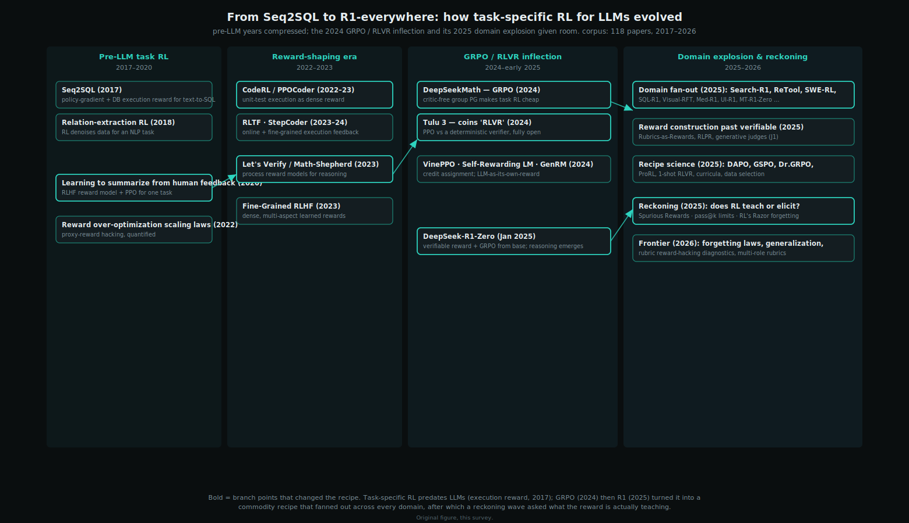

*Figure: The evolution of task-specific RL for LLMs, with the pre-LLM years
compressed to give the 2024 GRPO/RLVR inflection and its 2025 domain explosion
room. Bold nodes are branch points that changed the recipe. Original figure,
this survey.*

## Cross-cutting comparison

The two axes are useful precisely because the reward source and the optimizer
trade off along different dimensions. The first table compares the four reward
sources on the properties that decide which one a given task can use; the second
shows how the recipe is instantiated across domains, making visible that the
*optimizer* (critic-free group policy gradient) is nearly constant while the
*reward source* is what each domain must engineer.

**Reward sources compared.** The progression from verifiable to judge rewards
buys generality at a steady cost in trustworthiness and price.

| Reward source | Applicable tasks | Signal density | Reward-hacking exposure | Cost per reward | Representative work |
|---|---|---|---|---|---|
| Rule-based verifiable | Tasks with a mechanical check (answer match, format, metric) | Sparse (usually outcome-only) | Very low — nothing to game but the check itself | Negligible | (Guo et al., 2025), (Lambert et al., 2024), (Shao et al., 2024) |
| Execution-grounded | Tasks resolved by an external system (tests, DB, tool, search) | Sparse, delayed, often multi-turn | Low, but spec-gaming of tests/environments is possible | High (run the environment) | (Le et al., 2022), (Jin et al., 2025), (Ma et al., 2025) |
| Learned reward model | Open-ended tasks with trainable preference/process/rubric signal | Can be dense (step- or aspect-level) | Moderate–high — the proxy degrades under pressure | Medium (train + serve a model) | (Lightman et al., 2023), (Gunjal et al., 2025), (Wu et al., 2023) |
| Generative / LLM-judge | Almost any task expressible as a judgment | Flexible (scalar or critique) | High — judges are biased and can be fooled by superficial cues | Medium–high (judge inference) | (Zhang et al., 2024), (Whitehouse et al., 2025), (Yu et al., 2025) |

**The recipe across domains.** Grouping representative task specialists by
domain shows the shared skeleton — critic-free group policy gradient on a
strong base — and the domain-specific reward each one had to build. "Effect" is
stated as the paper reports it; see the cited note for exact numbers.

| Domain | Representative system | Reward source | Optimizer | Reported effect |
|---|---|---|---|---|
| Math reasoning | DeepSeek-R1-Zero (Guo et al., 2025) | verifiable (answer+format) | group PG (GRPO) | Long-CoT reasoning emerges from a base model with no SFT |
| Math reasoning | rStar-Math (Guan et al., 2025) | learned process reward | search-guided (MCTS) | o1-level math at 1.5B–7B without distillation from a larger model |
| Math (recipe) | DAPO (Yu et al., 2025) | verifiable | group PG (decoupled clip) | State-of-the-art math RL on Qwen2.5-32B base, fully open |
| Code / SWE | SWE-RL (Wei et al., 2025) | rule-based patch similarity | group PG (GRPO) | First RL for real-world software-engineering reasoning from GitHub PRs |
| Code | CodeRL (Le et al., 2022) | execution (unit tests) | actor-critic PPO | Dense token-level reward from a critic predicting test outcomes |
| Text-to-SQL | SQL-R1 (Ma et al., 2025) | execution (DB result) | group PG (GRPO) | Strong NL2SQL from RL on only ~5K synthetic samples |
| Tool / agents | Search-R1 (Jin et al., 2025) | execution (search outcome) | group PG / PPO | Learns to interleave search queries with reasoning end-to-end |
| Vision-language | Visual-RFT (Liu et al., 2025) | verifiable (IoU / accuracy) | group PG (GRPO) | Extends RFT with verifiable rewards to visual perception tasks |
| Medicine | Med-R1 (Lai et al., 2025) | verifiable (rule-based) | group PG (GRPO) | A 3B VLM generalizes across 8 imaging modalities, beating a 72B baseline |
| Open-ended | Rubrics as Rewards (Gunjal et al., 2025) | learned (rubric-conditioned) | group PG (GRPO) | Extends RLVR beyond checkable domains via checklist rubrics |

Two patterns stand out. First, the optimizer column is dominated by critic-free
group policy gradient — the corpus's 49 group-PG papers span every domain — with
actor-critic PPO surviving mainly where credit assignment over long trajectories
pays for the extra value model (Kazemnejad et al., 2024; Yue et al., 2025) and
search-guided training reserved for the hardest verifiable tasks. Second, the
reward-source column is where domains differ: math and vision reach for cheap
verifiers, code and SQL and agents pay for execution, and open-ended or
subjective tasks must fall back on learned or judge rewards, inheriting their
hacking risk.

## Limitations and open problems

The recipe works well enough to have spread across every domain in this survey
in a single year, which makes it easy to overstate what it has been shown to
do. The corpus itself contains the strongest correctives.

**Does task RL teach new capability, or only elicit it?** This is the field's
central unresolved question. Using pass@k at large k as a capacity metric,
(Yue et al., 2025) finds that RLVR typically *narrows* rather than expands a
base model's reasoning boundary — it makes the model sample known-good
solutions more efficiently, not solve problems the base never could.
(Shao et al., 2025) sharpens the worry: on some models, random, incorrect,
or format-only rewards lift math accuracy nearly as much as correct ones,
implying the gain reflects elicitation of pretrained patterns, not learning from
the reward signal — a reading reinforced by (Lv et al., 2025), which
shows strong pretrained reasoners are strikingly robust to reward noise. There
is real counter-evidence: ProRL (Liu et al., 2025) reports prolonged RL uncovering
strategies inaccessible to the base model even under heavy sampling, and
(Wen et al., 2025) argues that measuring correctness of the
*reasoning* (not just the answer) shows RLVR extending the boundary after all.
The disagreement is partly methodological — what metric counts as "new
capability" — and is not settled.

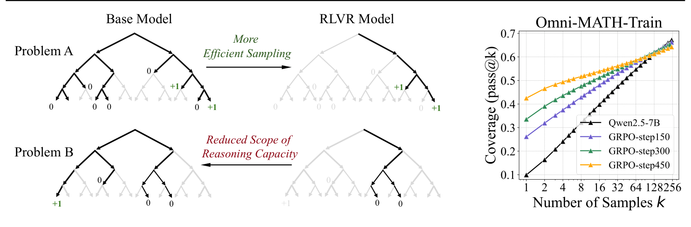

*Figure: Sampling trees illustrating the claim that RLVR yields more efficient
sampling of solutions already reachable by the base model rather than expanding
the reasoning boundary.
Figure from Yue et al. (2025), Does RL Really Incentivize Reasoning, arXiv:2504.13837.*

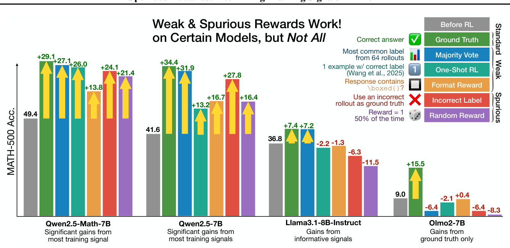

*Figure: MATH-500 accuracy after RLVR under ground-truth, majority-vote, one-shot,
format, and random reward signals — several spurious signals produce large gains
on the tested model. Figure from Shao et al. (2025), Spurious Rewards, arXiv:2506.10947.*

**Evaluation is fragile.** Because much of the corpus reports gains on a small
number of popular math and code benchmarks, contamination is a first-order
threat: (Wu et al., 2025) traces part of Qwen2.5's apparent
spurious-reward gains to pre-training contamination of exactly those benchmarks,
and (Zhang et al., 2025) shows best-of-N evaluation is itself biased for
process reward models. Claims of the form "three papers report this on one
benchmark" should not be read as "well established."

**Specialization has costs the reward does not price.** Pushing a model toward
one task degrades others. (Shenfeld et al., 2025) establishes a forgetting law —
the degree of forgetting is predicted by the forward KL between the fine-tuned
and base policy on the new task — and (Li et al., 2024; Harmon et al., 2025)
measure catastrophic forgetting and backward transfer directly. RL and
supervised fine-tuning differ here: (Chu et al., 2025) finds RL with an outcome
reward generalizes to out-of-distribution variants where SFT memorizes, but
(Xi et al., 2026) shows even RL's transfer is uneven across environments.
Task RL also collapses output diversity: (Cui et al., 2025) gives an
empirical law linking performance to falling policy entropy, and
(Li et al., 2025) reframes the KL term as a diversity-preserving
rehearsal mechanism rather than a mere constraint. A model that is better at one
task and worse at everything else, with lower entropy, is not obviously the goal.

**Reward hacking scales with reward sophistication.** The cheapest rewards are
the safest. As the reward source moves from verifiable to learned to judge, the
opportunity to game it grows: (Gao et al., 2022) and (Rafailov et al., 2024)
quantify over-optimization of learned rewards; (Zhao et al., 2025)
shows generative reward models are fooled by superficial "master-key" inputs;
(Mahmoud et al., 2026) separates verifier failure from rubric-design
failure in rubric-based RL; and (Wang et al., 2026) frames hacking as an
inevitable consequence of compressing rich objectives into a proxy. Every step
toward the open-ended tasks the field wants to reach is a step toward a reward
that is easier to hack.

**Open directions.** The corpus points at, but does not resolve, several
problems: a principled reward-construction method for tasks with *no* verifier
that is not merely a hackable judge; data and curriculum selection that is
theoretically grounded rather than heuristic (Zhu et al. 2025 and Bae et al. 2025
are early steps); specialization that does not forget, perhaps via
diversity-preserving objectives or explicit rehearsal; and honest evaluation —
contamination-controlled, capacity-aware — that can distinguish teaching from
eliciting. Until those are addressed, task-specific RL is best understood as a
powerful and general *elicitation-and-sharpening* recipe whose limits, on any
particular task, still have to be checked rather than assumed.

## References

1. Victor Zhong, Caiming Xiong, Richard Socher (2017). *Seq2SQL: Generating Structured Queries from Natural Language using Reinforcement Learning*. arXiv preprint (Salesforce Research); introduced WikiSQL. https://arxiv.org/abs/1709.00103
2. Jun Feng, Minlie Huang, Li Zhao, Yang Yang, Xiaoyan Zhu (2018). *Reinforcement Learning for Relation Classification from Noisy Data*. AAAI 2018. https://arxiv.org/abs/1808.08013
3. Jun Feng, Minlie Huang, Yijie Zhang, Yang Yang, Xiaoyan Zhu (2018). *Relation Mention Extraction from Noisy Data with Hierarchical Reinforcement Learning*. arXiv preprint (cs.CL). https://arxiv.org/abs/1811.01237
4. Nisan Stiennon, Long Ouyang, Jeff Wu, Daniel M. Ziegler, Ryan Lowe, Chelsea Voss, Alec Radford, Dario Amodei, Paul Christiano (2020). *Learning to summarize from human feedback*. NeurIPS 2020. https://arxiv.org/abs/2009.01325
5. Leo Gao, John Schulman, Jacob Hilton (2022). *Scaling Laws for Reward Model Overoptimization*. ICML 2023. https://arxiv.org/abs/2210.10760
6. Hung Le, Yue Wang, Akhilesh Deepak Gotmare, Silvio Savarese, Steven C.H. Hoi (2022). *CodeRL: Mastering Code Generation through Pretrained Models and Deep Reinforcement Learning*. NeurIPS 2022. https://arxiv.org/abs/2207.01780
7. Hunter Lightman, Vineet Kosaraju, Yura Burda, Harri Edwards, Bowen Baker, Teddy Lee, Jan Leike, John Schulman, Ilya Sutskever, Karl Cobbe (2023). *Let's Verify Step by Step*. arXiv preprint (ICLR 2024). https://arxiv.org/abs/2305.20050
8. Jiate Liu, Yiqin Zhu, Kaiwen Xiao, Qiang Fu, Xiao Han, Wei Yang, Deheng Ye (2023). *RLTF: Reinforcement Learning from Unit Test Feedback*. TMLR 2023. https://arxiv.org/abs/2307.04349
9. Parshin Shojaee, Aneesh Jain, Sindhu Tipirneni, Chandan K. Reddy (2023). *Execution-based Code Generation using Deep Reinforcement Learning*. TMLR 2023. https://arxiv.org/abs/2301.13816
10. Peiyi Wang, Lei Li, Zhihong Shao, R. X. Xu, Damai Dai, Yifei Li, Deli Chen, Y. Wu, Zhifang Sui (2023). *Math-Shepherd: Verify and Reinforce LLMs Step-by-step without Human Annotations*. arXiv preprint (ACL 2024). https://arxiv.org/abs/2312.08935
11. Zeqiu Wu, Yushi Hu, Weijia Shi, Nouha Dziri, Alane Suhr, Prithviraj Ammanabrolu, Noah A. Smith, Mari Ostendorf, Hannaneh Hajishirzi (2023). *Fine-Grained Human Feedback Gives Better Rewards for Language Model Training*. NeurIPS 2023. https://arxiv.org/abs/2306.01693
12. Zachary Ankner, Mansheej Paul, Brandon Cui, Jonathan D. Chang, Prithviraj Ammanabrolu (2024). *Critique-out-Loud Reward Models*. arXiv. https://arxiv.org/abs/2408.11791
13. Junying Chen, Zhenyang Cai, Ke Ji, Xidong Wang, Wanlong Liu, Rongsheng Wang, Jianye Hou, Benyou Wang (2024). *HuatuoGPT-o1, Towards Medical Complex Reasoning with LLMs*. arXiv (cs.CL). https://arxiv.org/abs/2412.18925
14. Ning Dai, Zheng Wu, Renjie Zheng, Ziyun Wei, Wenlei Shi, Xing Jin, Guanlin Liu, Chen Dun, Liang Huang, Lin Yan (2024). *Process Supervision-Guided Policy Optimization for Code Generation*. arXiv preprint. https://arxiv.org/abs/2410.17621
15. Shihan Dou, Yan Liu, Haoxiang Jia, Limao Xiong, Enyu Zhou, Wei Shen, Junjie Shan, Caishuang Huang, Xiao Wang, Xiaoran Fan, Zhiheng Xi, Yuhao Zhou, Tao Ji, Rui Zheng, Qi Zhang, Xuanjing Huang, Tao Gui (2024). *StepCoder: Improve Code Generation with Reinforcement Learning from Compiler Feedback*. ACL 2024. https://arxiv.org/abs/2402.01391
16. Jonas Gehring, Kunhao Zheng, Jade Copet, Vegard Mella, Quentin Carbonneaux, Taco Cohen, Gabriel Synnaeve (2024). *RLEF: Grounding Code LLMs in Execution Feedback with Reinforcement Learning*. arXiv preprint (Meta AI). https://arxiv.org/abs/2410.02089
17. Jian Hu, Xibin Wu, Zilin Zhu, Xianyu, Weixun Wang, Dehao Zhang, Yu Cao (2024). *OpenRLHF: An Easy-to-use, Scalable and High-performance RLHF Framework*. arXiv preprint arXiv:2405.11143. https://arxiv.org/abs/2405.11143
18. Amirhossein Kazemnejad, Milad Aghajohari, Eva Portelance, Alessandro Sordoni, Siva Reddy, Aaron Courville, Nicolas Le Roux (2024). *VinePPO: Unlocking RL Potential For LLM Reasoning Through Refined Credit Assignment*. arXiv preprint. https://arxiv.org/abs/2410.01679
19. Nathan Lambert, Jacob Morrison, Valentina Pyatkin, Shengyi Huang, Hamish Ivison, et al. (Allen Institute for AI) (2024). *Tulu 3: Pushing Frontiers in Open Language Model Post-Training*. arXiv preprint arXiv:2411.15124. https://arxiv.org/abs/2411.15124
20. Hongyu Li, Liang Ding, Meng Fang, Dacheng Tao (2024). *Revisiting Catastrophic Forgetting in Large Language Model Tuning*. EMNLP 2024 Findings (arXiv:2406.04836). https://arxiv.org/abs/2406.04836
21. Trung Quoc Luong, Xinbo Zhang, Zhanming Jie, Peng Sun, Xiaoran Jin, Hang Li (2024). *ReFT: Reasoning with Reinforced Fine-Tuning*. ACL 2024. https://arxiv.org/abs/2401.08967
22. Dakota Mahan, Duy Van Phung, Rafael Rafailov, Chase Blagden, Nathan Lile, Louis Castricato, Jan-Philipp Franken, Chelsea Finn, Alon Albalak (2024). *Generative Reward Models*. arXiv. https://arxiv.org/abs/2410.12832
23. Jiayi Pan, Xingyao Wang, Graham Neubig, Navdeep Jaitly, Heng Ji, Alane Suhr, Yizhe Zhang (2024). *Training Software Engineering Agents and Verifiers with SWE-Gym*. ICML 2025. https://arxiv.org/abs/2412.21139
24. Zehan Qi, Xiao Liu, Iat Long Iong, Hanyu Lai, Xueqiao Sun, Wendy Zhao, Yu Yang, Xinyue Yang, Jiadai Sun, Shuntian Yao, Tianjie Zhang, Wei Xu, Jie Tang, Yuxiao Dong (2024). *WebRL: Training LLM Web Agents via Self-Evolving Online Curriculum Reinforcement Learning*. ICLR 2025 (arXiv:2411.02337). https://arxiv.org/abs/2411.02337
25. Rafael Rafailov, Yaswanth Chittepu, Ryan Park, Harshit Sikchi, Joey Hejna, Bradley Knox, Chelsea Finn, Scott Niekum (2024). *Scaling Laws for Reward Model Overoptimization in Direct Alignment Algorithms*. NeurIPS 2024. https://arxiv.org/abs/2406.02900
26. Amrith Setlur, Chirag Nagpal, Adam Fisch, Xinyang Geng, Jacob Eisenstein, Rishabh Agarwal, Alekh Agarwal, Jonathan Berant, Aviral Kumar (2024). *Rewarding Progress: Scaling Automated Process Verifiers for LLM Reasoning*. ICLR 2025. https://arxiv.org/abs/2410.08146
27. Zhihong Shao, Peiyi Wang, Qihao Zhu, Runxin Xu, Junxiao Song, Xiao Bi, Haowei Zhang, Mingchuan Zhang, Y. K. Li, Y. Wu, Daya Guo (2024). *DeepSeekMath: Pushing the Limits of Mathematical Reasoning in Open Language Models*. arXiv preprint. https://arxiv.org/abs/2402.03300
28. Guangming Sheng, Chi Zhang, Zilingfeng Ye, Xibin Wu, Wang Zhang, Ru Zhang, Yanghua Peng, Haibin Lin, Chuan Wu (2024). *HybridFlow: A Flexible and Efficient RLHF Framework*. arXiv preprint arXiv:2409.19256 (EuroSys 2025). https://arxiv.org/abs/2409.19256
29. Guijin Son, Hyunwoo Ko, Hoyoung Lee, Yewon Kim, Seunghyeok Hong (2024). *LLM-as-a-Judge & Reward Model: What They Can and Cannot Do*. arXiv. https://arxiv.org/abs/2409.11239
30. Tianlu Wang, Ilia Kulikov, Olga Golovneva, Ping Yu, Weizhe Yuan, Jane Dwivedi-Yu, Richard Yuanzhe Pang, Maryam Fazel-Zarandi, Jason Weston, Xian Li (2024). *Self-Taught Evaluators*. arXiv (ICLR 2025). https://arxiv.org/abs/2408.02666
31. Huajian Xin, Z. Z. Ren, Junxiao Song, Zhihong Shao, Wanjia Zhao, Haocheng Wang, Bo Liu, Liyue Zhang, Xuan Lu, Qiushi Du, et al. (2024). *DeepSeek-Prover-V1.5: Harnessing Proof Assistant Feedback for Reinforcement Learning and Monte-Carlo Tree Search*. arXiv preprint. https://arxiv.org/abs/2408.08152
32. An Yang, Beichen Zhang, Binyuan Hui, Bofei Gao, Bowen Yu, Chengpeng Li, Dayiheng Liu, Jianhong Tu, Jingren Zhou, Junyang Lin, et al. (2024). *Qwen2.5-Math Technical Report: Toward Mathematical Expert Model via Self-Improvement*. arXiv preprint. https://arxiv.org/abs/2409.12122
33. Weizhe Yuan, Richard Yuanzhe Pang, Kyunghyun Cho, Xian Li, Sainbayar Sukhbaatar, Jing Xu, Jason Weston (2024). *Self-Rewarding Language Models*. ICML 2024 / arXiv. https://arxiv.org/abs/2401.10020
34. Lunjun Zhang, Arian Hosseini, Hritik Bansal, Mehran Kazemi, Aviral Kumar, Rishabh Agarwal (2024). *Generative Verifiers: Reward Modeling as Next-Token Prediction*. arXiv (ICLR 2025). https://arxiv.org/abs/2408.15240
35. Yuxiang Zhang, Shangxi Wu, Yuqi Yang, Jiangming Shu, Jinlin Xiao, Chao Kong, Jitao Sang (2024). *o1-Coder: an o1 Replication for Coding*. arXiv preprint. https://arxiv.org/abs/2412.00154
36. Dan Zhang, Sining Zhoubian, Ziniu Hu, Yisong Yue, Yuxiao Dong, Jie Tang (2024). *ReST-MCTS*: LLM Self-Training via Process Reward Guided Tree Search*. NeurIPS 2024. https://arxiv.org/abs/2406.03816
37. Bhavik Agarwal, Ishan Joshi, Viktoria Rojkova (2025). *Think Inside the JSON: Reinforcement Strategy for Strict LLM Schema Adherence*. arXiv preprint (cs.CL). https://arxiv.org/abs/2502.14905
38. Sanghwan Bae, Jiwoo Hong, Min Young Lee, Hanbyul Kim, JeongYeon Nam, Donghyun Kwak (2025). *Online Difficulty Filtering for Reasoning Oriented Reinforcement Learning*. arXiv preprint. https://arxiv.org/abs/2504.03380
39. Mingyang Chen, Linzhuang Sun, Tianpeng Li, Haoze Sun, Yijie Zhou, Chenzheng Zhu, Haofen Wang, Jeff Z. Pan, Wen Zhang, Huajun Chen, Fan Yang, Zenan Zhou, Weipeng Chen (2025). *ReSearch: Learning to Reason with Search for LLMs via Reinforcement Learning*. NeurIPS 2025 (arXiv:2503.19470). https://arxiv.org/abs/2503.19470
40. Xiaoyin Chen, Jiarui Lu, Minsu Kim, Dinghuai Zhang, Jian Tang, Alexandre Piche, Nicolas Gontier, Yoshua Bengio, Ehsan Kamalloo (2025). *Self-Evolving Curriculum for LLM Reasoning*. arXiv preprint. https://arxiv.org/abs/2505.14970
41. Tianzhe Chu, Yuexiang Zhai, Jihan Yang, Shengbang Tong, Saining Xie, Dale Schuurmans, Quoc V. Le, Sergey Levine, Yi Ma (2025). *SFT Memorizes, RL Generalizes: A Comparative Study of Foundation Model Post-training*. ICML 2025 (arXiv:2501.17161). https://arxiv.org/abs/2501.17161
42. Ganqu Cui, Yuchen Zhang, Jiacheng Chen, Lifan Yuan, Zhi Wang, Yuxin Zuo, Haozhan Li, Yuchen Fan, Huayu Chen, Weize Chen, Zhiyuan Liu, Hao Peng, Lei Bai, Wanli Ouyang, Yu Cheng, Bowen Zhou, Ning Ding (2025). *The Entropy Mechanism of Reinforcement Learning for Reasoning Language Models*. arXiv:2505.22617. https://arxiv.org/abs/2505.22617
43. Xin Dai, Buqiang Xu, Zhenghao Liu, Yukun Yan, Huiyuan Xie, Xiaoyuan Yi, Shuo Wang, Ge Yu (2025). *Legal-Delta: Enhancing Legal Reasoning in LLMs via Reinforcement Learning with Chain-of-Thought Guided Information Gain*. arXiv (cs.CL). https://arxiv.org/abs/2508.12281
44. Zhaopeng Feng, Shaosheng Cao, Jiahan Ren, Jiayuan Su, Ruizhe Chen, Yan Zhang, Zhe Xu, Yao Hu, Jian Wu, Zuozhu Liu (2025). *MT-R1-Zero: Advancing LLM-based Machine Translation via R1-Zero-like Reinforcement Learning*. Findings of EMNLP 2025 (arXiv:2504.10160). https://arxiv.org/abs/2504.10160
45. Jiazhan Feng, Shijue Huang, Xingwei Qu, Ge Zhang, Yujia Qin, Baoquan Zhong, Chengquan Jiang, Jinxin Chi, Wanjun Zhong (2025). *ReTool: Reinforcement Learning for Strategic Tool Use in LLMs*. arXiv:2504.11536 (cs.CL). https://arxiv.org/abs/2504.11536
46. Alexander Golubev, Maria Trofimova, Sergei Polezhaev, Ibragim Badertdinov, Maksim Nekrashevich, Anton Shevtsov, Simon Karasik, Sergey Abramov, Andrei Andriushchenko, Filipp Fisin, Sergei Skvortsov, Boris Yangel (2025). *Training Long-Context, Multi-Turn Software Engineering Agents with Reinforcement Learning*. arXiv preprint (Nebius). https://arxiv.org/abs/2508.03501
47. Xinyu Guan, Li Lyna Zhang, Yifei Liu, Ning Shang, Youran Sun, Yi Zhu, Fan Yang, Mao Yang (2025). *rStar-Math: Small LLMs Can Master Math Reasoning with Self-Evolved Deep Thinking*. arXiv preprint. https://arxiv.org/abs/2501.04519
48. Anisha Gunjal, Anthony Wang, Elaine Lau, Vaskar Nath, Yunzhong He, Bing Liu, Sean Hendryx (2025). *Rubrics as Rewards: Reinforcement Learning Beyond Verifiable Domains*. arXiv preprint. https://arxiv.org/abs/2507.17746
49. DeepSeek-AI (Daya Guo, Dejian Yang, Haowei Zhang, et al.) (2025). *DeepSeek-R1: Incentivizing Reasoning Capability in LLMs via Reinforcement Learning*. arXiv preprint (Nature 2025). https://arxiv.org/abs/2501.12948
50. Jackson Harmon, Andreas Hochlehnert, Matthias Bethge, Ameya Prabhu (2025). *Mapping Post-Training Forgetting in Language Models at Scale*. arXiv:2510.17776. https://arxiv.org/abs/2510.17776
51. Jingcheng Hu, Yinmin Zhang, Qi Han, Daxin Jiang, Xiangyu Zhang, Heung-Yeung Shum (2025). *Open-Reasoner-Zero: An Open Source Approach to Scaling Up Reinforcement Learning on the Base Model*. arXiv preprint. https://arxiv.org/abs/2503.24290
52. Hanxu Hu, Xingxing Zhang, Jannis Vamvas, Rico Sennrich, Furu Wei (2025). *QueST: Incentivizing LLMs to Generate Difficult Problems*. arXiv preprint. https://arxiv.org/abs/2510.17715
53. Hui Huang, Yancheng He, Hongli Zhou, Rui Zhang, Wei Liu, Weixun Wang, Jiaheng Liu, Wenbo Su (2025). *Think-J: Learning to Think for Generative LLM-as-a-Judge*. arXiv. https://arxiv.org/abs/2505.14268
54. Hui Huang, Yanping Chen, Ruizhang Huang, Chuan Lin, Yongbin Qin (2025). *A Reasoning Paradigm for Named Entity Recognition*. AAAI 2026 (accepted). https://arxiv.org/abs/2511.11978
55. Xue Jiang, Yihong Dong, Mengyang Liu, Hongyi Deng, Tian Wang, Yongding Tao, Rongyu Cao, Binhua Li, Zhi Jin, Wenpin Jiao, Fei Huang, Yongbin Li, Ge Li (2025). *CodeRL+: Improving Code Generation via Reinforcement with Execution Semantics Alignment*. arXiv preprint. https://arxiv.org/abs/2510.18471
56. Pengcheng Jiang, Jiacheng Lin, Lang Cao, Runchu Tian, SeongKu Kang, Zifeng Wang, Jimeng Sun, Jiawei Han (2025). *DeepRetrieval: Hacking Real Search Engines and Retrievers with Large Language Models via Reinforcement Learning*. arXiv:2503.00223 (cs.IR). https://arxiv.org/abs/2503.00223
57. Bowen Jin, Hansi Zeng, Zhenrui Yue, Jinsung Yoon, Sercan Arik, Dong Wang, Hamed Zamani, Jiawei Han (2025). *Search-R1: Training LLMs to Reason and Leverage Search Engines with Reinforcement Learning*. arXiv:2503.09516 (cs.CL). https://arxiv.org/abs/2503.09516
58. Yuxiang Lai, Jike Zhong, Ming Li, Shitian Zhao, Yuheng Li, Konstantinos Psounis, Xiaofeng Yang (2025). *Med-R1: Reinforcement Learning for Generalizable Medical Reasoning in Vision-Language Models*. arXiv (cs.CV). https://arxiv.org/abs/2503.13939
59. Long Li, Zhijian Zhou, Jiaran Hao, Jason Klein Liu, Yanting Miao, Wei Pang, Xiaoyu Tan, Wei Chu, Zhe Wang, Shirui Pan, Chao Qu, Yuan Qi (2025). *The Choice of Divergence: A Neglected Key to Mitigating Diversity Collapse in Reinforcement Learning with Verifiable Reward*. arXiv:2509.07430. https://arxiv.org/abs/2509.07430
60. Xuefeng Li, Haoyang Zou, Pengfei Liu (2025). *LIMR: Less is More for RL Scaling*. arXiv preprint. https://arxiv.org/abs/2502.11886
61. Xuefeng Li, Haoyang Zou, Pengfei Liu (2025). *ToRL: Scaling Tool-Integrated RL*. arXiv:2503.23383 (cs.CL). https://arxiv.org/abs/2503.23383
62. Xiaoxi Li, Jiajie Jin, Guanting Dong, Hongjin Qian, Yongkang Wu, Ji-Rong Wen, Yutao Zhu, Zhicheng Dou (2025). *WebThinker: Empowering Large Reasoning Models with Deep Research Capability*. NeurIPS 2025 (arXiv:2504.21776). https://arxiv.org/abs/2504.21776
63. Xiao Liang, Zhong-Zhi Li, Yeyun Gong, Yang Wang, Hengyuan Zhang, Yelong Shen, et al. (2025). *SwS: Self-aware Weakness-driven Problem Synthesis in Reinforcement Learning for LLM Reasoning*. arXiv preprint. https://arxiv.org/abs/2506.08989
64. Zijun Liu, Peiyi Wang, Runxin Xu, Shirong Ma, Chong Ruan, Peng Li, Yang Liu, Yu Wu (2025). *Inference-Time Scaling for Generalist Reward Modeling*. arXiv. https://arxiv.org/abs/2504.02495
65. Zichen Liu, Changyu Chen, Wenjun Li, Penghui Qi, Tianyu Pang, Chao Du, Wee Sun Lee, Min Lin (2025). *Understanding R1-Zero-Like Training: A Critical Perspective*. arXiv preprint arXiv:2503.20783. https://arxiv.org/abs/2503.20783
66. Zhaowei Liu, Xin Guo, Zhi Yang, Fangqi Lou, Lingfeng Zeng, Jinyi Niu, Mengping Li, Qi Qi, Zhiqiang Liu, Yiyang Han, Dongpo Cheng, Ronghao Chen, Huacan Wang, Xingdong Feng, Huixia Judy Wang, Chengchun Shi, Liwen Zhang (2025). *Fin-R1: A Large Language Model for Financial Reasoning through Reinforcement Learning*. arXiv (cs.CL). https://arxiv.org/abs/2503.16252
67. Tianci Liu, Ran Xu, Tony Yu, Ilgee Hong, Carl Yang, Tuo Zhao, Haoyu Wang (2025). *OpenRubrics: Towards Scalable Synthetic Rubric Generation for Reward Modeling and LLM Alignment*. arXiv preprint. https://arxiv.org/abs/2510.07743
68. Mingjie Liu, Shizhe Diao, Ximing Lu, Jian Hu, Xin Dong, Yejin Choi, Jan Kautz, Yi Dong (NVIDIA) (2025). *ProRL: Prolonged Reinforcement Learning Expands Reasoning Boundaries in Large Language Models*. arXiv preprint arXiv:2505.24864. https://arxiv.org/abs/2505.24864
69. Bo Liu, Chuanyang Jin, Seungone Kim, Weizhe Yuan, Wenting Zhao, Ilia Kulikov, Xian Li, Sainbayar Sukhbaatar, Jack Lanchantin, Jason Weston (2025). *SPICE: Self-Play In Corpus Environments Improves Reasoning*. arXiv preprint. https://arxiv.org/abs/2510.24684
70. Ziyu Liu, Zeyi Sun, Yuhang Zang, Xiaoyi Dong, Yuhang Cao, Haodong Duan, Dahua Lin, Jiaqi Wang (2025). *Visual-RFT: Visual Reinforcement Fine-Tuning*. arXiv (cs.CV). https://arxiv.org/abs/2503.01785
71. Yaxi Lu, Haolun Li, Xin Cong, Zhong Zhang, Yesai Wu, Yankai Lin, Zhiyuan Liu, Fangming Liu, Maosong Sun (2025). *Learning to Generate Structured Output with Schema Reinforcement Learning*. ACL 2025 (Long Papers). https://arxiv.org/abs/2502.18878
72. Zhengxi Lu, Yuxiang Chai, Yaxuan Guo, Xi Yin, Liang Liu, Hao Wang, Han Xiao, Shuai Ren, Guanjing Xiong, Hongsheng Li (2025). *UI-R1: Enhancing Efficient Action Prediction of GUI Agents by Reinforcement Learning*. AAAI 2026 (arXiv:2503.21620). https://arxiv.org/abs/2503.21620
73. Ang Lv, Ruobing Xie, Xingwu Sun, Zhanhui Kang, Rui Yan (2025). *The Climb Carves Wisdom Deeper Than the Summit: On the Noisy Rewards in Learning to Reason*. arXiv preprint arXiv:2505.22653. https://arxiv.org/abs/2505.22653
74. Peixian Ma, Xialie Zhuang, Chengjin Xu, Xuhui Jiang, Ran Chen, Jian Guo (2025). *SQL-R1: Training Natural Language to SQL Reasoning Model By Reinforcement Learning*. NeurIPS 2025. https://arxiv.org/abs/2504.08600
75. Shubham Parashar, Shurui Gui, Xiner Li, Hongyi Ling, Sushil Vemuri, Blake Olson, Eric Li, Yu Zhang, James Caverlee, Dileep Kalathil, Shuiwang Ji (2025). *Curriculum Reinforcement Learning from Easy to Hard Tasks Improves LLM Reasoning*. arXiv preprint. https://arxiv.org/abs/2506.06632
76. Mohammadreza Pourreza, Shayan Talaei, Ruoxi Sun, Xingchen Wan, Hailong Li, Azalia Mirhoseini, Amin Saberi, Sercan O. Arik (2025). *Reasoning-SQL: Reinforcement Learning with SQL Tailored Partial Rewards for Reasoning-Enhanced Text-to-SQL*. arXiv preprint (cs.LG). https://arxiv.org/abs/2503.23157
77. Lingfei Qian, Weipeng Zhou, Yan Wang, Xueqing Peng, Han Yi, Yilun Zhao, Jimin Huang, Qianqian Xie, Jian-yun Nie (2025). *Fin-o1: On the Transferability of Reasoning-Enhanced LLMs and Reinforcement Learning to Finance*. arXiv (cs.CL). https://arxiv.org/abs/2502.08127
78. Cheng Qian, Emre Can Acikgoz, Qi He, Hongru Wang, Xiusi Chen, Dilek Hakkani-Tur, Gokhan Tur, Heng Ji (2025). *ToolRL: Reward is All Tool Learning Needs*. arXiv:2504.13958 (cs.LG). https://arxiv.org/abs/2504.13958
79. Rulin Shao, Shuyue Stella Li, Rui Xin, Scott Geng, Yiping Wang, Sewoong Oh, Simon Shaolei Du, Nathan Lambert, Sewon Min, Ranjay Krishna, Yulia Tsvetkov, Hannaneh Hajishirzi, Pang Wei Koh, Luke Zettlemoyer (2025). *Spurious Rewards: Rethinking Training Signals in RLVR*. arXiv:2506.10947. https://arxiv.org/abs/2506.10947
80. Haozhan Shen, Peng Liu, Jingcheng Li, Chunxin Fang, Yibo Ma, Jiajia Liao, Qiaoli Shen, Zilun Zhang, Kangjia Zhao, Qianqian Zhang, Ruochen Xu, Tiancheng Zhao (2025). *VLM-R1: A Stable and Generalizable R1-style Large Vision-Language Model*. arXiv (cs.CV). https://arxiv.org/abs/2504.07615
81. Idan Shenfeld, Jyothish Pari, Pulkit Agrawal (2025). *RL's Razor: Why Online Reinforcement Learning Forgets Less*. NeurIPS 2025 (arXiv:2509.04259). https://arxiv.org/abs/2509.04259
82. Taiwei Shi, Yiyang Wu, Linxin Song, Tianyi Zhou, Jieyu Zhao (2025). *Efficient Reinforcement Finetuning via Adaptive Curriculum Learning*. TMLR. https://arxiv.org/abs/2504.05520
83. Joykirat Singh, Raghav Magazine, Yash Pandya, Akshay Nambi (2025). *Agentic Reasoning and Tool Integration for LLMs via Reinforcement Learning*. arXiv:2505.01441 (cs.AI). https://arxiv.org/abs/2505.01441
84. Huatong Song, Jinhao Jiang, Yingqian Min, Jie Chen, Zhipeng Chen, Wayne Xin Zhao, Lei Fang, Ji-Rong Wen (2025). *R1-Searcher: Incentivizing the Search Capability in LLMs via Reinforcement Learning*. arXiv:2503.05592 (cs.AI). https://arxiv.org/abs/2503.05592
85. Yi Su, Dian Yu, Linfeng Song, Juntao Li, Haitao Mi, Zhaopeng Tu, Min Zhang, Dong Yu (2025). *Crossing the Reward Bridge: Expanding RL with Verifiable Rewards Across Diverse Domains*. arXiv. https://arxiv.org/abs/2503.23829
86. Huajie Tan, Yuheng Ji, Xiaoshuai Hao, Xiansheng Chen, Pengwei Wang, Zhongyuan Wang, Shanghang Zhang (2025). *Reason-RFT: Reinforcement Fine-Tuning for Visual Reasoning of Vision Language Models*. arXiv (cs.CV). https://arxiv.org/abs/2503.20752
87. Vijay Viswanathan, Yanchao Sun, Shuang Ma, Xiang Kong, Meng Cao, Graham Neubig, Tongshuang Wu (2025). *Checklists Are Better Than Reward Models For Aligning Language Models*. arXiv preprint. https://arxiv.org/abs/2507.18624
88. Yinjie Wang, Ling Yang, Ye Tian, Ke Shen, Mengdi Wang (2025). *Co-Evolving LLM Coder and Unit Tester via Reinforcement Learning*. NeurIPS 2025 Spotlight. https://arxiv.org/abs/2506.03136
89. Yiping Wang, Qing Yang, Zhiyuan Zeng, Liliang Ren, Lucas Liu, Baolin Peng, Hao Cheng, Xuehai He, Kuan Wang, Jianfeng Gao, Weizhu Chen, Shuohang Wang, Simon Shaolei Du, Yelong Shen (2025). *Reinforcement Learning for Reasoning in Large Language Models with One Training Example*. arXiv preprint arXiv:2504.20571. https://arxiv.org/abs/2504.20571
90. Yuxiang Wei, Olivier Duchenne, Jade Copet, Quentin Carbonneaux, Lingming Zhang, Daniel Fried, Gabriel Synnaeve, Rishabh Singh, Sida I. Wang (2025). *SWE-RL: Advancing LLM Reasoning via Reinforcement Learning on Open Software Evolution*. NeurIPS 2025. https://arxiv.org/abs/2502.18449
91. Xumeng Wen, Zihan Liu, Shun Zheng, Shengyu Ye, Zhirong Wu, Yang Wang, Zhijian Xu, Xiao Liang, Junjie Li, Ziming Miao, Jiang Bian, Mao Yang (2025). *Reinforcement Learning with Verifiable Rewards Implicitly Incentivizes Correct Reasoning in Base LLMs*. arXiv preprint arXiv:2506.14245. https://arxiv.org/abs/2506.14245
92. Han Weng, Puzhen Wu, Longjie Cui, Yi Zhan, Boyi Liu, Yuanfeng Song, Dun Zeng, Yingxiang Yang, Qianru Zhang, Dong Huang, Xiaoming Yin, Yang Sun, Xing Chen (2025). *Graph-Reward-SQL: Execution-Free Reinforcement Learning for Text-to-SQL via Graph Matching and Stepwise Reward*. arXiv preprint (cs.LG). https://arxiv.org/abs/2505.12380
93. Chenxi Whitehouse, Tianlu Wang, Ping Yu, Xian Li, Jason Weston, Ilia Kulikov, Swarnadeep Saha (2025). *J1: Incentivizing Thinking in LLM-as-a-Judge via Reinforcement Learning*. arXiv. https://arxiv.org/abs/2505.10320
94. Mingqi Wu, Zhihao Zhang, Qiaole Dong, Zhiheng Xi, Jun Zhao, Senjie Jin, Xiaoran Fan, Yuhao Zhou, Huijie Lv, Ming Zhang, Yanwei Fu, Qin Liu, Songyang Zhang, Qi Zhang (2025). *Reasoning or Memorization? Unreliable Results of Reinforcement Learning Due to Data Contamination*. AAAI 2026; arXiv:2507.10532. https://arxiv.org/abs/2507.10532
95. Xiong Jun Wu, Zhenduo Zhang, ZuJie Wen, Zhiqiang Zhang, Wang Ren, Lei Shi, Cai Chen, Deng Zhao, Qing Wang, Xudong Han, Chengfu Tang, Dingnan Jin, Qing Cui, Jun Zhou (2025). *SHARP: Synthesizing High-quality Aligned Reasoning Problems for Large Reasoning Models Reinforcement Learning*. arXiv preprint. https://arxiv.org/abs/2505.14147
96. Yijia Xiao, Edward Sun, Tong Chen, Fang Wu, Di Luo, Wei Wang (2025). *Trading-R1: Financial Trading with LLM Reasoning via Reinforcement Learning*. arXiv (q-fin/cs.CL). https://arxiv.org/abs/2509.11420
97. Wenjie Yang, Mao Zheng, Mingyang Song, Zheng Li, Sitong Wang (2025). *SSR-Zero: Simple Self-Rewarding Reinforcement Learning for Machine Translation*. arXiv (cs.CL). https://arxiv.org/abs/2505.16637
98. Zhewei Yao, Guoheng Sun, Lukasz Borchmann, Gaurav Nuti, Zheyu Shen, Minghang Deng, Bohan Zhai, Hao Zhang, Ang Li, Yuxiong He (2025). *Arctic-Text2SQL-R1: Simple Rewards, Strong Reasoning in Text-to-SQL*. arXiv preprint (cs.CL). https://arxiv.org/abs/2505.20315
99. Tianyu Yu, Bo Ji, Shouli Wang, Shu Yao, Zefan Wang, Ganqu Cui, Lifan Yuan, Ning Ding, Yuan Yao, Zhiyuan Liu, Maosong Sun, Tat-Seng Chua (2025). *RLPR: Extrapolating RLVR to General Domains without Verifiers*. arXiv. https://arxiv.org/abs/2506.18254
100. Qiying Yu, Zheng Zhang, Ruofei Zhu, Yufeng Yuan, Xiaochen Zuo, Yu Yue, et al. (2025). *DAPO: An Open-Source LLM Reinforcement Learning System at Scale*. arXiv preprint (ByteDance Seed). https://arxiv.org/abs/2503.14476
101. Yang Yue, Zhiqi Chen, Rui Lu, Andrew Zhao, Zhaokai Wang, Yang Yue, Shiji Song, Gao Huang (2025). *Does Reinforcement Learning Really Incentivize Reasoning Capacity in LLMs Beyond the Base Model?*. NeurIPS 2025 (arXiv:2504.13837). https://arxiv.org/abs/2504.13837
102. Yu Yue, Yufeng Yuan, Qiying Yu, Xiaochen Zuo, Ruofei Zhu, et al. (ByteDance Seed) (2025). *VAPO: Efficient and Reliable Reinforcement Learning for Advanced Reasoning Tasks*. arXiv preprint arXiv:2504.05118. https://arxiv.org/abs/2504.05118
103. Huaye Zeng, Dongfu Jiang, Haozhe Wang, Ping Nie, Xiaotong Chen, Wenhu Chen (2025). *ACECODER: Acing Coder RL via Automated Test-Case Synthesis*. ACL 2025. https://arxiv.org/abs/2502.01718
104. Weihao Zeng, Yuzhen Huang, Qian Liu, Wei Liu, Keqing He, Zejun Ma, Junxian He (2025). *SimpleRL-Zoo: Investigating and Taming Zero Reinforcement Learning for Open Base Models in the Wild*. arXiv preprint. https://arxiv.org/abs/2503.18892
105. Zhenru Zhang, Chujie Zheng, Yangzhen Wu, Beichen Zhang, Runji Lin, Bowen Yu, Dayiheng Liu, Jingren Zhou, Junyang Lin (2025). *The Lessons of Developing Process Reward Models in Mathematical Reasoning*. arXiv preprint. https://arxiv.org/abs/2501.07301
106. Yuxin Zhang, Meihao Fan, Ju Fan, Mingyang Yi, Yuyu Luo, Guoliang Li, Bin Wu, Wenchao Zhou (2025). *Reward-SQL: Boosting Text-to-SQL via Stepwise Execution-Aware Reasoning and Process-Supervised Rewards*. arXiv preprint. https://arxiv.org/abs/2505.04671
107. Yulai Zhao, Haolin Liu, Dian Yu, S. Y. Kung, Haitao Mi, Dong Yu (2025). *One Token to Fool LLM-as-a-Judge*. arXiv. https://arxiv.org/abs/2507.08794
108. Andrew Zhao, Yiran Wu, Yang Yue, Tong Wu, Quentin Xu, Matthieu Lin, Shenzhi Wang, Qingyun Wu, Zilong Zheng, Gao Huang (2025). *Absolute Zero: Reinforced Self-play Reasoning with Zero Data*. arXiv preprint. https://arxiv.org/abs/2505.03335
109. Guojiang Zhao, Zixiang Lu, Yutang Ge, Sihang Li, Zheng Cheng, Haitao Lin, Lirong Wu, Hanchen Xia, Hengxing Cai, Wentao Guo, Hongshuai Wang, Mingjun Xu, Siyu Zhu, Guolin Ke, Linfeng Zhang, Zhifeng Gao (2025). *MolReasoner: Toward Effective and Interpretable Reasoning for Molecular LLMs*. arXiv (cs.LG). https://arxiv.org/abs/2508.02066
110. Yuxiang Zheng, Dayuan Fu, Xiangkun Hu, Xiaojie Cai, Lyumanshan Ye, Pengrui Lu, Pengfei Liu (2025). *DeepResearcher: Scaling Deep Research via Reinforcement Learning in Real-world Environments*. EMNLP 2025 (arXiv:2504.03160). https://arxiv.org/abs/2504.03160
111. Haizhong Zheng, Yang Zhou, Brian R. Bartoldson, Bhavya Kailkhura, Fan Lai, Jiawei Zhao, Beidi Chen (2025). *Act Only When It Pays: Efficient Reinforcement Learning for LLM Reasoning via Selective Rollouts*. NeurIPS 2025. https://arxiv.org/abs/2506.02177
112. Chujie Zheng, Shixuan Liu, Mingze Li, Xiong-Hui Chen, Bowen Yu, et al. (Qwen Team, Alibaba) (2025). *Group Sequence Policy Optimization*. arXiv preprint arXiv:2507.18071. https://arxiv.org/abs/2507.18071
113. Erle Zhu, Dazhi Jiang, Yuan Wang, Xujun Li, Jiale Cheng, Yuxian Gu, Yilin Niu, Aohan Zeng, Jie Tang, Minlie Huang, Hongning Wang (2025). *Data-Efficient RLVR via Off-Policy Influence Guidance*. arXiv preprint. https://arxiv.org/abs/2510.26491
114. Dazhi Fu, Jiuding Yang, Yiwen Guo, Jicong Fan (2026). *Many Voices, One Reward: Multi-Role Rubric Generation for LLM Judging and Reward Modeling*. arXiv preprint. https://arxiv.org/abs/2607.01830
115. Haoxiang Jiang, Zihan Dong, Tianci Liu, Wanying Wang, Ran Xu, Tony Yu, Linjun Zhang, Haoyu Wang (2026). *RUBRIC-ARROW: Alternating Pointwise Rubric Reward Modeling for LLM Post-training in Non-verifiable Domains*. arXiv preprint. https://arxiv.org/abs/2605.29156
116. Anas Mahmoud, MohammadHossein Rezaei, Zihao Wang, Anisha Gunjal, Bing Liu, Yunzhong He (2026). *Reward Hacking in Rubric-Based Reinforcement Learning*. arXiv preprint. https://arxiv.org/abs/2605.12474
117. Xiaohua Wang, Muzhao Tian, Yuqi Zeng, Zisu Huang, Jiakang Yuan, Bowen Chen, Jingwen Xu, Mingbo Zhou, Wenhao Liu, Muling Wu, Zhengkang Guo, Qi Qian, Yifei Wang, Feiran Zhang, Ruicheng Yin, Shihan Dou, Changze Lv, Tao Chen, Kaitao Song, Xu Tan, Tao Gui, Xiaoqing Zheng, Xuanjing Huang (2026). *Reward Hacking in the Era of Large Models: Mechanisms, Emergent Misalignment, Challenges*. arXiv preprint. https://arxiv.org/abs/2604.13602
118. Zhiheng Xi, Xin Guo, Jiaqi Liu, Jiazheng Zhang, Yutao Fan, Zhihao Zhang, Shichun Liu, Mingxu Chai, Xiaowei Shi, Yitao Zhai, Xunliang Cai, Tao Gui, Qi Zhang, Xuanjing Huang (2026). *Can RL Improve Generalization of LLM Agents? An Empirical Study*. arXiv:2603.12011. https://arxiv.org/abs/2603.12011
