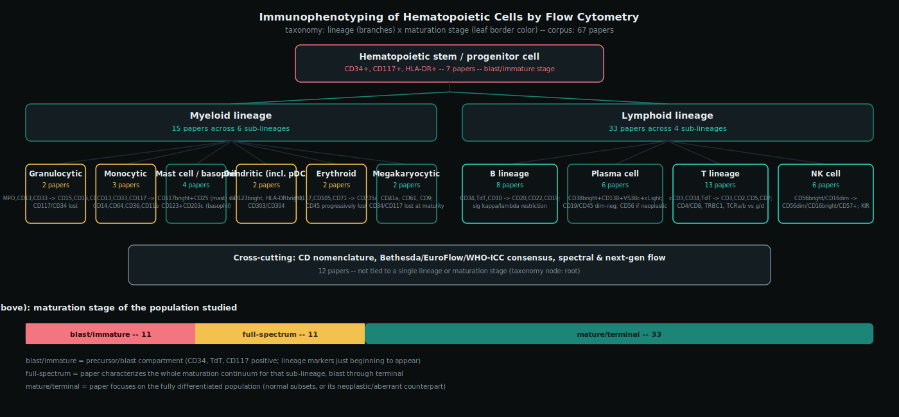

# Immunophenotyping of Hematopoietic Cells by Flow Cytometry: A Survey and Taxonomy

## 1. Scope and Driving Problems

This survey maps the expected surface and cytoplasmic marker expression of every major hematopoietic cell population — myeloid and lymphoid, blast through terminally differentiated — across the panel of markers clinically utilized in diagnostic flow cytometry, plus the relevant non-hematolymphoid populations (mast cell, dendritic cell, erythroid precursor, megakaryocyte/platelet) that a bone marrow or blood flow panel routinely encounters. The goal is the normal immunophenotypic template used in diagnostic hematopathology: the baseline against which a leukemia, lymphoma, or plasma cell neoplasm is recognized as abnormal.

The survey organizes around four driving problems:

1. **What is the normal, stage-resolved antigen-expression template** for each myeloid and lymphoid maturation sequence — the reference pattern a diagnostic flow report is implicitly or explicitly compared against?
2. **Which marker combinations assign lineage to blasts and resolve closely related populations** — hematogones from B-lymphoblasts, normal from neoplastic plasma cells, reactive from clonal T- and NK-cell populations — where morphology alone is insufficient?
3. **How is aberrancy defined operationally** — antigen loss, antigen gain, over- or under-expression relative to the normal template, and asynchronous (out-of-sequence) maturation — to separate neoplastic from reactive processes?
4. **How have CD nomenclature, consensus panel standardization (Bethesda, EuroFlow), and instrument technology** (multicolor conventional flow to spectral and next-generation flow for measurable residual disease) shaped which markers are clinically utilized today, and why?

**Corpus and its size.** This survey reads 67 papers in full — above the underlying survey methodology's 25-paper floor, and a deliberately *focused* corpus rather than the 100+ papers a broad computational-science survey might assemble. That choice is a scope decision, not a shortcut: the literature that actually defines "clinically utilized" flow markers is structurally concentrated, not diffuse. A small number of consensus and standardization documents (EGIL 1995, Bethesda 2006, EuroFlow's founding antibody-panel paper, WHO-5 and the International Consensus Classification, CD Nomenclature 2015) set the vocabulary and panel design that essentially all later disease-specific and lineage-specific papers build on and cite; the corpus includes every one of these anchor documents rather than diluting them among secondary commentary. Within each lineage, the discriminating literature is likewise a small number of landmark papers refined over decades (three papers trace the entire TRBC1 T-cell clonality method from proof-of-concept to clinical standard; a five-paper lineage traces plasma cell aberrancy from the original Rawstron MRD study to the current EuroFlow next-generation flow panel) rather than a large, disconnected population of independent studies. The corpus was assembled to cover eight subareas spanning every major lineage and the standardization/technology layer, with 6-13 papers per subarea (none exceeding half the corpus, none below the two-paper floor), prioritizing open-access and PubMed Central full text wherever an equivalent exists so that every included paper could be read in full rather than skimmed from an abstract; 19 of the 67 papers (28%) were, despite active searching for open mirrors, accessible only as a detailed PubMed abstract — this is disclosed per-paper in the relevant node sections below rather than hidden, and no claim in this survey rests solely on such a paper without that caveat.

## 2. Taxonomy

Every corpus paper is placed on a two-axis taxonomy derived from the recurring contrast the notes themselves draw, not imposed from a template.

**Axis 1 — lineage.** The primary split is stem/progenitor versus myeloid versus lymphoid, with myeloid further resolved into six sub-lineages (granulocytic, monocytic, mast cell/basophil, dendritic, erythroid, megakaryocytic) and lymphoid into four (B, plasma cell, T, NK). Lineage is the organizing axis because it predicts which core antigens a population expresses at all — myeloperoxidase, CD13, and CD33 mark the granulocytic/monocytic axis; cytoplasmic CD79a and CD19 mark B lineage; cytoplasmic CD3 marks T lineage — independent of how mature that population is.

**Axis 2 — maturation stage.** Within every lineage box, populations are further staged as blast/immature (CD34, TdT, CD117 positive; lineage markers just beginning to appear), full-spectrum (the paper characterizes the entire maturation continuum for that sub-lineage, blast through terminal), or mature/terminal (the paper focuses on the fully differentiated, circulating or resident population — its normal subsets, or its neoplastic/aberrant counterpart). Stage is the organizing axis because it predicts *when* an antigen is gained or lost along the same maturation sequence, independent of which lineage that sequence belongs to.

Twelve papers — the CD nomenclature, disease-classification (WHO-5, ICC), and panel-standardization/technology literature (EGIL, Bethesda, EuroFlow, ICSH/ICCS, spectral flow) — are not tied to a single lineage or maturation stage and are placed at the taxonomy root; they are the vocabulary and panel-design layer that every lineage-specific node below depends on.

## 3. The Field, Node by Node

### 3.1 B lineage: hematogones through mature B-cell subsets (lineage/lymphoid-b, 8 papers)

**The problem.** This node covers two distinct but related discrimination problems that share a single developmental axis. The first is a bone-marrow problem: regenerating B-lymphocyte precursors -- hematogones -- can morphologically and immunophenotypically resemble neoplastic B-lymphoblasts of precursor B-ALL, and reliably telling the two apart is central to routine marrow workups, post-therapy assessment, and minimal-residual-disease monitoring, since a false-positive read of residual leukemia (or a missed true positive masked by benign hematogones) has direct clinical consequences [8][11]. The second is a peripheral/mature problem: distinguishing normal or reactive mature B cells from mature B-cell neoplasms, where the classic tool is surface immunoglobulin (SIg) kappa/lambda light-chain restriction, but that tool has known failure modes -- complete SIg negativity and other atypical light-chain patterns can occur in both benign and neoplastic populations, so additional discriminators such as CD200 intensity are needed to resolve the ambiguity [10][30][57]. Together these two problems bracket the full B-lymphocyte developmental continuum, from the earliest bone-marrow precursor through the terminally differentiated peripheral/lymphoid effector subsets, and the corpus's mature-subset gating literature explicitly frames itself as spanning that whole arc rather than treating precursor and mature stages as separate topics [33][56].

**Key idea and expected marker profile: the precursor side.** The antigen-sequence backbone for this entire node was established by Loken et al.'s original multiparameter description of normal human B-lymphocyte development in bone marrow: across maturation, HLA-DP expression precedes HLA-DQ, CD10 expression is lost concurrently with acquisition of CD21 and CD22, and surface IgM, CD20, and HLA-DQ appear synchronously later in the sequence, with CD19+CD10+CD34+ cells marking the earliest identifiable B-lineage precursors [1]. McKenna and colleagues built directly on this sequence in a 662-specimen series establishing the normal population-level range of hematogones by four-color flow cytometry: hematogones were identifiable in 79.8% of marrow specimens, declined in proportion with age but with a broad range at every age, and were increased in lymphoma, marrow regeneration, immune cytopenias, and AIDS -- crucially, normal hematogones showed a complex but orderly spectrum of antigen expression with no aberrant patterns, in contrast to 49 concurrently studied B-ALL cases that showed maturation arrest and one to eleven immunophenotypic aberrancies per case [8]. Their companion paper formalizes this into an explicit discriminator framework: hematogones display a continuous, complete maturation spectrum (smooth, gradual intensity transitions with no gaps) typical of normal B-precursor evolution, whereas neoplastic lymphoblasts deviate from that spectrum through maturation arrest, over-, under-, or asynchronous antigen expression, and frequent aberrant co-expression of myeloid-associated antigens -- with four-color flow cytometry and optimal antibody combinations able to distinguish the two populations in nearly all cases [11].

**Key idea and expected marker profile: the mature side.** Clavarino et al.'s unified gating strategy bridges precursor and mature stages with a compact six-marker backbone (CD38, CD27, CD10, CD19, CD5, CD45) that resolves plasma cells, transitional B cells, hematogones stage 1-2, germinal-center B cells, naive B cells, and memory B cells by combinatorial gating, extendable to an eight-color panel that tracks 17 surface markers' mean fluorescence intensity across the full differentiation trajectory and validated across bone marrow, cord blood, peripheral blood, and lymph node [33]. Velounias-Tull et al.'s review consolidates the peripheral/mature side specifically, converging on CD27/IgD/CD10 as the primary backbone: naive B cells (CD27-IgD+CD10-), transitional T1/T2/T3 subsets (CD27-IgD+CD10+, graded by CD24/CD38/CD21), marginal-zone-like B cells (CD27+IgD+IgM+), IgM-only memory (CD27+IgD-IgM+), class-switched memory (CD27+IgD-IgM-, surface IgG/IgA+), and double-negative memory populations (CD27-IgD-, including the T-bet+CD11c+ DN2 subset) -- while flagging that subset boundaries are not sharp along this developmental continuum and that gating definitions for the same named subset vary across the literature [56].

For clonality assessment on top of this mature-subset framework, light-chain restriction remains the classic tool, but two papers in this node characterize its failure modes and a complementary marker. Li et al. established that complete absence (not just skewing) of SIg light-chain expression on a mature B-cell population is itself a specific surrogate marker of clonality: in a retrospective series, 36 cases with more than 25% SIg-light-chain-negative B cells were all lymphomas, and 71% of those with tissue available showed a clonal immunoglobulin heavy-chain gene rearrangement [10]. Huang et al. substantially refine and complicate that conclusion: in a larger, more recent series, they found that SIg negativity can also occur in genuinely benign, polytypic B-cell populations -- apparently restricted to body/cystic fluid specimens -- and catalog four distinct patterns of light-chain expression among 89 SIg-negative mature B-cell lymphomas, ranging from partial SIg loss detectable only by polyclonal antibody through complete loss of both surface and cytoplasmic immunoglobulin. Their conclusion is that SIg negativity alone must never be used to diagnose lymphoma without cytoplasmic immunoglobulin (cIg) follow-up, since combined SIg-negative-and-cIg-negative status is a more reliable neoplasia surrogate than SIg negativity by itself [57]. Challagundla et al. add an independent, complementary discriminator: CD200 expression intensity differs systematically across B-cell neoplasm subtypes relative to normal B cells (CLL bright, mantle cell lymphoma typically dim/negative, follicular lymphoma characteristically dim), and that dim CD200 signature specifically helps distinguish follicular lymphoma cells from background hematogones in bone marrow staging specimens -- explicitly extending the hematogone-discrimination problem into the mature-neoplasm setting [30].

| Marker | Hematogone stage I (CD10-bright) | Hematogone stage II (CD10-dim) | Mature naive B cell | Mature memory B cell | Neoplastic-discriminator context |
|---|---|---|---|---|---|
| CD34 | Present at earliest precursor stage, lost with maturation [1][33] | Absent [1][33] | Absent | Absent | Persistent/aberrant retention flags neoplastic lymphoblast rather than hematogone [11] |
| CD10 | Bright [8][11][33] | Dim, decreasing [8][11][33] | Negative [56] | Negative [56] | Loss concurrent with CD21/CD22 gain in normal sequence; asynchronous CD10 pattern flags lymphoblast [1][11] |
| CD20 | Negative/low, increasing through stage [1][8] | Positive [1][8] | Positive | Positive | Smooth, gradual CD10/CD20 transition (no gap) distinguishes hematogones from lymphoblasts [11] |
| CD19 | Positive (pan-B, present throughout) [1][33] | Positive | Positive | Positive | Pan-B backbone marker, not itself a discriminator [33] |
| CD38 | Bright (++) [33] | Bright, decreasing with maturation [33] | Low/negative [33][56] | Low/negative [33][56] | Backbone marker for Clavarino et al.'s combinatorial gating scheme [33] |
| CD27 | Negative [33] | Negative [33] | Negative [56] | Positive [56] | Core naive/memory discriminator in the CD27/IgD/CD10 backbone [56] |
| IgD | (unverified — not established in the surveyed papers for hematogone stages) | (unverified — not established in the surveyed papers for hematogone stages) | Positive [56] | Variable (positive in IgM-only memory, negative in class-switched memory) [56] |  |
| Surface kappa/lambda light chain | Not yet expressed at precursor stages [1] | Not yet expressed [1] | Polytypic (normal K:L ratio) [10][57] | Polytypic (normal K:L ratio) [10][57] | Restriction (skewed K:L) or complete SIg absence with cIg follow-up flags clonality; SIg-negative alone is insufficient (can be reactive) [10][57] |
| CD200 | (unverified — not established in the surveyed papers for hematogone stages) | (unverified — not established in the surveyed papers for hematogone stages) | Bright-to-moderate, comparator baseline [30] | (unverified — not established in the surveyed papers) | Dim/negative in mantle cell and follicular lymphoma vs. bright in CLL; dim CD200 helps separate follicular lymphoma from background hematogones [30] |

**Contrast with sibling nodes.** This node is distinguished from the T-lineage node by lineage-defining backbone antigens rather than by maturation-stage logic alone: T-lineage assignment turns on cytoplasmic CD3 as the lineage-committing marker, whereas B-lineage assignment and staging here run through the CD19/CD10/CD20/CD34/CD38/CD27 sequence described above, with no cCD3 involvement at any stage. Plasma cells are a terminal B-lineage differentiation state that shares this node's developmental axis -- Clavarino et al.'s backbone gating places plasma cells (CD38+++CD10-) at the far end of the same combinatorial scheme used for hematogones and mature subsets [33] -- but plasma cells are covered in their own sibling section because they carry a distinct clinical discriminator literature (surface-light-chain loss with cytoplasmic light-chain restriction, CD19/CD56/CD45 aberrancy patterns relevant to plasma cell neoplasms) rather than the SIg-restriction and hematogone-versus-lymphoblast logic that defines this node. Within this node itself, the precursor sub-problem (hematogone vs. lymphoblast, [1][8][11]) and the mature sub-problem (light-chain restriction and its pitfalls, CD200, [10][30][57]) are bridged by [33] and [56], which their own notes describe as together spanning the full B-lymphocyte developmental continuum from bone-marrow precursor through peripheral mature stages -- the justification for treating hematogone and mature-subset immunophenotyping as one taxonomy node rather than two. Five of the eight papers in this node ([1], [8], [10], [11], [30]) were accessible only at abstract level, so their marker-level claims above are drawn from abstract detail rather than full-text verification.

### 3.2 NK cell (lineage/lymphoid-nk, 6 papers)

This node covers two related but distinct problems. The first is descriptive: characterizing how normal NK cells mature, from an early CD56bright regulatory subset through a terminally differentiated CD56dim cytotoxic subset, so that a flow laboratory has a baseline against which anything abnormal can be judged. The second is diagnostic, and harder: separating a reactive, polyclonal NK-cell expansion (chronic lymphoproliferative disorder of NK cells, CLPD-NK) from a genuinely clonal or malignant one (aggressive NK-cell leukemia, ANKL), in a lineage that -- unlike B or T cells -- has no immunoglobulin or TCR gene rearrangement to serve as a molecular clonality marker. Flow-cytometric receptor-repertoire skewing has had to substitute for that missing molecular readout, and the six papers here trace how that substitute went from a basic-immunology observation to a validated clinical rule.

[20] supplies the foundational vocabulary. This synthesis review establishes the now-canonical two-subset model of human NK cells: CD56bright/CD16dim cells (roughly 10% of blood NK cells, near 100% of NK cells in secondary lymphoid tissue) are cytokine-producing and largely non-cytotoxic, while CD56dim/CD16bright cells are the circulating majority and the potent cytolytic, ADCC-capable effectors. [20] frames CD56bright cells as a developmental intermediate that differentiates into CD56dim cells, and lays out the inhibitory (KIR, CD94-NKG2A) versus activating (NKG2D, natural cytotoxicity receptors) receptor repertoire that governs NK target recognition via the missing-self/education balance. As a 2008 review, it explicitly predates CD57 as a maturation marker.

[24] fills that gap directly, showing that CD56dim cells are not phenotypically static once they diverge from CD56bright cells but continue to differentiate along a defined further axis: sequential loss of NKG2A, then acquisition of inhibitory KIR, then acquisition of CD57, with CD57 acquisition accompanied by declining proliferative capacity and occurring independently of NK-cell education status. On average about 40% of CD56dim cells were CD57+ (range roughly 5-70% across individuals in the cohort). This CD57-acquisition finding is what makes CD57 the field's standard flow marker of terminal NK maturation, but the note on this paper is explicit that its full text could not be retrieved past a bot-detection wall on the publisher's site, so these figures rest on the PubMed abstract and secondary summaries rather than a direct methods/results read and should be treated with correspondingly more caution than the other entries in this table.

[23] is the methodological bridge from that biology to a repeatable assay: a multicolor flow cytometry protocol chapter describing an antibody panel and gating strategy able to resolve the four major inhibitory KIRs (CD158a/h, CD158b, CD158e/k, and a fourth inhibitory KIR) together with NKG2A at single-cell resolution. Like [24], this note is built from the abstract only -- the book chapter's full text sits behind a Springer Link authentication wall -- so exact clones, fluorochromes, and gating hierarchy are not claimed here.

The remaining three papers apply this vocabulary and this panel diagnostically. [31] is the pivotal clonality study: a 26-marker panel applied to CD56low/CD3- NK cells from patients with expanded circulating NK counts, with clonality independently established by HUMARA X-inactivation assay in a training set of 23 heterozygous females. The result is a specific aberrant phenotype -- uniformly high CD94 (100% of clonal cases positive vs. a median 68.5% in polyclonal cases), higher and more homogeneous HLA-DR, and markedly reduced KIR (CD158a/b median 0% in clonal cases vs. 27.5% and 37% in polyclonal cases) -- that classified 94% of the training set correctly (81% sensitivity, 98% specificity) and achieved 100% concordance with an independent classification method on a 37-case prospective validation set. [35] then applies essentially the same CD56/CD16/CD57/KIR vocabulary to the malignant end of the spectrum: in a 47-patient multicenter ANKL cohort, 91.9% of cases showed a CD56bright/CD16dim/CD57-negative phenotype with markedly elevated Ki-67 (median 56%), and 72.7% showed complete loss of all three KIR molecules tested (CD158a/h, CD158b, CD158e) -- a KIR-loss finding that parallels [31]'s clonality signature even though [35]'s comparator groups were extranodal NK/T-cell lymphoma and CLPD-NK rather than healthy controls. [57] closes the loop by turning the KIR/NKG2A repertoire into an actual clinical decision rule: nonparametric 95% and 99% reference intervals for CD158a+, CD158b+, CD158e+, KIR-negative, and NKG2A+ percentages were derived from 145 healthy donors, and the 99% upper limits (NKG2A >88%, or CD158a >53%, or CD158b >72%, or CD158e >54%, or KIR-negative >72%) discriminated NK-cell neoplasms from healthy controls with reported 100% accuracy in a 63-patient cohort of confirmed cases. As with [23] and [24], this note is built from the abstract and secondary summaries only, since the paper sits behind a Modern Pathology paywall with no accessible mirror; the authors' own limitations note that the 100% accuracy figure comes from a single retrospective cohort and likely needs external validation.

| Marker | Immature / CD56-bright | Mature / CD56-dim | Clonally-restricted or malignant |
|---|---|---|---|
| CD56 | bright | dim | bright in ANKL (91.9% of cases) [35]; CLPD-NK typically arises in the CD56-low compartment [31] |
| CD16 | dim/negative | bright | dim in ANKL [35] |
| CD57 | negative | acquired last, terminal maturation marker, ~40% of CD56dim cells (range ~5-70%) [24] | negative in ANKL (part of the diagnostic CD56bright/CD16dim/CD57-negative triad) [35] |
| CD94 | expressed as part of the CD94-NKG2A inhibitory pair [20] | -- | uniformly high (100% positive) in clonal CLPD-NK vs. median 68.5% in polyclonal cases [31] |
| NKG2A | lost first in the CD56dim maturation sequence [24] | absent/low in fully mature cells [24] | restricted/elevated expression (>88%, 99% reference-interval cutoff) flags NK-cell neoplasm [57] |
| NKG2C | not characterized beyond inclusion in [35]'s panel; none of the six papers report a specific expected value | -- | not established by these six papers |
| KIR (CD158a/h, CD158b, CD158e/k) | absent | acquired mid-sequence, after NKG2A loss and before CD57 [24]; resolved by the [23] multicolor panel | markedly reduced/absent in clonal CLPD-NK (CD158a/b median 0% clonal vs. 27.5-37% polyclonal) [31]; complete loss of all three in 72.7% of ANKL [35]; restricted single-KIR positivity (>53-72%, 99% RI cutoffs) or KIR-negativity (>72%) flags neoplasm [57] |

This node's most useful contrast is negative: it shares CD57 as a maturation/cytotoxicity marker with cytotoxic T cells, but NK cells are defined by the absence of surface CD3 and any TCR rearrangement -- exactly the feature that forces this node's entire diagnostic apparatus to be built on receptor-repertoire skewing rather than the clonal-marker logic used elsewhere in this survey's lymphoid nodes. The other throughline across these six papers is a clear protocol-to-clinical-standard arc: [23] establishes a research-grade multicolor KIR/NKG2A panel; [31] and [35] show, in two independent disease contexts, that restriction of that same panel's readout (reduced/absent KIR, elevated CD94, restricted NKG2A) tracks clonality and malignancy; and [57], in 2023, converts that accumulated evidence into the current authoritative reference-interval standard -- statistically derived cutoffs on healthy-donor data that a laboratory can apply directly rather than relying on qualitative "reduced" or "elevated" judgments.

### 3.3 Plasma cell (lineage/lymphoid-plasma-cell, 6 papers)

This node targets the central diagnostic and monitoring problem of the plasma
cell proliferative disorders (PCPD) spectrum — monoclonal gammopathy of
undetermined significance (MGUS), smoldering multiple myeloma (SMM), and
active multiple myeloma (MM): distinguishing normal, polytypic bone marrow
plasma cells from neoplastic, clonal plasma cells. Morphology alone cannot
reliably make this distinction, particularly at low tumor burdens, and
standard serologic remission assessment (immunofixation) cannot reliably
separate patients who are truly disease-free after myeloma therapy from those
with residual clonal plasma cells that will drive early relapse [10]. The
same normal-vs-neoplastic distinction underlies three related clinical tasks
covered by papers in this node: diagnostic classification, pre-treatment risk
stratification in MGUS/SMM, and post-treatment minimal residual disease (MRD)
monitoring in MM.

**Key idea and expected marker profile.** The foundational approach,
established by the Rawstron group, is to quantify the *ratio* of
phenotypically normal to phenotypically neoplastic plasma cells within the
total bone marrow plasma cell compartment, rather than searching for a single
aberrant marker on an isolated cell [10]. That group's companion protocol
paper formalizes this into a four-color bench method: strong CD38 and CD138
co-expression identifies the plasma cell compartment, and aberrant CD19
expression together with intracellular immunoglobulin light-chain restriction
separates neoplastic from normal cells within it [15]. The Spanish PETHEMA
group extended this CD19/CD45/CD56-aberrancy logic from diagnostic use into
prognosis, showing in a 500-patient MGUS/SMM cohort that an aberrant-plasma-
cell fraction (aPC/BMPC) at or above 95% is an independent predictor of
progression-free survival in both disorders, using a four-color panel
(CD38/CD56/CD19/CD45, with cytoplasmic kappa/lambda staining added in
ambiguous cases) [17]. The EuroFlow-affiliated multivariate analysis in [34]
then formalized and expanded this discriminator set: CD138 and CD38 remain
the plasma-cell-identification markers, while CD45, CD19, CD56, CD27, CD81,
and CD117 together form the normal-vs-clonal discrimination panel, with the
abstract explicitly noting that no single marker among the candidates gives
sufficient specificity alone and that performance depends on the specific
antibody clone and fluorochrome conjugate chosen, not just the marker
identity — the basis of the EuroFlow next-generation flow (NGF) approach.
The most recent paper in this node, a 2022 prospective 791-sample study,
confirms CD19, CD56, and CD27 as the most frequently and informatively
aberrant markers and shows that combining immunophenotypic aberrancy with
clonality (cytoplasmic kappa/lambda ratio) assessment is necessary rather
than either approach alone: clonality assessment was decisive in 42% of
cases, and in 13% of mixed normal/aberrant samples the bulk kappa/lambda
ratio looked deceptively normal until the aberrant subpopulation was
computationally isolated [50].

| Marker | Expected: normal plasma cell | Expected: neoplastic (clonal) plasma cell |
|---|---|---|
| CD38 | Bright, uniform (gating marker) | Present, but may be reduced in intensity |
| CD138 (Syndecan-1) | Positive (gating marker with CD38) | Positive (retained as identification marker) |
| CD19 | Positive | Negative/dim (aberrant loss) |
| CD45 | Positive (dim-to-moderate) | Negative/dim (aberrant loss) |
| CD56 | Negative, or positive in only a small normal subset | Positive (aberrant gain) |
| CD27 | Positive | Negative/dim (aberrant loss) |
| CD81 | Positive | Negative/dim (aberrant loss) |
| CD117 | Negative | Aberrantly positive in a subset of cases |
| Cytoplasmic kappa/lambda | Polytypic ratio | Monotypic (clonal) restriction |

No note for these six papers discusses VS38c or BCMA (CD269) as a plasma-cell
marker, so no expression claim is made for either here.

**Relationship to sibling nodes and internal lineage.** Plasma cells are the
terminal differentiation stage of the B lineage, but this node's
discriminator panel is almost entirely disjoint from the B-lineage node's:
once CD19 and CD20 are lost in the transition to a plasma cell, the markers
that stage and subset earlier B cells no longer apply, and a nearly separate
panel (CD38/CD138 gating plus CD45/CD56/CD27/CD81/CD117 aberrancy) takes
over. Within the node, the six papers form a direct methodological lineage
rather than six independent studies: [10] establishes the normal-vs-
neoplastic ratio as a clinically actionable post-transplant MRD readout; [15]
formalizes that finding into a standardized bench protocol; [17] extends the
same aberrancy logic from MRD monitoring to pre-treatment risk stratification
in MGUS and SMM; [34] expands the marker panel (adding CD27, CD81, CD117) and
formalizes antibody-clone-level specifications as the EuroFlow NGF basis;
[37] synthesizes this lineage into a single up-to-date review spanning the
full PCPD spectrum; and [50] is the most recent refinement, adding prospective
pattern-based recognition and demonstrating quantitatively why clonality
assessment must be combined with — not replaced by — immunophenotypic
aberrancy. Three of the six sources ([10], [15], [17]) are noted in their own
limitations as grounded only in their PubMed abstracts, since no open-access
full text could be located for them; the quantitative claims drawn from those
three papers above are limited accordingly to what their abstracts state.

### 3.4 T lineage: precursor through mature subsets (lineage/lymphoid-t, 13 papers)

This is the survey's largest node because "T lineage" spans the entire developmental
and functional arc a flow cytometrist actually has to reason about: a bone-marrow/
thymic-precursor lymphoblast at one end, a fully differentiated effector-memory or
regulatory T cell at the other, and — layered across that whole arc — the diagnostic
problem of telling a reactive/polyclonal T-cell population from a clonal, neoplastic
one. The thirteen papers below organize into five sub-parts: precursor
lymphoblasts, naive/memory subsetting of mature T cells, TRBC-based clonality
assessment, gamma-delta T cells, and CD26-driven cutaneous T-cell lymphoma (CTCL)
staging.

**1. Precursor T-lymphoblasts.** [47] (a review of early T-cell precursor acute
lymphoblastic leukemia, ETP-ALL) and [65] (a broader 2025 review of B- and
T-lymphoblastic leukemia/lymphoma flow cytometry) are described in their own
notes as directly complementary: [65] lays out the general T-ALL maturation-stage
scheme, and [47]'s ETP-ALL phenotype sits at the earliest, most immature end of
that spectrum. [65] defines four stages by sequential marker acquisition — pro-T
(CD7 and cytoplasmic CD3 positive only), pre-T (adds CD2 and CD5, still
CD1a/CD4/CD8/surface CD3 negative), cortical (adds CD1a, with CD4/CD8 double
positivity, surface CD3 still negative), and medullary (single CD4 or CD8
positivity, surface CD3 finally acquired) — with TdT and CD34 marking immaturity
throughout and CD45 characteristically dim. [47]'s ETP-ALL phenotype —
CD1a-negative, CD8-negative, CD5-negative-or-dim (≤75% of blasts), surface-CD3-
negative, TCR-alpha/beta- and TCR-gamma/delta-negative, cytoplasmic-CD3-positive,
CD7-positive, plus ≥25%-of-blasts expression of at least one stem-cell/myeloid
marker (CD34, HLA-DR, CD13, CD33, CD117, CD11b, or CD65), with CD2/CD4/CD10 not
excluding the diagnosis — corresponds to a pre-pro-T-like stage at or near [65]'s
pro-T checkpoint, distinguished from cortical T-ALL chiefly by CD1a negativity
and weaker CD5. [47] also flags a diagnostic wrinkle: "near-ETP-ALL" cases with
strong CD5 expression are genetically similar to true ETP-ALL but fall outside
strict immunophenotypic criteria, and competing scoring systems (Tokyo
Children's Cancer Study Group, Zuurbier et al., Khogeer et al.) give
inconsistent sensitivity/specificity for that boundary.

**2. Naive/memory subsetting.** [7] is the foundational paper here: using CD45RA
and CCR7 (two independent anti-CCR7 clones), it splits mature CD4+ (and, with an
extra CD45RA+CCR7− subset, CD8+) T cells into naive (CD45RA+CCR7+), central
memory (CD45RA−CCR7+, TCM), and effector memory (CD45RA−CCR7−, TEM) populations.
Sorted TCM cells co-expressed high CD62L, produced only IL-2 (no IFN-gamma,
IL-4, or IL-5), and lacked immediate effector function but efficiently triggered
dendritic-cell IL-12 production and rapidly upregulated CD40L. Sorted TEM cells
expressed lower/variable CD62L, high beta1/beta2 integrins and tissue-homing
receptors (CD103, CLA) plus inflammatory chemokine receptors (CCR1, CCR3, CCR5),
and showed immediate effector function — rapid IFN-gamma/IL-4/IL-5 production
and, in CD8+ cells, perforin content. Telomere length decreased progressively
from naive to TCM to TEM, consistent with a linear differentiation model. [45]
is a 2021 nomenclature synthesis that traces this CCR7/CD45RA split as
foundational and catalogs how the field's subsequent proliferation of names
(Tscm, Trm, Tpm, Tllec, Temra, Tex) was assigned — arguing some distinctions
(Tscm vs. classic Tcm, differing mainly in CD45RA/RO isoform) may be
"distinctions without a difference," while others (Tcm-vs-Tem trafficking, or
Tex reinvigoration by PD-1 blockade selectively in TCF1+CXCR5+Tim-3-low cells)
are functionally consequential. It proposes two practical "supergroups" — a Tcm
supergroup (classic Tcm, Tscm, memory-phenotype Tcm, unified by CCR7+CD62L+
trafficking) and a Tem supergroup (Tem, Trm, Temra, Tllec, unified by inability
to access lymphoid tissue via high endothelial venules) — built on gating logic
that also invokes CD27, CD28, and CD95. [14] extends this same CD4+ activation/
memory framework to regulatory T cells: because the classic CD4+CD25hi Treg gate
only reliably captures the top ~1–2% highest CD25-expressing cells and misses
FoxP3+ cells among CD25-low/negative populations, [14] shows CD127 (the IL-7
receptor alpha chain) is transcriptionally repressed by FoxP3 (confirmed by ChIP)
and inversely tracks Treg identity; gating CD4+CD25+CD127low/− captured 86.6%
FoxP3+ cells (vs. 2.5% in CD127+ cells) and roughly threefold more cells than
CD25hi gating alone, with equivalent or better suppression in mixed-lymphocyte
reactions. Its own caveat — that memory T cells are IL-7Rhi while Tregs are
IL-7Rlo/−, so CD127low alone is not fully Treg-specific without co-gating CD25
or CD4 — is the same IL-7R-high-memory-versus-IL-7R-low-Treg dichotomy [45]
later contextualizes historically.

**3. Clonality assessment.** These three papers form a direct methodological
lineage, each explicitly built on the one before it. [43] is the pivotal
proof-of-concept: because TRBC1 and TRBC2 are two mutually exclusive TCR-beta
constant-region isoforms expressed by essentially all alpha-beta T cells, a
single anti-TRBC1 antibody added to a routine flow panel can call clonality by
detecting a skewed TRBC1-positive/negative ratio within an aberrant T-cell
population, without needing the full Vbeta repertoire. In 20 T-cell neoplasm
cases this gave 100% sensitivity (17/20 either >97% or <3% TRBC1-positive), while
7 of 44 non-malignant controls (16%) showed small monotypic CD8+ subsets flagged
as uncertain significance rather than false positives. Only the PubMed abstract
of [43] was accessible (Wiley paywall), so this reflects abstract-level detail.
[46] is a multicenter (Salamanca, Porto, Barcelona) standardization of that
approach: it optimizes anti-TRBC1 (clone JOVI-1) staining order and fluorochrome
stability (BV421 samples must be under 48 hours old; TRBC1-FITC to 72 hours),
defines healthy-donor reference ranges for TRBC1+/TRBC1− ratios (0.25–1.4 for
total alpha-beta T cells, with subset-specific ranges by CD4/CD8/DP/DN), and
validates against sorted TRBJ gene-rearrangement PCR (94% of TRBC1+ sorted
populations TRBJ1-only vs. 100% dual TRBJ1+TRBJ2 in TRBC1−) and TCRVbeta
flow/PCR (96% concordance, 112/117 cases), reaching clonal-cell detection down
to ≤10⁻⁴ when combined with TCRVbeta. It flags that effector-memory and
terminally differentiated compartments show skewed TRBC1 ratios even in healthy
donors — a limitation directly addressed by [59], which engineers a novel
anti-TRBC2 antibody (structure-guided mutation of JOVI.1's CDR1/CDR3 residues)
and combines it with anti-TRBC1 for two-dimensional dot-plot gating analogous to
kappa/lambda light-chain gating. In healthy donors, TRBC2:TRBC1 ratios were
consistently polytypic (median 1.6) and independent of Vbeta subset or
maturation stage; across 60 neoplasm specimens, 87% showed a clonal ratio (73%
TRBC2-restricted). Dual staining resolved the spurious TRBC1-dim artifact in 24
of 90 clinical specimens (27%) and reclassified 9 of 13 dim-TRBC1 mature
neoplasms as TRBC2-restricted; T-cell clones of uncertain significance appeared
in 17 of 121 non-malignant specimens (14%), smaller than neoplastic clones and
associated with older age. [59] discloses that several authors hold Autolus
Therapeutics patents/equity tied to TRBC1/2 diagnostics and therapeutics.

**4. Gamma-delta T cells.** [18] establishes the normal-tissue baseline: across
spleen, thymus, lymph node, appendix, tonsil, and peripheral blood, gamma-delta
cells ranged from 12.5% of CD3+ T cells in spleen down to 0.7% in tonsil, with
at least 90% localized to interfollicular zones (about 90% of thymic
gamma-delta cells to the medulla); 30–90% expressed CD5 and/or CD8, about 60%
of thymocyte gamma-delta cells expressed low-density CD4, and at least 70%
expressed CD11b, Leu7 (CD57), and NKH-1 — a mature, resting immunophenotype
consistent with suppressor/cytotoxic function (≥98% of peripheral-blood
gamma-delta cells sat in G0/G1, versus ~25% of thymic gamma-delta cells). [13]
provides the malignant counterpoint: across mature gamma-delta T-cell
malignancies, aggressive entities (hepatosplenic and cutaneous gamma-delta
lymphoma) pursued a poor clinical course while gamma-delta T-LGL leukemia was
indolent, and CD57 expression specifically flagged the indolent subtype,
distinguished from the aggressive lymphomas by differing CD5/CD8/CD16 patterns.
As with [43], only the PubMed abstract of [13] was accessible (Wiley paywall),
so specific counts and percentages are not verifiable beyond the abstract. [44]
then extends both by adding TCR-Vdelta subtyping as a faster, protein-level
clonality readout: using TCR-Vdelta1/Vdelta2 antibodies in a 10-color panel,
normal controls showed Vdelta2 predominance (16.4–99.0%) over Vdelta1
(0–50.5%, p<0.0001), whereas 16 of 19 (84.2%) confirmed lymphoma cases showed a
restricted high-Vdelta1 pattern (88.0–98.4%) and the remaining 3 were negative
for both. Across 28 specimens this gave 100% sensitivity and specificity,
versus 94%/91% for TCR gene scanning (kappa 0.850). The authors describe this as
the first attempt at clonal TCR-Vdelta assessment by flow cytometry, and note
their cohort is too small for firm conclusions about NK-marker co-expression.

**5. CD26 and cutaneous T-cell lymphoma staging.** [22] characterizes CD26 loss
as a T-cell lymphoma discriminator outside blood, in tissue and body-fluid
specimens by four-color flow cytometry: many T-cell lymphomas were dim or
absent for CD26 (a subset bright-positive), and CD26 patterns helped identify
abnormal population clusters in most lymphoma cases — but reactive tissue T
cells and tumor-infiltrating lymphocytes also typically showed low CD26, so
CD26 alone was not reliable for distinguishing benign from malignant T cells in
tissue. Only the PubMed abstract of [22] was accessible (Wiley paywall), so this
summary is abstract-level. [53] directly builds on that literature, moving CD26
loss from tissue/body-fluid diagnosis into standardized peripheral-blood
B-staging of mycosis fungoides/Sezary syndrome (MF/SS) under the 2021 TNMB
update (B0: <250 aberrant cells/uL; B1: 250–<1000/uL; B2: ≥1000/uL with a clone
present), proposing a minimum six-marker panel (CD3, CD4, CD7, CD8, CD26, CD45)
plus emerging markers (notably KIR3DL2/CD158k) toward a EuroFlow-style
harmonized panel. Reported cutoffs: CD4+CD7− >40% of CD4+ distinguished SS from
inflammatory dermatoses at 54% sensitivity/100% specificity; CD4+CD26− ≥30%
gave 86%/47%, while >80% CD26− gave 100%/66%; KIR3DL2+ Sezary cells ≥200/uL gave
88.6%/96.3% in one study (falling to 33% sensitivity in another using frozen
samples). [53] also names therapeutic-target markers (CD30, CCR4, PD-1,
CD158k/KIR3DL2, CD47, CD52) relevant to MF/SS treatment, though as treatment
targets rather than staged expression values. The authors caution that healthy
CD4+ T cells in SS patients frequently show aberrant CD7/CD26/exhaustion-marker
phenotypes mimicking malignant cells, and that TCR-Vbeta panels cover only
about 70% of the TCR repertoire and fail on TCR-negative cells.

**Expected marker profile across the T-lineage arc.** The table below is
grounded strictly in what the thirteen papers' notes state; where a marker is
not actually established for a given stage in this corpus, that is marked
explicitly rather than inferred.

| Marker | Precursor (blast) | Naive | Memory (central/effector) | Effector/mature-differentiated |
|---|---|---|---|---|
| CD3 (surface) / cCD3 | cCD3+ from pro-T; surface CD3 acquired only at the medullary stage [65]; ETP-ALL is surface-CD3-negative, cCD3-positive [47] | Positive (implicit gating marker for mature T cells in [7], [45]) | Positive | Positive |
| CD2 | Acquired at pre-T stage [65] | (unverified — not established in the surveyed papers) | Listed among [45]'s naive/memory gating markers but its directional pattern is not detailed | (unverified) |
| CD5 | Acquired at pre-T stage [65]; negative/dim (≤75%+) in ETP-ALL [47] | (unverified) | (unverified) | Differs between indolent gd-LGL leukemia and aggressive gd lymphoma subtypes [13] |
| CD7 | Positive from pro-T stage onward [65], [47] | (unverified) | (unverified) | Lost in 50–80% of MF/SS; CD4+CD7− >40% distinguishes SS from inflammatory dermatoses [53] |
| CD4 | Double-positive (with CD8) at cortical stage; single-positive at medullary stage [65] | Naive/memory subsetting performed within CD4+ compartment [7]; Treg gate is CD4+CD25+CD127low/− [14] | CD4+ TCM/TEM per [7] | CD4+CD26− loss diagnostic in MF/SS [53] |
| CD8 | Negative in ETP-ALL [47]; double-positive at cortical, single at medullary [65] | Additional CD45RA+CCR7− subset within CD8+ [7] | CD8+ TEM shows perforin content [7]; CD8+ TRBC2:TRBC1 ratio slightly higher than CD4+ [59] | Monotypic small CD8+ subsets of uncertain significance seen in ~14–16% of non-malignant specimens [43], [59] |
| CD1a | Acquired at cortical stage; negative in ETP-ALL, distinguishing it from cortical T-ALL [65], [47] | (unverified) | (unverified) | (unverified) |
| TRBC1 | (unverified) | Polytypic reference range 0.25–1.4 (total alpha-beta T cells) [46] | Effector-memory/terminally differentiated compartments can show skewed ratios even in healthy donors [46] | Clonally skewed (monophasic) in mature T-cell neoplasms [43], [46], [59] |
| TCR alpha/beta | Negative (surface) in ETP-ALL [47] | Framework for TRBC clonality assays [43], [46], [59] | — | Clonal TRBC-isoform restriction in neoplasms [43], [46], [59] |
| TCR gamma/delta | Negative (surface) in ETP-ALL [47] | Vdelta2 predominance over Vdelta1 in normal controls [44] | — | Restricted high-Vdelta1 (or Vdelta1/Vdelta2 double-negative) pattern in gd T-cell lymphoma [44]; aberrant profile in gd malignancy generally [13] |
| CD26 | (unverified) | (unverified) | (unverified) | Dim/absent in many T-cell lymphomas in tissue [22]; CD26 loss (≥30–80% CD26−) diagnostic in MF/SS blood staging [53] |
| CD25 | (unverified) | Treg gate component (CD4+CD25+) [14] | — | — |
| CD30 | (unverified) | (unverified) | (unverified) | Named as a therapeutic target in MF/SS by [53]; staged expression pattern not established in the surveyed papers |
| CD52 | (unverified — not established in the surveyed papers) | (unverified) | (unverified) | Named as a therapeutic target in MF/SS by [53]; staged expression pattern not established |
| CCR4 | (unverified) | Included in [7]'s tested chemokine-receptor panel but not called out among the markers found elevated in TEM | (unverified) | Named as a therapeutic target in MF/SS by [53]; staged expression pattern not established |
| PD-1 | (unverified) | (unverified) | Marks the Tex ("exhausted") subset alongside TCF1/CXCR5/Tim-3; reinvigorated by PD-1 blockade selectively in TCF1+CXCR5+Tim-3-low cells [45] | Named as a therapeutic target in MF/SS by [53] |
| CD57 (Leu7) | (unverified) | (unverified) | (unverified) | ≥70% of normal gd T cells positive [18]; positivity specifically flags indolent gd-LGL leukemia [13] |
| CD45RA | (unverified) | Positive (CD45RA+CCR7+ defines naive) [7] | Negative in TCM/TEM; re-acquired in CD45RA+CCR7− (Temra-like) subset [7] | — |
| CCR7 | (unverified) | Positive (CD45RA+CCR7+ defines naive) [7] | Positive in TCM, negative in TEM [7] | — |
| CD127 (IL-7Ralpha) | (unverified) | Memory T cells are IL-7Rhi (CD127hi), contextualized historically by [45] | Low/negative on Tregs (CD4+CD25+CD127low/−), inversely repressed by FoxP3 [14] | — |
| CD27 | (unverified) | Listed among [45]'s naive/Tscm/Tcm/Tem/Temra gating markers; directional pattern not detailed in the notes | Same as naive | — |

**How this differs from sibling lineage nodes.** B lineage flow cytometry in
this survey is organized around cytoplasmic CD79a and CD19 as the lineage-
defining markers (cytoplasmic CD3 has no counterpart role there), with B-cell
maturation staged by CD10, surface/cytoplasmic immunoglobulin, and CD20 rather
than by the CD1a/CD4/CD8/CCR7 logic that structures the T-lineage arc above.
NK-cell immunophenotyping, by contrast, is built around CD56 and CD16 with the
diagnostic absence of surface CD3 as the defining negative — NK maturation and
clonality assessment (KIR repertoire restriction, CD57/NKG2A differentiation)
run on an entirely separate marker vocabulary from the CD45RA/CCR7 naive-memory
axis, the TRBC-isoform clonality logic, or the CD1a/CD5/CD7 precursor-staging
scheme that unify this node's thirteen papers around a single cytoplasmic-CD3-
defined lineage.

### 3.5 Dendritic cells, including plasmacytoid dendritic cells (lineage/myeloid-dendritic, 2 papers)

Plasmacytoid dendritic cells (pDCs) sit at a recurring diagnostic pitfall in myeloid flow cytometry: their normal/reactive counterpart shares markers with the aggressive, rare neoplasm derived from the same lineage, blastic plasmacytoid dendritic cell neoplasm (BPDCN), and also with pDC proliferations that arise as a component of a myeloid neoplasm rather than as a distinct entity (MPDMN). The clinical stakes are real -- BPDCN carries a distinct treatment pathway, and misreading a benign reactive pDC expansion as neoplastic, or missing low-level residual disease after therapy, has direct patient consequences. Both papers in this node address that boundary from opposite directions: [48] builds the panel that separates reactive from neoplastic pDCs at diagnosis and at minimal residual disease (MRD) sensitivity, while [42] documents a myeloid-neoplasm subset whose pDC differentiation mimics neither classic category and must not be over-called as BPDCN.

The expected pDC immunophenotype -- CD123-bright, HLA-DR-bright, CD64-negative, CD45-dim -- is the entry gate both papers rely on. [48]'s central finding is that CD56, the marker most often used to flag BPDCN, is not a reliable sole discriminator: a CD56-positive subset (median ~4.5% of total pDCs) exists among normal reactive pDCs in lymphoma-staging and post-transplant marrow, distinguishable from neoplastic pDCs only by adding CD2, CD38, CD7, and CD303 to the panel.

| Marker | Reactive pDC (including CD56+ subset) | Neoplastic pDC (BPDCN) |
|---|---|---|
| CD123 | bright | often decreased (78% of cases) |
| HLA-DR | bright | often increased (69% of cases) |
| CD56 | positive in a minority subset (~4.5% of pDCs) -- **not diagnostic alone** | positive in 97% of cases |
| CD2 | positive | negative (81% of cases) |
| CD38 | bright | decreased/negative (82% of cases) |
| CD7 | negative | positive (64% of cases) |
| CD303 | positive | negative (56% of cases) |

This multimarker panel (CD2/CD7/CD38/CD303/CD123/HLA-DR/CD64/CD4/CD45/CD56) achieved 0.01% MRD sensitivity in [48], exceeding next-generation sequencing's ~1% floor, and outperformed TCF4/CD123 immunohistochemistry, which could highlight pDCs but not separate reactive from neoplastic ones.

[42] adds a further pitfall from the opposite side of the differential: in seven cases of high-grade myeloid neoplasm with CD56-negative pDC infiltrates comprising 5-26% of cellularity, six showed immunophenotypic evidence that the pDC population arose from the leukemic blast clone itself along a maturation spectrum -- a reactive-appearing but clonal process that fits neither BPDCN nor classic MPDMN criteria, underscoring that pDC differentiation in myeloid neoplasia is a continuum rather than a binary call.

Against sibling myeloid nodes, this subset is distinguished by pDC-defining CD123-bright/HLA-DR-bright/CD303 positivity rather than the CD14/CD64-driven monocytic signature used to separate monocytic lineage populations, even though both share myeloid origin.

### 3.6 Erythroid precursors (lineage/myeloid-erythroid, 2 papers)

This node targets two related but distinct problems: mapping the normal
erythroid maturation continuum by flow cytometry, and using that map to score
erythroid *dysplasia* in myelodysplastic syndromes (MDS), where morphologic
assessment of dysplastic erythropoiesis is notoriously subjective and
poorly reproducible between observers. Existing MDS flow scores had focused
almost exclusively on the (im)mature myelomonocytic lineage, leaving
near-universal erythroid dysplasia largely uncaptured by those panels [41].

**Expected marker profile.** [60], a synthesizing review, reframes erythroid
maturation as a continuum rather than a set of discrete gates, tracked from
Lin−/CD34+/CD117+ progenitors through CD105/CD150-defined progenitor
substages (CD150+ early BFU-E, CD150+CD105+ late BFU-E/pre-CFU-E, CD105+
alone CFU-E in the murine scheme; a parallel human scheme splits CD117+/
CD235a− cells by CD34 and CD36) into CD71/CD36/CD235a/forward-scatter-defined
precursor maturation. Notably, [60] finds that CD71 and CD44 stay roughly
constant across the basophilic-to-orthochromatic precursor stages, and that
cell size (forward scatter) plus declining CD49d and rising Band 3 are the
more reliable maturation trackers at that late stage; CD235a (glycophorin A)
marks terminal commitment. [41]'s IMDSFlow consensus study operationalizes
this same marker set (CD34/CD117/CD235a/CD71/CD36/CD105) for a CD45dim-to-
negative, low-intermediate side-scatter erythroid gate, and — working from a
677-case learning cohort validated on an independent 331-case cohort across
19 centers — identifies four parameters as the strongest MDS discriminators:
increased CD36 coefficient of variation (CV, the single strongest),
increased CD71 CV, decreased CD71 mean fluorescence intensity, and an
altered (increased or decreased) percentage of CD117+ erythroid progenitors.

| Marker | Early (progenitor) | Intermediate (precursor) | Late/terminal |
|---|---|---|---|
| CD117 | Positive (progenitor marker) | Waning | Lost |
| CD34 | Positive on earliest progenitors | Lost | Absent |
| CD105 | Marks progenitor substages (with CD150) | Present | Not specified |
| CD71 | Rising | Roughly constant through basophilic–orthochromatic stages | Lost (with reticulocyte maturation) |
| CD36 | Rising (CFU-E marker) | Present | Not specified |
| CD235a (glycophorin A) | Absent/low | Increasing | High, terminal marker |
| CD45 | Dim-to-negative gate boundary | Progressively lost | Negative |

The weighted erythroid score built from these parameters in [41] achieved
high specificity (90% learning, 92% validation) but only modest sensitivity
(33% and 24%, respectively) — the score reliably confirms established
dysplasia but misses many true MDS cases if used alone, so it is explicitly
designed to complement, not replace, myelomonocytic flow scores,
cytomorphology, cytogenetics, and molecular data.

**Relationship to sibling nodes and within-node structure.** Erythroid
precursors form one of two non-myelomonocytic lineage components of modern
MDS flow scoring, alongside the megakaryocytic/platelet lineage covered in
its own sibling section. Within this node, the relationship between the two
papers is itself a reference/application pair: [60] supplies the modern,
continuum-based normal reference framework for erythroid marker expression,
while [41] applies and perturbs that same marker set (CD71, CD36, CD105,
CD235a) to detect disease-associated CV and MFI shifts against it — the
dysplasia signal in [41] is defined precisely as a departure from the normal
maturation trajectory that [60] characterizes.

### 3.7 Granulocytic maturation (lineage/myeloid-granulocytic, 2 papers)

This node targets the two parallel maturation ladders inside the granulocytic sub-lineage: the neutrophil sequence running myeloblast -> promyelocyte -> myelocyte/metamyelocyte -> band -> segmented neutrophil, and the eosinophil sequence running early -> intermediate -> mature eosinophil. Staging either ladder immunophenotypically matters clinically in two distinct ways: quantifying immature granulocytes is a routine part of sepsis and infection workups (a left shift signals marrow stress release), and recognizing where a neoplastic granulocytic population has arrested along the sequence is central to diagnosing acute myeloid leukemia and myelodysplastic/myeloproliferative neoplasms. Before flow-based staging existed, both sequences were staged only by subjective morphologic assessment of marrow smears.

**Neutrophil maturation.** Terstappen et al. [2] -- part III of the Terstappen/Loken "Flow cytometric analysis of human bone marrow" series and the field's origin paper for this node -- showed that combining CD11b, CD15, and CD16 with forward/side light scatter resolves six discrete, reproducible neutrophil maturation stages (N I myeloblasts through N VI segmented neutrophils) that correspond closely to classical morphologic staging. Only the PubMed abstract was accessible for this note (no open-access full text, PMC copy, or institutional mirror could be located), so exact antibody clones, fluorochromes, and statistical methods from the original paper could not be independently verified here; the six-stage framework and marker trajectory below are grounded in the abstract and in the secondary literature that cites it.

**Eosinophil maturation.** Trindade et al. [62] fill the eosinophilopoiesis gap with a 22-marker, five-tube panel applied to bone marrow from 15 healthy donors (plus HES and SM patients), gating eosinophils via CD45/side-scatter and EMR-1/IL-5Ralpha confirmation, then separating three morphologically confirmed stages (early, intermediate, mature) by differential Siglec-8 and CD9 expression, sorted and cytospin-confirmed by a hematopathologist.

| Marker | Blast / immature | Mature |
|---|---|---|
| CD34 (neutrophil) | positive | negative (lost with maturation) |
| CD117 (neutrophil) | positive | negative (lost with maturation) |
| CD15 (neutrophil) | low/negative | positive (gained) |
| CD16 (neutrophil) | negative | positive (gained) |
| CD11b (neutrophil) | negative | positive (gained) |
| Siglec-8 (eosinophil) | lower | progressively upregulated |
| CD9 (eosinophil) | lower | progressively upregulated |
| CD11b (eosinophil) | lower | progressively upregulated |
| CD49d (eosinophil) | highest on early promyelocytes | declines with maturation |
| CD34 (eosinophil) | negative throughout | negative throughout |
| EMR-1, IL-5Ralpha, CD13 (eosinophil) | stable | stable (lineage-defining, not maturational) |

For the eosinophil sequence, CCR3, CD49f, CD62L, CD11c, CD162, and CD45 also rise progressively alongside Siglec-8 and CD9, while EMR-1, IL-5Ralpha, CD11a, CD29, CD54, and CD13 stay flat across all three stages -- these are lineage-confirmation markers rather than maturation markers. Ki-67 positivity is confined to immature/intermediate eosinophils, mirroring the proliferative-then-quiescent pattern seen in neutrophil maturation, and CD69 appears mainly on the most mature cells. In HES and SM, this same trajectory is preserved in shape but shifted: Siglec-8, CD49f, and CD13 run lower at some stages, CD69 is elevated on mature eosinophils in both diseases, and CD9 (SM) or CD44 (HES) are selectively elevated on mature cells -- disease detection here means recognizing a deviation from, not a wholesale replacement of, the normal maturation pattern in [62]'s CD11b/CD62L axis (itself an extension of the reference-pattern approach of van Lochem et al., not covered in this node).

Granulocytic maturation is MPO-driven and terminates in the CD15/CD16/CD11b-positive, CD34/CD117-negative neutrophil or the Siglec-8/CD9-bright eosinophil, distinguishing it sharply from the two sibling nodes in the myeloid axis. The monocytic node (lineage/myeloid-monocytic, covered separately) terminates instead in CD14/CD64 acquisition with retained HLA-DR, tracking a promonocyte-to-monocyte sequence rather than a granulocyte one. The mast cell/basophil node is a distinct minor granulocyte-adjacent lineage defined by persistently bright CD117 with CD123 co-expression, a combination neither the neutrophil nor the eosinophil sequence in this node ever displays -- CD117 is lost early in both granulocytic ladders rather than retained.

### 3.8 Mast cell and basophil (lineage/myeloid-mast-basophil, 4 papers)

This node covers two minor granulocyte-lineage-adjacent populations that share a
practical problem despite having almost nothing else in common clinically:
each is easy to overlook by routine morphology, yet each carries real diagnostic
weight once correctly identified -- basophils for chronic myelogenous leukemia
(CML) workups and allergy/activation studies, mast cells for systemic
mastocytosis (SM) workups. Both must first be separated from the rest of the
granulocytic and blastic compartment, and then, because the two populations sit
near each other on light scatter and share some myeloid markers, separated from
each other. The four papers here build the reference immunophenotype for each
population, in that order: basophils first ([21], then extended by [52]), mast
cells second ([26], then substantially extended by [61]).

**Basophil signature.** [21] establishes the normal basophil profile by 4-color
flow cytometry on 20 controls: CD9+, CD13+, CD22+, CD25 dim+, CD33+, CD36+,
CD38 bright+, CD45+, and CD123 bright+, while negative for CD19, CD34, CD64,
CD117, and HLA-DR -- the CD123-bright/HLA-DR-negative/CD117-negative combination
being what separates basophils from myeloblasts and from the CD117-bright mast
cell population described below. Against this normal template, all 15 CML
basophil samples in the same study showed 1-5 aberrancies, most often
under-expression of CD38, followed by aberrant gain of CD64 and under-expression
of CD123 -- turning the normal profile into a disease-monitoring tool, not just a
gating rule. [52] adds CD203c (ectoenzyme E-NPP3) as a further discriminator,
gating basophils as CD123+/CD45+ and then reading CD203c positivity and
intensity within that gate; CD203c+ basophil percentage was markedly elevated in
CML peripheral blood versus healthy controls, correlated with Sokal/EUTOS
prognostic risk scores, and fell with successful tyrosine-kinase-inhibitor
therapy, addressing the practical problem that leukemic basophils are often
hypo-granulated and unreliable to count by light microscopy.

**Mast cell signature.** [26] identifies a discrete population of mast cells
within the CD117-bright gate as a new, high-sensitivity flow criterion for SM
bone marrow involvement -- present even in cases lacking the classical aberrant
CD2/CD25 immunophenotype that had been the long-standing minor WHO criterion.
Combining the discrete-population criterion with aberrant CD2/CD25 detection
raised flow sensitivity for SM from 77% to 95% (96% specificity), exceeding
morphology. [61] directly builds on and substantially extends [26]: it validates
a larger six-marker panel (CD2, CD25, CD30, CD45, CD117, HLA-DR) against a
contemporary 88-case SM cohort and cross-checks findings against both
immunohistochemistry (IHC) and KIT D816V molecular testing. CD30 emerges as a
genuinely additive marker -- particularly in well-differentiated SM and in SM
with an associated hematologic neoplasm (SM-AHN), where CD2 expression is
markedly reduced (38% vs. 91% in pure SM) -- and flow cytometry adequately
assessed 99% of cases versus 59% for IHC, whose false-negative rates for CD2 and
CD30 relative to flow reached 40% and 50%. This pairing is a clean
validation-and-extension arc: a single-institution proof-of-concept criterion
in [26] becomes, twelve years later in [61], the current diagnostic-performance
benchmark for mast cell flow immunophenotyping, expanded from a three-marker to
a six-marker panel and checked against molecular ground truth rather than
morphology alone.

| | Basophil | Mast cell |
|---|---|---|
| Gating anchor | CD123 bright+, HLA-DR-negative, CD117-negative | CD117 bright+ (discrete population within the bright gate) |
| Core normal markers | CD9+, CD13+, CD22+, CD25 dim+, CD33+, CD36+, CD38 bright+, CD45+ | CD45+, CD117+ |
| Added/aberrancy markers | CD203c (activation/quantification, [52]); CD38 loss, CD64 gain, CD123 loss in CML aberrancy ([21]) | CD2, CD25 (classical minor WHO criterion, [26]); CD30, HLA-DR (added value, especially SM-AHN, [61]) |
| Clinical use | CML basophilia monitoring, prognostic scoring | Systemic mastocytosis diagnosis and subclassification |

**Distinguishing from sibling nodes.** Neither population is reached by the
granulocytic maturation sequence described elsewhere in this taxonomy, which is
driven by MPO, CD15, and CD16 expression across a continuous maturation
gradient and never produces a discrete CD117-bright terminal population --
CD117 there marks early myeloid progenitors, not a mature, lineage-defining
population as it does for mast cells. Basophils and mast cells are themselves
kept apart operationally by the CD123-bright/CD117-negative versus
CD117-bright/CD123-low split rather than by any single marker unique to one
population, which is why both [21]/[52] and [26]/[61] treat the CD123/CD117
axis as the first gating decision before layering on the aberrancy-specific
markers each disease context calls for.

### 3.9 Megakaryocytic lineage and platelets (lineage/myeloid-megakaryocytic, 2 papers)

The megakaryocytic lineage is the least directly sampled compartment in marrow-based MDS flow scoring: bone marrow megakaryocytes are large, adherent, and poorly preserved by standard aspirate processing, so both papers in this node instead use peripheral blood platelets as an accessible surrogate readout for megakaryocytic-lineage dysplasia. [25] is the foundational study, establishing that platelet glycoprotein flow cytometry can detect MDS-associated aberrancy and carries prognostic weight, while [54] supplies the healthy-donor reference framework -- normal-range mean fluorescence intensity (MFI) cutoffs for the core glycoprotein panel -- that a disease-cohort finding like [25]'s is ultimately judged against.

[25] compared peripheral blood platelets from 44 WHO-classified MDS patients against 20 healthy controls and 19 non-MDS cytopenic/myeloproliferative disease controls, evaluating glycoprotein expression (CD31, CD34, CD36, CD41a, CD41b, CD42a, CD42b, CD61), activation markers (PAC-1, CD62P, fibrinogen, CD63), and light scatter. About half of MDS patients showed an altered platelet immunophenotype, most commonly decreased CD36 (n=5), decreased CD61 (n=2), decreased CD42a (n=1), and aberrant CD34 reactivity (n=1). A derived immunophenotypic risk score classified 36% of patients (16/44) as high-risk (score >1.5), and this group had significantly shorter overall survival (45±9 vs 102±11 months, p=0.01) -- giving the megakaryocytic node, unusually among the myeloid lineage sections, direct prognostic validation rather than only diagnostic classification.

[54] targets a different but complementary problem: flow cytometric investigation of inherited platelet-function disorders such as Bernard-Soulier syndrome (BSS) and Glanzmann thrombasthenia (GT), which arise from glycoprotein deficiencies but whose diagnostic interpretation is limited by inconsistent reference ranges across laboratories. Using 41 healthy volunteers, [54] established normal MFI values for CD41a (GPIIb), CD61 (GPIIIa), CD42a (GPIX), and CD42b (GPIb), then applied these cutoffs to 30 hospitalized patients with suspected BSS or GT. Suspected BSS cases showed significantly reduced CD42a and CD42b (p<0.001 and p=0.0011) with increased CD41/CD61, while suspected GT cases showed reduced CD61 with normal-to-increased CD42a/CD42b, letting the authors further subclassify GT into type II and type III variants by degree of GPIIb/IIIa reduction.

| Marker | Expected normal expression | Disease-associated deviation |
|---|---|---|
| CD41a (GPIIb) | present, [54] establishes healthy-donor MFI reference range | increased in suspected BSS [54]; decreased in some MDS cases [25] |
| CD61 (GPIIIa) | present, [54] establishes healthy-donor MFI reference range | decreased in 2/44 MDS patients [25]; decreased in suspected BSS and GT [54] |
| CD36 | present | decreased in 5/44 MDS patients, the most common alteration [25] |
| CD42a (GPIX) | present, [54] establishes healthy-donor MFI reference range | decreased in 1/44 MDS patients [25]; markedly decreased in suspected BSS [54] |
| CD42b (GPIb) | present, [54] establishes healthy-donor MFI reference range | decreased in suspected BSS [54] |
| CD34 | absent on mature platelets | aberrant reactivity in 1/44 MDS patients [25] |

Because [54]'s panel (CD41a/CD61/CD42a/CD42b) overlaps substantially with [25]'s disease-cohort markers, the two papers form a reference/application pair rather than two independent method traditions: [54] is not itself an MDS study, but it is the source a reader would consult to judge whether a given platelet MFI value in a suspected dysplasia case is truly decreased or within normal biological variation -- exactly the denominator problem [25]'s scoring system had to solve internally with its own smaller control set. Against the erythroid lineage node, the other non-myelomonocytic component of comprehensive MDS flow scoring, the megakaryocytic node is distinguished by its reliance on a peripheral blood surrogate (platelets) rather than direct bone marrow sampling of the lineage's precursor cells, and by glycoprotein (CD41/CD42/CD61/CD36) rather than maturation-marker panels as the discriminating axis.

### 3.10 Monocytic maturation (lineage/myeloid-monocytic, 3 papers)

**The problem.** Monocytic differentiation runs through a continuous, overlapping sequence -- myelomonocytic progenitor to monoblast to promonocyte to mature monocyte -- and unlike, say, the T-cell or B-cell lineages, only a handful of markers are truly monocytic-lineage-specific, and fewer still mark a single maturation stage cleanly [37]. That matters diagnostically because acute myeloid leukemias with monocytic differentiation characteristically arrest at an immature stage of this sequence rather than differentiating through it, and where exactly the neoplastic population sits along the maturation axis is central to both WHO classification and to identifying which abnormal cells should be counted as "blast equivalents" for blast-percentage staging [38] [67]. Reading a monocytic population by flow cytometry therefore means reconstructing a maturation trajectory across several markers at once and asking where a given sample's cells fall on it, rather than gating on any single hallmark antigen.

**Key idea and expected marker profile.** Lambert et al.'s ESCCA synthesis lays out the normal trajectory explicitly: CD34+/CD117+ myelomonocytic progenitors give rise to monoblasts (CD33++, CD64+, CD34/CD117 fading, HLA-DR+, CD36+), which mature into promonocytes (CD14++, CD13++, CD11b+, CD11c+, CD35+, and notably CD15-negative/CD16-negative), which in turn mature into mature monocytes/M1 macrophages (CD45++, CD14, CD36, CD4, CD62L, CD64, CD91, CD163, CD204, CD206, CD115) [37]. A minority CD14-low/CD16-positive "M2" subset also emerges at the mature stage; it is less phagocytic and expresses higher HLA class II, consistent with an antigen-presenting rather than phagocytic role [37]. The paper explicitly warns against relying on CD14 alone as the hallmark of maturity, both because of this CD14-low M2 subset and because newer pan-monocyte markers (CD91, CD163, CD204, CD206) can identify monocytes independent of CD14/CD16 status altogether [37].

Zhang et al. refine this framework by adding CD300e (IREM2), a monocyte-restricted receptor, to the standard CD64/CD14 pairing [67]. Their abstract-level findings (full text was paywalled) report that a CD14-by-CD300e bivariate pattern differs between myeloid-neoplasm-positive and -negative specimens in a substantial majority of positive peripheral-blood cases (85%) and a smaller but still notable fraction of positive bone-marrow cases (39%), and propose that bright CD64 expression combined with an altered CD14/CD300e maturation pattern can flag myeloid neoplasms and help identify which monocytic cells function as blast equivalents [67].

| Marker | Immature / blast-arrested (AML monocytic) | Mature monocyte |
|---|---|---|
| CD13 | Strongly expressed at monoblast/promonocyte stages [37] | Present but part of a maturing profile, not a discriminator on its own [37] |
| CD33 | ++ at monoblast stage, part of the AML monocytic aberrant profile (high CD33) [37][38] | Present at lower relative intensity as maturation proceeds [37] |
| CD117 | Persistent/aberrantly retained in AML monocytic blasts [38] | Fades from monoblast onward, absent by promonocyte/mature stage [37] |
| CD34 | Persistent/aberrantly retained in AML monocytic blasts [38] | Present only at the progenitor stage, lost thereafter [37] |
| CD14 | Low/negative at blast-arrested stages; altered CD14/CD300e pattern in neoplasm [67] | ++ at promonocyte stage; present (or low in the M2 subset) at mature stage [37] |
| CD64 | High/bright in AML monocytic blasts; bright CD64 flags myeloid neoplasm [38][67] | Present from monoblast stage onward, part of the pan-monocyte profile [37] |
| CD36 | Present from monoblast stage | Present at mature stage [37] |
| CD11b | High in AML monocytic aberrant profile [38] | Gained through promonocyte and mature stages [37] |
| CD300e | Abnormal CD14/CD300e co-expression pattern signals neoplasm [67] | Normal maturation-linked pattern (reference not fully specified in abstract) [67] |

**The disease-side counterpoint.** Matarraz et al.'s EuroFlow-consortium introduction to monocytic-lineage leukemia diagnosis (available only as an abstract in this survey's corpus) describes AML with monocytic differentiation as arresting at the monoblastic or promonocytic stage of the normal sequence above, with a characteristic aberrant profile of persistent CD34 and CD117 expression alongside high CD11b, CD33, CD64, and HLA-DR [38]. Lambert et al.'s editorial explicitly previews this finding and frames it as the disease-side complement to the normal maturation scheme: where normal maturation sheds CD34/CD117 and only gradually acquires CD11b/CD64, the neoplastic population retains the progenitor markers while simultaneously over-expressing the markers of later maturation, an internally inconsistent ("asynchronous") profile that is itself the diagnostic signal [37]. This is the same asynchrony logic that recurs elsewhere in this survey for myelodysplastic syndromes, but here applied specifically to the monocytic axis.

**Contrast with sibling nodes.** The monocytic node is distinguished from its myeloid siblings by which markers drive the axis rather than by CD45/SSC backbone position alone (monocytes and granulocytes overlap substantially on backbone gating and require CD11b vs CD16, or HLA-DR vs CD11b, to separate cleanly [37]). Granulocytic maturation is read out through MPO positivity and the CD15/CD16 maturation axis rather than CD14/CD64/CD300e, and normal granulocytic precursors do not pass through the CD34+/CD117+ to CD14++ trajectory described above. Dendritic cells are a related but distinct myeloid-derived lineage that must also be distinguished from monocytes: they are characterized by bright CD123 and bright HLA-DR expression rather than by the CD14/CD64/CD36/CD11b acquisition pattern that marks monocytic maturation, and they do not pass through the CD13++/CD33++ monoblast stage described by Lambert et al. [37].

### 3.11 Stem / progenitor / blast compartment (lineage/stem-progenitor, 7 papers)

This node covers the earliest, least-differentiated compartment flow cytometry resolves: CD34+ hematopoietic stem and progenitor cells (HSPCs) and the related blast compartment of acute leukemia and MDS. Two clinical use cases converge on the same gating logic: graft enumeration, where CD34+ counts in peripheral blood and apheresis products determine whether a stem-cell product is adequate for transplant (mid-1990s lab-specific gating strategies were producing clinically incomparable counts for the same specimen), and blast enumeration for diagnosis and response assessment in AML and MDS, where blast percentage crossing defined thresholds directly determines diagnosis and, later, remission status.

The foundational methodology is the ISHAGE (International Society of Hematotherapy and Graft Engineering) sequential Boolean gating strategy, established by Sutherland et al. (1996) [4]: CD45 versus side-scatter (SS) first isolates a blast-like leucocyte population by requiring CD45 expression at dim, blast-characteristic intensity together with low side-scatter and low-to-intermediate forward-scatter, and CD34 positivity is then required within that gate. This CD45/SS-first logic was independently validated for AML blast phenotyping by Lacombe et al. (1997) [5], who showed CD45/SS gating on lysed whole bone marrow correlated far better with morphologic blast counts (r=0.94) than conventional FSC/SSC gating (r=0.76), while also revealing blast heterogeneity via differential CD45 display. Keeney et al. (1998) [6] then converted the dual-platform ISHAGE protocol into a single-platform method using internal counting fluorospheres for direct absolute CD34+ counts, adding 7-AAD as a viability dye so only viable CD34+ cells are enumerated — 7-AAD functions purely as a viability gate, not a lineage or maturation marker, and is not part of the antigen-expression profile below.

| Marker | Expected expression (normal HSPC/blast compartment) |
|---|---|
| CD34 | Positive (defining marker) |
| CD45 | Dim (distinguishes from CD45-bright mature leukocytes and CD45-negative debris) |
| CD117 (c-Kit) | Positive, part of the core progenitor panel |
| CD38 | Positive, variable intensity (dim/negative loss marks abnormal progenitors in MDS) |
| HLA-DR | Positive, variable intensity (dim/negative loss marks abnormal progenitors in MDS) |
| CD123 | Low/variable on normal progenitors; elevated CD123+CD34+ fraction marks abnormal progenitors |
| TdT | Positive in the immature/blast stage, per this survey's taxonomy definition of the blast/immature maturation stage |
| 7-AAD | Not a lineage marker — a viability dye used to gate out nonviable cells before enumeration |

Relative to sibling nodes in the myeloid and lymphoid branches, the defining feature of this compartment is that CD34, CD117, and dim CD45 are transient: as cells commit to a lineage and mature, these progenitor markers are progressively lost and replaced by the lineage-committed antigens each sibling section describes (myeloperoxidase/CD13/CD33 for granulocytic, cytoplasmic CD79a/CD19 for B lineage, cytoplasmic CD3 for T lineage). This node is the shared root every lineage-specific maturation sequence branches from. The CD45/SS blast gate itself, however, is not a clean population boundary: Harrington, Olteanu, and Kroft (2012) [25] dissected its composition across MDS, MPN, CMML, and nonneoplastic marrow and found true blasts made up only 14.7-22% of gated events, with granulocytes (23.3-33.2%), monocytes (up to 24.2% in CMML), and basophils (up to 35.4% in MPN) substantially contaminating it; blast purity fell from 94.2% in controls to 80.7% in CMML, and 10-20% of true blasts fell outside the gate entirely in some disease states. This is an important limitation on the CD45/SS approach Lacombe validated for AML [5]: it performs well when blasts are numerous but is least reliable exactly where blast numbers are lowest and diagnostic uncertainty is highest — MDS and MPN.

That low-blast setting motivates the node's most recent refinement, a three-paper lineage sharing co-authors Wolfgang Kern and Brent Wood. Kern et al. (2023) [56], the ELN iMDS flow working group's prospective multicenter validation across 1,682 patients, proposed lowering the flow cytometric myeloid progenitor threshold to >=3% (versus the classical 5% cytomorphologic blast threshold) and validated a 17-marker aberrancy panel against WHO-2016 cytomorphology, reaching 81% overall agreement. Verigou et al. (2024) [63] synthesize that threshold and panel into a broader review connecting CD34/CD117/CD38/HLA-DR/CD123 progenitor immunophenotyping to genotype-specific signatures (SF3B1, SRSF2, TP53, del(5q)), while noting scoring-system sensitivity drops to 53.8-71.8% in exactly the low-grade MDS cases where blast counts are lowest. Wang et al. (2026) [66], an EHA/ELN consensus panel including both Kern and Wood, extends this lineage into harmonized reporting standards, recommending CD45-expressing cells (excluding CD45-negative debris) as the flow cytometric MRD denominator for AML — a direct descendant of the CD45-based gating logic Lacombe and the ISHAGE committee established for this compartment.

#### Cross-lineage view: the blast/immature stage

A second lens across the eleven lineage sections above cuts by maturation stage rather than lineage. Eleven corpus papers describe a population at the blast/immature stage specifically: the stem/progenitor-blast compartment itself [4][5][6][25][56][63][66], hematogone stage I/II [8][11], and precursor T-lymphoblasts [47][65]. What these otherwise very different populations share is a common signature independent of which lineage they will ultimately commit to — CD34 and TdT positivity, and, where a stage-appropriate progenitor marker exists for that lineage, CD117 (myeloid/stem) — combined with the *absence* of the terminal-differentiation markers each lineage section above describes as arriving later (CD15/CD16/CD11b for granulocytic, CD14/CD64 for monocytic, CD20/light-chain expression for B lineage, surface CD3/CD4/CD8 single-positivity for T lineage).

This shared signature is exactly why lineage assignment at the blast stage is a genuinely hard diagnostic problem, and why EGIL's 1995 lineage-scoring system [3] and its Bethesda/WHO-5/ICC-era successors [19][51][49] exist: a blast expressing only pan-progenitor markers gives few clues to its eventual lineage, so lineage assignment leans on early lineage-committed markers appearing *within* the blast/immature stage (cytoplasmic CD79a or CD22 for B lineage, cytoplasmic CD3 for T lineage, myeloperoxidase for myeloid) rather than waiting for full maturation. The stem-progenitor node's CD45/side-scatter blast gate [4][5] is the shared operational starting point every lineage-specific blast workup in this survey uses, and its documented limitation — degraded purity in low-blast-count settings like MDS [25] — is a limitation on blast-stage assessment generally, not on any one lineage's blast population specifically. Hematogones [8][11] and T-lymphoblasts [47][65] are the two blast/immature populations in this corpus with an especially well-characterized normal-vs-neoplastic discriminator (maturation-spectrum smoothness for hematogones, the four-stage pro-T-to-medullary sequence for T-ALL), both summarized in their own Section 3 subsections and in Section 5's hematogone discriminator table.

#### Cross-lineage view: full-spectrum reference-pattern papers

A distinct cluster of papers across this survey's lineage sections do not describe one maturation stage but deliberately map an entire sub-lineage's maturation continuum in a single study: granulocytic maturation [2][62], monocytic maturation [39][67], B-lymphocyte development [1][33], NK-cell differentiation [20][24], plasmacytoid dendritic cell differentiation [42], and erythroid maturation [41][60]. These full-spectrum papers play a specific methodological role that the stage-specific and mature-terminal papers elsewhere in this survey depend on: they are the *reference pattern* a stage-specific finding or a disease-associated deviation is measured against, in the same sense the Evolution Narrative traces from Terstappen's origin paper [2] through van Lochem's multi-lineage reference framework [12] (itself full-spectrum in scope, though placed at taxonomy root for its cross-lineage reach rather than under any single lineage node).

The practical value of a full-spectrum paper is that it turns "is this marker level abnormal" into a quantitative rather than qualitative question. Trindade et al.'s eosinophilopoiesis paper [62] and McGrath's erythroid-continuum synthesis [60] are explicit examples of this pattern within their respective sibling sections: each characterizes a continuous marker trajectory across three or more maturation stages precisely so that a disease-associated shift (in [62]'s case, altered maturation patterns in hypereosinophilic syndrome and systemic mastocytosis; in [60]'s case, the erythroid-dysplasia scoring scheme in [41]) can be described as a *deviation from* that trajectory rather than as an isolated abnormal value. The same logic applies to Loken's original antigen-sequence paper for B lymphocytes [1], which the hematogone-discrimination literature in Section 3.1 builds on directly, and to Matarraz and Lambert's monocytic-maturation framework [39][38], which the AML monocytic-differentiation discussion in Section 3.10 reads disease phenotypes against. Full-spectrum papers are therefore best read not as a maturation stage in their own right but as the methodological backbone underlying every blast/immature-versus-mature-terminal comparison this survey makes within a given lineage.

#### Cross-lineage view: the mature/terminal stage

The largest cluster of papers in this survey — over half the corpus — describes a fully differentiated, terminal population: basophils and mast cells [21][26][52][61], plasmacytoid dendritic cells [48], megakaryocytes/platelets [27][54], mature monocytes [38], mature naive/memory B-cell subsets [9][30][55][58], plasma cells [10][15][17][34][37][50], the full span of mature T-cell subsets and clonality assessments [7][13][14][18][22][43][44][45][46][53][59], and mature NK-cell subsets and their clonality assessment [23][31][35][57]. Once a population has finished maturing, the diagnostic question this survey's node sections keep returning to changes shape: it stops being "where on the maturation axis is this cell" and becomes "is this the expected phenotype for a terminally differentiated cell of this lineage, or has something gone wrong."

That reframing is why the mature/terminal stage is where nearly all of this survey's named clonality and aberrancy discriminators live — light-chain restriction and its CD200/sIg-negativity pitfalls for mature B cells [9][30][55] (see Section 5.3's hematogone-vs-lymphoblast table, whose neoplastic counterpart is a mature-stage problem), the CD19/CD45/CD56/CD27/CD81 aberrancy panel for plasma cells [10][15][17][34][50], TRBC1/TRBC2 restriction for T-cell clonality [43][46][59], and KIR/NKG2A repertoire restriction for NK-cell clonality [31][35][57] — each summarized in full in Section 5.3. Terminal differentiation is also where a lineage's disease-monitoring literature concentrates: mastocytosis and CML-basophilia panels [26][61][52], cutaneous T-cell lymphoma peripheral-blood staging [53], and aggressive NK-cell leukemia [35] are all diagnostic problems that only arise once the relevant cell has finished maturing into its terminal, clinically recognizable form. Mature/terminal populations are therefore the stage at which this survey's marker panels do the most diagnostic work per antigen, precisely because the maturation-stage question has already been answered and every remaining antigen difference is a candidate aberrancy signal.

## 4. Evolution Narrative

Clinical flow immunophenotyping did not begin with a plan to standardize; it began with a description problem. Instruments in the 1980s could resolve antigen intensity well enough to show that maturation was not a light switch but a dial, and the field's first task was simply to write down, lineage by lineage, which dial moved when. Everything that follows — consensus panels, aberrancy scoring, next-generation MRD — is downstream of that first descriptive act, and downstream of the recurring institutional pressure to make one lab's "abnormal" mean the same thing as another lab's.

### Origins: antigen sequences as a maturation clock (1987-1998)

The corpus's two oldest papers are companion volumes of the same series, "Flow cytometric analysis of human bone marrow" — Loken et al.'s Part II on normal B-lymphocyte development [1] and Terstappen, Safford & Loken's Part III on neutrophil maturation [2]. Both establish the same methodological move: instead of treating a marker as present-or-absent, plot it against another marker and read the resulting curve as a developmental trajectory. Loken's CD10/CD20/CD34 ordering becomes the antigen sequence that McKenna's hematogone studies later formalize into a diagnostic discriminator [8, 11]; Terstappen's CD11b/CD15/CD16 granulocytic staging becomes, fourteen years later, the backbone of van Lochem et al.'s multi-lineage reference framework [12]. In parallel, a distinct clinical need — counting stem cells accurately enough to release a transplant graft — drove Sutherland et al.'s ISHAGE CD34+ gating guidelines [4] and Keeney et al.'s single-platform, 7-AAD-viability-gated refinement of them [6], while Lacombe et al. validated CD45/side-scatter blast gating for acute myeloid leukemia [5]. These are two separate problems (maturation description, blast/stem enumeration) that later chapters keep re-converging on the same gating logic.

### From lineage assignment to cross-lab consensus (1995-2013)

Bene et al.'s 1995 EGIL proposal [3] is the corpus's earliest standardization document: a European consensus scheme for assigning lineage to acute leukemias by antigen scoring, written because different centers were reaching different diagnoses from ostensibly the same immunophenotype. Wood et al.'s 2006 Bethesda International Consensus recommendations [19] build directly on EGIL, extending lineage-assignment consensus into a full reagent-panel and reporting standard — motivated, the paper is explicit, by the absence of any comparable agreement on *which* antibodies to run and how to report them as multicolor panels proliferated. Van Dongen et al.'s 2012 EuroFlow antibody panel paper [28] is the field's central organizing event: it builds on both Bene and Wood, explicitly reacts against the pre-2006 lack of systematically validated multidimensional panels, and becomes the most heavily cited standardization document in this corpus — the backbone that essentially every disease-specific EuroFlow paper from 2016 onward cites as its panel-design authority. Wood et al.'s 2013 ICSH/ICCS validation guideline [29] closes this era by turning consensus panels into a formal assay-validation methodology suitable for laboratory accreditation, building on both Wood 2007 and van Dongen 2012's reference-database approach. Running alongside this standardization thread, Engel et al.'s 2015 CD Nomenclature update [32] documents the HLDA workshop process that supplies the antigen names every one of these panels depends on — the quietest paper in the corpus and arguably the one everything else is written in the vocabulary of.

### Reference patterns become a diagnostic instrument (2001-2007)

Once a lab can describe normal maturation precisely, the next move is to use that description as a denominator against which to measure disease. McKenna et al.'s 662-specimen hematogone study [8] takes Loken's antigen sequence and turns it into an age-stratified normal reference; three years later the same group's hematogone-vs-lymphoblast paper [11] turns that reference into an explicit aberrancy discriminator, the direct ancestor of every hematogone-vs-precursor-B-ALL workup performed today. Rawstron et al.'s multiple myeloma MRD study [10] and its 2006 protocol formalization [15] do the same thing for plasma cells — establish a normal-vs-neoplastic ratio, then operationalize it — and Pérez-Persona et al. extend that same CD19/CD45/CD56 aberrancy panel to risk-stratify MGUS and smoldering myeloma [17]. Van Lochem et al.'s 2004 reference-pattern paper [12] is the pivot point of this whole era: it takes Terstappen's single-lineage granulocytic staging and Loken's B-cell sequence and welds them into one comprehensive normal-hematopoiesis reference spanning B-lymphoid, monocytic, granulocytic, and erythroid maturation together, explicitly naming "normal reference pattern" as a diagnostic concept rather than a descriptive curiosity. Almost every later lineage-specific paper in this survey's myeloid subareas cites this reference-pattern logic, even when the marker panel itself has since been superseded.

### Aberrancy becomes a quantitative, EuroFlow-anchored discipline (2016-2017)

The years 2016-2017 are the corpus's densest cluster, and they share one shape: take an existing normal-vs-neoplastic discriminator, add markers, and fold it into the EuroFlow standardization framework so it can be run identically across sites. Flores-Montero et al.'s 2016 normal-vs-myeloma plasma cell immunophenotype paper [34] builds directly on the Rawstron/Pérez-Persona lineage, adds CD27, CD81, and CD117, and formalizes antibody-clone-level panel specifications — the paper that becomes the panel-design basis for EuroFlow's Next Generation Flow (NGF) [36] the following year. Theunissen et al.'s standardized B-ALL MRD protocol [40] and Flores-Montero et al.'s NGF myeloma protocol [36] are direct disease-specific twins of the same paradigm (bulk lysis, standardized panel, defined limit of detection), both depending on Engel's CD nomenclature for antibody specification and both aimed at pushing MRD sensitivity past what single-tube conventional flow could reach. Jelinek et al.'s synthesis review [37] closes this cluster by tying the entire Rawstron-to-Flores-Montero plasma cell lineage together as one continuous methodological story. The same standardization logic reaches acute leukemia diagnosis from the other direction: Matarraz et al.'s EuroFlow monocytic-lineage leukemia classification [39], previewed by Lambert et al.'s companion ESCCA editorial on monocyte/macrophage flow [38], reads AML monocytic phenotypes against the normal monocyte-maturation backbone the myeloid-maturation subarea establishes elsewhere in this corpus.

### Disease classification and standardized immunophenotyping converge (2022)

By 2022 the field has two separate consensus tracks — one for how to *stain and gate*, one for how to *classify what you find* — and that year produces the disease-classification frameworks every flow report must ultimately map onto: Khoury et al.'s WHO-5th-edition classification of myeloid and histiocytic neoplasms [51] and Campo et al.'s International Consensus Classification of mature lymphoid neoplasms [49], companion/rival frameworks covering the two ends of the diagnostic space this survey spans. Both explicitly depend on Engel's CD nomenclature for their lineage-defining antigen panels, and both are the diagnostic backbone that standardized MRD panels (Theunissen, Flores-Montero) and lineage-specific discriminators (hematogones, plasma cell aberrancy, T-cell clonality) must diagnose against. This is where the two threads traced above — normal reference patterns and consensus panel standardization — formally meet the disease-taxonomy layer.

### Subspecialization: the same pattern, lineage by lineage (2005-2024)

Once the reference-pattern-then-discriminator-then-standardize pattern is established, it recurs almost mechanically across every lineage this survey covers, each thread visible directly in the papers' own stated relationships:

- **T-cell clonality by TRBC1** is the cleanest three-paper lineage in the corpus: Shi et al.'s 2020 single-antibody proof of concept [43] is standardized into a validated multicenter protocol by Langerak et al. [46], which is in turn extended by Horna et al.'s 2024 dual TRBC1/TRBC2 staining [59] to resolve the dim/spurious-staining artifacts the single-antibody approach left unresolved — a direct methodological answer to the field's decades-long reliance on slower molecular TCR gene rearrangement studies.
- **Memory T-cell subsetting** begins with Sallusto et al.'s 1999 CD45RA/CCR7 naive/central-memory/effector-memory framework [7], the conceptual backbone Jameson's 2021 nomenclature synthesis [45] contextualizes historically and that Liu et al.'s CD127-based Treg identification [14] depends on for its underlying CD4+ activation-marker conventions.
- **Gamma-delta T-cell immunophenotyping** shows the field did not always establish "normal" first: Ahmad et al.'s 2005 malignant gamma-delta T-cell profile [13] predates Wei et al.'s 2007 normal-tissue baseline [18] by two years, with the normal reference arriving to contextualize a disease pattern already in print rather than the other way around; Wang et al.'s 2020 TCR-Vdelta subtyping [44] then extends both as a faster protein-level clonality readout matching molecular gene-rearrangement results.
- **NK-cell maturation and clonality** runs from Caligiuri's 2008 CD56/CD16/KIR review [20] through Björkström et al.'s 2010 KIR-repertoire protocol [23] and CD57-maturation-staging paper [24], which are then applied diagnostically by Bárcena et al. (CLPD-NK clonality) [31] and Li et al. (aggressive NK-cell leukemia) [35], and finally converted into a clinically actionable, statistically cutoff-defined diagnostic rule by Seheult et al. in 2023 [57] — the same protocol-to-clinical-reference-interval arc seen throughout this survey.
- **Plasma cell immunophenotyping**, traced above through 2017, continues with Das et al.'s 2022 pattern-based aberrancy recognition [50], the most recent refinement of the Rawstron-to-Flores-Montero lineage.
- **Mast cell and basophil identification** run as two short, clean validation pairs: Pozdnyakova et al.'s CD117-bright/CD2/CD25 mastocytosis criterion [26] is extended by Nwogbo et al.'s six-marker panel validated against molecular KIT D816V testing [61]; Han et al.'s basophil baseline [21] is refined by Sadovnik et al.'s CD203c marker for CML-associated basophils [52].
- **Non-hematolymphoid MDS-score lineages** — erythroid and megakaryocytic — mirror each other structurally: Sandes et al.'s platelet immunophenotype in MDS [27] gets its healthy-donor reference denominator from Cecconello et al. [54], while Westers et al.'s IMDSFlow erythroid dysplasia consensus score [41] is given its normal-continuum backdrop by McGrath's 2024 erythropoietic-intermediates synthesis [60] — together the non-myelomonocytic half of the MDS flow scoring literature.
- **Blast/progenitor enumeration for MDS** runs continuously from Wood's 2006 multicolor panel methodology [16] through Kern et al.'s 2023 ELN iMDS-flow working-group consensus (>=3% progenitor threshold, 17-marker panel) [56], synthesized in Verigou et al.'s 2024 review [63], and arrives at Wang et al.'s 2026 EHA/ELN harmonized blast-percentage reporting standard [66] — a lineage made explicit by shared co-authorship (Wood, Kern) across all four papers. Harrington, Olteanu & Kroft's 2012 dissection of the CD45/side-scatter blast gate [25] is this thread's necessary corrective, reacting directly to Lacombe's foundational gating paper by quantifying where it fails once blast counts drop below the acute-leukemia range.
- **B-cell/hematogone discrimination** keeps being refined as false-positive patterns accumulate: Li et al.'s light-chain-absence lymphoma marker [9] and Challagundla et al.'s CD200-intensity discriminator [30] both explicitly exclude hematogones from their study design, reflecting the field's practice of separating precursor-B and mature-B workups; Huang et al.'s 2023 four-pattern mechanistic framework [55] directly updates Li's 2002 criterion to address a specific pitfall (sIg-negative reactive germinal-center B cells) documented in the intervening two decades.

### The next standardization cycle, arriving early (2025-2026)

The corpus's most recent paper is also its most self-consciously transitional. Czechowska et al.'s 2025 review of spectral flow cytometry [64] is framed explicitly as a counterpoint to the conventional-flow, single-tube panel literature this narrative has traced from 1987 onward: spectral instruments' full-spectrum, high-parameter capability, the paper argues, has already outpaced the validation and regulatory infrastructure it took the field roughly two decades (EGIL 1995 to ICSH/ICCS 2013) to build for conventional flow. Read alongside Sin & Man's ETP-ALL review [47] and Dorfman's 2025 pro-T-through-medullary T-lymphoblastic leukemia staging synthesis [65] — themselves recent refinements of a decades-old maturation-staging problem — the corpus's own chronology suggests the field is not at an endpoint but at the start of another standardization cycle, this time for a technology whose descriptive power has again outrun its consensus.

## 5. Cross-Cutting Comparison

### 5.1 The layer every lineage section above depends on

Every lineage-specific node in Section 3 silently depends on a shared layer of infrastructure: a common vocabulary for naming antigens, consensus panels specifying which antibodies to run and how to report them, disease-classification frameworks a flow report must ultimately map onto, and the instrument technology that determines how many antigens can be measured at once. Twelve corpus papers describe that shared layer rather than any single population's marker expression, which is why they sit at the taxonomy root rather than under a lineage branch.

The field's earliest standardization problem was not which markers to use but what to call them: independent laboratories developing monoclonal antibodies from the late 1970s onward assigned incompatible names to identical surface molecules. The Human Leukocyte Differentiation Antigen (HLDA) Workshops resolved this through blind multi-center testing — at the fifth workshop alone, over 100,000 aliquots from 1,450 antibodies were distributed for cross-validation, and by the tenth workshop in 2014, 401 CD designations (CD1-CD371) had been formally assigned [32]. EGIL (1995) proposed the first widely adopted lineage-assignment scoring system for acute leukemias, weighting CD markers by lineage specificity [3], and became the direct historical predecessor of the 2006 Bethesda International Consensus [19], which extended EGIL's logic into a full reagent and reporting framework. The EuroFlow Consortium's 2012 antibody-panel paper [28] — the field's most heavily cited standardization document — iteratively designed and validated standardized 8-color panels against reference databases (the Acute Leukemia Orientation Tube at 98.3% lineage-orientation efficiency on 483 samples; the Lymphoid Screening Tube at 100% concordance with routine methods on 271 samples), and the ICSH/ICCS joint validation guideline (2013) extended that standardization into formal assay-validation methodology for laboratory accreditation [29].

Two disease-classification frameworks currently split the diagnostic-interpretation role by lineage: WHO-5 [51] for myeloid and histiocytic/dendritic neoplasms, and the International Consensus Classification [49] for mature lymphoid neoplasms — both dependent on the same CD nomenclature [32] to specify their antigen panels, and together the frameworks every diagnostic flow report elsewhere in this survey is ultimately checked against. Van Lochem et al.'s 2004 multi-lineage reference-pattern paper [12] (discussed further in the Evolution Narrative) and Wood's 2006 paper on 9- and 10-color flow cytometry [16] underlie panel-construction and interpretive work across the lineage nodes above. EuroFlow's standardization paradigm reaches its most sensitive expression in two parallel measurable-residual-disease protocols built on [28]'s panel-design methodology: Theunissen et al. (2017) [40] for B-cell precursor ALL (RQ-PCR-comparable sensitivity to roughly 2.5x10^-6) and Flores-Montero et al. (2017) [36] for multiple myeloma Next Generation Flow (limit of detection below 2x10^-6). Finally, Czechowska et al.'s 2025 review of spectral flow cytometry [64] documents the field's next standardization cycle arriving before the last one has finished: full-spectrum instruments already support 20- to 50-plus color panels, but no harmonized cross-platform calibration exists and only one instrument holds diagnostic clearance anywhere.

### 5.2 Master population x marker comparison

The tables below summarize, at a glance, the expected expression of the survey's core panel across every population this survey covers. They condense — and should be read alongside — the fuller, more heavily cited tables in each population's own Section 3 subsection; a cell here is left blank only where the relevant Section 3 subsection also could not ground a value in the corpus notes. Symbols: **+** positive, **-** negative, **+/-** variable or subset-restricted, **dim** weak positive, **bright** strong positive, **cyto** cytoplasmic-only.

#### 5.2.1 Myeloid populations

| Marker | HSPC / blast | Myeloblast->promyelocyte | Mature neutrophil | Eosinophil (mature) | Basophil | Mast cell | Promonocyte | Mature monocyte | pDC | Erythroid precursor | Megakaryocyte / platelet |
|---|---|---|---|---|---|---|---|---|---|---|---|
| CD34 | + | + (blast only) | - | - | - | - | +/- (blast-arrested only) | - | - | + (earliest only) | - |
| CD117 | + | + (early only) | - | - | - | bright | +/- (blast-arrested only) | - | - | + (early, waning) | - |
| CD38 | + | | | | bright | | | | | | |
| HLA-DR | + | | | | - | | + | +/- | bright | | |
| CD123 | +/- | | | | bright | | | | bright | | |
| MPO (cyto) | +/- | + | + | | | | | | | | |
| CD13 | | + | | | + | | ++ (blast stage) | + | | | |
| CD33 | | + | | | + | | ++ (blast stage) | + (lower relative) | | | |
| CD15 | | - (blast) | + | | | | - | | | | |
| CD16 | | - | + | | | | - | +/- (M2 subset) | | | |
| CD11b | | - (blast) | + | rising | | | + | + | | | |
| CD64 | | | | | - | | + | + | - | | |
| CD14 | | | | | - | | ++ | + (dim in M2) | | | |
| CD36 | | | | | + | | + | + | | rising | |
| CD9 | | | | rising | + | | | | | | + |
| CD203c | | | | | +/- (activation) | | | | | | |
| CD2 | | | | | - | +/- | | | + | | |
| CD25 | | | | | dim | +/- | | | | | |
| CD30 | | | | | | +/- | | | | | |
| CD303 | | | | | | | | | + | | |
| CD105 | | | | | | | | | | + | |
| CD71 | | | | | | | | | | rising then flat | |
| CD235a (glycophorin A) | | | | | | | | | | - -> bright terminal | |
| CD41a | | | | | | | | | | | + |
| CD61 | | | | | | | | | | | + |
| CD45 | dim | | + | | + | + | | ++ | dim | dim->neg | - |

Citations: HSPC/blast [4][5][6][25][56][63][66]; granulocytic [2][62]; basophil/mast cell [21][26][52][61]; monocytic [38][39][67]; pDC [42][48]; erythroid [41][60]; megakaryocytic/platelet [27][54].

#### 5.2.2 B lineage and plasma cell

| Marker | Hematogone stage I | Hematogone stage II | Mature naive B | Mature memory B | Plasma cell (normal) | Plasma cell (neoplastic) |
|---|---|---|---|---|---|---|
| CD34 | + | - | - | - | - | - |
| TdT | + (blast/immature stage per taxonomy) | +/- | - | - | - | - |
| CD10 | bright | dim, decreasing | - | - | - | - |
| CD19 | + | + | + | + | + | dim/- (aberrant loss) |
| CD20 | -/low, increasing | + | + | + | - | - |
| CD38 | bright | bright, decreasing | low/- | low/- | bright | present, may be reduced |
| CD138 (Syndecan-1) | - | - | - | - | + | + |
| CD27 | - | - | - | + | + | dim/- (aberrant loss) |
| CD45 | + | + | + | + | + (dim-moderate) | dim/- (aberrant loss) |
| CD56 | - | - | - | - | - (or + in small normal subset) | + (aberrant gain) |
| CD81 | | | | | + | dim/- (aberrant loss) |
| CD117 | | | | | - | +/- (aberrant, subset) |
| IgD | (unverified) | (unverified) | + | +/- (see subset notes) | | |
| Surface kappa/lambda | not yet expressed | not yet expressed | polytypic | polytypic | | |
| Cytoplasmic kappa/lambda | | | | | polytypic | monotypic (clonal) |
| CD200 | (unverified) | (unverified) | bright-moderate (baseline) | (unverified) | | |

Citations: hematogones/mature B [1][8][9][11][30][33][55][58]; plasma cell [10][15][17][34][37][50].

#### 5.2.3 T lineage

| Marker | Precursor (pro-T -> medullary) | Naive | Central/effector memory | Treg | Mature effector (gd, cytotoxic, MF/SS context) |
|---|---|---|---|---|---|
| cCD3 | + (from pro-T) | | | | |
| Surface CD3 | - until medullary stage | + | + | + | + |
| CD2 | acquired at pre-T | | | | |
| CD5 | acquired at pre-T; dim/- in ETP-ALL | | | | +/- (differs indolent vs aggressive gd disease) |
| CD7 | + from pro-T | | | | lost in 50-80% of MF/SS |
| CD1a | acquired at cortical stage; - in ETP-ALL | | | | |
| CD4 | DP at cortical, SP at medullary | +/- (subsetted) | +/- (subsetted) | + | CD4+CD7- diagnostic pattern in SS |
| CD8 | DP at cortical, SP at medullary; - in ETP-ALL | +/- (subsetted) | +/- (subsetted) | | |
| TdT | + throughout precursor stages | - | - | - | - |
| TRBC1 | (unverified) | polytypic ratio 0.25-1.4 | can be skewed even in health at effector/terminal stages | | clonally skewed (monophasic) in neoplasm |
| TCR alpha/beta | - in ETP-ALL | + (backbone for TRBC assays) | | | clonal TRBC-isoform restriction in neoplasm |
| TCR gamma/delta | - in ETP-ALL | Vdelta2 > Vdelta1 predominance normal | | | restricted high-Vdelta1 pattern in gd lymphoma |
| CD25 | | Treg-gate component (CD4+CD25+) | | + (with CD127low) | |
| CD127 | | memory cells IL-7Rhi | | low/- (inversely tracks FoxP3) | |
| CD45RA | | + (defines naive with CCR7+) | - in TCM/TEM; re-acquired in Temra-like subset | | |
| CCR7 | | + (defines naive) | + in TCM, - in TEM | | |
| CD26 | | | | | dim/absent in many T-cell lymphomas; loss diagnostic in MF/SS blood staging |
| CD57 (Leu7) | | | | | >=70% of normal gd T cells+; flags indolent gd-LGL leukemia |
| CD30, CD52, CCR4, PD-1 | (unverified — not established in the surveyed papers at any specific stage) | | | | named as MF/SS therapeutic targets, staged expression not established |

Citations: precursor [47][65]; naive/memory/Treg [7][14][45]; TRBC clonality [43][46][59]; gd T cells [13][18][44]; CD26/CTCL [22][53].

#### 5.2.4 NK cell

| Marker | CD56-bright (immature) | CD56-dim (mature) | Clonally-restricted / malignant |
|---|---|---|---|
| CD56 | bright | dim | bright in ANKL (91.9% of cases); CLPD-NK typically CD56-low |
| CD16 | dim/- | bright | dim in ANKL |
| CD57 | - | acquired last, ~40% of CD56-dim cells (range ~5-70%) | - in ANKL (part of diagnostic triad with CD56bright/CD16dim) |
| CD94 | expressed with NKG2A (inhibitory pair) | -- | uniformly high (100%) in clonal CLPD-NK vs. median 68.5% polyclonal |
| NKG2A | -- | lost first in CD56-dim maturation sequence | restricted/elevated (>88%, 99% reference-interval cutoff) flags neoplasm |
| NKG2C | not characterized beyond panel inclusion; no expected value established in this corpus | | |
| KIR (CD158a/h, CD158b, CD158e/k) | absent | acquired mid-sequence, after NKG2A loss, before CD57 | markedly reduced/absent in clonal CLPD-NK; complete loss of all three in 72.7% of ANKL; restricted single-KIR or KIR-negativity (>53-72%, 99% RI cutoffs) flags neoplasm |

Citations: [20][23][24][31][35][57].

### 5.3 Named discriminator problems

The corpus repeatedly returns to four specific normal-vs-abnormal discrimination problems that recur across routine diagnostic hematopathology. Each is summarized here as its own compact table, condensing the fuller discussion in the relevant Section 3 subsection.

**Hematogones vs. B-lymphoblasts (bone marrow precursor B-cell workup).**

| Feature | Hematogone (normal) | B-lymphoblast (neoplastic) |
|---|---|---|
| Antigen intensity transitions | Smooth, gradual, no gaps [11] | Abrupt, discrete, aberrant gaps [11] |
| CD10/CD20 relationship | Continuous inverse trajectory (CD10 falls as CD20 rises) [1][8] | Maturation arrest at one point in the sequence [11] |
| Myeloid-associated antigen co-expression | Absent | Frequent aberrant co-expression [11] |
| Population heterogeneity | Complex but orderly spectrum, all maturation stages represented [8] | One to eleven immunophenotypic aberrancies per case in the founding 662-specimen series [8] |
| CD200 (in the mature-neoplasm variant of this problem) | Bright-to-moderate baseline [30] | Dim/negative helps separate follicular lymphoma specifically from background hematogones [30] |

**Normal vs. neoplastic plasma cells (bone marrow plasma cell dyscrasia workup).**

| Feature | Normal / polytypic plasma cell | Neoplastic / clonal plasma cell |
|---|---|---|
| CD19 | Positive | Negative/dim (aberrant loss) [10][15][34] |
| CD45 | Positive | Negative/dim (aberrant loss) [10][15][34] |
| CD56 | Negative (or positive in a small normal subset) | Positive (aberrant gain) [10][15][34] |
| CD27 / CD81 | Positive | Negative/dim (aberrant loss) [34] |
| CD117 | Negative | Aberrantly positive in a subset [34] |
| Light chain | Polytypic ratio | Monotypic (clonal) restriction [50] |
| Diagnostic logic | Aberrant-plasma-cell fraction (aPC/BMPC) at or above 95% is an independent predictor of MGUS/SMM progression [17]; combining aberrancy with clonality assessment outperforms either alone, decisive in 42% of cases in the most recent series [50] | |

**T-cell clonality by TRBC1 (and TRBC1/TRBC2 dual staining).**

| Step in the methodological lineage | What it established |
|---|---|
| Shi et al. (2020) [43] | Single anti-TRBC1 antibody proof of concept: 100% sensitivity in 20 T-cell neoplasm cases (17/20 either >97% or <3% TRBC1-positive); 16% of non-malignant controls show small monotypic CD8+ subsets of uncertain significance, not false positives |
| Langerak et al. (2021) [46] | Multicenter standardization: healthy-donor reference ranges (TRBC1+/- ratio 0.25-1.4 for total alpha-beta T cells); validated against TRBJ gene-rearrangement PCR (94-100% concordance) and TCR-Vbeta flow/PCR (96% concordance); flags that effector-memory/terminally differentiated compartments show skewed ratios even in healthy donors |
| Horna et al. (2024) [59] | Dual TRBC1/TRBC2 staining resolves the spurious TRBC1-dim artifact (24/90 clinical specimens, 27%) that single-antibody staining left unresolved; 87% of 60 neoplasm specimens showed a clonal ratio (73% TRBC2-restricted) |

**NK-cell clonality by KIR/NKG2A restriction.**

| Step in the methodological lineage | What it established |
|---|---|
| Björkström et al. (2010) [23] | Research-grade multicolor flow protocol resolving the major inhibitory KIRs (CD158a/h, CD158b, CD158e/k) plus NKG2A at single-cell resolution |
| Bárcena et al. (2015) [31] | Pivotal clonality study (HUMARA-confirmed): clonal CLPD-NK shows uniformly high CD94 (100% vs. median 68.5% polyclonal) and markedly reduced KIR (CD158a/b median 0% clonal vs. 27.5-37% polyclonal); 94% training-set accuracy, 100% concordance on independent validation |
| Li et al. (2016) [35] | Applies the same vocabulary to aggressive NK-cell leukemia: 91.9% CD56-bright/CD16-dim/CD57-negative; 72.7% complete loss of all three KIRs tested |
| Seheult et al. (2023) [57] | Converts the repertoire into a clinical decision rule: statistically derived 99% reference-interval cutoffs from 145 healthy donors (e.g. NKG2A >88%, KIR-negative >72%) discriminated NK-cell neoplasms with reported 100% accuracy in a 63-patient cohort |

## 6. Limitations and Future Directions

**Corpus access, not just corpus size.** This survey reads 67 papers, and Section 1 explains why that is a deliberate, justified scope rather than a shortfall against the 100+-paper norm for a broad literature survey. The more consequential limitation is not the count but the access: 19 of the 67 papers (28%) were reachable only as a detailed PubMed abstract, with no PMC, institutional, or open-access mirror locatable despite active searching by every reader who encountered one. Every node section above flags which of its member papers fall in this category, and every reader-worker was instructed to write from what the abstract actually states rather than infer beyond it — but an abstract cannot substitute for a paper's full methods and results, and specific numeric findings drawn from an abstract-only source (several appear in Section 5's tables) carry correspondingly less confidence than a finding verified against full text. A minority of these were blocked by outright bot-detection (e.g. one NK-cell paper behind a Cloudflare wall), which is a technical access failure rather than a genuine publication-access one, but the practical effect on this survey's grounding is the same either way.

**Unverified cells are real gaps, not rounding.** Multiple tables in Section 3 and Section 5 explicitly mark cells "(unverified — not established in the surveyed papers)" rather than filling them with a plausible-sounding value — most visibly in the T-lineage table, where several markers named in the original request (CD52, CCR4, PD-1, CD30) are documented in this corpus only as therapeutic targets or panel components, never with a staged expression value the corpus itself establishes. A reader using this survey as a bench reference should treat every such cell as a genuine open question this corpus does not answer, not as an oversight to fill in from outside knowledge.

**The CD45/side-scatter blast gate is not a clean population boundary.** Section 3.11 documents Harrington, Olteanu & Kroft's finding that the field's foundational blast-gating strategy is substantially contaminated by non-blast events (granulocytes, monocytes, and basophils) in MDS, MPN, and CMML, with purity degrading from 94.2% in controls to as low as 80.7% in CMML. Because this gate underlies blast enumeration across essentially every myeloid diagnostic workflow this survey touches, that limitation is inherited by every downstream finding that depends on an accurately gated blast population in a low-blast-count disease state — a caveat this survey states once here rather than repeating in every affected section.

**Maturation-stage boundaries are not sharp.** The taxonomy's second axis (blast/immature, full-spectrum, mature-terminal) is a genuine organizing principle derived from the corpus, but several node sections note explicitly that the underlying biology does not respect clean boundaries — the B-cell subset literature (Section 3.1) flags that named-subset gating definitions vary across papers, and the T-cell memory-subset nomenclature review (Section 3.4) argues some distinctions in current use may be "distinctions without a difference." Readers should treat the stage axis as an organizing lens for this survey, not as a claim that any given population transitions between stages at a fixed, universally agreed antigen threshold.

**Four reference URLs are confirmed live but block automated verification.** Automated curl-based reference-URL checking (Section 8's verification step) reports a non-200 response for four of the 67 references: Björkström et al. 2010 (Blood/ASH), Flores-Montero et al. 2016 and Kern et al. 2023 (both Wiley Online Library), and Nwogbo et al. 2024 (Oxford Academic/AJCP). Each was independently confirmed to be a real, correctly cited, currently live article (via a browser-simulating fetch and/or a web search returning the same title, authors, and venue at the same URL) rather than a broken, mistyped, or fabricated citation; the publishers in question return HTTP 403 to automated tools specifically, a bot-detection response rather than a dead-link one, and no PMC or other open-access mirror was locatable for any of the four. This is documented here explicitly so the distinction between "URL is wrong" and "URL is correct but bot-blocked" is not lost.

**Prognostic and molecular correlation is out of scope.** This survey's driving problems (Section 1) are about expected expression and normal-vs-aberrant discrimination, not about which flow findings predict outcome or correlate with a specific genetic lesion. Several corpus papers do report prognostic or molecular findings in passing (e.g. the megakaryocytic node's platelet-immunophenotype risk score, or genotype-specific MDS aberrancy signatures mentioned in Section 3.11) and are cited when directly relevant to a discrimination problem, but a systematic mapping of immunophenotype to prognosis or to specific genetic subtypes was not attempted and would be a legitimate separate survey.

**Future directions.** Section 4's closing observation — that spectral flow cytometry's descriptive capability has already outpaced its own standardization and regulatory infrastructure — is this survey's clearest forward-looking thread: the next decade's version of this survey will likely need a taxonomy node, or a full second edition, for spectral-flow-specific reference ranges once cross-platform calibration and formal validation guidelines catch up to what 20-to-50-color panels can already measure. A second plausible extension is broadening this survey's scope from normal/aberrant discrimination toward the measurable-residual-disease sensitivity frontier (next-generation flow, spectral MRD) as a topic in its own right, since several corpus papers here (EuroFlow NGF, standardized B-ALL MRD) already sit at that boundary but were included here for their normal-vs-neoplastic panel logic rather than surveyed comprehensively for MRD methodology specifically.

## 7. References

1. M R Loken, V O Shah, K L Dattilio, C I Civin (1987). *Flow cytometric analysis of human bone marrow. II. Normal B lymphocyte development*. Blood 70(5):1316-24. https://pubmed.ncbi.nlm.nih.gov/3117132/
2. Terstappen LW, Safford M, Loken MR (1990). *Flow cytometric analysis of human bone marrow. III. Neutrophil maturation*. Leukemia. https://pubmed.ncbi.nlm.nih.gov/2395385/
3. M C Bene, G Castoldi, W Knapp, W D Ludwig, E Matutes, A Orfao, M B van't Veer (1995). *Proposals for the immunological classification of acute leukemias. European Group for the Immunological Characterization of Leukemias (EGIL)*. Leukemia, 9(10):1783-1786. https://pubmed.ncbi.nlm.nih.gov/7564526/
4. D R Sutherland, L Anderson, M Keeney, R Nayar, I Chin-Yee (1996). *The ISHAGE guidelines for CD34+ cell determination by flow cytometry. International Society of Hematotherapy and Graft Engineering*. Journal of Hematotherapy 5(3):213-26. https://pubmed.ncbi.nlm.nih.gov/8817388/
5. F Lacombe, F Durrieu, A Briais, P Dumain, F Belloc, E Bascans, J Reiffers, M R Boisseau, P Bernard (1997). *Flow cytometry CD45 gating for immunophenotyping of acute myeloid leukemia*. Leukemia 11(11):1878-86. https://pubmed.ncbi.nlm.nih.gov/9369421/
6. M Keeney, I Chin-Yee, K Weir, J Popma, R Nayar, D R Sutherland (1998). *Single platform flow cytometric absolute CD34+ cell counts based on the ISHAGE guidelines*. Cytometry 34(2):61-70. https://pubmed.ncbi.nlm.nih.gov/9579602/
7. Federica Sallusto, Danielle Lenig, Reinhold Förster, Martin Lipp, Antonio Lanzavecchia (1999). *Two subsets of memory T lymphocytes with distinct homing potentials and effector functions*. Nature. https://www.nature.com/articles/35005534
8. R W McKenna, L T Washington, D B Aquino, L J Picker, S H Kroft (2001). *Immunophenotypic analysis of hematogones (B-lymphocyte precursors) in 662 consecutive bone marrow specimens by 4-color flow cytometry*. Blood 98(8):2498-507. https://pubmed.ncbi.nlm.nih.gov/11588048/
9. Shiyong Li, James R Eshleman, Michael J Borowitz (2002). *Lack of surface immunoglobulin light chain expression by flow cytometric immunophenotyping can help diagnose peripheral B-cell lymphoma*. American Journal of Clinical Pathology 118(2):229-34. https://pubmed.ncbi.nlm.nih.gov/12162683/
10. Andy C. Rawstron, Faith E. Davies, Ranjit DasGupta, A. John Ashcroft, Russell Patmore, Mark T. Drayson, et al. (2002). *Flow cytometric disease monitoring in multiple myeloma: the relationship between normal and neoplastic plasma cells predicts outcome after transplantation*. Blood, 100(9):3095-3100. https://pubmed.ncbi.nlm.nih.gov/12384404/
11. Robert W McKenna, Sheryl L Asplund, Steven H Kroft (2004). *Immunophenotypic analysis of hematogones (B-lymphocyte precursors) and neoplastic lymphoblasts by 4-color flow cytometry*. Leukemia & Lymphoma 45(2):277-85. https://pubmed.ncbi.nlm.nih.gov/15101712/
12. van Lochem EG, van der Velden VH, Wind HK, te Marvelde JG, Westerdaal NA, van Dongen JJ (2004). *Immunophenotypic differentiation patterns of normal hematopoiesis in human bone marrow: Reference patterns for age-related changes and disease-induced shifts*. Cytometry Part B: Clinical Cytometry. https://pubmed.ncbi.nlm.nih.gov/15221864/
13. Ejaz Ahmad, Douglas W. Kingma, Elaine S. Jaffe, Jeffrey A. Schrager, John Janik, Wyndham Wilson, Maryalice Stetler-Stevenson (2005). *Flow cytometric immunophenotypic profiles of mature gamma delta T-cell malignancies involving peripheral blood and bone marrow*. Cytometry Part B: Clinical Cytometry, 67(1):6-12. https://pubmed.ncbi.nlm.nih.gov/15973700/
14. Weihong Liu, Angela L. Putnam, Zhou Xu-Yu, Gregory L. Szot, Michael R. Lee, Sara Zhu, Peter A. Gottlieb, Alberto Kapranov, Kevin G. Becker, Steven B. Wagner, Nancy S. Ferrara, Jeffrey A. Bluestone (2006). *CD127 expression inversely correlates with FoxP3 and suppressive function of human CD4+ T reg cells*. Journal of Experimental Medicine, 203(7):1701-1711. https://pmc.ncbi.nlm.nih.gov/articles/PMC2118339/
15. Andy C. Rawstron (2006). *Immunophenotyping of plasma cells*. Current Protocols in Cytometry, Chapter 6, Unit 6.23. https://pubmed.ncbi.nlm.nih.gov/18770841/
16. Brent L Wood (2006). *9-color and 10-color flow cytometry in the clinical laboratory*. Archives of Pathology & Laboratory Medicine 130(5):680-690. https://pubmed.ncbi.nlm.nih.gov/16683886/
17. Ernesto Pérez-Persona, María-Belén Vidriales, Gema Mateo, Ramón García-Sanz, Maria-Victoria Mateos, Alfonso García de Coca, Josefina Galende, Guillermo Martín-Nuñez, José M. Alonso, Natalia de Las Heras, José M. Hernández, Alejandro Martín, Consuelo López-Berges, Alberto Orfao, Jesús F. San Miguel (2007). *New criteria to identify risk of progression in monoclonal gammopathy of uncertain significance and smoldering multiple myeloma based on multiparameter flow cytometry analysis of bone marrow plasma cells*. Blood, 110(7):2586-2592. https://pubmed.ncbi.nlm.nih.gov/17576818/
18. Shuchan Wei, David P. Ryan, Barbara Lucas, Fu-Sheng Wang, Todd Sartor (2007). *Flow cytometric and immunohistochemical characterization of the gamma/delta T-lymphocyte population in normal human lymphoid tissue and peripheral blood*. PMC (journal article, hematopathology). https://pmc.ncbi.nlm.nih.gov/articles/PMC1877417/
19. Brent L Wood, Maria Arroz, David Barnett, Joseph DiGiuseppe, Bruce Greig, Steven J Kussick, Teri Oldaker, Mark Shenkin, Elizabeth Stone, Paul Wallace (2007). *2006 Bethesda International Consensus recommendations on the immunophenotypic analysis of hematolymphoid neoplasia by flow cytometry: optimal reagents and reporting for the flow cytometric diagnosis of hematopoietic neoplasia*. Cytometry Part B: Clinical Cytometry, 72 Suppl 1:S14-22. https://pubmed.ncbi.nlm.nih.gov/17803189/
20. Michael A. Caligiuri (2008). *Human natural killer cells*. Blood, 112(3):461-469. https://pmc.ncbi.nlm.nih.gov/articles/PMC2481557/
21. Han X, Jorgensen JL, Brahmandam A, Schlette E, Huh YO, Shi Y, Awagu S, Chen W (2008). *Immunophenotypic study of basophils by multiparameter flow cytometry*. Archives of Pathology & Laboratory Medicine. https://pubmed.ncbi.nlm.nih.gov/18466030/
22. Diane M. Pierson, Dan Jones, Tariq Muzzafar, Marian J. Kersh, Pramoda Challagundla, L. Jeffrey Medeiros, Jeffrey L. Jorgensen (2008). *Utility of CD26 in flow cytometric immunophenotyping of T-cell lymphomas in tissue and body fluid specimens*. Cytometry Part B: Clinical Cytometry, 74(6):341-348. https://pubmed.ncbi.nlm.nih.gov/18727078/
23. Niklas K. Björkström, Cyril Fauriat, Yenan T. Bryceson, Johan K. Sandberg, Hans-Gustaf Ljunggren, Karl-Johan Malmberg (2010). *Analysis of the KIR repertoire in human NK cells by flow cytometry*. Methods in Molecular Biology, vol. 612, pp. 353-364 (in: Natural Killer Cell Protocols, ed. K. Campbell, Humana Press). https://doi.org/10.1007/978-1-60761-362-6_24
24. Niklas K. Björkström, Peggy Riese, Frank Heuts, Sandra Andersson, Cyril Fauriat, Martin A. Ivarsson, Andreas T. Björklund, Malin Flodström-Tullberg, Jakob Michaëlsson, Martin E. Rottenberg, Carlos A. Guzmán, Hans-Gustaf Ljunggren, Karl-Johan Malmberg (2010). *Expression patterns of NKG2A, KIR, and CD57 define a process of CD56dim NK-cell differentiation uncoupled from NK-cell education*. Blood, 116(19):3853-3864. https://doi.org/10.1182/blood-2010-04-281675
25. Alexandra M Harrington, Horatiu Olteanu, Steven H Kroft (2012). *A dissection of the CD45/side scatter "blast gate"*. American Journal of Clinical Pathology 137(5):800-804. https://pubmed.ncbi.nlm.nih.gov/22523220/
26. Olga Pozdnyakova, Svetlana Kondtratiev, Betty Li, Karry Charest, David M. Dorfman (2012). *High-Sensitivity Flow Cytometric Analysis for the Evaluation of Systemic Mastocytosis Including the Identification of a New Flow Cytometric Criterion for Bone Marrow Involvement*. American Journal of Clinical Pathology, 138(3):416-424. https://pubmed.ncbi.nlm.nih.gov/22912359/
27. Alex F. Sandes, Mihoko Yamamoto, Sergio Matarraz, Maria de Lourdes L.F. Chauffaille, Sandra Quijano, Antonio Lopez, Tsutomu Oguro, Eliza Y.S. Kimura, Alberto Orfao (2012). *Altered Immunophenotypic Features of Peripheral Blood Platelets in Myelodysplastic Syndromes*. Haematologica, 97(6). https://haematologica.org/article/view/6329
28. J J M van Dongen, L Lhermitte, S Böttcher, J Almeida, V H J van der Velden, J Flores-Montero, A Rawstron, V Asnafi, Q Lécrevisse, P Lucio, E Mejstrikova, T Szczepański, T Kalina, R de Tute, M Brüggemann, L Sedek, M Cullen, A W Langerak, A Mendonça, E Macintyre, M Martin-Ayuso, O Hrusak, M B Vidriales, A Orfao; EuroFlow Consortium (EU-FP6, LSHB-CT-2006-018708) (2012). *EuroFlow antibody panels for standardized n-dimensional flow cytometric immunophenotyping of normal, reactive and malignant leukocytes*. Leukemia, 26(9):1908-1975. https://pmc.ncbi.nlm.nih.gov/articles/PMC3437410/
29. Brent Wood, Dragan Jevremovic, Marie C Béné, Ming Yan, Patrick Jacobs, Virginia Litwin; ICSH/ICCS Working Group (2013). *Validation of cell-based fluorescence assays: practice guidelines from the ICSH and ICCS - part V - assay performance criteria*. Cytometry Part B: Clinical Cytometry, 84(5):315-323. https://pubmed.ncbi.nlm.nih.gov/24022854/
30. Pramoda Challagundla, L Jeffrey Medeiros, Rashmi Kanagal-Shamanna, Roberto N Miranda, Jeffrey L Jorgensen (2014). *Differential expression of CD200 in B-cell neoplasms by flow cytometry can assist in diagnosis, subclassification, and bone marrow staging*. American Journal of Clinical Pathology 142(6):837-44. https://pubmed.ncbi.nlm.nih.gov/25389338/
31. Paloma Bárcena, María Jara-Acevedo, María Dolores Tabernero, Antonio López, María Luz Sánchez, Andrés C. García-Montero, Noemí Muñoz-García, María Belén Vidriales, Artur Paiva, Quentin Lecrevisse, Margarida Lima, Anton W. Langerak, Sebastian Böttcher, Jacques J. M. van Dongen, Alberto Orfao, Julia Almeida (2015). *Phenotypic profile of expanded NK cells in chronic lymphoproliferative disorders: a surrogate marker for NK-cell clonality*. Oncotarget, 6(40):42938-42951. https://pmc.ncbi.nlm.nih.gov/articles/PMC4767482/
32. Pablo Engel, Laurence Boumsell, Robert Balderas, Armand Bensussan, Valter Gattei, Vaclav Horejsi, Bo-Quan Jin, Fabio Malavasi, Frank Mortari, Reinhard Schwartz-Albiez, Hannes Stockinger, Menno C van Zelm, Heddy Zola, Georgina Clark (2015). *CD Nomenclature 2015: Human Leukocyte Differentiation Antigen Workshops as a Driving Force in Immunology*. The Journal of Immunology, 195(10):4555-4563. https://pubmed.ncbi.nlm.nih.gov/26546687/
33. Giovanna Clavarino, Noemie Delouche, Claire Vettier, David Laurin, Martine Pernollet, Tatiana Raskovalova, Jean-Yves Cesbron, Chantal Dumestre-Perard, Marie-Christine Jacob (2016). *Novel Strategy for Phenotypic Characterization of Human B Lymphocytes from Precursors to Effector Cells by Flow Cytometry*. PLOS ONE 11(9):e0162209. https://journals.plos.org/plosone/article?id=10.1371%2Fjournal.pone.0162209
34. Juan Flores-Montero, Ruth de Tute, Bruno Paiva, José Juan Perez, Sebastian Böttcher, Henk Wind, Luzalba Sanoja, Noemí Puig, Quentin Lecrevisse, María Belén Vidriales, Jacques J. M. van Dongen, Alberto Orfao (2016). *Immunophenotype of normal vs. myeloma plasma cells: Toward antibody panel specifications for MRD detection in multiple myeloma*. Cytometry Part B: Clinical Cytometry, 90(1):61-72. https://doi.org/10.1002/cyto.b.21265
35. Yi Li, Jia Wei, Xia Mao, Qingping Gao, Longlong Liu, Ping Cheng, Limei Liu, Xinhua Zhang, Ke Zhang, Jin Wang, Li Zhu, Jianfeng Zhou, Yicheng Zhang, Li Meng, Hanying Sun, Dengju Li, Mei Huang, Wei Huang, Jinniu Deng, Donghua Zhang (2016). *Flow Cytometric Immunophenotyping Is Sensitive for the Early Diagnosis of De Novo Aggressive Natural Killer Cell Leukemia (ANKL): A Multicenter Retrospective Analysis*. PLoS One, 11(8):e0158827. https://pmc.ncbi.nlm.nih.gov/articles/PMC4970793/
36. J Flores-Montero, L Sanoja-Flores, B Paiva, N Puig, O García-Sánchez, S Böttcher, V H J van der Velden, J-J Pérez-Morán, M-B Vidriales, R García-Sanz, C Jimenez, M González, J Martínez-López, A Corral-Mateos, G-E Grigore, R Fluxá, R Pontes, J Caetano, L Sedek, M-C Del Cañizo, J Bladé, J-J Lahuerta, C Aguilar, A Bárez, A García-Mateo, J Labrador, P Leoz, C Aguilera-Sanz, J San-Miguel, M-V Mateos, B Durie, J J M van Dongen, A Orfao (2017). *Next Generation Flow for highly sensitive and standardized detection of minimal residual disease in multiple myeloma*. Leukemia, 31(10):2094-2103. https://pmc.ncbi.nlm.nih.gov/articles/PMC5629369/
37. Tomas Jelinek, Renata Bezdekova, Michal Zatopkova, Lucia Burgos, Michal Simicek, Tereza Sevcikova, Bruno Paiva, Roman Hajek (2017). *Current applications of multiparameter flow cytometry in plasma cell disorders*. Blood Cancer Journal, 7(10):e617. https://pmc.ncbi.nlm.nih.gov/articles/PMC5678219/
38. Lambert C, Preijers FWMB, Yanikkaya Demirel G, Sack U (2017). *Monocytes and macrophages in flow: an ESCCA initiative on advanced analyses of monocyte lineage using flow cytometry*. Cytometry Part B: Clinical Cytometry. https://pubmed.ncbi.nlm.nih.gov/26332381/
39. Matarraz S, Almeida J, Flores-Montero J, Lecrevisse Q, Guerri V, Lopez A, Barrena S, van der Velden VH, te Marvelde JG, van Dongen JJ, Orfao A (2017). *Introduction to the diagnosis and classification of monocytic-lineage leukemias by flow cytometry*. Cytometry Part B: Clinical Cytometry. https://pubmed.ncbi.nlm.nih.gov/26282340/
40. Prisca Theunissen, Ester Mejstrikova, Lukasz Sedek, Alita J van der Sluijs-Gelling, Giuseppe Gaipa, Marius Bartels, Elaine Sobral da Costa, Michaela Kotrová, Michaela Novakova, Edwin Sonneveld, Chiara Buracchi, Paola Bonaccorso, Elen Oliveira, Jeroen G Te Marvelde, Tomasz Szczepanski, Ludovic Lhermitte, Ondrej Hrusak, Quentin Lecrevisse, Georgiana Emilia Grigore, Eva Froňková, Jan Trka, Monika Brüggemann, Alberto Orfao, Jacques J M van Dongen, Vincent H J van der Velden; EuroFlow Consortium (2017). *Standardized flow cytometry for highly sensitive MRD measurements in B-cell acute lymphoblastic leukemia*. Blood, 129(3):347-357. https://pmc.ncbi.nlm.nih.gov/articles/pmid/27903527/
41. Theresia M. Westers, Arjan A. van der Loosdrecht, et al. (IMDSFlow Working Group) (2017). *Immunophenotypic Analysis of Erythroid Dysplasia in Myelodysplastic Syndromes. A Report from the IMDSFlow Working Group*. Haematologica, 102(2):308-319. https://pmc.ncbi.nlm.nih.gov/articles/PMC5286938/
42. Fatima Hamadeh, Amad Awadallah, Howard J. Meyerson, Rose C. Beck (2020). *Flow Cytometry Identifies a Spectrum of Maturation in Myeloid Neoplasms Having Plasmacytoid Dendritic Cell Differentiation*. Cytometry Part B: Clinical Cytometry, 98(1):43-51. https://pubmed.ncbi.nlm.nih.gov/30614203/
43. Min Shi, Dragan Jevremovic, Gregory E. Otteson, Michael M. Timm, Horatiu Olteanu, Pedro Horna (2020). *Single Antibody Detection of T-Cell Receptor αβ Clonality by Flow Cytometry Rapidly Identifies Mature T-Cell Neoplasms and Monotypic Small CD8-Positive Subsets of Uncertain Significance*. Cytometry Part B: Clinical Cytometry, 98(1):99-107. https://pubmed.ncbi.nlm.nih.gov/30972977/
44. Ping Wang, Meng Wang, Xiaoli Zhang, Jing Ye, Xinxin Cao, Jian Li, Yan Zhang, Chunyan Ji, Daobin Zhou, Yan Zhu (2020). *Flow Cytometric Pattern of TCRVδ Subtype Expression Rapidly Identifies γδT Cell Lymphoma*. Frontiers in Oncology, 10:844. https://www.frontiersin.org/journals/oncology/articles/10.3389/fonc.2020.00844/full
45. Stephen C. Jameson (2021). *The Naming of Memory T-Cell Subsets*. Cold Spring Harbor Perspectives in Biology, 13(1):a037788. https://pmc.ncbi.nlm.nih.gov/articles/PMC7778151/
46. Anton W. Langerak, Sandra de Bruin, Rik A. Brooimans, Wilma Sonneveld, Grazyna Kubalova, Melanie Verkerk, Vincent H. J. van der Velden, Jacques J. M. van Dongen (2021). *Anti-TRBC1 Antibody-Based Flow Cytometric Detection of T-Cell Clonality: Standardization of Sample Preparation and Diagnostic Implementation*. Cancers, 13(17):4379. https://pmc.ncbi.nlm.nih.gov/articles/PMC8430560/
47. Chun-fung Sin, Pui-hei Marcus Man (2021). *Early T-Cell Precursor Acute Lymphoblastic Leukemia: Diagnosis, Updates in Molecular Pathogenesis, Management, and Novel Therapies*. Frontiers in Oncology, 11:750789. https://pmc.ncbi.nlm.nih.gov/articles/PMC8666570/
48. Wei Wang, Joseph D. Khoury, Roberto N. Miranda, Jeffrey L. Jorgensen, Jie Xu, Sanam Loghavi, Shaoying Li, Naveen Pemmaraju, Than Nguyen, L. Jeffrey Medeiros, Sa A. Wang (2021). *Immunophenotypic Characterization of Reactive and Neoplastic Plasmacytoid Dendritic Cells Permits Establishment of a 10-Color Flow Cytometric Panel for Initial Workup and Residual Disease Evaluation of Blastic Plasmacytoid Dendritic Cell Neoplasm*. Haematologica, 106(4). https://haematologica.org/article/view/9708
49. Elias Campo, Elaine S Jaffe, James R Cook, Leticia Quintanilla-Martinez, Steven H Swerdlow, Kenneth C Anderson, et al. (2022). *The International Consensus Classification of Mature Lymphoid Neoplasms: a report from the Clinical Advisory Committee*. Blood, 140(11):1229-1253. https://pmc.ncbi.nlm.nih.gov/articles/PMC9479027/
50. Nupur Das, Meetu Dahiya, Ritu Gupta, Sandeep Rai, Saroj Singh, Vijay K. Prajapati, Lalit Kumar, Atul Sharma, Ranjit K. Sahoo, Ajay Gogia (2022). *Flow cytometric immunophenotyping of plasma cells across the spectrum of plasma cell proliferative disorders: A fresh insight with pattern-based recognition*. Cytometry Part B: Clinical Cytometry, 102(4):292-302. https://pubmed.ncbi.nlm.nih.gov/35212134/
51. Joseph D Khoury, Eric Solary, Oussama Abla, Yassmine Akkari, Rita Alaggio, Jane F Apperley, et al. (2022). *The 5th edition of the World Health Organization Classification of Haematolymphoid Tumours: Myeloid and Histiocytic/Dendritic Neoplasms*. Leukemia, 36(7):1703-1719. https://pmc.ncbi.nlm.nih.gov/articles/PMC9252913/
52. Sadovnik I, Ivanov D, Smiljkovic D, Stefanzl G, Degenfeld-Schonburg L, Herndlhofer S, Eisenwort G, Hauswirth AW, Sliwa T, Keil F, Sperr WR, Valent P (2022). *Identification of CD203c as a New Basophil-Specific Flow-Marker in Ph+ Chronic Myeloid Leukemia*. Cells. https://pmc.ncbi.nlm.nih.gov/articles/PMC9818308/
53. Maarten H. Vermeer, Helene Moins-Teisserenc, Martine Bagot, Pietro Quaglino, Sean Whittaker (2022). *Flow cytometry for the assessment of blood tumour burden in cutaneous T-cell lymphoma: towards a standardized approach*. British Journal of Dermatology, 187(1):21-28. https://pmc.ncbi.nlm.nih.gov/articles/PMC9541328/
54. Daiane Keller Cecconello, Fabiane Spagnol, Ana Paula Alegretti, Diogo Andre Pilger, Mariela Granero Farias (2023). *Flow Cytometry Immunophenotyping of Healthy Platelets and Hospitalized Patients with Suspected Platelet Dysfunction: Challenges for Establishing a Cutoff Value*. Hematology, Transfusion and Cell Therapy, 46(Suppl 5):S136-S142. https://pmc.ncbi.nlm.nih.gov/articles/PMC11670585/
55. Sara L Huang, Thomas Fennell, Xia Chen, James Z Huang (2023). *The patterns and diagnostic significance of the lack of surface immunoglobulin light chain on mature B cells in clinical samples for lymphoma workup*. Cytometry Part B: Clinical Cytometry 104(3):263-270. https://pubmed.ncbi.nlm.nih.gov/36448669/
56. Wolfgang Kern, Theresia M Westers, Frauke Bellos, Matteo G Della Porta, Uta Oelschlaegel, Michaela Fuchs, Kim de Jong, Peter Valent, Robin Ireland, Chiara Cuteri, Anna Porwit, Sergio Matarraz, Alberto Orfao, Vincent H J van der Velden, Marie C Bene, Alan Saul Wagner, Peter Bettelheim, Michael R Loken, Katherina Psarra, Ulrika Johansson, Leonie Saft, Frank Preijers, Marion Subira, Christa Fonteijn, Canan Alhan, Sylvia Snauwaert, Peter M Voorhoeve, Denise A Wells, Sylvie D Freeman, Arjan A van de Loosdrecht (2023). *Multicenter prospective evaluation of diagnostic potential of flow cytometric aberrancies in myelodysplastic syndromes by the ELN iMDS flow working group*. Cytometry Part B: Clinical Cytometry 104(1):51-65. https://onlinelibrary.wiley.com/doi/full/10.1002/cyto.b.22105
57. Jansen N. Seheult, Gregory E. Otteson, Dragan Jevremovic, Pedro Horna, Michael M. Timm, Ji Yuan, William G. Morice, Horatiu Olteanu, Min Shi (2023). *Establishing NK-Cell Receptor Restriction by Flow Cytometry and Detecting Potential NK-Cell Clones of Uncertain Significance*. Modern Pathology, 36(8):100255. https://doi.org/10.1016/j.modpat.2023.100255
58. Rebekah L Velounias, Thomas J Tull (2023). *Human B-cell subset identification and changes in inflammatory diseases*. Clinical and Experimental Immunology 210(3):201-216. https://pmc.ncbi.nlm.nih.gov/articles/PMC9985170/
59. Pedro Horna, Matthew J. Weybright, Mathieu Ferrari, Dennis Jungherz, YaYi Peng, Zulaikha Akbar, F. Tudor Ilca, Gregory E. Otteson, Jansen N. Seheult, Janosch Ortmann, Min Shi, Paul M. Maciocia, Marco Herling, Martin A. Pule, Horatiu Olteanu (2024). *Dual T-cell constant β chain (TRBC)1 and TRBC2 staining for the identification of T-cell neoplasms by flow cytometry*. Blood Cancer Journal, 14:34. https://www.nature.com/articles/s41408-024-01002-0
60. Kathleen E. McGrath (2024). *Delineation of Erythropoietic Intermediates by Flow Cytometry*. Frontiers in Hematology, 3, Review Article. https://www.frontiersin.org/journals/hematology/articles/10.3389/frhem.2024.1496916/full
61. Okechukwu Valentine Nwogbo, Hong Fang, Wei Wang, Jie Xu, Roberto N. Miranda, Prithviraj Bose, Chi Young Ok, Jeffrey L. Jorgensen, L. Jeffrey Medeiros, Sa A. Wang (2024). *Multicolor Flow Cytometric Immunophenotyping Is Highly Sensitive and Specific in Identifying Aberrant Mast Cells in the Diagnostic Workup of Systemic Mastocytosis*. American Journal of Clinical Pathology, 161(6):598-608. https://academic.oup.com/ajcp/article/161/6/598/7610492
62. Trindade CJ, Sun X, Maric D, Sharma S, Komarow HD, Hourigan CS, Klion A, Maric I (2024). *Flow cytometric immunophenotypic differentiation patterns of bone marrow eosinophilopoiesis*. Cytometry Part B: Clinical Cytometry. https://pmc.ncbi.nlm.nih.gov/articles/PMC11442120/
63. Evgenia Verigou, Theodora Chatzilygeroudi, Vasileios Lazaris, Anne-Lise de Lastic, Argiris Symeonidis (2024). *Immunophenotyping myelodysplastic neoplasms: the role of flow cytometry in the molecular classification era*. Frontiers in Oncology 14:1447001. https://pmc.ncbi.nlm.nih.gov/articles/PMC11560873/
64. Kamila Czechowska, Diana L Bonilla, Adam Cotty, Amay Dankar, Paul E Mead, Veronica Nash (2025). *Beyond the Limits: How Is Spectral Flow Cytometry Reshaping the Clinical Landscape and What Is Coming Next?*. Cells, 14(13):997. https://pmc.ncbi.nlm.nih.gov/articles/PMC12248732/
65. David M. Dorfman (2025). *The Flow Cytometric Evaluation of B- and T-Lymphoblastic Leukemia/Lymphoma*. Cancers, 17(7):1111. https://pmc.ncbi.nlm.nih.gov/articles/PMC11987905/
66. Sa A Wang, Leonor Arenillas, Francesco Buccisano, Monika Bruggemann, Wolfgang Kern, Manuel Menes, Adriana Plesa, Louisa Stone, Dominique Wellnitz, David A Westerman, Brent L Wood, Sylvie D Freeman (2026). *Reporting blast percentage for response assessment in acute leukemias: recommendations from an EHA/ELN expert panel*. Haematologica 111(1):98-107. https://haematologica.org/article/view/12257
67. Zhang J, Kaplan J, Courville E (2026). *Monocyte maturation pattern by flow cytometry expression of CD64, CD300e, and CD14 correlates to presence of myeloid neoplasm and helps identify blast equivalents in the setting of monocytic neoplasm*. Cytometry Part B: Clinical Cytometry. https://pubmed.ncbi.nlm.nih.gov/40960047/
