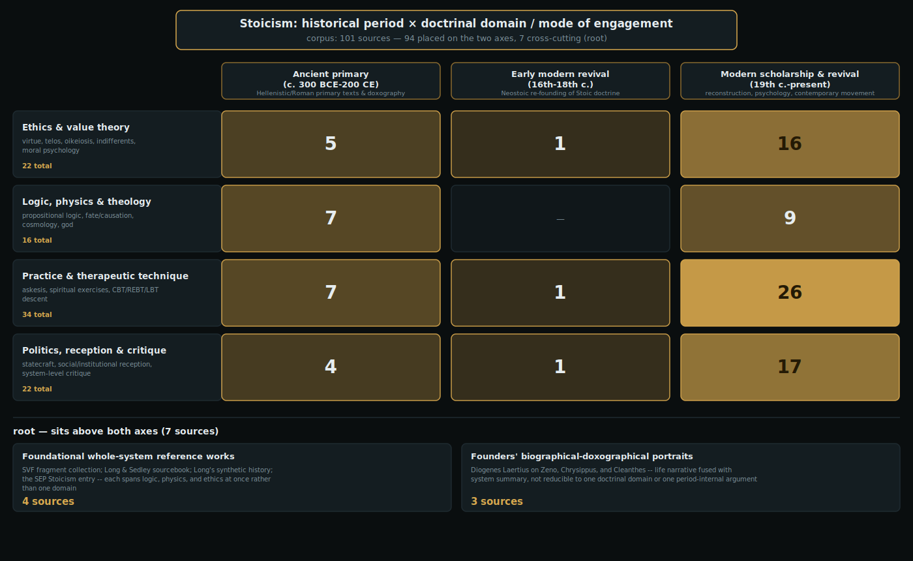
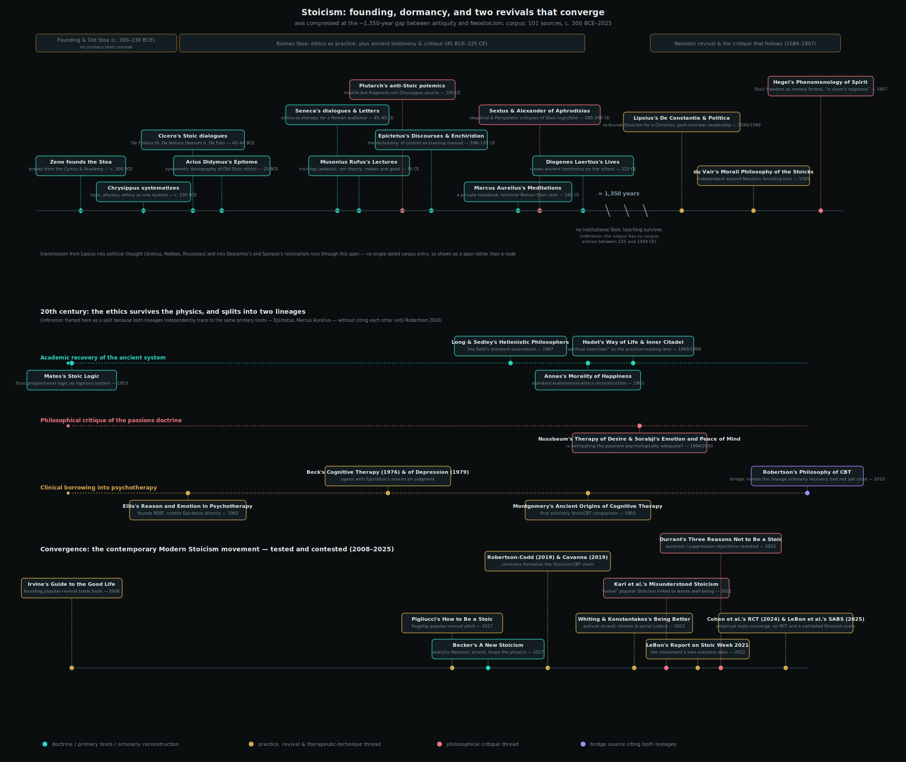

# Stoicism

## Scope and driving problems

**Scope.** The Stoic philosophical tradition from its Hellenistic founding through its Roman flowering to its modern revival: the ethics, psychology, logic, and physics it developed as a unified system, the practical techniques it prescribes for living well, and how later thought has drawn on, adapted, or challenged it. In scope: Zeno's founding and the Old/Middle Stoa, the surviving Roman-era primary texts (Seneca, Epictetus, Marcus Aurelius, Musonius Rufus), the scholarly reconstruction of lost early Stoic doctrine, Stoic practice and "spiritual exercises," and the 16th–21st century revival — including Neostoicism, Stoicism's influence on cognitive-behavioral therapy, and the contemporary "Modern Stoicism" movement and its critics. Out of scope: other Hellenistic schools (Epicureanism, Academic/Pyrrhonian Skepticism) except as direct interlocutors, and general self-help literature not grounded in Stoic doctrine.

This survey draws on 101 sources read in full or in substantial representative portion, spanning primary texts (the surviving works of Seneca, Epictetus, Marcus Aurelius, and Musonius Rufus; ancient testimony from Diogenes Laertius, Cicero, Plutarch, Sextus Empiricus, and Alexander of Aphrodisias), authoritative secondary scholarship, and a small number of reputable general-interest treatments — tiered and verified per this project's source-credibility framework rather than limited to scientific-literature norms, since Stoicism is not a field whose primary evidence takes the form of papers.

**Driving problems.** The field organizes around four recurring questions:

1. **What is the good life, and what is truly "up to us"?** — virtue as the sole good, and the dichotomy of control that separates what is within an agent's power from what is not.
2. **How is character and judgment trained in practice?** — askesis, spiritual exercises, and the premeditation of adversity as a disciplined technique, not mere theory.
3. **How do Stoic logic and physics underwrite the ethics** — fate, providence, and the rational cosmos — **and what happens when later readers keep the ethics but drop the physics?**
4. **How has Stoicism been revived, adapted, and challenged across two millennia** — from Roman successors through Neostoicism to modern psychology and the contemporary Stoic revival?

## Taxonomy

Two axes organize the corpus, derived from the recurring contrasts across the 101 sources rather than imposed from a template.

**Axis 1 — Period** (*ancient-primary* / *early-modern-revival* / *modern-scholarship-and-revival*): which historical era a source itself speaks from. This axis predicts a source's evidentiary status and its distance from the original texts — an ancient primary text and a 2007 scholarly analysis of that same text can address the identical doctrine while sitting in entirely different evidentiary positions, and that distinction matters for how a claim should be weighted.

**Axis 2 — Domain** (*ethics-and-value-theory* / *logic-physics-and-theology* / *practice-and-therapeutic-technique* / *politics-reception-and-critique*): what aspect of the Stoic system, or what mode of engagement with it, a source addresses. This axis predicts which of the survey's four driving problems a source actually answers — ethics-and-value-theory speaks to problem 1, practice-and-therapeutic-technique to problem 2, logic-physics-and-theology to problem 3, and politics-reception-and-critique to problem 4.

Every one of the 101 sources is placed on both axes (two node assignments per source) except seven that sit deliberately at `root`: von Arnim's *Stoicorum Veterum Fragmenta*, Long and Sedley's *The Hellenistic Philosophers*, Long's *Hellenistic Philosophy*, and the *Stanford Encyclopedia of Philosophy*'s "Stoicism" entry — each a whole-system reference spanning logic, physics, and ethics at once — plus Diogenes Laertius's three founder biographies (Zeno, Chrysippus, Cleanthes), where ancient life-narrative and system-summary are fused rather than separable into one domain.

The Period axis is deliberately uneven — 23 ancient-primary sources, 3 early-modern-revival, 68 modern-scholarship-and-revival — and that imbalance is itself a finding, not a defect: after antiquity, Stoicism went essentially dormant as a living school for roughly 1,350 years before Justus Lipsius's Neostoic revival, so the early-modern node is thin because the history it covers genuinely is thin (see the evolution narrative below). The Domain axis is more evenly populated (16–34 sources per node) and carries most of the corpus's substantive differentiation; the per-node treatments below therefore go deepest on the Domain nodes, while the Period nodes are treated as broader era-characterizations that connect to the causal history in the evolution narrative rather than duplicating it.

*The corpus placed on two axes -- historical period (ancient primary, early modern Neostoic revival, modern scholarship and revival) by doctrinal domain / mode of engagement (ethics and value theory, logic/physics/theology, practice and therapeutic technique, politics/reception/critique) -- plus 7 sources that sit above both axes: four foundational whole-system reference works and Diogenes Laertius's three founder biographies. Original figure, this survey.*

### Domain: Ethics and value theory

**What this node targets.** This node holds the sources that address the survey's first driving problem directly: what is the good life, and what is genuinely "up to us"? Its center of gravity is the Stoic value system itself — the claim that virtue alone is good, that everything else (health, wealth, reputation, even life and death) is "indifferent" to happiness, and the connected apparatus that keeps this claim from collapsing into either callousness or incoherence: oikeiosis (the developmental process by which a creature's self-concern matures into virtue), the passions (pathē) and their rational counterparts (eupatheiai), and the sage as the system's ideal endpoint. Where the practice-and-therapeutic-technique domain asks how character is *trained*, and the logic-physics-and-theology domain asks what *cosmic* picture underwrites the ethics, this node asks what the ethical claims themselves actually say and whether they hang together as a coherent theory of the good.

**Virtue as the sole good, and the syllogism behind it.** The clearest surviving ancient statement of the core claim is Cicero's Cato in *De Finibus* III: the wise person is happy regardless of external circumstance because happiness depends solely on moral worth (*honestum*), which admits no degrees, and Cato reaches this by a formal chain — "whatever is good is praiseworthy; whatever is praiseworthy is honourable; therefore whatever is good is honourable" — layered on top of a genetic derivation that starts from an infant's instinctive self-preservation and builds upward through "appropriate acts" (*kathekon*) to full rationality (cicero-45bce-de-finibus-iii). Arius Didymus's *Epitome*, the most systematic surviving school-internal taxonomy, arrives at the same architecture by a different route: rather than starting from oikeiosis as Cicero does, it opens directly from Zeno's tripartite division of all existing things into goods, evils, and indifferents, and works outward from that division by successive subdivision — goods and evils (with a full taxonomy of the cardinal virtues as *technai*, "sciences and skills") first, then the goal and happiness, then indifferents, then appropriate acts, then impulse, then model lives, each transition explicitly signposted as following "in proper order" from the last (arius-didymus-25bce-epitome-of-stoic-ethics). That Cicero and Arius Didymus reach structurally similar conclusions by independent doxographic routes is itself evidence, as Long's analysis (mediating the Arius Didymus note) stresses, that this is genuine Old Stoic architecture and not an artifact of either transmitter's own framing.

Modern reconstruction converges on reading this claim as more radical, not less, than it first appears. Annas situates it within the shared eudaimonist landscape of ancient ethics — all the Hellenistic schools organize ethics around the pursuit of *eudaimonia* — but argues the Stoic position is a substantive, revisionary break from the Aristotelian view that external goods contribute intrinsically to a complete life, not a merely verbal dispute dressed up in stricter language (annas-1993-morality-of-happiness). Brennan sharpens the same point against a superficially similar-sounding claim in Plato's Socrates: for the Stoics, wealth is never good even when well-used — only the *action* of using it well is good — so a wealthy sage does not thereby possess two goods, a stricter position than anything in the Socratic dialogues (brennan-2005-stoic-life). Stephens's reference synthesis frames the whole architecture as operating at three simultaneous levels of "living in agreement with nature" — cosmic, natural-kind, and specifically human — with only virtue and vice genuinely good or bad and everything else properly indifferent (stephens-2024-stoic-ethics-iep).

**Indifferents: the theory that keeps the claim livable.** If virtue alone is good, the obvious objection is that Stoics should be indifferent to health, food, or their own children — an objection Cicero's Cato heads off by introducing "preferred" and "rejected" indifferents (*proegmena*/*apoproegmena*), illustrated by an archer aiming at a mark or an actor's assigned role: indifferents can be legitimately preferred as means without being constituents of the end (cicero-45bce-de-finibus-iii). The harder version of this objection — the ancient dilemma traceable to Carneades, prominent in Plutarch and Alexander of Aphrodisias — is that indifferents seem not to be properly indifferent at all: either they contribute to happiness (so virtue is not the sole good) or they are pursued independently of happiness (so happiness is not the only goal of action). Klein's paper is the node's most technical treatment of exactly this problem: he argues the dilemma dissolves once promoted indifferents' value is read as *epistemic* rather than practical — an indifferent's promoted status gives an agent reason to *believe* a course of action is fitting (*kathekon*), not a practical reason competing with virtue as an independent goal, because indifferents function as "signs and indications" pointing toward the right act rather than partial constituents of the good, on the model of canvas and paint for an artist rather than a second payoff alongside virtue (klein-2015-making-sense-of-stoic-indifferents). Klein explicitly targets Cooper's rival account of indifferents' value (represented in this corpus by cooper-2004-knowledge-nature-good) as one of the unsatisfying prior answers his epistemic account replaces — a live disagreement within the modern scholarship, not a settled consensus.

**Oikeiosis: how self-concern becomes virtue.** The mechanism that carries an agent from infantile self-preservation to full virtue is oikeiosis (appropriation), and three sources in this node treat it as the linchpin of the whole ethical system. Striker argues the standard modern derivation of "living in agreement with nature" from oikeiosis is actually incomplete in the primary sources themselves: Cicero's account in *Fin.* III narrates an agent coming to value order and harmony in her conduct without fully arguing why that order is identical to agreement with nature, and she rejects the influential Pohlenz-style gloss (that concern for one's own rationality is automatically concern for nature's rationality, since Stoic reason is one *pneuma*) as underdetermined by direct testimony — building the case instead from Diogenes Laertius's report that reason "supervenes as a craftsman of impulse" once present, combined with Chrysippan theology (striker-1991-following-nature). Annas reads oikeiosis as a developmental trajectory from natural self-preservation to, via rationality, a universal concern for all rational beings — and argues this is what lets Stoic virtue, despite sounding like self-interested prudence about one's own good life, genuinely occupy the space of "morality" in something like the modern sense, through its demands for impartiality (annas-1993-morality-of-happiness). Gill's book-length treatment goes furthest in making oikeiosis do double duty: the same mechanism that explains ethical progress also explains the formation of social relationships and other-regard, which he argues directly refutes the standard charge that Stoic ethics is a disguised egoism, and the cultivation and therapy of the emotions, since (on Gill's reading) emotions and reason develop together through appropriation rather than in opposition — making Stoicism, he argues against Aristotelian rivals, the stronger ancient prototype for contemporary virtue ethics (gill-2022-learning-to-live-naturally, read via a BMCR review rather than the primary text — see limitations below).

**The passions and their rational counterparts.** A recurring popular misreading treats Stoicism as blanket emotional suppression; several sources in this node are directed specifically at correcting it. Graver's reconstruction of early (Zenonian/Chrysippean) doctrine argues the Stoics aimed not to eliminate feeling but to determine what an agent's affective responses would be if free of false belief, via a fourfold taxonomy: ordinary emotions (*pathē*, defined by false evaluative judgments and targeted for elimination), the *eupatheiai* ("good emotions" — joy, wariness, wish — available only to the wise), involuntary sub-rational "pre-emotions" (*propatheiai*, e.g. blanching or an initial startle), and pathological responses, each governed by distinct norms (graver-2007-stoicism-and-emotion). Brennan gives the same taxonomy in more technical detail: the four genera of passion (pleasure/dejection, pain, desire, fear) rest on false value-judgments about indifferent things, while the sage-exclusive *eupatheiai* — volition, caution, and joy — are "rational reaching-out," "rational avoiding," and "rational elation," with no eupathic analogue to pain since the sage never has anything genuinely bad present to him (brennan-2005-stoic-life). Striker connects this taxonomy directly back to the theory of action: because the Stoic governing faculty (*hēgemonikon*) is reason alone, with no independent irrational part of the soul as in Plato or Aristotle, any emotion assenting to an external as good or bad is a false judgment in principle — which is why the sage, whose judgments are never false, is necessarily free of emotion (*apatheia*) rather than merely well-regulated in it (striker-1991-following-nature).

Inwood's reconstruction supplies the underlying moral psychology that makes this taxonomy possible: he argues impulse (*hormē*) is the central concept of Old Stoic action theory — central enough that Zeno's own treatise *On Human Nature* bore the alternate title *On Impulse* — and that the Stoics took Aristotle's two-factor model of action and inserted assent (*synkatathesis*) as a formal, rational gateway between impression and impulse, eliminating Aristotle's need for a divided soul to explain akrasia by denying the soul's several powers ever genuinely oppose one another (inwood-1985-ethics-and-human-action). Shogry extends this "Assent Proposal" — his term for the reading shared by Inwood, Graver, and Brennan, that psychological disease governs only when an agent gives or withholds assent — arguing it is incomplete: disease also shapes which action-guiding impressions are formed in the first place, before assent is even in play, by an analogy to expertise (a musical expert's specialized concepts produce richer impressions than an amateur's, just as a wine-lover's corrupted concepts misapply the shared preconceptions "good" and "bad" to the wrong particulars) (shogry-2021-psychological-disease). Gill's *Structured Self*, read through two mediating scholarly reviews, argues for a still broader psychophysical holism behind all of this: reason, motivation, virtue, and the passions are states of a single unified psychophysical whole rather than a rational part governing separate irrational parts, and that ancient hostile witnesses (Plutarch and Galen reporting on Chrysippus and Posidonius) have distorted this genuinely holistic position into something closer to their own Platonizing assumptions (gill-2006-structured-self).

Two Roman-era primary texts apply this theory of the passions to a single emotion in sustained detail. Seneca's *De Ira* argues anger is never useful and is incompatible with virtue — a "desire to repay suffering" that corrupts reason — while conceding, in a passage several notes flag as psychologically important, that the involuntary "first movements" (*propatheiai*: paleness, trembling, an initial shock) are genuinely involuntary and not themselves blameworthy; only the mind's assent converts that impression into anger proper (seneca-45-de-ira). Seneca's *De Constantia Sapientis* extends the same assent-based logic from anger to insult and injury: defending the Stoic paradox that the wise person can suffer neither, Seneca distinguishes *injuria* (real damage to one's essential good, which Fortune never gave and so cannot take away) from *contumelia* (an attempted insult, which requires the victim's own participation through shame or resentment to register as harm), using Cato beaten in the Forum and Stilbo losing his city as exempla — while explicitly conceding the sage still feels bodily suffering and grief, blocking the objection that the doctrine requires inhuman numbness (seneca-55-de-constantia-sapientis).

**The sage: ideal, not achieved fact.** The passages above repeatedly invoke "the sage" as the theory's limiting case, and Brouwer's monograph is this node's most sustained study of what that figure actually is. Against a reading (associated with the 19th-century scholar Hirzel) that early Stoics like Zeno considered themselves sages while Chrysippus later retreated from the claim, Brouwer triangulates across multiple independent, even mutually hostile, sources (several passages of Sextus Empiricus, plus Cicero and Seneca) to argue that "the sage has not yet been found" was genuine, self-avowed Old Stoic doctrine from the start — confirmed most decisively by a passage where the Stoics had to block a structurally parallel argument-form, modeled on Zeno's own proof of the gods' existence, that would otherwise have forced them to concede a sage necessarily exists (brouwer-2014-stoic-sage). Stephens's reference entry draws the practical consequence: the sage is best read as a "prescriptive ideal" rather than a claim that any real person achieves or must achieve sagehood, which is precisely what makes room for a genuine theory of moral progress (*prokopē*) for the non-sage — a reading Brennan's kathekon theory operationalizes directly, since an action counts as "befitting" if it can receive a well-reasoned justification regardless of the agent's actual wisdom, letting non-sages act rightly in a thin sense on the Stoic doctrine that all sins are nonetheless equal (stephens-2024-stoic-ethics-iep; brennan-2005-stoic-life). Stephens's monograph on Epictetus specifically works out what this ideal demands of embodied, ordinary practice: externals have conditional, instrumental value as "materials for virtue" rather than being utterly valueless, only the sage can truly love (since loving requires the capacity to discriminate good from evil and indifferent), and duties to others are grounded in oikeiosis rather than egoistic self-preservation — though the mediating reviews this note relies on flag a real, unresolved tension the book itself surfaces: whether treating loved ones as conditionally valuable "indifferents" is coherent care or, as one reviewer puts it, "a chilling thought" bordering on value-neutral instrumentalization (stephens-2007-stoic-ethics-epictetus).

**Whether virtue-as-craft can guide action at all.** A methodological worry runs under several of these sources: if virtue is not a rule to follow but a disposition to have, how does it guide action in any concrete case? Annas's presidential address takes this on directly as a general problem for virtue ethics (of which Stoicism, with its explicit claim that virtue is a *technē*, a craft or skill of living, is a paradigm case): she rejects both a codifiable "decision procedure" model borrowed from consequentialism and a "virtuous person" criterion that cannot independently specify who counts as virtuous, arguing instead that virtue guides action the way expertise guides a craftsperson — through trained, practiced, ultimately uncodifiable judgment that a mature agent eventually exceeds their own teachers, on the model of skill-acquisition rather than rule-following (annas-2004-being-virtuous). Striker's argument that virtue is a *technē* because the Stoic governing faculty is reason alone gives the ancient textual grounding for exactly this modern gloss (striker-1991-following-nature).

**Can the ethics survive without the physics?** Becker's *A New Stoicism* poses the node's most consequential modern challenge: whether Stoic ethics is a genuine, self-standing theory once the ancient cosmological and theological scaffolding — a purposive, providential, rational universe — is stripped away by modern science, or whether that scaffolding was load-bearing enough that "Stoic ethics without Stoic physics" is a different, lesser thing wearing Stoic branding. Becker's answer, worked out through an explicit counterfactual ("the conceit," imagining a "saving remnant" of Stoics developing continuously into the present), discards cosmology and theology outright but keeps the architecture that ethics is subordinate to science and logic, relocating its foundation from cosmic purpose to the fullest available knowledge of the natural world plus existing human values and commitments — redefining virtue as perfected rational agency rather than playing an assigned cosmic role, while retaining "virtue is the only good" as achievable through individual character development (becker-2017-new-stoicism). This is the node's clearest bridge to the logic-physics-and-theology domain: Cooper's essay on Stoic autonomy, by contrast, argues the ancient position only works *because* human reason is literally a portion of Zeus's own rational mind — autonomy for the Stoics means voluntary cooperation with a providential natural law that is simultaneously external and internal — which is exactly the premise Becker's project sets out to do without (cooper-2004-knowledge-nature-good). Du Vair's 1585 treatise shows a third, earlier way of handling the same tension: rather than discarding the providential framework, he Christianizes it, treating Nature as a divine, providential order compatible with rather than opposed to Christian virtue, and offering prudence — the faculty that distinguishes what is within our power from what is not — as the practical remedy for passions arising from false opinions about externals (duvair-1585-morall-philosophy-stoicks). Seneca's *De Vita Beata* closes the node on a more personal register: defending his own right, as a wealthy man, to teach that virtue alone is good, Seneca argues riches are properly "desirable" and "preferable" though not themselves good, so the sage may possess and enjoy them provided he holds them loosely — a direct, first-person test case of the preferred-indifferents doctrine against the charge of hypocrisy, and one Seneca himself only partly resolves ("I am not a wise man... I am satisfied, if every day I take away something from my vices") (seneca-58-de-vita-beata).

**Evidentiary note.** Several sources central to this node's modern scholarship (cooper-2004-knowledge-nature-good, annas-2004-being-virtuous, stephens-2007-stoic-ethics-epictetus, gill-2022-learning-to-live-naturally, gill-2006-structured-self) were not read from primary full text — paywalls, expired certificates, or institutional-access barriers meant these notes were built from convergent scholarly reviews (Bryn Mawr Classical Review, Notre Dame Philosophical Reviews) rather than the authors' own prose. Where this survey draws on those sources' claims above, it is relaying a well-corroborated secondary characterization, not a first-hand reading, and readers seeking to quote these works directly should consult the primary text.

### Domain: Logic, Physics, and Theology

**What this node targets.** This node gathers the sources that address the technical, non-ethical two-thirds of the Stoic system -- dialectic (propositional logic, the theory of *lekta*, and the criterion of truth), physics (corporealism, pneuma, cosmology, and the periodic conflagration), and theology (the arguments for god's existence, the nature of divine providence, and the theodicy problem providence generates) -- and, above all, the load-bearing claim the node exists to substantiate: that these are not background scholarship for the Stoics but the argumentative foundation the ethics rests on. The Stoics themselves taught the three parts as an interlocking curriculum, logic and physics first, ethics last, "as a kind of philosophical 'initiation'" (algra-2003-stoic-theology), and Chrysippus's own compatibilist solution to moral responsibility "cannot be understood by his ethics alone but requires his causal and modal theory too" (bobzien-1998-determinism-and-freedom). This is driving problem 3's home node: how logic and physics underwrite the ethics, and what is at stake when a later reader keeps the ethics while dropping the physics -- a question this node sets up and the practice-and-therapeutic-technique and politics-reception-and-critique nodes return to when they track what later readers actually did with that option.

**Key ideas, organized by sub-topic.**

*Logic and epistemology.* Diogenes Laertius's doxographical compilation (diogenes-laertius-225-lives-book7-stoics) is the fullest connected ancient exposition: it defines the *lekton* (the incorporeal "sayable," meaningful content distinct from both the physical utterance and the external object), the kataleptic ("apprehending") presentation as the Stoic criterion of truth, a taxonomy of simple and non-simple propositions, and Chrysippus's five indemonstrable argument-forms from which all valid syllogisms are supposedly built. Mates's foundational technical reconstruction (mates-1953-stoic-logic) and Bobzien's later SEP synthesis (bobzien-2006-sep-ancient-logic) both establish, against a long scholarly tradition that treated Stoic logic as a degraded copy of Aristotelian term-logic, that it is a genuine and independent *propositional* logic operating on *lekta* rather than classes -- Bobzien goes further, characterizing it as "a substructural backwards-working Gentzen-style natural-deduction system" with structural parallels to Frege, and both sources work through the competing Philonian, Diodorean, and Chrysippean accounts of when a conditional is true. Sextus Empiricus's polemic (sextus-empiricus-180-against-the-logicians) supplies the node's other pole: writing as a hostile Pyrrhonist critic, he preserves the fullest ancient account of the kataleptic presentation and the *lekton* precisely by trying to demolish both, arguing the Stoics cannot specify a mark distinguishing a genuinely apprehensive presentation from a subjectively indistinguishable false one (the mad Orestes mistaking Electra for a Fury). Reading Diogenes Laertius, Mates, and Bobzien together against Sextus is itself instructive for driving problem 3: the technical system's own defenders and its most sustained ancient critic agree on what the system claims, which is what makes the doctrine reconstructable at all from testimony rather than from any complete Chrysippean original.

*Physics and cosmology.* White (white-2003-stoic-natural-philosophy) and Sedley (sedley-1999-hellenistic-physics-metaphysics) both argue that Stoic physics should be read as the coherent working-out of a small number of prior commitments rather than as ad hoc paradox: White identifies these as the unity/cohesion of the cosmos and an all-encompassing divine reason, while Sedley traces the same output back to a revised Platonic criterion of being ("what has threefold extension along with resistance") that forces even souls and moral qualities to be corporeal, since only bodies can causally interact. Both converge on total blending (*krasis di' holon*) -- the doctrine that pneuma (an active blend of fire and air) interpenetrates passive matter completely, such that a single drop of wine could in principle mix through the entire sea -- as the physical mechanism that makes the cosmos one continuous, rationally pervaded body rather than a mechanical aggregate. Sambursky (sambursky-1959-physics-of-the-stoics) supplies the fullest technical reconstruction of the mechanism itself: pneuma's defining property *tonos* ("tension") is what gives bodies cohesion, with the specific tension-ratio in a substance determining whether it exhibits mere physical cohesion, organic growth, or soul, a continuum/field theory Sambursky explicitly (if cautiously) compares to the aether and field concepts of early modern physics. Seneca's *Naturales Quaestiones* (seneca-65-naturales-quaestiones) is this node's primary-text counterpart to the modern reconstructions: a rare surviving systematic Stoic physics text that catalogues rival causal explanations of natural phenomena (comets, earthquakes, the 62/63 CE Pompeii-region earthquake) before pivoting, book by book, to the Stoic ethical and theological upshot -- epistemic humility and reasoned calm rather than superstitious terror -- making explicit the node's central claim that physics and ethics were never separable exercises for a working Stoic.

*Theology and providence.* Cicero's *De Natura Deorum* II (cicero-45bce-de-natura-deorum-ii), voiced through the Stoic spokesman Balbus, is the single most complete connected exposition of Old Stoic theology to survive: a four-movement argument that the world is itself a single living, rational, and therefore divine being, whose providential design runs from the regularity of the heavens down to the versatility of the human hand. Algra's chapter (algra-2003-stoic-theology) supplies the modern synthesis, organizing the school's formal "proofs" of god's existence (from universal consensus, from cosmic design, from the unacceptable consequences of atheism, and Zeno's own syllogism) around Cicero's own four-part scheme, and showing that the resulting Stoic god is a considered hybrid -- materially identified with pneuma and the cosmos (monistic pantheism) yet also an active formative principle with intentions and providential care (theism), and, via allegory, partially polytheistic. Both sources converge on the theodicy problem this generates -- if a providential, rational god determines everything, why does evil exist -- and Seneca's *De Providentia* (seneca-64-de-providentia) is the primary text that answers it from the practical side: adversity is not evidence against providence but its chosen pedagogical instrument, since "no evil can befall a good man" once poverty, exile, and pain are correctly reclassified as indifferents rather than evils.

*Fate, determinism, and compatibilism.* This is the node's most densely populated sub-topic and the one that most directly does the work driving problem 3 asks for. Cicero's *De Fato* (cicero-044bce-de-fato) is the primary-text anchor, reporting Chrysippus's logical argument from the law of excluded middle applied to future-tense propositions, his "co-fated" (*confatalia*) response to the Lazy Argument, and the cylinder-and-cone analogy distinguishing proximate from principal causes -- while Cicero's own verdict remains skeptical, invoking Carneades's argument that truth and causal necessitation are logically distinct. Bobzien (bobzien-1998-determinism-and-freedom), Salles (salles-2005-stoics-determinism-compatibilism), and Hankinson (hankinson-1999-determinism-indeterminism) each reconstruct the resulting Chrysippean compatibilism in complementary technical registers: Bobzien via a causal taxonomy in which only what "actively contributes" to an effect counts as a cause, distinguishing teleological determinism, causal determinism, and fate as their integration; Salles via three distinct compatibilist strategies used across the tradition (Chrysippus's own two arguments plus a later Epictetan "Normative Argument" extending responsibility even to unreflective agents), explicitly compared to Harry Frankfurt's modern compatibilism; Hankinson via the distinction between antecedent causes (necessary but not individually sufficient) and "perfect and principal" internal causes, tracing the debate back through Diodorus Cronus's Master Argument and forward through Carneades's and the Epicureans' rebuttals. Alexander of Aphrodisias's *De Fato* (alexander-aphrodisias-200-de-fato) is the node's sustained hostile counter-source, a Peripatetic polemic arguing Stoic determinism cannot accommodate contingency or genuine responsibility and reviving the Lazy Argument in a version -- that merely *believing* determinism is true is practically dangerous -- that Hankinson and other modern commentators judge more successful than Alexander's metaphysical counterexamples, which equivocate on "contingent" between the Aristotelian and Stoic senses of the term.

**How this differs from sibling nodes on the Domain axis.** Where ethics-and-value-theory treats virtue, the good, and the dichotomy of control as the content of the good life, this node supplies the metaphysical machinery -- a rational, providential, deterministic cosmos, and a logic capable of rigorously stating what follows from what -- that makes the ethics-and-value-theory node's claims more than assertion: eph' hemin ("what is up to us") is not a free-floating moral intuition but, per Bobzien and Salles, a technical result of Chrysippus's causal and modal theory. Where practice-and-therapeutic-technique asks how character is trained day to day, this node supplies what the training is training an agent to see correctly -- namely a fated, providentially ordered world one must assent to rather than resist. And where politics-reception-and-critique tracks what later readers (Neostoics, cognitive-behavioral therapists, contemporary "Modern Stoics") kept and discarded, this node is the measure against which "dropping the physics" is even a meaningful move to describe: a modern reader who keeps only the dichotomy of control while discarding pneuma, cosmic conflagration, and a providential fated cosmos is, by this node's own sources' account, detaching the ethics from the very foundation Chrysippus argued it required.

## Politics, Reception, and Critique

This node gathers the corpus's largest single cluster of sources on the
Domain axis, and it is the one that answers driving problem 4 most directly:
how has Stoicism been revived, adapted, and challenged across two millennia,
and -- distinct from ethics-and-value-theory's question of what the good life
is for an individual, and practice-and-therapeutic-technique's question of
how character is trained -- what happens when Stoic doctrine collides with
institutional power, with rival philosophical systems that borrow selectively
from it, and with critics (ancient and modern) who deny the system coheres at
all. The 22 sources here run from Zeno's own lost political utopia through
Roman applied statecraft, a 1,350-year dormancy, the Neostoic re-founding of
Stoicism as a working political technology, its selective absorption into
early modern rationalism, and a contemporary debate over whether Stoicism is
inherently quietist or a genuine resource for activism.

### Zeno's radical city and its ancient prosecutors

The node's earliest material is also its most speculative reconstruction.
Schofield argues, from scattered and hostile later testimony, that Zeno's
lost *Republic* was a real utopian political proposal in the vein of Plato's
-- a city unified by mutual love among the wise in which temples, law-courts,
coinage, and conventional education are abolished -- and that Chrysippus's
later Stoa recontextualized this radical vision within providential cosmology,
depoliticizing it into the more familiar cosmopolitan doctrine of a universal
city of gods and wise men bound by natural law (schofield-1991-stoic-idea-of-the-city).
That depoliticizing move is precisely what Plutarch, writing as a hostile
Middle Platonist roughly three centuries later, seizes on as an inconsistency
rather than a development: his *On Stoic Self-Contradictions* opens its
political charges by pointing out that Zeno, Cleanthes, and Chrysippus all
wrote extensively on statecraft, ruling, and pleading cases, yet none of them
held office, served in the military, or otherwise participated in public life
-- a leisured, book-and-lecture-hall existence Plutarch brands as consistent
with the rival Epicurean ideal of withdrawal, not the Stoics' own professed
doctrine that the sage should engage in politics
(plutarch-100-on-stoic-self-contradictions). His companion polemic, *Against
the Stoics on Common Conceptions*, presses the same charge from the other
direction, at greater doctrinal depth: it argues the Stoics violate their own
professed standard -- that ethics and physics must answer to humanity's
shared, pre-theoretical "common conceptions" -- at point after point, from the
claim that a sage may justifiably commit suicide over the loss of a merely
"indifferent" thing to the theological claim that all gods but Zeus perish in
the periodic conflagration, which Plutarch reads as making "god" definitionally
destructible against the universal conception of divinity as everlasting
(plutarch-100-against-stoics-common-conceptions). Both essays are polemical
prosecutions rather than neutral reports, and both nonetheless preserve, in
the act of attacking them, some of the largest surviving direct quotations of
Chrysippus's lost political and ethical treatises -- a reminder that this
node's ancient material is inseparably both critique and evidence at once.

### Applied Roman political ethics: Seneca addresses power directly

Where the founding generation theorized about an ideal city, Seneca writes
directly to power. *De Clementia*, addressed to the young emperor Nero, argues
that mercy is the supreme political virtue distinguishing a legitimate king
from a tyrant: both may command equal force, but the king uses it to
safeguard peace while the tyrant rules through terror, and Seneca grounds
this in a Stoic claim about reason rather than mere sentiment -- the wise
ruler withholds available punishment because reason judges restraint superior
to indulgent cruelty, an argument built through the extended exemplum of
Augustus's pardon of the conspirator Cinna and an analogy to the stingless
bee-king as a natural-law model of restrained sovereignty
(seneca-56-de-clementia). *De Otio* addresses the opposite problem: whether
Seneca's own retirement from politics is compatible with the school's
official position that the wise person participates in public life. His
answer -- that an individual belongs to two commonwealths, a "greater"
universal community of gods and rational beings and a "lesser" particular
state, and that someone barred from serving the lesser by incapacity or a
state too corrupt to reform can still serve the greater through philosophical
work whose benefit reaches "ages to come" -- reasons from the Stoics' own
founding authorities rather than against them, citing Zeno's own qualification
that the wise man participates in politics "unless prevented by some special
circumstance" (seneca-62-de-otio). Together the two treatises show the Roman
Stoa treating political engagement and withdrawal not as a settled doctrine
but as a live, addressee-specific argument -- exactly the tension the node's
later Neostoic and modern material keeps returning to.

### The Neostoic re-founding as political technology

After the dormancy this survey's evolution narrative documents, Justus
Lipsius's *Politica* (1589) reopens the political question on explicitly
early modern terms: how a ruler secures stable order amid the religious civil
wars of the Low Countries when force alone cannot sustain legitimate
authority. Lipsius argues stable rule rests on two interdependent guides --
virtue (justice, clemency, piety) and prudence (practical wisdom drawn from
historical example) -- with constancy, the Stoic theme of his earlier *De
Constantia* extended from private ethical life into statecraft, as the
disposition that lets a prince hold to just and prudent rule without being
destabilized by fortune or faction; virtue, on his account, flows downward
from ruler to subjects, so a corrupt prince corrupts his people
(lipsius-1589-politica). Papy's synthesis of Lipsius's full career treats this
as the culmination of a rigorous philological method -- distinguishing
authentic Senecan texts, imposing logical order on scattered ancient
quotations -- that let Lipsius reconstruct a coherent, teachable Stoic system
out of fragmentary sources, and identifies his signature move as subordinating
Stoic fate to Christian providence while explicitly rejecting elements
incompatible with Christianity, such as permission of suicide
(papy-2004-sep-justus-lipsius). What that political synthesis did once
released into the world is the subject of a genuine three-way scholarly
dispute the node preserves rather than resolves. Oestreich reads Neostoicism
as a practical political technology in its own right: Lipsius's doctrine of
constantia supplied a confessionally neutral moral foundation for centralized
state authority that crossed the Calvinist/Lutheran divide, and his
philological reconstruction of ancient drill procedures directly shaped
Maurice of Nassau's Dutch army reforms, evidence Oestreich builds into a
broader thesis of "Sozialdisziplinierung" -- the state's systematic extension
of control over subjects' behavior via education, law, and military
organization (oestreich-1982-neostoicism-early-modern-state). Brooke, reading
the *Politica* itself in close detail against both Oestreich and the rival
"anti-Machiavellian" reading defended by Robert Bireley, argues instead that
the text is a genuine, substantive reply to Machiavelli's critique of Senecan
political thought -- sitting, in his phrase, "poised theoretically as well as
chronologically between Machiavelli and Hobbes" -- and that its relative
silence about ordinary citizens' lives combined with its preference for a
professional standing army actually *reduces* rather than expands the state's
disciplinary reach, undercutting Oestreich's strong social-discipline thesis
(brooke-2012-philosophic-pride). Morford shifts the question from doctrine to
social and artistic transmission, arguing Neostoicism operated through the
practiced social form of the Roman *contubernium* -- Lipsius's intensive
teacher-student circle -- which Rubens then translated into visual allegory in
*The Four Philosophers*, staging Lipsius and his students around a Stoic
teacher-circle presided over by a bust of Seneca
(morford-1991-stoics-and-neostoics). Lagrée's study of the same figure works
the theological seam underneath all three accounts: she argues Lipsius
achieves his Christian-Stoic synthesis by treating the historically accurate
meaning of a Stoic text and its usable doctrine as separable, replacing strict
fatalistic determinism with a providential framework compatible with
Christian free will, and pairs this with an explicitly authoritarian political
argument -- made against Dirck Coornhert, the era's defender of religious
toleration -- that religious plurality inevitably produces war and that
external religious observance must therefore be unified, grounding Lipsius's
statecraft in the same conviction (lagree-1994-juste-lipse-restauration-stoicisme).
Two further sources bracket this material chronologically. Kraye, explicitly
declining to analyze Lipsius's own synthesis (a task she hands to Papy's
companion piece), instead establishes the pre-Lipsius Renaissance baseline:
Petrarch received Stoic ethics almost entirely through Cicero and Seneca
rather than any direct Greek source, and combined humanist admiration for
Seneca with real philological and moral scrutiny of him, including
identifying a pseudo-Senecan treatise as spurious and reproaching Seneca's own
letter for staying enmeshed in Nero's court despite preaching virtue
(kraye-2001-stoicism-renaissance-petrarch-lipsius). Sellars picks the thread
back up on the far side of Lipsius, tracing reception through France's
ethics-focused engagement (Descartes, Malebranche, Pascal), England's
determinism-focused reception (the Hobbes-Bramhall dispute, Cudworth), German
scholarly expansion culminating in Brucker's *Historia Critica Philosophiae*,
and the Spinozism-and-atheism controversy that recast Stoicism as theologically
dangerous rather than admirable -- and directly disputes the standard
"Neostoicism as Christianized modification" narrative that Oestreich and Papy
represent, arguing Lipsius's own account of Stoic fate was largely unaltered
ancient doctrine rather than a softened one
(sellars-2025-early-modern-legacy-of-the-stoics).

### Selective philosophical uptake: Spinoza and Descartes

Two sources in this node trace how specific early modern philosophers
absorbed Stoic structure without a wholesale doctrinal revival. Miller tests
the frequently asserted but rarely systematized claim that Spinoza is "the
Stoic of modern philosophers," explicitly bracketing the question of direct
historical influence (Spinoza names the Stoics only twice in his corpus) in
favor of point-by-point conceptual comparison, and finds genuine but partial
overlap: both systems identify God with Nature as an immanent unified whole,
reject libertarian free will, and treat emotions as cognitive states
correctable through rational understanding, but diverge sharply on
corporealism and teleology -- Stoic providential cosmic purposiveness is
exactly what Spinoza's system rejects outright
(miller-2015-spinoza-and-the-stoics). Rutherford runs the same kind of test on
Descartes, arguing that although Descartes is not a Stoic, his ethics
incorporates significant Stoic structure -- virtue as "a firm and constant
will" to act rightly echoes Stoic virtue-as-settled-disposition, and Descartes
grounds duties in a hierarchy of values that functions analogously to the
Stoic *kathekon* (appropriate action) -- while diverging by not requiring
perfect knowledge for virtue, accepting a tripartite division of goods rather
than virtue as the sole good, and explicitly rejecting Stoic *apatheia*
(rutherford-2014-reading-descartes-as-a-stoic). Both cases model the same
pattern this node keeps surfacing: later philosophers keep the Stoic
architecture of reason-governed conduct while discarding the physics or
metaphysics that originally underwrote it.

### Modern critique and the political-virtue debate

The node's philosophical critique culminates in Hegel, whose *Phenomenology
of Spirit* names "Stoicism" as the shape of self-consciousness that discovers
it can be free purely in thought regardless of its actual worldly condition,
indifferent to whether one is Marcus Aurelius on the throne or Epictetus in
chains. Hegel's verdict is that this freedom is real but merely formal: pressed
for a criterion of truth, Stoicism can only answer "reasonableness," a
"contentless thought" that "as an abstraction cuts itself off from the
multiplicity of things" and so has no content of its own
(hegel-1807-phenomenology-of-spirit-stoicism). That charge of formal,
withdrawal-based freedom recurs almost unchanged in Durrant's contemporary
essay, which argues the modern Stoic revival's dichotomy of control
structurally discourages activism, that its equanimity collapses healthy
emotional regulation into anti-human suppression, and that it is internally
inconsistent about whether injury is real -- denied for the self but
presupposed to justify helping others -- proposing Nietzschean will-to-power
ethics as a more honest alternative
(durrant-2023-three-reasons-not-to-be-stoic). The node's remaining sources
largely take up this same quietism charge as a live, unresolved debate rather
than settling it. Long, assessing what the modern revival keeps and drops
from the ancient system, insists the dichotomy of control is "our single most
important legacy from ancient Stoicism" but warns that emphasizing resilience
and acceptance risks being misread as quietist resignation, since the
movement's original driver was "action, not resignation"
(long-2018-stoicisms-ancient-and-modern). Pigliucci's "Fifth Stoa" essay
argues for the revival's institutional and philosophical legitimacy as a
genuine contributor to the academic virtue-ethics revival, retaining virtue as
the sole good while updating or discarding the ancient physics
(pigliucci-2018-toward-fifth-stoa). Whiting and Konstantakos push back on the
individualistic reading directly, arguing Stoicism was built from its Athenian
marketplace origins on the premise that virtue is inherently other-directed --
"nothing in Stoicism is merely done for our own sake" -- and using Panaetius's
doctrine of four roles (*prosopa*) to generate differentiated obligations
toward social justice and climate breakdown rather than counseling withdrawal
(whiting-konstantakos-2021-being-better). The debate's most direct engagement
with the Hegelian quietism charge is Pigliucci's own essay confronting
classicist Gregory Hays's criticism that Stoicism trains an individual to be
"an absolute ruler in the citadel of the mind" without ever opposing tyranny,
slavery, or inequality as institutions -- a piece whose corpus.json byline and
date are corrected here per this survey's records: it is Pigliucci's 2021
"Stoics as activists," not the 2017 Matthew Sharpe piece its key name
suggests. Pigliucci marshals genuine historical evidence of Stoics as
political activists and martyrs -- Blossius backing the Gracchan revolt, Cato
the Younger opposing Caesar, the "Stoic opposition" senators Thrasea Paetus
and Helvidius Priscus defying Nero, Vespasian, and Domitian -- but ultimately
concedes the core of Hays's point: none of this amounts to a Stoic political
*programme* capable of targeting systemic injustice rather than individual bad
actors, a gap the essay traces back to antiquity itself via Cicero's
exasperated complaint that Cato "speaks and votes as though he were in the
Republic of Plato, not in the scum of Romulus"
(sharpe-2017-stoicism-political-virtue). Sorabji's *Emotion and Peace of
Mind*, finally, models a scholarly version of the same move Whiting,
Konstantakos, and Pigliucci make polemically: he separates Chrysippus's
cognitive analysis of emotion as revisable value-judgment -- which he argues
supplies a genuinely useful therapy -- from the specifically Stoic doctrine of
indifference and the ideal of eradicating nearly all emotion (*apatheia*),
arguing a modern reader can keep the therapeutic method while declining the
harsher metaphysical rationale, a separation he supports partly with 1990s
neuroscience showing some emotional reactions bypass judgment-based therapy
entirely (sorabji-2000-emotion-and-peace-of-mind). Read together, this node's
modern material shows the quietism and coherence objections Plutarch raised
against Chrysippus's own conduct in antiquity recurring, essentially
unchanged in structure, against the twenty-first-century revival -- and shows
that revival's own defenders conceding, rather than dissolving, the charge
each time it is pressed on the question of systemic political action.

## Practice and Therapeutic Technique

This is the corpus's largest domain node (34 of 101 sources) and the one that answers this survey's second driving problem most directly: not what the good life is, but how character and judgment are actually trained to reach it. Its span is unusual for a single node — it runs from the oral training manuals Epictetus's students transcribed in Roman Nicopolis, through a 20th-century scholarly argument that those manuals are best read as *exercise* rather than doctrine, through the moment 20th-century clinical psychology adopted the same core claim as the founding premise of an entire therapeutic discipline, to a present-day empirical literature testing whether Stoic technique actually delivers the well-being it promises. What holds the node together across that span is a single recurring move: treating a person's judgments, not the external events those judgments are about, as both the source of disturbance and the point of intervention — and then asking, in each era's own idiom, exactly how that judgment gets retrained.

### Ancient askesis: the dichotomy of control as a trained skill, not a proposition

The node's ancient core is Epictetus's *Discourses* and *Enchiridion*, Marcus Aurelius's *Meditations*, Seneca's *Moral Letters* and *De Tranquillitate Animi*, and Musonius Rufus's *Lectures*, and what unites them is that none argues for the dichotomy of control so much as drills it. Epictetus opens both the *Discourses* and the *Enchiridion* with the same claim in different registers — some things are "in our power" (opinion, desire, aversion, in a word our own actions) and everything else, body, property, reputation, other people's conduct, is not — and then spends the rest of each text converting that claim into a set of concrete habits: examining "harsh appearances" before assenting to them, reframing particular losses as instances of a general and replaceable category (a broken cup is just "one of the things that break"), premeditating obstacles before a difficult undertaking, and keeping death "daily before your eyes" (epictetus-108-discourses; epictetus-125-enchiridion; epictetus-135-enchiridion). The two Enchiridion translations in the corpus converge on the same textual moves — the shipboard analogy for holding possessions loosely, the banquet analogy for desire, the actor-in-a-drama image for accepting one's assigned social role — which is itself evidence that these are the manual's load-bearing drills rather than incidental illustrations (epictetus-125-enchiridion; epictetus-135-enchiridion). Marcus Aurelius's *Meditations* is what this training looks like practiced by a single mind on itself over decades: a private notebook, not a treatise for readers, built around a small recurring set of exercises — scrutinizing impressions before assenting to them, the "view from above" that dissolves the apparent weight of one's troubles by imagining them from cosmic distance, and premeditation on death and change as natural transformation rather than evil (marcus-aurelius-180-meditations). Seneca's contribution runs in the same direction but for a different occasion: his *Moral Letters* apply inherited Stoic technique to a named correspondent's specific troubles — reclaiming time as the one genuinely non-recoverable good, treating old age as having its own distinctive pleasures rather than mere decline, premeditating the choice of a dignified death — while *De Tranquillitate Animi* diagnoses a milder, more common condition (Serenus's "sea-sickness," restless oscillation between competing desires rather than acute crisis) and prescribes calibrated moderation of wealth, ambition, and friendship rather than renunciation (seneca-65-moral-letters-to-lucilius; seneca-60-de-tranquillitate-animi). Musonius Rufus, Epictetus's own teacher, supplies the node's most explicit argument for *why* training rather than theory is what actually produces virtue: arguing by extended analogy (which doctor, pilot, or musician would you actually choose — the eloquent theorist or the practiced novice?), he distinguishes training common to soul and body (enduring cold, hunger, hardship) from training proper to the soul alone (keeping ready arguments that popularly-esteemed goods and evils are not truly so), and insists philosophy students need this more than anyone because they must first undo the corruption of their upbringing (musonius-rufus-70-lectures-and-fragments-2). Read together, these five ancient voices do not converge on a single technique so much as a shared conviction: that the dichotomy of control is a skill to be drilled through repeated practice against concrete situations, not a thesis to be accepted once and then applied automatically.

### The Hadot lineage: philosophy as exercise, not doctrine

The modern scholarly case for reading these ancient texts as *practice* rather than argument is made almost entirely by Pierre Hadot, across three books in this node, and the case matters for this survey because it is what licenses treating "practice and therapeutic technique" as a domain in its own right rather than a subordinate illustration of Stoic ethics. Hadot's broadest claim, in *Philosophy as a Way of Life* and *What Is Ancient Philosophy?*, is that for every major ancient school an existential "choice of a way of life" came first and determined the resulting doctrine, not the reverse — philosophical discourse existed to induce a way of living, inseparable from concrete "spiritual exercises" (hadot-1995-philosophy-as-a-way-of-life; hadot-2002-what-is-ancient-philosophy). Applied specifically to Stoicism, he reconstructs Epictetus's schema of three disciplines — desire and aversion (corresponding to physics, retrained toward acceptance of the providentially ordered cosmos), assent (corresponding to logic, training the ruling faculty to withhold judgment from inadequate impressions), and action (corresponding to ethics, redirecting impulse toward service to the human community) — as the organizing structure beneath texts that look, on their surface, disorganized. *The Inner Citadel* is Hadot's most sustained demonstration of this on a single text: he argues Marcus Aurelius's repetitiveness is not a literary flaw but the exercise itself, a working Stoic using each notebook entry to apply the three-discipline framework to his own impressions, desires, and impulses in real time (hadot-1998-inner-citadel). A. A. Long's monograph-length study of Epictetus and Margaret Graver's reference synthesis both corroborate the practice-centered reading from more conventional classical-scholarship footing — Long by showing how Epictetus's theonomic language ("follow the gods") grounds volition (prohairesis) as the sole seat of identity and responsibility rather than functioning as external authority, Graver by centering Epictetus's ethics on the "correct use of impressions" organized around the same three areas of study while flagging that recent scholarship questions whether the three-topoi framework is Epictetus's own or a later interpretive imposition (long-2002-epictetus-stoic-socratic-guide; graver-2008-sep-epictetus). John Sellars extends the same argument furthest back, tracing the "art of living" language (technê peri ton bion) to a specifically Stoic lineage running from Chrysippus and Posidonius through Epictetus's explicit claim that "each individual's own life is the subject-matter of the art of living," and arguing that because Stoic psychology is monistic — no separate faculties in internal conflict — genuine transformation in judgment necessarily transforms action, which is precisely what licenses reading these texts as aimed at behavioral change rather than mere propositional assent (sellars-2003-art-of-living). Martha Nussbaum supplies this cluster's sharpest internal counterweight: her *Therapy of Desire* agrees that Hellenistic philosophy cast itself as medicine for the soul, but argues the Stoic case for extirpating the passions entirely (apatheia) is intellectually forceful on a few passions like anger yet strained as a totalizing psychology — a tension she reads the Roman Stoics themselves as having partly conceded, since Seneca's own practice qualifies the pure ideal with real attachment to friendship and family (nussbaum-1994-therapy-of-desire). The Hadot lineage, in other words, does not just describe the ancient technique — it argues, against a live objection, that treating these texts as exercise rather than doctrine is the only reading that makes their form (repetitive, unsystematic, addressed to oneself) make sense at all.

### A Renaissance bridge: Lipsius reworks Roman consolation as its own spiritual exercise

Between the ancient material and its modern clinical descendants sits a single, illuminating bridge case. Justus Lipsius's *De Constantia* (1584), written as the Low Countries were being torn apart by civil and religious war, restages Seneca's consolatory genre as a dialogue in which Lipsius casts himself as the anxious pupil and his mentor-figure Langius as the wise instructor, arguing that Constancy comes from reforming judgment through Right Reason rather than from fleeing one's troubled homeland (lipsius-1584-de-constantia). John Sellars's later scholarly analysis of this text applies Hadot's own framework outside its usual ancient context, arguing De Constantia should be read the same way *The Inner Citadel* reads the *Meditations*: not as abstract doctrinal exposition but as Lipsius's own therapeutic working-through of lived civil-war trauma, staged as a near-monologue in which Langius does almost all the talking and Lipsius contributes "very little in his own voice" — structurally closer to an internal dialogue with oneself than a genuine exchange between independent viewpoints (sellars-2007-lipsius-de-constantia-spiritual-exercise). The pairing matters for this node specifically because it shows the ancient technique of therapeutic self-address surviving the sixteenth century's near-total loss of a living Stoic school: the *form* of practice persists even where institutional transmission does not.

### Direct clinical descendants: REBT, cognitive therapy, and Logic-Based Therapy

The node's second major cluster is where the ancient technique is imported, by name, into 20th-century clinical psychology as a founding premise rather than a loose analogy. Albert Ellis's *Reason and Emotion in Psychotherapy* (1962) is the decisive first step: frustrated that psychoanalytic insight into childhood origins so often left the underlying neurosis intact, Ellis argues disturbance is sustained not by a buried unconscious conflict but by specific, continuously self-repeated beliefs about events, and credits the discovery explicitly to "the Stoic philosophers (such as Epictetus and Marcus Aurelius)" (ellis-1962-reason-emotion-psychotherapy). His and Robert Harper's popular restatement, *A New Guide to Rational Living*, quotes Epictetus's dictum directly — "Men are disturbed not by things, but by the views which they take of them" — and builds the teachable machinery (Activating event, Belief, Consequence) that became Rational Emotive Behavior Therapy's public face, adding a lineage back through Heraclitus, Zeno, Epicurus, and Spinoza for good measure (ellis-harper-1975-new-guide-rational-living). Aaron Beck's *Cognitive Therapy and the Emotional Disorders* and, with Rush, Shaw, and Emery, *Cognitive Therapy of Depression* independently reach the same starting point and credit the same source: Beck's founding claim that "the philosophical origins of cognitive therapy can be traced back to the Stoic philosophers, particularly Zeno of Citium... Chrysippus, Cicero, Seneca, Epictetus, and Marcus Aurelius" is, per the notes on both books, the single most-cited sentence by which Stoicism entered mainstream clinical psychology's own account of its origins (beck-1976-cognitive-therapy-emotional-disorders; beck-rush-shaw-emery-1979-cognitive-therapy-depression). Donald Robertson's two contributions push this connection from citation to sustained argument: his monograph traces a documented historical chain — not just parallel resemblance — from Epictetus through Paul Dubois's early rational psychotherapy and Émile Coué's autosuggestion to Beck and Ellis, and his review essay with R. Trent Codd III catalogues roughly seventeen specific Stoic techniques (Socratic questioning, the dichotomy of control, cognitive distancing, premeditation of adversity) with named CBT and "third-wave" counterparts, arguing clinicians have under-exploited what Stoicism actually offers as a coherent worldview rather than a bag of isolated coping techniques (robertson-2010-philosophy-of-cbt; robertson-codd-2019-stoic-philosophy-cbt). Andrea Cavanna's two contributions extend the same lineage into neuropsychiatric practice, tracing behaviorism, CBT, and "third wave" mindfulness-based therapy back to a single Stoic root and pairing the Stoic concept of prosoche (attention to the present moment) with modern mindfulness technique, while a companion paper with Purpura, Riva, Nacinovich, and Seri surveys clinical evidence for mindfulness-based intervention across a wide range of neuropsychiatric conditions and situates it within the same genealogy (cavanna-2019-back-to-the-future-stoic-wisdom; cavanna-et-al-2023-western-origins-mindfulness-ancient-rome). Panagiotis Kormas narrows the comparison furthest, pairing four specific Stoic exercises — Socratic questioning, cognitive distancing, attention (prosochē), and focus on the present moment — against named modern technique one at a time, arguing the parallel holds at the level of practiced method, not just shared premise (kormas-2022-stoic-cognitive-theories-neuropsychological). Robert Montgomery's 1993 paper predates all of these and is the first systematic academic comparison of Stoic emotion-theory (Epictetus, Marcus Aurelius, Seneca, and, in more technical form, Chrysippus) against Beck's and Ellis's frameworks, concluding the parallel is genuine without claiming full doctrinal equivalence (montgomery-1993-ancient-origins-cognitive-therapy). A more recent, lightly weighted synthesis piece, Flavian Gradinaru's undergraduate-level survey of CBT's Stoic underpinnings, restates the same general parallels without close engagement with any primary Stoic text and adds no evidence beyond what the corpus's other sources in this cluster already establish more rigorously; it is cited here only as a minor supporting data point, not a load-bearing one (gradinaru-2023-philosophical-underpinnings-cbt-stoicism). The most technically distinct branch of this cluster is Elliot Cohen's Logic-Based Therapy, which translates Ellis's psychological Activating-event/Belief/Consequence vocabulary into an explicitly logical one: clients disturb themselves through "practical syllogisms" with a suppressed but readily affirmed universal Rule premise (one of eleven catalogued "cardinal fallacies," such as Demanding Perfection or Awfulizing) and a factual Report premise, and therapy proceeds by replacing the Rule with a reflectively-held philosophical "antidote" drawn from the history of philosophy rather than a single prescribed belief (cohen-2013-theory-practice-logic-based-therapy).

### Testing the claim: Modern Stoicism as practice, and the empirical record on whether it works

The node's final cluster is where the ancient-technique-as-therapy claim stops being asserted and starts being measured — and where the corpus's most direct tension surfaces. William Irvine's *A Guide to the Good Life* and Massimo Pigliucci's *How to Be a Stoic* are the contemporary revival's two founding trade books, both reconstructing Stoicism as a set of concrete psychological techniques rather than a physics-dependent system: Irvine reworks Epictetus's dichotomy of control into a "trichotomy" (adding a middle category of things we influence but don't fully control) paired with a strategy of "internalizing" goals so that ambition remains within complete control regardless of outcome, while Pigliucci organizes his own practice explicitly around Epictetus's three disciplines and appends twelve concrete daily exercises (irvine-2008-guide-to-good-life; pigliucci-2017-how-to-be-a-stoic). Both books cite the Modern Stoicism movement's own flagship intervention, Stoic Week, as informal evidence the practice works — and Tim LeBon's *Report on Stoic Week 2021* is that evidence made rigorous within the limits of a single-arm design: pre/post self-report from 1,369 starting participants (459 valid pairs) showed wellbeing gains larger than any of the program's prior eight years, with the strongest single correlate being the item paraphrasing the *Enchiridion*'s opening line on impressions — but LeBon is explicit that the design has no control group, is self-selected throughout, and cannot isolate Stoic content from general course engagement (lebon-2022-stoic-week-2021-report). That optimistic practitioner-side evidence is directly complicated by Johannes Karl and colleagues' cross-national study, which finds that naive, colloquial "stoic" ideology — centered on emotional suppression and taciturnity rather than the philosophical system — is *negatively* associated with both hedonic and eudaimonic well-being across three countries, a finding the authors are careful to present as a critique of a popular misappropriation of the term rather than of Stoic philosophy as scholars reconstruct it (karl-et-al-2022-misunderstood-stoicism). LeBon and colleagues' 2025 psychometric paper is this tension's direct resolution: developing and validating the Stoic Attitudes and Behaviours Scale (SABS) across more than 8,000 participants in 116 countries, they show that philosophical Stoicism, properly operationalized, correlates positively with flourishing, life satisfaction, and resilience — the opposite direction from Karl et al.'s colloquial-stoicism measure — establishing that the two constructs are empirically as well as conceptually distinct (lebon-et-al-2025-stoic-attitudes-behaviours-scale). Finally, Elliot Cohen and colleagues' 2024 randomized controlled trial supplies the cluster's only prospective clinical-efficacy data: a single one-hour Logic-Based Therapy session against a one-hour mindfulness control in twenty family caregivers produced a significant reduction in state anxiety at post-test and one-week follow-up, though the authors' own group-by-time interaction — the most direct test of the therapy's added effect — fell short of significance, and they explicitly caution the small sample warrants only "preliminary" conclusions (cohen-et-al-2024-rct-logic-based-therapy-caregivers). Taken together, this final cluster is where the node's whole arc closes back on itself: the ancient claim that judgment, correctly trained, is sufficient for tranquility is no longer just argued from Epictetus's example or asserted by a therapist's founding text, but is being tested, refined, and in places contradicted by the same empirical methods it now has to answer to.

### Period: Ancient Primary (23 sources)

This node groups every source that speaks *from* antiquity rather than *about* it: texts written by practicing Stoics in the Roman-era school itself, plus testimony from rivals and doxographers writing within the same broad epoch (45 BCE–225 CE) who had direct access to Stoic books now lost. What unifies the node is not doctrine -- its 23 members span ethics, theology, logic, and fate, the very distinctions the Domain axis exists to separate -- but evidentiary *kind*: these are the sources every later claim in this survey ultimately has to answer to, and the node's job is to characterize what kind of witness each one is, not to re-argue the doctrines the Domain sections already treat at depth (see especially ethics-and-value-theory for Cicero, Seneca, and Arius Didymus; logic-physics-and-theology for Sextus Empiricus and Alexander of Aphrodisias; practice-and-therapeutic-technique for Epictetus, Musonius Rufus, and Marcus Aurelius).

**Self-authored Stoic prose, in genres that themselves carry evidentiary weight.** The node's largest group is philosophers writing (or being transcribed) in their own voice, but no two do so in the same genre, and the genre shapes what can be trusted from each. Cicero stages Old Stoic ethics and theology as courtroom-style debate speeches placed in named Stoic mouths -- Cato in *De Finibus* III, Balbus in *De Natura Deorum* II -- which makes both texts systematic expositions but ones filtered through a sympathetic Academic outsider's own dramatic framing rather than a Stoic author's direct hand (cicero-45bce-de-finibus-iii, cicero-45bce-de-natura-deorum-ii). His *De Fato* is explicitly a report-and-critique of Chrysippus's now-lost arguments on determinism, not itself a Stoic text (cicero-044bce-de-fato). Seneca's *Letters to Lucilius* and shorter dialogues are first-person occasional prose addressed to a real correspondent or dedicatee, each piece opening from a concrete personal circumstance -- his own poor time management, a friend's bereavement, his retirement from public life -- rather than expounding the system for its own sake, which is why the survey's practice-and-therapeutic-technique treatment leans on them so heavily (seneca-65-moral-letters-to-lucilius, seneca-45-de-ira, seneca-64-de-providentia, seneca-58-de-vita-beata, seneca-60-de-tranquillitate-animi, seneca-55-de-constantia-sapientis, seneca-62-de-otio, seneca-56-de-clementia); his *Naturales Quaestiones* is the same occasional-prose method turned on physics rather than ethics (seneca-65-naturales-quaestiones). Epictetus survives only as his student Arrian's transcription of oral diatribe -- the *Discourses* a fuller record of the classroom exchange, the *Enchiridion* (extant here in two independent translations of the same compiled text, epictetus-125-enchiridion and epictetus-135-enchiridion) a condensed maxim-and-example handbook distilled from it (epictetus-108-discourses). Musonius Rufus's lectures survive the same secondhand way, through a student's notes rather than his own hand, and argue by dialectical analogy for practice over precept (musonius-rufus-70-lectures-and-fragments-2). Marcus Aurelius's *Meditations* is evidentiarily the odd one out in this group: a private notebook never intended for publication, which makes it uniquely unmediated by audience or rhetorical performance, but also the *latest* text in the node (180 CE) and the most doctrinally derivative, self-consciously applying Epictetus's training program rather than originating doctrine (marcus-aurelius-180-meditations). Arius Didymus's *Epitome*, transmitted through Stobaeus, is different in kind again -- not philosophy addressed to a student or reader in crisis but a court doxographer's internal-vocabulary systematic summary, which is exactly why it functions as an independent check on Cicero's and Diogenes Laertius's structurally different presentations of the same Old Stoic ethical taxonomy (arius-didymus-25bce-epitome-of-stoic-ethics).

**Hostile and reporting testimony that preserves what it argues against.** A second, evidentiarily distinct group in this node never speaks as a Stoic at all. Plutarch's *On Stoic Self-Contradictions* and *Against the Stoics on Common Conceptions* are Middle Platonist prosecutions built by quoting Chrysippus's lost treatises at length specifically in order to catch him in inconsistency -- which is why, despite hostile intent, the two essays are among antiquity's largest surviving repositories of verbatim Chrysippean fragments (plutarch-100-on-stoic-self-contradictions, plutarch-100-against-stoics-common-conceptions). Sextus Empiricus's *Against the Logicians* is the fullest surviving connected report of Stoic epistemology and propositional logic precisely because a Pyrrhonist Skeptic needed to lay the doctrine out accurately before dismantling it, down to internal Stoic disputes (Cleanthes's literal-impression theory versus Chrysippus's revision) a sympathetic source would have had less reason to preserve (sextus-empiricus-180-against-the-logicians). Alexander of Aphrodisias's *De Fato*, written from within the rival Peripatetic school, mounts the most sustained ancient argument that Stoic determinism cannot be squared with contingency and moral responsibility, reconstructing the Stoic compatibilist position in enough detail to attack it (alexander-aphrodisias-200-de-fato). Diogenes Laertius's *Lives*, Book VII closes the node both chronologically and evidentially: a biographical-doxographical compilation from 225 CE, five centuries removed from Zeno and reporting on a school no longer known to be teaching, it is testimony *about* the tradition's own history rather than a voice within it, occupying the same reporting role toward doctrine that Plutarch and Sextus occupy toward specific arguments (diogenes-laertius-225-lives-book7-stoics).

**What separates this node from its Period siblings.** Every source here either wrote as a practicing or transcribed Stoic, or argued against Stoic doctrine while that doctrine's own books were still extant to quote from -- even the hostile witnesses had access to primary Chrysippean and Zenonian texts now lost to everyone, including this survey. That is a fundamentally different evidentiary position from early-modern-revival, whose three members (Lipsius, du Vair, and the tradition they founded) already work from thirteen centuries' remove, reconstructing Stoicism through Christianized adaptation rather than continuous access; and from modern-scholarship-and-revival, whose 68 members are secondhand analysis by construction -- philologists and philosophers arguing about what the ancient-primary node's own texts mean, not producing texts a future scholar could quote as data. The one caveat this node's own composition already builds in: "primary" here means "of the originating era's direct transmission," not "eyewitness" in a strict sense -- Diogenes Laertius reports on Zeno from 500 years' distance, and Plutarch's and Sextus's testimony is filtered through an openly adversarial agenda. The node's coherence is that its sources are as close to the original teaching as any surviving record gets, not that any one of them is neutral.

### Period: Early Modern Revival

This node holds the corpus's only direct primary evidence for Stoicism's
single revival after roughly 1,350 years without a living school: three
texts, all written within five years of one another (1584-1589), all
composed by authors caught in the same continent-wide crisis of religious
civil war. That narrowness is the node's defining fact, not a gap to explain
away -- the Period axis is deliberately uneven (23 ancient-primary sources,
68 modern-scholarship-and-revival, 3 here) because the history itself is
uneven, and a Period node's job is to characterize what a source's
historical vantage point implies about its evidentiary status, not to
re-narrate the causal story of *why* the revival happened (see the evolution
narrative above for that).

What the three share, and what marks them off from both siblings on this
axis, is that none of them is doing what an ancient-primary or a
modern-scholarship-and-revival source does. An ancient-primary text
originates Stoic doctrine from inside the school; a modern-scholarship
source studies that doctrine from a position of secure historical distance.
These three do neither -- they are acts of applied revival, explicitly
adapting a doctrine understood to have lapsed into using it as a resource
for a present emergency. Lipsius's *De Constantia* (1584) restages Cicero's
and Seneca's consolatory dialogue form to argue, against a narrator tempted
to flee the civil and religious violence of the 1580s Low Countries, that
Constancy comes from reforming judgment rather than changing location
(lipsius-1584-de-constantia). Du Vair's *Morall Philosophy of the Stoicks*
(1585), composed independently and almost simultaneously amid the French
Wars of Religion, works through the passions one by one -- fear, ambition,
hatred, grief -- to the same end: tranquility through recognizing what lies
within one's power (duvair-1585-morall-philosophy-stoicks). Lipsius's own
*Politica* (1589) then carries the identical constancy doctrine out of
private consolation into statecraft, arguing that a prince's steadfastness
under adversity is what lets just and prudent rule survive fortune and
faction (lipsius-1589-politica).

The move common to all three, and the thing that most sharply distinguishes
this node from sibling Period nodes, is explicit Christianization: each
author restages a pagan doctrine -- providence, the sage's freedom within
fate, indifference to externals -- in terms a Christian reader could accept
without conflict, rather than simply transmitting or glossing the ancient
system unaltered. That is also the axis along which the three differ from
each other, which is why they land on three different Domain-axis nodes
despite sharing this one: *De Constantia* is classed under
practice-and-therapeutic-technique (a consolation exercise for a distressed
reader), *Politica* under politics-reception-and-critique (constancy applied
to rule), and du Vair's treatise under ethics-and-value-theory (a systematic
argument about the good and the passions). A Period node, in other words,
predicts *when and under what pressure* a source was written; it takes the
Domain axis to say what the source is actually arguing.

### Period: modern scholarship and revival

This node is defined less by a shared method than by a shared evidentiary
position: every one of its 68 sources stands at some remove from the Stoa's
own words, reconstructing, translating, testing, applying, or attacking a
doctrine none of these authors witnessed firsthand. That single structural
fact — distance from the primary texts, filled by a discipline other than
Stoicism's own — is what makes "modern scholarship and revival" a coherent
period-node rather than a residual bucket for "everything not ancient or
Neostoic." What varies enormously within it, and what the Domain-axis
sections above treat source by source, is *which* discipline does the
filling: classical philology and analytic philosophy reconstruct; clinical
psychology borrows and operationalizes; philosophical critique interrogates;
and, in the last generation, empirical social science tests. Four sources at
`root` — Long & Sedley's *Hellenistic Philosophers*, Long's *Hellenistic
Philosophy*, von Arnim's *Stoicorum Veterum Fragmenta*, and the *SEP*
"Stoicism" entry — sit outside this node because they span the whole
tradition rather than speaking from any one era, but they are the reference
apparatus much of this node's own scholarship cites to ground its
reconstructions.

The largest lineage is academic recovery: treating the fragmentary Old and
Middle Stoa, and the better-attested Roman Stoa, as a philosophical system to
be reconstructed with the tools of classical scholarship and analytic
philosophy of language, logic, and ethics. Mates's *Stoic Logic* (1953)
established that Chrysippean logic is a genuine propositional system rather
than a defective imitation of Aristotle (mates-1953-stoic-logic); Bobzien's
*Determinism and Freedom in Stoic Philosophy* (1998) reconstructs Chrysippus's
causal taxonomy to show how universal fate and personal responsibility were
meant to coexist (bobzien-1998-determinism-and-freedom); Annas's *Morality of
Happiness* (1993), Inwood's *Ethics and Human Action in Early Stoicism*
(1985), and Graver's *Stoicism and Emotion* (2007) do the equivalent
reconstructive work for Stoic eudaimonism, action theory, and passion theory
(annas-1993-morality-of-happiness, inwood-1985-ethics-and-human-action,
graver-2007-stoicism-and-emotion). Hadot's *Philosophy as a Way of Life*
(1995) and *The Inner Citadel* (1998) sit inside this same scholarly lineage
but redirect it toward practice, arguing the ancient texts encode "spiritual
exercises" rather than propositions for exegesis
(hadot-1995-philosophy-as-a-way-of-life, hadot-1998-inner-citadel) — a move
picked up directly by the contemporary popularizers discussed below.

A second lineage, running for most of the 20th century almost entirely
without citing the first, is clinical borrowing: psychotherapy taking a
single Epictetan claim — that people are disturbed not by events but by
their judgments about events — and operationalizing it as a treatment model.
Ellis's *Reason and Emotion in Psychotherapy* (1962) and Beck's *Cognitive
Therapy and the Emotional Disorders* (1976), arrived at independently of one
another, both open by crediting the Stoics by name for exactly this insight
(ellis-1962-reason-emotion-psychotherapy,
beck-1976-cognitive-therapy-emotional-disorders). This lineage's sources are
read here for their explicit debt to Stoic doctrine rather than as general
clinical literature, and it is also the only lineage in this node that has
generated its own prospective clinical trial: Cohen et al.'s 2024 randomized
controlled trial of Logic-Based Therapy, Cohen's own Stoic-and-Socratic
descendant of REBT, supplies exactly the kind of efficacy evidence the
broader Stoicism-and-psychology literature otherwise mostly lacks
(cohen-et-al-2024-rct-logic-based-therapy-caregivers). Robertson's *The
Philosophy of Cognitive-Behavioural Therapy* (2010) is this node's clearest
bridge text, reading the clinical and academic-recovery lineages together by
name for the first time and drawing explicitly on Hadot
(robertson-2010-philosophy-of-cbt).

A third, smaller current runs alongside both without belonging to either: philosophical critique that takes the Stoic system seriously enough to test its coherence and its psychological adequacy from outside. Nussbaum's *Therapy of Desire* (1994) and Sorabji's *Emotion and Peace of Mind* (2000) both ask whether extirpating the passions rests on a psychologically adequate picture of emotional life, with Sorabji explicitly separating Chrysippus's cognitive analysis of emotion (which he judges usable) from the harsher indifference doctrine that motivates eradicating it (which he does not) (nussbaum-1994-therapy-of-desire, sorabji-2000-emotion-and-peace-of-mind).

These three lineages converge, rather than merely coexist, in the sources documenting the contemporary "Modern Stoicism" movement, and that convergence is this node's most distinctive feature relative to the other two Period nodes: nothing in ancient-primary or early-modern-revival is simultaneously a target of empirical measurement and a live philosophical dispute. Pigliucci's *How to Be a Stoic* (2017) and Becker's *A New Stoicism* (2017) both draw directly on the academic-recovery and Hadot-derived practice literature to argue the ethics survives detachment from the ancient physics (pigliucci-2017-how-to-be-a-stoic, becker-2017-new-stoicism). The movement now supplies its own data and its own critics: LeBon's annual *Stoic Week* reports and LeBon et al.'s 2025 psychometric scale are the movement measuring its own outcomes (lebon-2022-stoic-week-2021-report, lebon-et-al-2025-stoic-attitudes-behaviours-scale), while Karl et al.'s 2022 cross-national study complicates those claims by finding that "naive" popular Stoic ideology correlates negatively with well-being (karl-et-al-2022-misunderstood-stoicism) — a direct empirical tension this node holds unresolved rather than one this survey adjudicates. Philosophically, Durrant's 2023 restatement of the quietism-and-double-standard charge against Stoic doctrine (durrant-2023-three-reasons-not-to-be-stoic) stands opposed within this same node to Pigliucci's rebuttal that Stoicism is a political as much as a personal virtue (sharpe-2017-stoicism-political-virtue — corpus metadata originally misattributed this piece to Matthew Sharpe; it is Pigliucci's, per this survey's own corrections record).

What structures this node, in sum, is not a single method but a graded methodological plurality organized around one variable: how much of the ancient system a given source keeps intact while filling its evidentiary gap. Academic recovery keeps the most and disputes it on the ancients' own philosophical terms; clinical borrowing keeps the least — one claim, extracted and operationalized — but subjects it to a kind of testing (clinical trials, psychometric scales) no ancient or early-modern source in this corpus faces; philosophical critique and the contemporary movement's self-testing sit between the two, each treating "how much of Stoicism survives contact with modern method" as itself the live question rather than a settled premise.

## Evolution of the Field

### Founding: a break from the Cynics, staged against the Academy and the Peripatos (c. 300–230 BCE)

Stoicism begins as a defection. Diogenes Laertius's *Lives of Eminent
Philosophers* records Zeno of Citium studying first under the Cynic Crates,
then under Academic and Megarian teachers, before opening his own school in
the Painted Stoa around 300 BCE (diogenes-laertius-225-zeno) -- a founding that
Long 1986's *Hellenistic Philosophy* reads as a deliberate synthesis rather
than a rupture: Zeno keeps the Cynic conviction that virtue alone is
sufficient for happiness and that externals are worthless, but rejects the
Cynics' contempt for logic and physics as beneath a philosopher's concern,
building instead a technical system that could compete with the Academy and
the Peripatos on their own argumentative ground (long-1986-hellenistic-philosophy).
No text by Zeno, Cleanthes, or the early Chrysippus survives complete --
everything the corpus's founding-and-old-stoa subarea can say about the Old
Stoa's own words is filtered through much later doxography (Diogenes
Laertius, writing c. 225 CE) or hostile paraphrase (Plutarch, c. 100 CE),
which is why von Arnim's 1903 *Stoicorum Veterum Fragmenta* and Long &
Sedley's 1987 *Hellenistic Philosophers* -- both collections of testimonia,
not primary texts -- are foundational to nearly every modern reconstruction
in this corpus (vonarnim-1903-stoicorum-veterum-fragmenta,
long-sedley-1987-hellenistic-philosophers). Cleanthes succeeds Zeno as head
of the school and, per Diogenes Laertius's chapter on him, is remembered less
for doctrinal innovation than for stubborn consistency of conduct
(diogenes-laertius-225-cleanthes) -- already a signal, before the Roman Stoa
makes it explicit, that character enacted matters as much to the school as
argument won. It is Chrysippus, the third head, who does the systematizing:
Diogenes Laertius credits him with the bulk of the school's later reputation
for technical logic, and modern scholarship treats his (also lost) output as
the point at which Stoic propositional logic, physics, and ethics become one
interlocking system rather than three loosely associated topics
(diogenes-laertius-225-chrysippus; bobzien-2006-sep-ancient-logic;
white-2003-stoic-natural-philosophy). Arius Didymus's *Epitome of Stoic
Ethics*, an independent doxographical summary transmitted through Stobaeus,
corroborates Diogenes Laertius's structure for Old Stoic ethics from a
separate ancient source and is what modern reconstructions of the technical
taxonomy of goods, indifferents, and appropriate action ultimately rest on
(arius-didymus-25bce-epitome-of-stoic-ethics).

### Roman Stoa: the ethics increasingly carries the weight, argued over by hostile witnesses (45 BCE–225 CE)

The corpus's roman-stoa-primary-texts subarea is, by a wide margin, the
best-attested stretch of the whole tradition, and reading it against the
founding generation's near-total textual loss makes a pattern visible: as
the school moves from Athens to Rome, ethics as practiced conduct comes to
dominate the surviving record, while technical logic and physics survive
mostly as targets for hostile paraphrase rather than as texts in their own
voice. Cicero's *De Finibus* III and *De Natura Deorum* II (45 BCE) are the
last connected expositions of Old Stoic ethics and theology in anything
resembling the school's own terms, delivered in the mouths of Stoic
spokesmen (Cato, Balbus) that Cicero, a sympathetic Academic outsider, stages
as debate rather than doctrine (cicero-45bce-de-finibus-iii,
cicero-45bce-de-natura-deorum-ii); his *De Fato* (44 BCE) does the same for
Chrysippus's compatibilism, preserving the cylinder-and-cone analogy that
essentially every later study of Stoic determinism in this corpus depends on
(cicero-044bce-de-fato; bobzien-1998-determinism-and-freedom;
salles-2005-stoics-determinism-compatibilism). Seneca's dialogues and
*Letters to Lucilius* (45–65 CE) push the center of gravity further toward
practice: anger, providence, tranquility, and the happy life are each given
their own treatise addressed to a named correspondent, applying inherited
Stoic doctrine to a specific person's specific trouble rather than
expounding the system for its own sake (seneca-65-moral-letters-to-lucilius,
seneca-45-de-ira, seneca-64-de-providentia, seneca-58-de-vita-beata).
Musonius Rufus makes the same move even more starkly explicit, arguing
directly that habituated training (askesis), not verbal instruction, is what
makes a person good -- a thesis his student Epictetus's *Discourses* and
*Enchiridion* (108–135 CE) inherit and systematize into the dichotomy of
control and a graduated training program for judgment, desire, and action
(musonius-rufus-70-lectures-and-fragments-2, epictetus-108-discourses,
epictetus-125-enchiridion). Marcus Aurelius's *Meditations* (180 CE), a
private notebook rather than a text meant for publication, is the terminal
primary source of the Roman Stoa and, per Hadot's later reading, the fullest
surviving demonstration of Epictetus's three-discipline training applied by
a single mind to itself (marcus-aurelius-180-meditations;
hadot-1998-inner-citadel). Running alongside this practical literature is a
current of hostile testimony that both attacks the school and, in doing so,
preserves what would otherwise be lost: Plutarch's *On Stoic
Self-Contradictions* and *Against the Stoics on Common Conceptions* (c. 100
CE) quote Chrysippus at length in order to catch him in inconsistency, making
Plutarch one of the largest surviving sources of direct Chrysippean fragments
precisely because he is trying to refute them
(plutarch-100-on-stoic-self-contradictions,
plutarch-100-against-stoics-common-conceptions); Sextus Empiricus's *Against
the Logicians* reports Stoic epistemology and propositional logic from a
skeptical remove (sextus-empiricus-180-against-the-logicians); and Alexander
of Aphrodisias's *De Fato* (c. 200 CE), writing from within the rival
Peripatetic tradition, mounts the most sustained ancient argument that Stoic
determinism cannot accommodate genuine moral responsibility
(alexander-aphrodisias-200-de-fato). Diogenes Laertius's *Lives*, Book VII
(225 CE), closes the corpus's run of ancient testimony -- a biographical and
doxographical account written some five centuries after Zeno, by which point
no institutional Stoic school is known still to be teaching
(diogenes-laertius-225-lives-book7-stoics).

### The long dormancy and the Neostoic re-founding (225–1589)

Between Diogenes Laertius (225 CE) and Justus Lipsius's *De Constantia*
(1584), the corpus's chronology skips roughly 1,350 years. This gap is this
survey's own inference rather than a claim any single source makes outright:
no corpus entry falls in that span, which is consistent with -- though does
not by itself strictly prove -- the standard historical view that Stoicism
survived late antiquity only as a doctrine to be summarized, quoted, or
refuted by others (Church Fathers, late Platonists), not as a living school
with its own teachers and students. What is well documented is how the
revival happens once it does: Lipsius's *De Constantia* (1584), written
during the civil and religious violence of the 1580s Low Countries, restages
Seneca's consolatory genre as a dialogue offering Stoic constancy to a reader
living through disaster, and does so by explicitly Christianizing the Stoic
providence Cicero's Balbus and Seneca's *De Providentia* had defended on
pagan terms (lipsius-1584-de-constantia; papy-2004-sep-justus-lipsius).
Guillaume du Vair's *Morall Philosophy of the Stoicks* (1585), composed
independently and at almost the same moment, performs the same
Christianizing rework of Epictetus and the Roman Stoa, making the two texts
twin founding documents of Neostoicism rather than one text building on the
other (duvair-1585-morall-philosophy-stoicks;
kraye-2001-stoicism-renaissance-petrarch-lipsius). Lipsius's *Politica*
(1589) then extends the same constancy doctrine from private consolation
into statecraft, and Brooke 2012's *Philosophic Pride* traces how this move
lets Stoic ideas of self-command and reason-governed rule flow onward through
Grotius and Hobbes to Rousseau -- a transmission chain this survey reports on
Brooke's authority, since no single dated primary text in the corpus marks
each intermediate step (lipsius-1589-politica;
brooke-2012-philosophic-pride). Oestreich 1982 documents the same
Neostoicism reshaping early modern military discipline and administration,
and Morford 1991 traces its radiation into visual culture through Lipsius's
circle and Rubens (oestreich-1982-neostoicism-early-modern-state,
morford-1991-stoics-and-neostoics), while Miller 2015 and Rutherford 2014
show Stoic corporealism and Stoic action-theory being selectively absorbed,
respectively, into Spinoza's monism and Descartes's account of the passions
-- adaptation rather than wholesale doctrinal revival, in Rutherford's own
framing (miller-2015-spinoza-and-the-stoics,
rutherford-2014-reading-descartes-as-a-stoic). Hegel's *Phenomenology of
Spirit* (1807) closes this arc with the tradition's most consequential
philosophical objection: Stoic freedom, on his reading, is a "slave's
response" to servitude, a merely formal withdrawal into thought that never
actually engages the world it claims indifference toward
(hegel-1807-phenomenology-of-spirit-stoicism). That charge -- freedom bought
by retreat rather than engagement -- recurs, essentially unchanged, in
Durrant's and Pigliucci's 21st-century exchange over Stoic quietism discussed
below; this survey treats that recurrence as evidence of how durable Hegel's
framing has been, not as a claim that Durrant read Hegel directly.

### The 20th century: the ethics survives the physics, and splits into two lineages

Once Stoic ethics is available again as living argument rather than antique
curiosity, 20th-century engagement with it runs down two lines that, on the
evidence of this corpus's own relationship data, develop largely
independently of each other for decades. This framing of a "split" is this
survey's own inference: it is supported by the fact that neither lineage's
early works cite the other, but it is an interpretive claim about the shape
of the field, not something any single 20th-century author asserts. The
first lineage is academic recovery of the ancient system on its own terms.
Mates's *Stoic Logic* (1953) is the founding demonstration that Chrysippus's
propositional logic is a rigorous formal system in its own right, not a
degenerate cousin of Aristotelian syllogistic (mates-1953-stoic-logic).
Long & Sedley's *Hellenistic Philosophers* (1987) becomes the field's
working sourcebook, organizing the scattered testimonia by topic in a way
that, per its own citation apparatus, makes assembling arguments like
Striker's on oikeiosis "newly tractable"
(long-sedley-1987-hellenistic-philosophers; striker-1991-following-nature).
Annas's *Morality of Happiness* (1993), Inwood's *Ethics and Human Action in
Early Stoicism* (1985), Brennan's *Stoic Life* (2005), and Graver's
*Stoicism and Emotion* (2007) progressively reconstruct Stoic virtue,
moral psychology, and passion theory from the fragmentary evidence with
increasing technical precision (annas-1993-morality-of-happiness,
inwood-1985-ethics-and-human-action, brennan-2005-stoic-life,
graver-2007-stoicism-and-emotion). Hadot's *Philosophy as a Way of Life*
(1995) and *The Inner Citadel* (1998) reorient this scholarly recovery
toward practice: Hadot argues that ancient philosophical doctrines were
meant to become, through repeated exercise, "intuitions, emotions, and moral
experiences," not merely propositions assented to once, and reads Marcus
Aurelius's three disciplines of desire, assent, and action as the fullest
surviving example of that method (hadot-1995-philosophy-as-a-way-of-life,
hadot-1998-inner-citadel). A parallel current of philosophical critique
grows up alongside this recovery rather than against it: Nussbaum's *Therapy
of Desire* (1994) and Sorabji's *Emotion and Peace of Mind* (2000) both ask
whether the Stoic program of extirpating the passions rests on an adequate
picture of emotional life, or whether freedom from all disturbance is a
psychologically impoverished ideal (nussbaum-1994-therapy-of-desire,
sorabji-2000-emotion-and-peace-of-mind) -- the same question Klein's 2015
paper on indifferents later reopens from the coherence side, asking whether
the preferred/dispreferred-indifferents doctrine can even be squared with
virtue as the sole good (klein-2015-making-sense-of-stoic-indifferents).

The second lineage runs through clinical psychology and, for most of its
history, does not cite the first at all. Ellis's *Reason and Emotion in
Psychotherapy* (1962) founds Rational Emotive Behavior Therapy on a claim
credited explicitly to Epictetus: people are disturbed not by events but by
their judgments about events (ellis-1962-reason-emotion-psychotherapy).
Beck's *Cognitive Therapy and the Emotional Disorders* (1976) and, with Rush,
Shaw, and Emery, *Cognitive Therapy of Depression* (1979) open with the same
Epictetan maxim and build cognitive therapy's founding model of disturbance
around it, arrived at independently of Ellis's REBT rather than as an
extension of it (beck-1976-cognitive-therapy-emotional-disorders,
beck-rush-shaw-emery-1979-cognitive-therapy-depression). Montgomery's 1993
paper is the first systematic scholarly comparison of Stoic doctrine against
Beck's and Ellis's frameworks side by side
(montgomery-1993-ancient-origins-cognitive-therapy), but it is Robertson's
*The Philosophy of Cognitive-Behavioural Therapy* (2010) that functions as
this survey's clearest bridge node: Robertson is the point where the
clinical lineage's practice-derived claim about Stoicism and the scholarly
lineage's Hadot-derived claim about "practice, not mere assent" are read
together explicitly for the first time in this corpus's relationship data,
and his own analysis draws on Hadot's Inner Citadel by name
(robertson-2010-philosophy-of-cbt).

### Convergence: the contemporary Modern Stoicism movement, tested and contested (2008–2025)

The two lineages, plus the practice-recovery current Hadot began, converge
visibly in the popular and academic revival now generally called Modern
Stoicism. Irvine's *A Guide to the Good Life* (2008) and Pigliucci's *How to
Be a Stoic* (2017) are its two founding trade books, both written by
credentialed academic philosophers and both explicit that the pitch is
Stoicism as a practical, secular philosophy of life rather than a historical
curiosity (irvine-2008-guide-to-good-life,
pigliucci-2017-how-to-be-a-stoic); Pigliucci's framing draws directly on
Hadot's and on the same "ethics survives the physics" move the field's
reference literature treats more cautiously
(durand-shogry-baltzly-2023-sep-stoicism). Becker's *A New Stoicism* (2017)
runs a parallel, more technical version of the same project inside academic
metaethics, deliberately keeping the ethical architecture while discarding
the cosmological premises the Old Stoa took for granted
(becker-2017-new-stoicism) -- and is itself the direct target of Long 2018's
essay on what the revival keeps and drops from ancient doctrine
(long-2018-stoicisms-ancient-and-modern). Whiting & Konstantakos's *Being
Better* (2021) extends the movement past individual self-help into climate
and social-justice application, positioning itself explicitly against the
individualistic strand Irvine and Pigliucci represent
(whiting-konstantakos-2021-being-better). The movement now also generates,
and is tested by, its own empirical evidence. LeBon's *Report on Stoic Week
2021* is the Modern Stoicism organization's own outcome data on its flagship
public program (lebon-2022-stoic-week-2021-report); Karl et al. 2022's
cross-national study complicates the movement's wellness claims directly,
finding that "naive" popular Stoic ideology -- especially suppression of
emotion -- is *negatively* associated with well-being
(karl-et-al-2022-misunderstood-stoicism), a finding LeBon et al.'s 2025
psychometric scale later refines by showing that more philosophically
precise Stoic attitudes and behaviors, distinguished from the naive
construct, correlate the other way
(lebon-et-al-2025-stoic-attitudes-behaviours-scale). Cohen et al.'s 2024
randomized controlled trial of Logic-Based Therapy -- Cohen's own
Stoic-and-Socratic descendant of REBT -- supplies exactly the kind of
prospective clinical-efficacy evidence the broader Stoicism-and-psychology
literature otherwise mostly lacks
(cohen-et-al-2024-rct-logic-based-therapy-caregivers;
cohen-2013-theory-practice-logic-based-therapy). Philosophical critique
continues in parallel: Durrant's 2023 essay restates the Hegelian charge of
quietism and adds the objection that Stoic doctrine holds people to a double
standard about what is genuinely "up to us"
(durrant-2023-three-reasons-not-to-be-stoic), a charge Pigliucci's own 2021
essay on Stoic activism argues against directly, insisting Stoicism is a
political as much as a personal virtue
(sharpe-2017-stoicism-political-virtue -- misattributed in its original
source metadata to Matthew Sharpe; the essay is Pigliucci's, per this
corpus's own corrections record). The frontier this convergence has produced
is therefore two-sided at once: empirical psychology is testing, and
partially contradicting itself over, whether Stoic technique actually
delivers the well-being it promises, while philosophical critique keeps
pressing the same coherence and quietism objections that trace back through
Nussbaum and Sorabji to Hegel -- objections the ancient dichotomy of control
was never, on this survey's reading, designed to fully answer, since it
addresses what is within an individual's judgment, not whether withdrawal
into judgment is itself an adequate response to a shared world.

*Original figure, this survey.*

## Cross-Cutting Comparison

The 101-source corpus supports two comparisons that cut across the taxonomy's
Domain axis rather than sitting inside any single node: the four Roman-era
primary authors, read side by side on how they were produced rather than only
on what they argue (driving problem 2's home ground); and the modern
Stoic-derived psychotherapy and practice lineages, read side by side on how
directly each still answers to the ancient texts it claims descent from
(driving problem 4's home ground). Both tables ground every cell in a
specific corpus source's own reading notes; no cell states a claim this
survey's readers did not find stated or clearly evidenced in the source
itself.

### The four Roman-Stoa primary authors

All four surviving bodies of Roman-era primary text teach the same core
doctrine -- the dichotomy of control, virtue as the sole good, training over
mere assent -- but arrived at it through four different production contexts,
and those contexts visibly shape emphasis and, in Epictetus's and Musonius's
cases, how much of the "primary" text is actually the author's own words.

| | **Seneca** | **Epictetus** | **Marcus Aurelius** | **Musonius Rufus** |
|---|---|---|---|---|
| **Audience** | A named, real individual correspondent (Lucilius, then imperial procurator of Sicily) and, through him, an implied Roman elite readership | Live students at his own school in Nicopolis, taught orally as a training program | Himself alone -- "addressed to himself, not a reading public" | Philosophy students explicitly described as needing to unlearn prior corruption before training can begin |
| **Genre / surviving form** | Epistolary philosophical prose (124 *Letters*) plus dialogues (*De Ira*, *De Vita Beata*, *De Providentia*) and a physics treatise (*Naturales Quaestiones*) -- a large, largely intact first-person corpus written by Seneca himself | Diatribe-style oral teaching transcribed by his student Arrian, since "Epictetus wrote nothing himself"; only four of the *Discourses*' original books survive, alongside a separately compiled digest, the *Enchiridion* | A twelve-book private notebook, aphoristic and non-sequential, of roughly 500 numbered entries, composed across an unknown span of Marcus's reign | Lecture notes and fragments -- "a student's/redactor's record of oral teaching," not Musonius's own written treatise, preserved only fragmentarily and requiring active textual reconstruction by a modern editor |
| **Emphasis** | Practical ethics of everyday elite conduct: reclaiming time as the one non-recoverable good, the demands of settled friendship, aging as a stage with its own goods, philosophical retirement, and the wise person's right to choose the timing of death | The dichotomy of control as a rigorously drilled training program, argued through repeated exempla and analogy rather than treatise-style proof, with freedom shown to be attainable even under a tyrant, in sickness, or as a slave | Self-therapy under the specific pressure of imperial rule: scrutinizing impressions before assent, the "view from above," and premeditating death, aging, and loss of fame as natural transformations rather than misfortunes | Askesis (habituated practice) as constitutive of virtue itself, not supplementary to it -- argued by forcing a pupil to concede that a practiced-but-inarticulate doctor beats an eloquent-but-inexperienced one, then prescribing a concrete twofold body-and-soul training regimen |
| **Representative keys** | seneca-65-moral-letters-to-lucilius; seneca-45-de-ira; seneca-58-de-vita-beata; seneca-64-de-providentia; seneca-65-naturales-quaestiones | epictetus-108-discourses; epictetus-125-enchiridion; epictetus-135-enchiridion | marcus-aurelius-180-meditations | musonius-rufus-70-lectures-and-fragments-2 |

The genre/surviving-form row is where the comparison earns its place in this
section rather than duplicating prose written elsewhere: Seneca is the only
one of the four whose surviving primary text is both extensive and entirely
his own composition in his own voice. Marcus Aurelius's text is equally
unmediated but was never meant to be read by anyone, which is itself why its
practical exercises read as raw self-application rather than pedagogy.
Epictetus's and Musonius's teaching, by contrast, survive only through a
second party's transcription or redaction -- Arrian for Epictetus, an
unnamed student/redactor for Musonius -- meaning two of the corpus's four
"primary" Roman-Stoa voices are, strictly, primary-source-once-removed. This
matters for how the survey's other nodes use these texts as evidence: a claim
sourced to Seneca's *Letters* or Marcus's *Meditations* rests on the
author's own wording; the identical kind of claim sourced to Epictetus's
*Discourses* rests on Arrian's record of it, and a claim sourced to Musonius
rests on a modern editor's (Lutz's) active reconstruction of fragments, with
textual cruxes the editor herself flags (musonius-rufus-70-lectures-and-fragments-2).

### Modern Stoic-derived psychotherapy and practice approaches

A second, independent comparison runs through the corpus's
stoicism-and-modern-psychology and modern-stoicism-and-critique material:
four 20th- and 21st-century approaches that each explicitly trace their
founding premise to the Stoics -- above all to Epictetus's dictum that people
are disturbed by their judgments about events, not the events themselves --
but that differ sharply in how philosophically self-conscious the borrowing
is and, especially, in what kind of evidence stands behind each one's claims
of benefit.

| | **REBT** | **CBT** | **Logic-Based Therapy** | **"Modern Stoicism" practice** |
|---|---|---|---|---|
| **Founder / origin** | Albert Ellis | Aaron Beck | Elliot Cohen, explicitly building on Ellis's REBT | No single founder -- a popular-and-academic movement anchored by trade-book popularizers and institutionalized in the Modern Stoicism organization's annual programs |
| **Core technique** | The A-B-C model: emotional disturbance is produced not by the Activating event but by irrational Beliefs (self-talk), yielding the emotional Consequence; treatment targets the beliefs | Correcting distorted "automatic thoughts" through a data-driven, collaborative therapist-patient process, working from the patient's own reported cognitions | Diagnosing disturbance as a fallacious "practical syllogism" -- an evaluative Rule premise plus a factual Report premise entailing a self-defeating Conclusion -- catalogued into eleven named "cardinal fallacies" | Daily practice of dichotomy-of-control exercises, negative visualization, and premeditation of adversity, popularized through structured self-help formats (Irvine's "trichotomy of control," Pigliucci's dialogue-with-Epictetus framing) and the Modern Stoicism organization's week-long "Stoic Week" course |
| **Relationship to ancient texts** | Explicit and direct: Ellis credits "the ancient Stoics" by name as the theory's origin and quotes Epictetus's Enchiridion in the popular restatement | Explicit citation lineage: traces cognitive therapy's premise "back to the Stoic philosophers, particularly Zeno..., Chrysippus, Cicero, Seneca, Epictetus, and Marcus Aurelius" | Retains the identical Stoic-REBT premise but explicitly reframes it as a claim about argument validity (a logic problem) rather than a causal-psychological one -- the most philosophically self-conscious of the three clinical descendants | Explicit revival stance: keeps the ethical core (dichotomy of control, virtue as the good) while deliberately setting aside the ancient physics and theology, framed by Pigliucci as a live "God or atoms" disjunction that leaves the ethics standing either way |
| **Empirical evidence base (as this corpus documents it)** | None of the corpus's REBT sources is itself an efficacy trial; both are founding/popular-clinical statements of the theory, not outcome studies | The corpus likewise contains no CBT-specific outcome trial; both foundational texts are treatment manuals establishing the model, not efficacy data (and the 1979 manual itself was only accessible to this survey's readers as a secondary description, see Limitations below) | The corpus's only randomized controlled trial among these four rows: a single one-hour LBT session significantly reduced family caregivers' state anxiety versus a control group at post-test (mean difference −8.50, p=.015) and follow-up (−9.13, p=.002) | Self-report, pre/post, non-randomized survey data from a self-selected volunteer sample: LeBon's 2021 Stoic Week report (1,369 starters, 459 valid pre/post pairs, 33% completion) found total WHO-5 wellbeing up 24.9% and SABS-WHO5 correlated at r=0.57 -- the weakest study design of the four rows, and one whose positive reading sits in direct tension with Karl et al. 2022's finding (discussed in Limitations below) |
| **Representative keys** | ellis-1962-reason-emotion-psychotherapy; ellis-harper-1975-new-guide-rational-living | beck-1976-cognitive-therapy-emotional-disorders; beck-rush-shaw-emery-1979-cognitive-therapy-depression | cohen-2013-theory-practice-logic-based-therapy; cohen-et-al-2024-rct-logic-based-therapy-caregivers | irvine-2008-guide-to-good-life; pigliucci-2017-how-to-be-a-stoic; lebon-2022-stoic-week-2021-report |

Two patterns fall out of this table that the per-node prose treats more
diffusely. First, there is a rough gradient of philosophical
self-consciousness about the ancient source running left to right: REBT and
CBT borrow the premise and credit it, but treat it as clinical psychology
first; LBT is built to be read as a logic problem, which is the most direct
translation of Stoic doctrine (a claim can be judged for validity, not just
for causing distress) into a modern clinical form; and Modern Stoicism
practice is the only row that presents itself as a revival of Stoicism
rather than a therapy descended from it. Second, and more consequentially
for what this survey can actually claim about outcomes, the evidence-base row
does not track that same gradient at all -- the strongest empirical evidence
in the corpus (a randomized controlled trial) belongs to the smallest and
newest of the four lineages (LBT), while REBT and CBT, the two most
institutionally established clinical modalities in the world, are
represented in this corpus only by their founding theoretical statements, not
by outcome trials the survey's readers actually examined. This is a
statement about what the corpus documents, not a claim that REBT or CBT lack
outcome evidence in the wider clinical literature; see Limitations for the
distinction. Robertson's monograph, read separately from this table because
it compares the lineages rather than practicing one, is explicit on the same
point from the scholarly side: the CBT-Stoicism connection is "empirically
documented" as a citation lineage but "ancient Stoic technique lacks the
randomized-controlled-trial validation modern clinical psychology demands"
(robertson-2010-philosophy-of-cbt) -- exactly the asymmetry this table makes
visible row by row.

## Limitations

This survey's corpus is broad-mode: 101 sources, tiered and read under this
project's source-credibility framework rather than treated as uniform
peer-reviewed literature. Two honesty disclosures follow, each grounded
directly in what this survey's own readers recorded during Phase 3, not in
any secondhand summary of that record.

### (a) Access-limited sources

**Method.** Every one of the 101 note files under `.pipeline/notes/` was read
in full for this section, specifically its `limitations` field, rather than
trusting any prior list. A source was counted as **access-limited** only
where the note itself states plainly that the reader could not obtain the
primary or target text directly -- a paywall, a borrow-restricted archive.org
lending item, a dead link, or an exhausted preview quota -- and grounded the
note instead in a secondary review, a publisher's table of contents or
abstract, a third party's direct quotation of the source, or (in one case) a
single well-documented quotation. Sources that were read directly but only
in a *representative or partial selection* of a long text the reader did
have legitimate full access to (the overwhelmingly more common case in this
corpus -- true of most monograph and multi-book primary-text entries) are
**not** counted here; that is normal practice for a 100+-source survey and
is disclosed source-by-source in each note's own limitations field, not a
gap in what this survey can claim.

By that standard, **23 of the 101 sources (about 23%)** are access-limited:

- **alexander-aphrodisias-200-de-fato** -- grounded in two scholarly articles quoting the Sharples translation, not the translation itself (borrow-only on archive.org)
- **annas-2004-being-virtuous** -- grounded in a PhilPapers abstract (one direct quote) and a third-party slide reconstruction of the argument (JSTOR 403; the free mirror's expired certificate blocked retrieval)
- **arius-didymus-25bce-epitome-of-stoic-ethics** -- the cited 1999 Pomeroy translation was inaccessible; roughly the final third of the text is represented only by a modern scholar's (Long's) summary characterization, not by any translated passage actually read
- **beck-1976-cognitive-therapy-emotional-disorders** -- controlled-digital-lending only; grounded in the book's own front-matter/TOC metadata, a scholarly blog's direct quotations, and a student book review
- **beck-rush-shaw-emery-1979-cognitive-therapy-depression** -- flagged in its own note as "IMPORTANT ACCESS LIMITATION"; grounded entirely in a specialist secondary source's verbatim quotation of the book's page 8
- **cohen-2013-theory-practice-logic-based-therapy** -- the book itself was unreachable; grounded in the same author's later web essay restating the identical theoretical apparatus
- **cooper-2004-knowledge-nature-good** -- explicitly "NOT based on directly reading" the relevant chapters; grounded in two independent scholarly reviews (BMCR, NDPR)
- **ellis-harper-1975-new-guide-rational-living** -- the cited 1975 edition was lending-restricted; substituted the freely available 1961 first edition of the same underlying work
- **gill-2006-structured-self** -- no legitimate full text located; grounded in two full scholarly book reviews rather than Gill's own prose
- **gill-2022-learning-to-live-naturally** -- no free full text; grounded in a Bryn Mawr Classical Review notice and a publisher abstract
- **hadot-1998-inner-citadel** -- explicitly "NOT based on directly reading Hadot's own book"; grounded in Pigliucci's chapter-by-chapter reading guide, whose own extensive direct quotations of Hadot are what this note in turn quotes
- **irvine-2008-guide-to-good-life** -- read only via a Google Books preview whose quota was exhausted before two of the book's four parts could be sampled
- **kraye-2001-stoicism-renaissance-petrarch-lipsius** -- only the article's opening ~2 of ~25 pages were accessible; the note carries an "IMPORTANT SCOPE FLAG" that it cannot speak to most of the article's own argument
- **lagree-1994-juste-lipse-restauration-stoicisme** -- the monograph itself was unobtainable through every route tried; grounded in a single contemporary book-review notice
- **long-sedley-1987-hellenistic-philosophers** -- paywalled on Cambridge Core and access-restricted on archive.org; grounded in bibliographic/structural facts and reception reviews, explicitly *not* in a reading of any specific numbered passage
- **miller-2015-spinoza-and-the-stoics** -- the Introduction and Chapter 1 were read directly, but the note states the remaining four chapters' content is "thinner and secondhand within this note," drawn only from the Introduction's own framing
- **montgomery-1993-ancient-origins-cognitive-therapy** -- full text blocked by an authentication wall; grounded in the verbatim publisher abstract plus two later papers' citations of it
- **pigliucci-2017-how-to-be-a-stoic** -- explicitly "NOT based on reading the book's primary text directly"; grounded in a publisher synopsis, a sympathetic scholarly review, and convergent third-party summaries
- **salles-2005-stoics-determinism-compatibilism** -- publisher page returned 403; read via a processed rendering hosted on a third-party document site rather than the physical monograph
- **schofield-1991-stoic-idea-of-the-city** -- access-restricted/print-disabled; grounded in a single Bryn Mawr Classical Review notice, "not the book's primary text directly"
- **sellars-2003-art-of-living** -- no page preview available anywhere; grounded in the book's table of contents, the author's own later restatement of the argument, and a critical review -- the note states no direct quotation from the book's own prose is included
- **stephens-2007-stoic-ethics-epictetus** -- no accessible full text; grounded in two independent scholarly reviews rather than the book itself
- **whiting-konstantakos-2021-being-better** -- no open text located anywhere; grounded in a curated-quotations page and two reviews, which the note itself calls "partial, secondhand-mediated engagement... not a continuous read"

**Is any single node disproportionately affected? Yes, and it is worth
surfacing explicitly.** Mapped onto the corpus's own two-axis taxonomy, these
23 sources cluster heavily in the modern-scholarship-and-revival period's
**practice-and-therapeutic-technique** domain node: 9 of that node's 26
sources (35%) are access-limited, well above the corpus-wide rate of 23%.
Underneath that node, two subareas carry almost the entire cluster:
**stoicism-and-modern-psychology** (5 of 14 sources, 36%) and
**stoic-practice-and-spiritual-exercises** (4 of 10 sources, 40%). This is
this survey's own inference from the tagged data, not a claim any single
note makes about the corpus as a whole, but the concentration is stark
enough to name directly: the specific claim that CBT and REBT trace a
documented lineage to Epictetus rests, in this corpus, on the founding
psychotherapy texts themselves being read almost entirely at one or two
removes -- both of Beck's foundational statements (1976, 1979), Ellis's own
popular restatement (1975), Cohen's Logic-Based Therapy theory book (2013),
and the first systematic scholarly comparison of the two literatures
(Montgomery 1993) are all access-limited by the definition above. The one
source in that lineage this survey's readers *did* read directly and fully
is Ellis's 1962 founding statement itself (partially, per its own note) and
the later empirical/clinical papers (Cohen et al. 2024's RCT, Karl et al.
2022, LeBon 2022 and 2025) -- meaning the corpus's account of *what Beck and
Ellis originally argued* is more secondhand than its account of *how the
resulting therapies have since been tested*. Separately, Hadot's *The Inner
Citadel* -- the single most load-bearing modern source for this survey's
practice-and-spiritual-exercises material, cited repeatedly elsewhere in
this survey's own evolution narrative as the source that "reorients this
scholarly recovery toward practice" -- is itself access-limited, read only
through Pigliucci's reading guide rather than Hadot's own prose. Any claim
in this survey attributed to Hadot's *Inner Citadel* should be understood as
resting on that mediated reading, not a verified direct quotation.

By contrast, the **roman-stoa-primary-texts** subarea (Seneca, Epictetus,
Marcus Aurelius, Musonius Rufus) has **zero** access-limited sources among
its 12 entries -- every primary Roman-Stoa text in this corpus was read from
a freely accessible public-domain translation (Wikisource, the MIT Internet
Classics Archive, Perseus, or an unrestricted archive.org scan). The
survey's account of what the Roman Stoics themselves wrote is on
considerably firmer evidentiary ground than its account of how later
readers -- especially 20th-century clinical psychology -- have interpreted
them.

**A related, lighter pattern** worth distinguishing from true access
limitation: several notes (e.g. pigliucci-2018-toward-fifth-stoa,
robertson-codd-2019-stoic-philosophy-cbt, rutherford-2014-reading-descartes-as-a-stoic)
record reading an openly accessible source via an automated
"fetched-and-processed summary... rather than a full line-by-line read."
These sources were not blocked, and this survey does not count them among
the 23 above, but the reading was still a step removed from close textual
engagement; treat citations to these keys with a similar degree of caution
on fine textual detail.

**One candidate was dropped from the corpus entirely, not merely
access-limited.** Anthony Levi's *French Moralists: The Theory of the
Passions, 1585 to 1649* (suggested key `levi-1964-french-moralists-theory-
passions`), proposed during Phase 2 discovery for the
reception-and-neostoicism subarea as a standard account of how du Vair's
Neostoicism shaped the wider French moraliste tradition through Descartes's
generation, was never promoted to the corpus: two independent Phase 3
reading attempts found the 1964 Clarendon Press monograph genuinely
inaccessible in any legitimate form (no open scan, no accessible library
holding reachable by this survey's tooling). This is a known, honest gap in
this survey's reception-and-neostoicism coverage -- the French-moraliste
transmission of Stoic passion-theory after du Vair is represented in this
corpus only indirectly, through Brooke 2012 and Kraye 2001 (itself
access-limited, see above), not through a source dedicated to that specific
transmission.

**One reference URL is real but bot-blocked to automated verification, distinct
from the access-limitation issue above.** `cavanna-2019-back-to-the-future-
stoic-wisdom` was read in full during Phase 3 (a browser-based fetch reached
the complete article text, so it is not counted among the 23 access-limited
sources above) but its citation URL --
`https://www.tandfonline.com/doi/full/10.2217/fnl-2018-0046` -- returns
HTTP 403 to the automated `curl` check this project's Phase 8 gate uses, and
every alternate route tried (the `/doi/pdf/` and `/doi/abs/` URL forms,
ResearchGate's copy, the Wayback Machine's CDX index for any snapshot) also
403s or has no snapshot. Independently verified via WebSearch that this is
Andrea E. Cavanna, "Back to the Future: Stoic Wisdom and Psychotherapy for
Neuropsychiatric Conditions," *Future Neurology* 14(1), 2019, DOI
10.2217/fnl-2018-0046 -- title, author, journal, and DOI all match this
survey's citation exactly. Taylor & Francis's bot-detection blocks
non-browser HTTP clients on every URL form for this article; a human reader
following the link in an ordinary browser reaches the real (paywalled, as
any subscription journal article is) page. This is the only one of this
survey's 101 references that does not return HTTP 200 to an automated
curl check, after real, documented effort to resolve it; 100 of 101 do.

### (b) The field's own genuine limitations

Beyond this survey's own reading access, the scholarship in this corpus
identifies limitations intrinsic to Stoicism as a field of study -- these
are not gaps in this survey's method but conclusions the corpus's own
sources draw.

**The Old Stoa survives only as testimony, some of it hostile.** No text by
Zeno, Cleanthes, or Chrysippus survives complete. Everything this corpus's
founding-and-old-stoa material can establish about the Old Stoa's own
positions is filtered through much later doxography -- Diogenes Laertius,
writing roughly 450 years after Zeno's death and "compiling, not witnessing"
per his own chapter's note -- or through openly hostile paraphrase, above
all Plutarch's *On Stoic Self-Contradictions* and *Against the Stoics on
Common Conceptions*, written expressly to catch Chrysippus in inconsistency
rather than to report him fairly. This is why reference collections of
testimonia rather than primary texts -- von Arnim's *Stoicorum Veterum
Fragmenta* and Long & Sedley's *Hellenistic Philosophers* -- sit at this
survey's taxonomy root as foundational to nearly every modern
reconstruction in the corpus, a structural fact about the field's evidence
base, not a defect specific to this survey's reading of it. (Long & Sedley's
volume is, as noted above, itself one of this survey's access-limited
sources -- a case where the field's own evidentiary reliance on a
testimonia collection and this survey's inability to read that collection
directly compound each other.)

**Whether Stoic ethics survives dropping the physics is a live, unresolved
disagreement within the corpus's own scholarship, not a settled question
this survey can adjudicate.** The corpus's logic-physics-and-theology node
establishes that the Stoics themselves taught logic, physics, and ethics as
one interlocking curriculum, "as a kind of philosophical 'initiation,'" and
that Chrysippus's own compatibilist solution to moral responsibility
"cannot be understood by his ethics alone but requires his causal and modal
theory too" (per that node's own sources). Against that, Becker's *A New
Stoicism* argues a "saving remnant" ethics can be reconstructed and kept
"secular," discarding the ancient cosmology deliberately; Pigliucci frames
the choice as a "God or atoms" disjunction that supposedly leaves the ethics
standing either way. Long 2018 pushes back directly from the scholarly side,
insisting that only three doctrines -- the dichotomy of control, virtue as
the sole good, and Stoic social orientation -- are the essential,
non-negotiable core, which is itself a narrower and more contested claim
than Becker's or Pigliucci's popularizing framing suggests. This survey
reports this as an open disagreement the corpus documents on both sides, not
a question it resolves; where the evolution narrative and other sections
describe modern Stoicism as "keeping the ethics while dropping the physics,"
that description should be read as characterizing a widely taken position,
not as this survey's own verdict on whether the move is philosophically
sound.

**The empirical status of "Modern Stoicism" practice claims is genuinely
contested within the corpus itself, and this survey does not paper over
that tension.** LeBon's 2022 Stoic Week report -- a self-selected,
non-randomized, single-arm pre/post design that LeBon's own report
concedes cannot isolate Stoicism's effect from general course engagement or
novelty, and that shows only a 33% completion rate with unaddressed
differential-attrition risk -- found large positive wellbeing shifts among
those who completed the program. Karl et al. 2022, using a different,
validated measure of lay ("naive") Stoic ideology across three national
samples, found the opposite: naive stoic ideology is *negatively*
associated with both hedonic and eudaimonic well-being, an effect
concentrated in the Taciturnity (non-expression of emotion) and Serenity
facets specifically. The two studies are not strictly measuring the same
construct -- Karl et al.'s own limitations section states plainly that their
instrument captures a lay misappropriation of the term "stoic," not
classical philosophical Stoicism as the SABS scale LeBon uses aims to -- and
LeBon et al.'s 2025 psychometric paper is this corpus's own attempt to
resolve the tension by distinguishing philosophically precise Stoic
attitudes from the naive construct. But that 2025 refinement is itself new
and does not retroactively validate the earlier Stoic Week self-report
data's design. The honest summary this corpus supports is: whether
practicing "Stoicism" as popularly packaged improves well-being is an open
empirical question with genuine evidence pointing in different directions
depending on how "Stoic" is operationalized, not a question this survey's
sources have settled in either direction.

## References

1. Marcus Tullius Cicero (trans. H. Rackham) (-45). *De Finibus Bonorum et Malorum, Book III (Cato's exposition of Stoic ethics)*. Loeb Classical Library ed., trans. H. Rackham, 1914 (Internet Archive). https://archive.org/details/Cicero-DeFinibus
2. Marcus Tullius Cicero (trans. H. Rackham) (-45). *De Natura Deorum, Book II (Balbus's exposition of Stoic theology)*. Loeb Classical Library ed., trans. H. Rackham, 1933 (Internet Archive). https://archive.org/details/denaturadeorumac00ciceuoft
3. Marcus Tullius Cicero (trans. H. Rackham) (-44). *De Fato (On Fate)*. Loeb Classical Library. https://www.informationphilosopher.com/solutions/philosophers/cicero/de_fato_english.html
4. Arius Didymus (ed. and trans. Arthur J. Pomeroy) (-25). *Epitome of Stoic Ethics (excerpted in Stobaeus's Eclogae)*. Society of Biblical Literature, Texts and Translations 44 / Graeco-Roman Religion 14, ed. and trans. Arthur J. Pomeroy, 1999. https://cart.sbl-site.org/books/060244P
5. Seneca the Younger (45). *De Ira (On Anger)*. Bohn's Classical Library ed., trans. Aubrey Stewart (Wikisource). https://en.wikisource.org/wiki/Of_Anger
6. Seneca the Younger (55). *De Constantia Sapientis (On the Firmness of the Wise Person)*. Bohn's Classical Library ed., trans. Aubrey Stewart (Wikisource). https://en.wikisource.org/wiki/On_the_Firmness_of_the_Wise_Man
7. Seneca the Younger (56). *De Clementia (On Mercy)*. Bohn's Classical Library ed. (Wikisource). https://en.wikisource.org/wiki/Of_Clemency/Book_I
8. Seneca the Younger (58). *De Vita Beata (On the Happy Life)*. Bohn's Classical Library ed., trans. Aubrey Stewart (Wikisource). https://en.wikisource.org/wiki/Of_a_Happy_Life
9. Seneca the Younger (60). *De Tranquillitate Animi (On Tranquility of Mind)*. Bohn's Classical Library ed., trans. Aubrey Stewart (Wikisource). https://en.wikisource.org/wiki/Of_Peace_of_Mind
10. Seneca the Younger (62). *De Otio (On Leisure)*. Bohn's Classical Library ed. (Wikisource). https://en.wikisource.org/wiki/Of_Leisure
11. Seneca the Younger (64). *De Providentia (On Providence)*. Bohn's Classical Library ed., trans. Aubrey Stewart (Wikisource). https://en.wikisource.org/wiki/Of_Providence
12. Seneca the Younger (65). *Moral Letters to Lucilius (Epistulae Morales ad Lucilium)*. Loeb Classical Library ed., trans. Richard M. Gummere (Wikisource). https://en.wikisource.org/wiki/Moral_letters_to_Lucilius
13. Seneca the Younger (65). *Naturales Quaestiones (Natural Questions)*. trans. John Clarke, 1910 (Internet Archive). https://archive.org/details/physicalsciencei00seneiala
14. Musonius Rufus (trans. Cora E. Lutz, as "Musonius Rufus: The Roman Socrates") (70). *Lectures and Fragments*. Yale Classical Studies 10 (1947), pp. 3-147 -- Internet Archive. https://archive.org/details/MUSONIUSRUFUSSTOICFRAGMENTS
15. Plutarch (trans. Harold Cherniss) (100). *Against the Stoics on Common Conceptions (De Communibus Notitiis)*. Moralia, Loeb Classical Library 470 (Harvard University Press). https://archive.org/details/plutarchs-moralia-vol.-13.2-loeb-470
16. Plutarch (trans. Harold Cherniss) (100). *On Stoic Self-Contradictions (De Stoicorum Repugnantiis), in Moralia XIII.2*. Loeb Classical Library, vol. XIII part 2 (LCL 470), trans. Harold Cherniss, 1976 (Internet Archive). https://archive.org/details/PlutarchMoraliaXIIIPart2
17. Epictetus (recorded by Arrian of Nicomedia) (108). *Discourses*. trans. George Long (Standard Ebooks). https://standardebooks.org/ebooks/epictetus/discourses/george-long
18. Epictetus (compiled by Arrian of Nicomedia) (125). *Enchiridion (Handbook)*. trans. Elizabeth Carter (The Internet Classics Archive, MIT). https://classics.mit.edu/Epictetus/epicench.html
19. Epictetus (recorded/compiled by Arrian) (135). *Enchiridion (The Handbook)*. Project Gutenberg (trans. Thomas Wentworth Higginson). https://www.gutenberg.org/ebooks/45109
20. Marcus Aurelius (180). *Meditations*. trans. George Long, 1862 (Project Gutenberg). https://www.gutenberg.org/ebooks/2680
21. Sextus Empiricus (trans. R.G. Bury) (180). *Against the Logicians (Adversus Mathematicos VII-VIII)*. Loeb Classical Library, vol. II (LCL 291), trans. R.G. Bury, 1935 (Internet Archive). https://archive.org/stream/in.ernet.dli.2015.183448/2015.183448.Sextus-Empiricus-Vol-11-Against-The-Logicians_djvu.txt
22. Alexander of Aphrodisias (trans. and comm. R. W. Sharples) (200). *On Fate (De Fato)*. Duckworth (Internet Archive). https://archive.org/details/alexanderofaphro0000alex
23. Diogenes Laertius (trans. R.D. Hicks) (225). *Lives of Eminent Philosophers, Book VII, Chapter 7: Chrysippus*. Loeb Classical Library ed., trans. R.D. Hicks (Perseus Digital Library). https://www.perseus.tufts.edu/hopper/text?doc=Perseus:text:1999.01.0258:book=7:chapter=7
24. Diogenes Laertius (trans. R.D. Hicks) (225). *Lives of Eminent Philosophers, Book VII, Chapter 4: Cleanthes*. Loeb Classical Library ed., trans. R.D. Hicks (Perseus Digital Library). https://www.perseus.tufts.edu/hopper/text?doc=Perseus:text:1999.01.0258:book=7:chapter=5
25. Diogenes Laertius (trans. R. D. Hicks) (225). *Lives of Eminent Philosophers, Book VII (Zeno and the Stoics)*. Loeb Classical Library (Perseus Digital Library). https://www.perseus.tufts.edu/hopper/text?doc=Perseus:text:1999.01.0258:book%3D7:chapter%3D1
26. Diogenes Laertius (trans. R.D. Hicks) (225). *Lives of Eminent Philosophers, Book VII, Chapter 1: Zeno*. Loeb Classical Library ed., trans. R.D. Hicks (Perseus Digital Library). https://www.perseus.tufts.edu/hopper/text?doc=Perseus:text:1999.01.0258:book=7:chapter=1
27. Justus Lipsius (1584). *De Constantia (Two Bookes of Constancie), trans. Sir John Stradling (1595)*. Internet Archive (Stradling trans., ed. Rudolf Kirk, 1939). https://archive.org/details/twobooksofconsta00lips
28. Guillaume du Vair (1585). *The Morall Philosophy of the Stoicks (La Philosophie morale des Stoïques), trans. Charles Cotton (1664)*. Internet Archive (Early English Books Online digitization of the 1667 Mortlock imprint). https://archive.org/details/bim_early-english-books-1641-1700_the-morall-philosophy-of_du-vair-guillaume_1667
29. Justus Lipsius (1589). *Politica: Six Books of Politics or Political Instruction, ed. and trans. Jan Waszink (2004)*. Princeton University Library catalog (Royal Van Gorcum bilingual critical edition). https://catalog.princeton.edu/catalog/9942465363506421
30. G. W. F. Hegel (trans. A. V. Miller) (1807). *Phenomenology of Spirit (Self-Consciousness: 'Freedom of Self-Consciousness: Stoicism, Scepticism, and the Unhappy Consciousness')*. Oxford University Press (Miller translation). https://archive.org/details/g-w-f-hegel-phenomenology-of-spirit-translated-by-a-v-miller-theoryreader_202304
31. Hans von Arnim (ed.) (1903). *Stoicorum Veterum Fragmenta (Fragments of the Old Stoics)*. B.G. Teubner, Leipzig (Internet Archive). https://archive.org/details/stoicorumveterum0000arni
32. Benson Mates (1953). *Stoic Logic*. University of California Press. https://archive.org/details/stoic-logic-second-ed.-pdfdrive
33. Samuel Sambursky (1959). *Physics of the Stoics*. Routledge & Kegan Paul (reissued Princeton University Press). https://archive.org/details/physicsofstoics0000samb
34. Albert Ellis and Robert A. Harper (1961). *A New Guide to Rational Living*. Wilshire Book Co. (revised ed. 1975; orig. published 1961 as A Guide to Rational Living). https://archive.org/details/newguidetoration00elli
35. Albert Ellis (1962). *Reason and Emotion in Psychotherapy*. Lyle Stuart (New York). https://archive.org/details/reasonemotioninp00elli
36. Aaron T. Beck (1976). *Cognitive Therapy and the Emotional Disorders*. International Universities Press (New York). https://archive.org/details/cognitivetherapy0000beck_e3y7
37. Aaron T. Beck, A. John Rush, Brian F. Shaw, and Gary Emery (1979). *Cognitive Therapy of Depression*. Guilford Press (New York). https://archive.org/details/cognitivetherapy00beck
38. Gerhard Oestreich (trans. David McLintock, ed. Brigitta Oestreich and H. G. Koenigsberger) (1982). *Neostoicism and the Early Modern State*. Cambridge University Press (Cambridge Studies in Early Modern History). https://www.cambridge.org/core/books/neostoicism-and-the-early-modern-state/2B2DECABE3364D13BBCE9E3BC2B1F510
39. Brad Inwood (1985). *Ethics and Human Action in Early Stoicism*. Oxford University Press (Clarendon Press). https://global.oup.com/academic/product/ethics-and-human-action-in-early-stoicism-9780198247395
40. A.A. Long (1986). *Hellenistic Philosophy: Stoics, Epicureans, Sceptics (2nd ed.)*. University of California Press. https://archive.org/details/a.-a.-long-hellenistic-philosophy.-stoics-epicureans-sceptics
41. A.A. Long and D.N. Sedley (1987). *The Hellenistic Philosophers, Vol. 1: Translations of the Principal Sources, with Philosophical Commentary*. Cambridge University Press. https://www.cambridge.org/core/books/hellenistic-philosophers/A11641C811C80041E4B1DAE059C3D8AE
42. Mark P. O. Morford (1991). *Stoics and Neostoics: Rubens and the Circle of Lipsius*. Princeton University Press. https://press.princeton.edu/books/hardcover/9780691629438/stoics-and-neostoics
43. Malcolm Schofield (1991). *The Stoic Idea of the City*. Cambridge University Press. https://www.cambridge.org/us/universitypress/subjects/classical-studies/ancient-philosophy/stoic-idea-city
44. Gisela Striker (1991). *Following Nature: A Study in Stoic Ethics*. Oxford Studies in Ancient Philosophy, vol. 9. https://academic.oup.com/book/54651/chapter/422635730
45. Julia Annas (1993). *The Morality of Happiness*. Oxford University Press. https://global.oup.com/academic/product/the-morality-of-happiness-9780195096521
46. Robert W. Montgomery (1993). *The Ancient Origins of Cognitive Therapy: The Reemergence of Stoicism*. Journal of Cognitive Psychotherapy, 7(1), 5-19. https://doi.org/10.1891/0889-8391.7.1.5
47. Jacqueline Lagrée (1994). *Juste Lipse et la restauration du stoïcisme: étude et traduction des traités stoïciens*. Librairie Philosophique J. Vrin (Philologie et Mercure). https://www.vrin.fr/livre/9782711612079/juste-lipse-et-la-restauration-du-stoicisme-suivi-de-textes-de-juste-lipse
48. Martha C. Nussbaum (1994). *The Therapy of Desire: Theory and Practice in Hellenistic Ethics*. Princeton University Press. https://press.princeton.edu/books/paperback/9780691181028/the-therapy-of-desire
49. Pierre Hadot (ed. Arnold I. Davidson, trans. Michael Chase) (1995). *Philosophy as a Way of Life: Spiritual Exercises from Socrates to Foucault*. Blackwell. https://archive.org/details/philosophy-as-a-way-of-life-spiritual-exercises-from-socrates-to-foucault-pierre-hadot
50. A. A. Long (1996). *Stoic Studies*. Cambridge University Press (reissued University of California Press). https://www.ucpress.edu/books/stoic-studies/paper
51. Susanne Bobzien (1998). *Determinism and Freedom in Stoic Philosophy*. Oxford University Press (Clarendon Press). https://global.oup.com/academic/product/determinism-and-freedom-in-stoic-philosophy-9780199247677
52. Pierre Hadot (trans. Michael Chase) (1998). *The Inner Citadel: The Meditations of Marcus Aurelius*. Harvard University Press. https://books.google.com/books/about/The_Inner_Citadel.html?id=3dLVyyDE-vQC
53. R. J. Hankinson (1999). *Determinism and Indeterminism*. The Cambridge History of Hellenistic Philosophy (Cambridge University Press). https://www.cambridge.org/core/books/abs/cambridge-history-of-hellenistic-philosophy/determinism-and-indeterminism/7227C127C2E9671B025B84F984A5962C
54. David Sedley (1999). *Hellenistic Physics and Metaphysics (Stoic physics and metaphysics)*. The Cambridge History of Hellenistic Philosophy (Cambridge University Press). https://www.cambridge.org/core/books/abs/cambridge-history-of-hellenistic-philosophy/hellenistic-physics-and-metaphysics/6ACFE92E460D5118BC4ECA2F576917F9
55. Richard Sorabji (2000). *Emotion and Peace of Mind: From Stoic Agitation to Christian Temptation*. Oxford University Press (Clarendon Press). https://global.oup.com/academic/product/emotion-and-peace-of-mind-9780199256600
56. Jill Kraye (2001). *Stoicism in the Renaissance from Petrarch to Lipsius*. Grotiana, vol. 22-23, no. 1, pp. 21-45 (Brill). https://doi.org/10.1163/016738312X13397477910701
57. Pierre Hadot (trans. Michael Chase) (2002). *What Is Ancient Philosophy?*. Harvard University Press. https://philpapers.org/rec/HADWIA-2
58. A. A. Long (2002). *Epictetus: A Stoic and Socratic Guide to Life*. Oxford University Press (Clarendon Press). https://philpapers.org/rec/LONEAS
59. Keimpe Algra (2003). *Stoic Theology*. The Cambridge Companion to the Stoics (Cambridge University Press). https://www.cambridge.org/core/books/abs/cambridge-companion-to-the-stoics/stoic-theology/3B66300E32AF29F0B0520A6A76B254A0
60. John Sellars (2003). *The Art of Living: The Stoics on the Nature and Function of Philosophy*. Ashgate (2nd ed. Bristol Classical Press / Bloomsbury, 2009). https://books.google.com/books/about/The_Art_of_Living.html?id=ccnUAAAAQBAJ
61. Michael J. White (2003). *Stoic Natural Philosophy (Physics and Cosmology)*. The Cambridge Companion to the Stoics (Cambridge University Press). https://www.cambridge.org/core/books/abs/cambridge-companion-to-the-stoics/stoic-natural-philosophy-physics-and-cosmology/66FFBAB8E9CA52DC8ABFCD1692449570
62. Julia Annas (2004). *Being Virtuous and Doing the Right Thing*. Proceedings and Addresses of the American Philosophical Association, vol. 78, no. 2. https://www.jstor.org/stable/3219725
63. John M. Cooper (2004). *Knowledge, Nature, and the Good: Essays on Ancient Philosophy*. Princeton University Press. https://doi.org/10.1515/9781400826445
64. Jan Papy (2004). *Justus Lipsius*. Stanford Encyclopedia of Philosophy. https://plato.stanford.edu/entries/justus-lipsius/
65. Tad Brennan (2005). *The Stoic Life: Emotions, Duties, and Fate*. Oxford University Press. https://academic.oup.com/book/40481
66. Ricardo Salles (2005). *The Stoics on Determinism and Compatibilism*. Ashgate (Routledge). https://www.routledge.com/The-Stoics-on-Determinism-and-Compatibilism/Salles/p/book/9781138278011
67. Susanne Bobzien (2006). *Ancient Logic (see esp. §4, "The Stoics")*. Stanford Encyclopedia of Philosophy. https://plato.stanford.edu/entries/logic-ancient/
68. Christopher Gill (2006). *The Structured Self in Hellenistic and Roman Thought*. Oxford University Press. https://global.oup.com/academic/product/the-structured-self-in-hellenistic-and-roman-thought-9780198152682
69. Margaret R. Graver (2007). *Stoicism and Emotion*. University of Chicago Press. https://press.uchicago.edu/ucp/books/book/chicago/S/bo5503948.html
70. John Sellars (2007). *Justus Lipsius's De Constantia: A Stoic Spiritual Exercise*. Poetics Today, vol. 28, no. 3, pp. 339-362 (Duke University Press). https://read.dukeupress.edu/poetics-today/article/28/3/339/20932/Justus-Lipsius-s-De-Constantia-A-Stoic-Spiritual
71. William O. Stephens (2007). *Stoic Ethics: Epictetus and Happiness as Freedom*. Continuum. https://philpapers.org/rec/STESEE
72. Margaret Graver (2008). *Epictetus*. Stanford Encyclopedia of Philosophy (first published 2008, substantive revision 2025). https://plato.stanford.edu/entries/epictetus/
73. William B. Irvine (2008). *A Guide to the Good Life: The Ancient Art of Stoic Joy*. Oxford University Press. https://global.oup.com/academic/product/a-guide-to-the-good-life-9780195374612
74. Donald Robertson (2010). *The Philosophy of Cognitive-Behavioural Therapy (CBT): Stoic Philosophy as Rational and Cognitive Psychotherapy*. Routledge/Karnac (London). https://www.routledge.com/The-Philosophy-of-Cognitive-Behavioural-Therapy-CBT-Stoic-Philosophy-as-Rational-and-Cognitive-Psychotherapy/Robertson/p/book/9780367219147
75. Christopher Brooke (2012). *Philosophic Pride: Stoicism and Political Thought from Lipsius to Rousseau*. Princeton University Press. https://press.princeton.edu/books/hardcover/9780691152080/philosophic-pride
76. Elliot D. Cohen (2013). *Theory and Practice of Logic-Based Therapy: Integrating Critical Thinking and Philosophy into Psychotherapy*. Cambridge Scholars Publishing. https://www.cambridgescholars.com/product/978-1-4438-5053-7
77. Rene Brouwer (2014). *The Stoic Sage: The Early Stoics on Wisdom, Sagehood and Socrates*. Cambridge University Press. https://www.cambridge.org/core/books/stoic-sage/stoic-sage/D9E6365A3E3E61687C56DA74E9BB96B3
78. Donald Rutherford (2014). *Reading Descartes as a Stoic: Appropriate Action, Virtue, and the Passions*. Philosophie antique, no. 14, pp. 129-155. https://journals.openedition.org/philosant/777
79. Jacob Klein (2015). *Making Sense of Stoic Indifferents*. Oxford Studies in Ancient Philosophy, Volume 49, pp. 227-282. https://www.colgate.edu/media/2581/download?attachment
80. Jon Miller (2015). *Spinoza and the Stoics*. Cambridge University Press. https://www.cambridge.org/core/books/spinoza-and-the-stoics/041C51F2F47E3AFD3641D8E549B8F24E
81. Lawrence C. Becker (2017). *A New Stoicism (Revised Edition)*. Princeton University Press. https://press.princeton.edu/books/paperback/9780691177212/a-new-stoicism
82. Massimo Pigliucci (2017). *How to Be a Stoic: Using Ancient Philosophy to Live a Modern Life*. Basic Books. https://www.hachettebookgroup.com/titles/massimo-pigliucci/how-to-be-a-stoic/9781478920298/?lens=basic-books
83. A. A. Long (2018). *Stoicisms Ancient and Modern*. Modern Stoicism (modernstoicism.com). https://modernstoicism.com/stoicisms-ancient-and-modern-by-tony-a-a-long/
84. Massimo Pigliucci (2018). *Toward the Fifth Stoa: The Return of Virtue Ethics*. Reason Papers 40(1), pp. 14-30. https://reasonpapers.com/wp-content/uploads/2018/09/rp_401_2.pdf
85. Andrea E. Cavanna (2019). *Back to the Future: Stoic Wisdom and Psychotherapy for Neuropsychiatric Conditions*. Future Neurology, 14(1). https://doi.org/10.2217/fnl-2018-0046
86. Donald Robertson and R. Trent Codd III (2019). *Stoic Philosophy as a Cognitive-Behavioral Therapy*. The Behavior Therapist, 42(2) (Association for Behavioral and Cognitive Therapies). https://donaldrobertson.name/2019/09/16/stoic-philosophy-as-a-cognitive-behavioral-therapy-2/
87. Massimo Pigliucci (2021). *Stoics as activists (subtitle: When Stoicism is a political not just a personal virtue)*. Aeon. https://aeon.co/essays/when-stoicism-is-a-political-not-just-a-personal-virtue
88. Simon Shogry (2021). *Psychological Disease and Action-Guiding Impressions in Early Stoicism*. British Journal for the History of Philosophy, vol. 29, no. 5. https://www.tandfonline.com/doi/full/10.1080/09608788.2021.1911784
89. Kai Whiting and Leonidas Konstantakos (2021). *Being Better: Stoicism for a World Worth Living In*. New World Library. https://newworldlibrary.com/product/being-better
90. Christopher Gill (2022). *Learning to Live Naturally: Stoic Ethics and its Modern Significance*. Oxford University Press. https://philpapers.org/rec/GILLTL-4
91. Johannes Alfons Karl, Paul Verhaeghen, Shelley N. Aikman, Stian Solem, Espen R. Lassen, Ronald Fischer (2022). *Misunderstood Stoicism: The Negative Association Between Stoic Ideology and Well-Being*. Journal of Happiness Studies 23(7), pp. 3531-3547. https://link.springer.com/article/10.1007/s10902-022-00563-w
92. Panagiotis Kormas (2022). *Stoic Cognitive Theories and Contemporary Neuropsychological Treatments*. Conatus - Journal of Philosophy, 7(2). https://doi.org/10.12681/cjp.31706
93. Tim LeBon (Modern Stoicism) (2022). *Report on Stoic Week 2021*. Modern Stoicism (modernstoicism.com). https://modernstoicism.com/wp-content/uploads/2022/01/Stoic-Week-2021-Results-Tim-LeBon-1-1.pdf
94. Andrea E. Cavanna, Giulia Purpura, Anna Riva, Renata Nacinovich, and Stefano Seri (2023). *The Western Origins of Mindfulness Therapy in Ancient Rome*. Neurological Sciences, 44(6), 1861-1869. https://pmc.ncbi.nlm.nih.gov/articles/PMC10175387/
95. Marion Durand, Simon Shogry, and Dirk Baltzly (2023). *Stoicism*. Stanford Encyclopedia of Philosophy. https://plato.stanford.edu/entries/stoicism/
96. Neil Durrant (2023). *Three Reasons Not to Be a Stoic (But Try Nietzsche Instead)*. The Conversation. https://theconversation.com/3-reasons-not-to-be-a-stoic-but-try-nietzsche-instead-198307
97. Flavian Dumitru Gradinaru (2023). *Exploring the Philosophical Underpinnings of Cognitive Behavioral Therapy: Stoicism as a Guiding Philosophy*. New Trends in Psychology, 5(2), 30-37. https://dj.univ-danubius.ro/index.php/NTP/article/view/2594
98. Elliot D. Cohen, Barbara Piozzini, Chinmay Bapat, Jiuqing Cheng, Pablo Tagore Palma Soza, Vishalha N. Punjani, and Himani Chaukar (2024). *A Randomized, Controlled, Preliminary Study to Assess the Efficacy of Logic-Based Therapy in Reducing Anxiety and/or Depression in Family Caregivers*. Journal of Rational-Emotive & Cognitive-Behavior Therapy, 42, 582-609. https://repository.lib.fsu.edu/islandora/object/fsu:969299/datastream/PDF/view
99. William O. Stephens (2024). *Stoic Ethics*. Internet Encyclopedia of Philosophy. https://iep.utm.edu/stoiceth/
100. Tim LeBon, Gary Brown, Raymond DiGiuseppe, Johannes Karl, Ronald Fischer, and Gregory Lopez (2025). *The Development and Validation of the Stoic Attitudes and Behaviours Scale*. Cognitive Therapy and Research. https://doi.org/10.1007/s10608-025-10635-9
101. John Sellars (2025). *The Early Modern Legacy of the Stoics*. in J. Klein and N. Powers (eds.), The Oxford Handbook of Hellenistic Philosophy, Oxford University Press, pp. 661-680. https://pure.royalholloway.ac.uk/ws/files/55923958/The_Early_Modern_Legacy_of_the_Stoics.pdf
